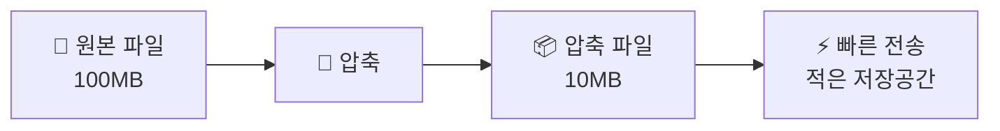
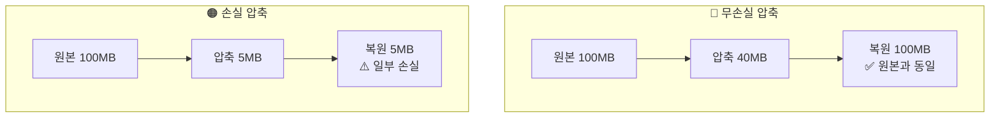

# 데이터가 너무 커요! — 압축이 필요한 이유

## 🎯 이 장에서 배우는 것

- [ ] 데이터 압축이 필요한 이유(저장 공간 절약, 전송 시간 단축)를 설명할 수 있다
- [ ] 무손실 압축과 손실 압축의 차이를 구별하고 예시를 들 수 있다
- [ ] 런 길이 부호화(RLE)의 원리를 이해하고 간단한 압축을 직접 수행할 수 있다

---

## 📚 핵심 개념

> **생각해보기** 💭
> 
> 카카오톡으로 사진을 보낼 때 '원본'과 '일반 화질' 중 뭘 선택하나요? 왜 그런 선택지가 있을까요?

### 개념 1: 데이터 압축이란?

**비유로 시작**: 데이터 압축은 마치 **여행 가방 짐 싸기**와 같아요. 옷을 돌돌 말아서 넣으면 같은 가방에 더 많은 옷을 담을 수 있죠!

**정확한 정의**: 데이터 압축(Data Compression)이란 **원본 데이터를 더 작은 크기로 변환**하는 기술입니다.

**왜 필요할까요?**

- **저장 공간 절약**: 스마트폰 64GB에 사진 1만 장 vs 3만 장
- **전송 시간 단축**: 100MB 파일 전송 10초 vs 10MB로 압축 후 1초
- **비용 절감**: 클라우드 저장 비용, 데이터 요금 절약
- **환경 보호**: 데이터센터 전력 소모 감소 → 탄소 배출 감소



---

### 개념 2: 무손실 압축 vs 손실 압축

데이터 압축에는 두 가지 방식이 있어요.

**무손실 압축 (Lossless Compression)**

비유: 여행 가방에 옷을 **압축팩**에 넣는 것. 꺼내면 원래 옷 그대로!

- 압축을 풀면 **원본과 100% 동일**하게 복원
- 예시: ZIP, PNG, 한글/워드 문서

**손실 압축 (Lossy Compression)**

비유: 여행 가방에 넣을 때 **안 입을 옷은 빼고** 가는 것. 가볍지만 일부는 없어짐!

- 사람이 잘 느끼지 못하는 정보를 **제거**하여 크기를 대폭 줄임
- 예시: JPEG(이미지), MP3(음악), MP4(영상)



> **알아보기** 📖
> 
> **언제 어떤 압축을 쓸까요?**
> - 무손실: 문서, 프로그램, 코드 (한 글자도 바뀌면 안 됨!)
> - 손실: 사진, 음악, 영상 (약간의 품질 저하는 눈/귀로 구분 어려움)

---

## 🔨 따라하기: 런 길이 부호화(RLE) 체험

**런 길이 부호화(Run-Length Encoding)**는 가장 간단한 무손실 압축 방식입니다.

### Step 1: RLE 원리 이해하기

같은 문자가 연속될 때, **"개수+문자"**로 표현합니다.

```
AAABBBCC → 3A3B2C
```

원본 8글자 → 압축 후 6글자! 🎉

### Step 2: 직접 압축해보기

```python
# 런 길이 부호화(RLE) 압축 함수
def rle_compress(data):
    if not data:
        return ""
    
    result = ""
    count = 1
    
    for i in range(1, len(data)):
        if data[i] == data[i-1]:
            count += 1
        else:
            result += str(count) + data[i-1]
            count = 1
    
    result += str(count) + data[-1]
    return result

# 테스트
original = "AAABBBCCCCDD"
compressed = rle_compress(original)

print(f"원본: {original} ({len(original)}글자)")
print(f"압축: {compressed} ({len(compressed)}글자)")
```

**실행 결과**:
```
원본: AAABBBCCCCDD (12글자)
압축: 3A3B4C2D (8글자)
```

### Step 3: 압축 해제하기

```python
# RLE 압축 해제 함수
def rle_decompress(data):
    result = ""
    i = 0
    
    while i < len(data):
        count = int(data[i])
        char = data[i+1]
        result += char * count
        i += 2
    
    return result

# 테스트
compressed = "3A3B4C2D"
decompressed = rle_decompress(compressed)

print(f"압축: {compressed}")
print(f"해제: {decompressed}")
print(f"원본 복원 성공! ✅")
```

**실행 결과**:
```
압축: 3A3B4C2D
해제: AAABBBCCCCDD
원본 복원 성공! ✅
```

---

## 📝 전체 코드

```python
# 런 길이 부호화(RLE) - 무손실 압축 체험

def rle_compress(data):
    """RLE 압축: 연속 문자를 개수+문자로 변환"""
    if not data:
        return ""
    result = ""
    count = 1
    for i in range(1, len(data)):
        if data[i] == data[i-1]:
            count += 1
        else:
            result += str(count) + data[i-1]
            count = 1
    result += str(count) + data[-1]
    return result

def rle_decompress(data):
    """RLE 압축 해제: 개수+문자를 원본으로 복원"""
    result = ""
    i = 0
    while i < len(data):
        count = int(data[i])
        char = data[i+1]
        result += char * count
        i += 2
    return result

# 실행
original = "AAABBBCCCCDD"
compressed = rle_compress(original)
restored = rle_decompress(compressed)

print(f"[원본] {original} ({len(original)}글자)")
print(f"[압축] {compressed} ({len(compressed)}글자)")
print(f"[복원] {restored}")
print(f"압축률: {len(compressed)/len(original)*100:.0f}%")
```

---

## ⚠️ 주의할 점

1. **RLE는 반복이 많을 때만 효과적**: `ABCD`를 압축하면 `1A1B1C1D`로 오히려 길어져요!

2. **손실 압축은 되돌릴 수 없음**: JPEG로 저장한 사진은 원본 품질로 복구 불가능해요.

---

## ✅ 점검하기

**1. 다음 파일 형식을 무손실/손실 압축으로 분류하세요.**
- ZIP 파일
- MP3 음악 파일  
- PNG 이미지

<details><summary>정답 확인</summary>

- ZIP: **무손실** (문서를 압축해도 내용이 바뀌면 안 되니까!)
- MP3: **손실** (사람이 잘 못 듣는 주파수 제거)
- PNG: **무손실** (픽셀 하나하나 정확히 보존)

</details>

**2. "XXXXYYYYZZ"를 RLE로 압축하면?**

<details><summary>정답 확인</summary>

`4X4Y2Z` (10글자 → 6글자)

</details>

**3. 왜 프로그램 코드는 무손실 압축을 사용해야 할까요?**

<details><summary>정답 확인</summary>

코드에서 한 글자라도 바뀌면 프로그램이 오류가 나거나 전혀 다르게 동작하기 때문입니다.

</details>

---

> **정리하기** 📋
> 
> - **압축**: 데이터를 더 작게 만드는 기술
> - **무손실**: 원본 100% 복원 (ZIP, PNG)
> - **손실**: 일부 제거, 더 작게 (JPEG, MP3)
> - **RLE**: 연속 문자를 "개수+문자"로 표현하는 간단한 무손실 압축

---

## 🔗 다음 장 미리보기

다음 시간에는 **"똑똑하게 줄여보자! — 허프만 코딩"**을 배웁니다. 자주 나오는 문자는 짧게, 드물게 나오는 문자는 길게 표현하는 더 영리한 압축 방법을 알아볼 거예요! 🌳