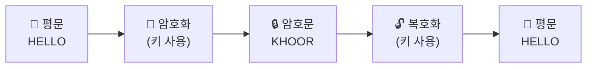
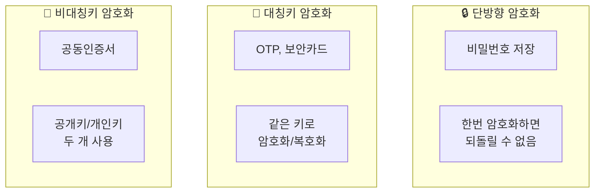

# 비밀을 지켜라! — 암호화의 세계

## 🎯 이 장에서 배우는 것

- [ ] 암호화의 핵심 용어(평문, 암호문, 암호키)를 설명할 수 있다
- [ ] 과거 암호(카이사르)와 현대 암호(단방향, 대칭, 비대칭)의 차이를 구별할 수 있다
- [ ] 일상 속 암호화 사례를 찾아 어떤 방식인지 연결할 수 있다

---

> **💭 생각해보기**
> 
> 인터넷 쇼핑할 때 카드번호를 입력하면, 그 정보가 해킹되지 않는 이유는 뭘까요?
> 누군가 중간에서 훔쳐보더라도 안전한 비결이 있습니다!

---

## 📚 핵심 개념

### 개념 1: 암호화란 무엇인가?

**비유로 시작**: 암호화는 마치 **비밀 언어**와 같아요. 친구와 둘만 아는 암호로 쪽지를 주고받으면, 다른 사람이 봐도 내용을 알 수 없죠!

**정확한 정의**: 암호화(Encryption)는 원래 내용을 특별한 규칙으로 변환해서, 허락받은 사람만 읽을 수 있게 만드는 기술입니다.

**핵심 용어 3가지**

- **평문(Plaintext)**: 누구나 읽을 수 있는 원래 메시지 → "안녕하세요"
- **암호문(Ciphertext)**: 암호화된 후의 알 수 없는 메시지 → "dkssudgktpdy"
- **암호키(Key)**: 암호를 만들고 푸는 비밀 열쇠 → "알파벳 3칸 밀기"



---

### 개념 2: 과거와 현대의 암호화

#### 🏛️ 과거의 암호 — 카이사르 암호

로마의 줄리어스 카이사르가 사용한 방식입니다. 알파벳을 일정 칸수만큼 밀어서 암호를 만들어요.

**예시 (3칸 밀기)**
- A → D, B → E, C → F ...
- "CAT" → "FDW"

#### 💻 현대의 암호 — 세 가지 방식



**단방향 암호화**: 한번 잠그면 열 수 없는 금고! 비밀번호 저장에 사용

**대칭키 암호화**: 같은 열쇠로 잠그고 여는 자물쇠. 빠르지만 열쇠 전달이 문제

**비대칭키 암호화**: 잠그는 열쇠(공개키)와 여는 열쇠(개인키)가 달라요. 안전하지만 느림

---

## 🔨 따라하기: 카이사르 암호 만들기

### Step 1: 암호화 함수 만들기

```python
def caesar_encrypt(text, shift):
    result = ""
    for char in text:
        if char.isalpha():  # 알파벳인 경우만
            base = ord('A') if char.isupper() else ord('a')
            result += chr((ord(char) - base + shift) % 26 + base)
        else:
            result += char  # 알파벳 아니면 그대로
    return result
```

### Step 2: 암호화 실행하기

```python
message = "Hello World"
encrypted = caesar_encrypt(message, 3)
print(f"평문: {message}")
print(f"암호문: {encrypted}")
```

**실행 결과**:
```
평문: Hello World
암호문: Khoor Zruog
```

### Step 3: 복호화하기

```python
# 복호화는 반대 방향으로 밀면 됨!
decrypted = caesar_encrypt(encrypted, -3)
print(f"복호화: {decrypted}")
```

**실행 결과**:
```
복호화: Hello World
```

---

## 📝 전체 코드

```python
def caesar_encrypt(text, shift):
    """카이사르 암호화/복호화 함수"""
    result = ""
    for char in text:
        if char.isalpha():
            base = ord('A') if char.isupper() else ord('a')
            result += chr((ord(char) - base + shift) % 26 + base)
        else:
            result += char
    return result

# 실행
message = "Hello World"
encrypted = caesar_encrypt(message, 3)    # 암호화
decrypted = caesar_encrypt(encrypted, -3)  # 복호화

print(f"평문: {message}")
print(f"암호문: {encrypted}")
print(f"복호화: {decrypted}")
```

---

## ⚠️ 주의할 점

**카이사르 암호는 현대에서 안전하지 않아요!** 경우의 수가 26가지뿐이라 컴퓨터로 1초 만에 뚫립니다. 학습용으로만 사용하세요.

---

> **📌 정리하기: 일상 속 암호화**
> 
> - **비밀번호 저장** → 단방향 (해시 함수)
> - **OTP, 보안카드** → 대칭키
> - **공동인증서, 전자서명** → 비대칭키

---

## ✅ 점검하기

**1. 평문, 암호문, 암호키를 각각 한 문장으로 설명해보세요.**

<details><summary>정답 확인</summary>

- 평문: 암호화 전 누구나 읽을 수 있는 원본 메시지
- 암호문: 암호화되어 의미를 알 수 없는 메시지  
- 암호키: 암호화와 복호화에 사용되는 비밀 정보

</details>

**2. 인터넷 뱅킹의 공동인증서는 어떤 암호화 방식을 사용할까요?**

<details><summary>정답 확인</summary>

비대칭키 암호화입니다. 공개키로 암호화하고, 본인만 가진 개인키로 복호화합니다.

</details>

**3. [도전] 친구에게 카이사르 암호(5칸 밀기)로 "PYTHON" 메시지를 보내려면?**

<details><summary>정답 확인</summary>

"UDYMTS" — P→U, Y→D, T→Y, H→M, O→T, N→S

</details>

---

## 🔗 다음 장 미리보기

**Chapter 1-3: 오류를 잡아라! — 오류 검출의 원리**

데이터가 전송 중에 변형되면 어떻게 알 수 있을까요? 다음 장에서는 패리티 비트와 체크섬으로 오류를 찾아내는 방법을 배웁니다!