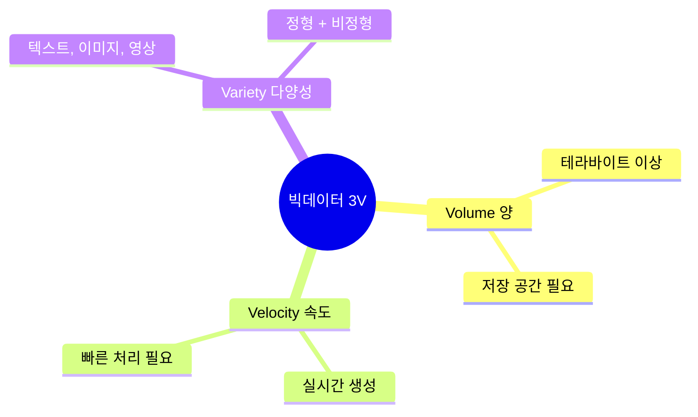
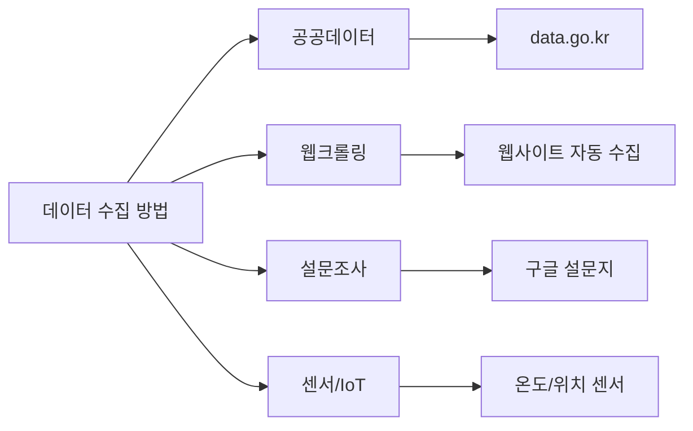

# 데이터가 폭발한다! — 빅데이터의 3V와 수집 방법

**Part 2. 빅데이터란 무엇인가 — 수집과 준비** | 3차시 (45분)

---

## 🎯 이 장에서 배우는 것

- [ ] 빅데이터의 3V 특성(Volume·Velocity·Variety)을 실생활 사례와 함께 설명할 수 있다
- [ ] 데이터 수집 방법의 종류와 특징을 구별할 수 있다
- [ ] 구글 설문지로 간단한 데이터 수집 설문을 설계할 수 있다

---

> **💭 생각해보기**
> 
> 유튜브에서 영상을 볼 때마다 '조회수', '시청 시간', '좋아요' 같은 데이터가 쌓입니다. 전 세계 20억 명이 매일 유튜브를 본다면, 하루에 얼마나 많은 데이터가 생길까요?

---

## 📚 핵심 개념

### 개념 1: 빅데이터의 3V

**비유로 시작**: 빅데이터는 마치 **거대한 폭포**와 같아요. 엄청난 **양(Volume)**의 물이, 빠른 **속도(Velocity)**로, **다양한 방향(Variety)**에서 쏟아지는 것처럼요.

**정확한 정의**: 빅데이터란 기존 도구로는 처리하기 어려운 대규모 데이터를 말하며, 세 가지 특성으로 정의합니다.

**예시로 확인**

- **Volume(양)**: 넷플릭스는 하루에 약 1PB(페타바이트)의 데이터 처리 → 책 10억 권 분량!
- **Velocity(속도)**: 트위터(X)에서는 1초에 약 6,000개의 트윗 발생
- **Variety(다양성)**: 인스타그램에는 텍스트, 사진, 영상, 위치정보가 함께 저장

---

### 개념 2: 데이터 수집 방법

**비유로 시작**: 데이터 수집은 마치 **요리 재료 구하기**와 같아요. 마트에서 살 수도 있고(공공데이터), 직접 키울 수도 있고(설문조사), 자동으로 배달받을 수도 있죠(센서).

**수집 방법별 특징**

- **공공데이터**: 정부가 무료 제공, 신뢰도 높음, data.go.kr에서 다운로드
- **웹크롤링**: 웹사이트에서 자동 수집, 프로그래밍 필요, 저작권 주의
- **설문조사**: 직접 설계 가능, 원하는 정보 수집, 응답자 모집 필요
- **센서/IoT**: 자동 측정, 실시간 데이터, 장비 비용 발생

---

## 🔨 따라하기: 구글 설문지로 데이터 수집하기

> **실습 목표**: '우리 반 생활 패턴 조사' 설문을 5문항으로 설계합니다.

### Step 1: 구글 설문지 만들기

1. [Google Forms](https://docs.google.com/forms) 접속
2. **'새 양식 시작하기'** 클릭
3. 제목 입력: `우리 반 생활 패턴 조사`

### Step 2: 설문 문항 설계하기

아래 5개 문항을 추가하세요:

**문항 구성**

- **Q1** "하루 평균 스마트폰 사용 시간은?" → 객관식 (1시간 미만 / 1-3시간 / 3-5시간 / 5시간 이상)
- **Q2** "평일 평균 수면 시간은?" → 객관식 (6시간 미만 / 6-7시간 / 7-8시간 / 8시간 이상)
- **Q3** "가장 자주 사용하는 SNS는?" → 객관식 (인스타그램 / 유튜브 / 틱톡 / 기타)
- **Q4** "일주일 운동 횟수는?" → 단답형 (숫자 입력)
- **Q5** "스트레스 해소 방법은?" → 체크박스 (게임 / 운동 / 음악 / 수면 / 기타)

### Step 3: 응답 설정 및 배포

1. 우측 상단 **'보내기'** 버튼 클릭
2. 링크 아이콘 선택 → **'URL 단축'** 체크
3. 복사한 링크를 친구들에게 공유!

**실행 결과**: 응답이 모이면 '응답' 탭에서 자동으로 그래프가 생성됩니다.

---

## ⚠️ 주의할 점

1. **개인정보 보호**: 설문에 이름, 전화번호 등 민감한 정보를 수집할 때는 반드시 동의를 구하세요
2. **웹크롤링 주의**: 모든 웹사이트를 크롤링할 수 있는 것은 아닙니다. robots.txt와 저작권을 확인하세요

---

## 📝 정리하기

> **핵심 요약**
> 
> - 빅데이터 = **3V** (Volume 양 + Velocity 속도 + Variety 다양성)
> - 수집 방법: 공공데이터(신뢰↑), 웹크롤링(자동화), 설문조사(맞춤), 센서(실시간)
> - 구글 설문지로 누구나 쉽게 데이터 수집 가능!

---

## ✅ 점검하기

**[기본] 3V 사례 매칭하기**

다음 사례가 3V 중 어떤 특성을 강조하는지 연결하세요.

1. "카카오톡에서 하루 110억 건의 메시지가 오간다"
2. "주식 거래 데이터는 0.001초 단위로 기록된다"
3. "병원에는 X-ray 사진, 진료 기록, 음성 상담 파일이 함께 저장된다"

정답 확인

1. **Volume(양)** - 110억 건이라는 엄청난 데이터량
2. **Velocity(속도)** - 밀리초 단위의 빠른 생성 속도
3. **Variety(다양성)** - 이미지, 텍스트, 음성 등 다양한 형식

---

**[응용] 수집 방법 선택하기**

"우리 동네 미세먼지 농도를 1시간마다 자동으로 측정하려면" 어떤 수집 방법이 가장 적절할까요?

정답 확인

**센서/IoT**가 가장 적절합니다. 미세먼지 측정 센서를 설치하면 사람이 개입하지 않아도 자동으로 실시간 데이터를 수집할 수 있습니다.

---

**[심화 도전] 공공데이터 탐색하기**

[공공데이터포털(data.go.kr)](https://data.go.kr)에 접속해서 관심 있는 데이터셋을 하나 찾아보세요. 어떤 데이터이고, 어디에 활용할 수 있을지 생각해보세요.

---
