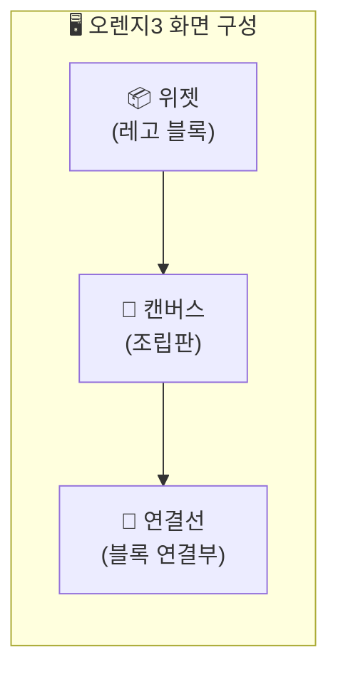
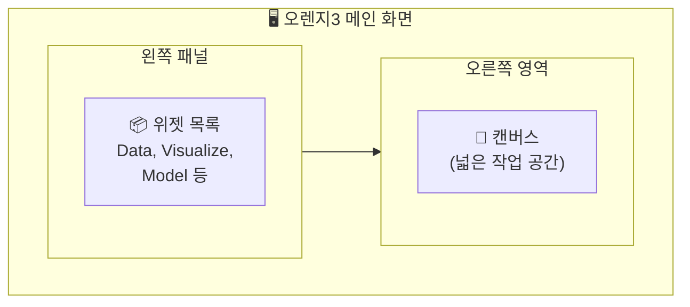
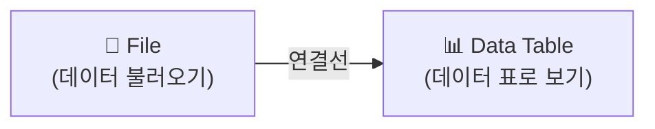

# 2-2. 오렌지3, 처음 만나기 — 설치부터 첫 워크플로우까지

---

## 🎯 이 장에서 배우는 것

- [ ] 오렌지3를 설치하고 기본 화면 구성(캔버스, 위젯, 연결선)을 설명할 수 있다
- [ ] CSV 파일을 오렌지3에 불러와 데이터 테이블을 확인할 수 있다
- [ ] File 위젯과 Data Table 위젯을 연결하는 기본 워크플로우를 만들 수 있다

---

> **💭 생각해보기**
> 
> "코딩을 전혀 모르는데, 데이터 분석을 할 수 있을까?"
> 
> 정답은 **"그렇다!"** 입니다. 오렌지3(Orange3)는 마우스로 블록을 연결하듯 데이터를 분석할 수 있는 도구예요. 마치 레고 블록을 조립하듯, 필요한 기능을 끌어다 연결하면 됩니다.

---

## 📚 핵심 개념

### 개념 1: 오렌지3란?

**비유로 시작**: 오렌지3는 마치 **요리 레시피 앱**과 같아요. 재료(데이터)를 넣고, 조리 도구(위젯)를 순서대로 연결하면 요리(분석 결과)가 완성됩니다!

**정확한 정의**: 오렌지3는 코딩 없이 마우스 드래그만으로 데이터 분석과 시각화를 할 수 있는 **오픈소스 프로그램**입니다.

**예시로 확인**
- 설문조사 결과를 그래프로 만들기
- 학급 성적 데이터의 평균과 분포 확인하기
- 데이터에서 패턴 찾아내기

---

### 개념 2: 오렌지3 화면 구성 3요소

**비유로 시작**: 오렌지3 화면은 마치 **레고 조립판**과 같아요!

**정확한 정의**

- **위젯(Widget)**: 하나의 기능을 담당하는 블록. 데이터 불러오기, 표 보기, 그래프 그리기 등 각자 역할이 있어요.

- **캔버스(Canvas)**: 위젯을 배치하고 작업하는 넓은 작업 공간이에요.

- **연결선(Link)**: 위젯과 위젯 사이를 이어 데이터가 흐르게 하는 선이에요.

---

## 🔨 따라하기

### Step 1: 오렌지3 설치하기

**1단계**: 웹 브라우저에서 `orangedatamining.com` 접속

**2단계**: 상단 메뉴에서 **Download** 클릭

**3단계**: 본인 운영체제(Windows/Mac) 선택 후 다운로드

**4단계**: 설치 파일 실행 → **Next** 버튼 계속 클릭 → 설치 완료

> **📌 알아보기**
> 
> 설치에 약 5~10분이 소요됩니다. 설치 중 "Python" 관련 항목이 나와도 걱정 마세요. 자동으로 설치됩니다!

---

### Step 2: 오렌지3 실행하고 화면 익히기

오렌지3를 실행하면 다음과 같은 화면이 나타납니다.

**확인할 것**
- 왼쪽: **위젯 목록** (Data, Visualize, Model 등 카테고리별 정리)
- 오른쪽: **캔버스** (위젯을 끌어다 놓는 공간)

---

### Step 3: 첫 워크플로우 만들기 (File → Data Table)

이제 실제로 데이터를 불러와 볼까요?

**1단계**: 왼쪽 위젯 목록에서 **Data** 카테고리 클릭

**2단계**: **File** 위젯을 캔버스로 드래그

**3단계**: **Data Table** 위젯도 캔버스로 드래그

**4단계**: File 위젯의 오른쪽 점을 클릭한 채로 Data Table 왼쪽 점까지 드래그하여 **연결선** 만들기

---

### Step 4: CSV 파일 불러오기

**1단계**: File 위젯을 **더블클릭**

**2단계**: 열리는 창에서 아래 옵션 중 선택
- **Browse documentation datasets**: 샘플 데이터 사용
- **파일 아이콘**: 내 컴퓨터의 CSV 파일 선택

**3단계**: 샘플 데이터 `iris.tab` 선택 (처음엔 이걸로 연습!)

**4단계**: Data Table 위젯 더블클릭 → 데이터가 표로 보입니다!

> **📌 알아보기**
> 
> `iris.tab`은 붓꽃 데이터로, 꽃잎 길이·너비 등 150개 데이터가 담겨 있어요. 데이터 분석 연습용으로 전 세계에서 가장 많이 쓰이는 샘플입니다.

---

## ⚠️ 주의할 점

**1. 연결선 방향이 중요해요!**
- 데이터는 **왼쪽에서 오른쪽**으로 흐릅니다
- File(출발) → Data Table(도착) 순서를 지켜주세요

**2. 위젯을 삭제하려면?**
- 위젯 선택 후 **Delete** 키 또는 우클릭 → Remove

---

## 📝 정리하기

> **🔑 핵심 개념 요약**
> 
> - **오렌지3**: 코딩 없이 마우스로 데이터 분석하는 프로그램
> - **위젯**: 각 기능을 담당하는 블록 (File, Data Table 등)
> - **캔버스**: 위젯을 배치하는 작업 공간
> - **연결선**: 위젯 사이를 연결하여 데이터 흐름을 만듦
> - **워크플로우**: 위젯들이 연결된 전체 작업 흐름

---

## ✅ 점검하기

**1. 오렌지3에서 데이터가 흐르는 방향은?**

정답 확인

왼쪽에서 오른쪽으로 흐릅니다. File 위젯(출발) → Data Table 위젯(도착) 순서입니다.

**2. 위젯, 캔버스, 연결선을 레고에 비유하면?**

정답 확인

위젯 = 레고 블록, 캔버스 = 조립판, 연결선 = 블록을 연결하는 부분

**3. [도전] Distributions 위젯을 추가로 연결해보세요!**

힌트 확인

왼쪽 패널 → Visualize → Distributions 위젯을 캔버스로 드래그 → Data Table과 연결하면 데이터 분포를 그래프로 볼 수 있어요!

---

