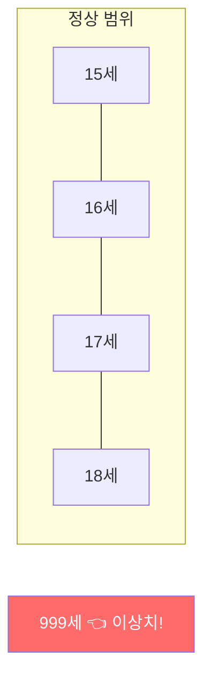
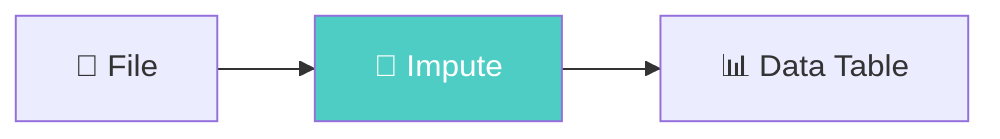
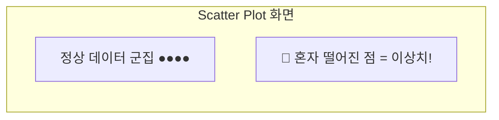
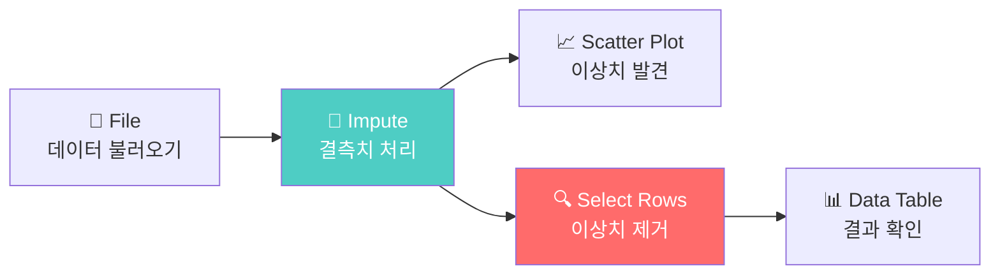

# 빠진 값, 이상한 값을 잡아라! — 결측치와 이상치 처리

**Part 3. 데이터를 다듬어라 — 빅데이터 전처리** | 5차시

---

## 🎯 이 장에서 배우는 것

- [ ] 결측치와 이상치의 의미와 발생 원인을 설명할 수 있다
- [ ] 오렌지3의 Impute 위젯으로 결측치를 처리할 수 있다
- [ ] Scatter Plot과 Select Rows로 이상치를 발견하고 제거할 수 있다

---

> **💭 생각해보기**
> 
> 설문지에 나이를 적는 칸에 누군가 **999**를 적었습니다. 이 데이터를 그대로 평균 계산에 포함하면 어떻게 될까요? 반 평균 나이가 갑자기 50세가 되어버릴 수도 있어요!

---

## 📚 핵심 개념

### 개념 1: 결측치(Missing Value)

**비유로 시작**: 결측치는 마치 **시험지에 답을 안 쓴 빈칸**과 같아요. 학생이 몰라서 비웠는지, 실수로 넘어갔는지 알 수 없지만, 어쨌든 **비어 있는 상태**입니다.

**정확한 정의**: 데이터에서 값이 기록되지 않아 **비어 있는 칸**을 결측치라고 합니다. 오렌지3에서는 `?` 또는 빈 셀로 표시됩니다.

**발생 원인**
- 설문 응답자가 질문을 건너뜀
- 센서 오류로 측정값이 기록되지 않음
- 데이터 전송 중 일부 손실

**예시로 확인**

```
이름    | 나이 | 키
--------|------|-----
김민수  | 17   | 172
이영희  | ?    | 165    ← 나이가 결측치
박철수  | 16   | ?      ← 키가 결측치
```

---

### 개념 2: 이상치(Outlier)

**비유로 시작**: 이상치는 마치 **100점 만점 시험에서 500점을 받았다고 기록된 것**과 같아요. 값이 있긴 한데, **정상 범위를 벗어나** 뭔가 이상합니다.

**정확한 정의**: 다른 데이터와 비교했을 때 **극단적으로 크거나 작은 값**으로, 분석 결과를 왜곡할 수 있는 데이터입니다.

**발생 원인**
- 입력 실수 (나이에 999 입력)
- 측정 장비 오작동
- 실제로 극단적인 경우 (진짜 이상한 값일 수도!)



---

> **📖 알아보기: 결측치 vs 이상치 구분법**
> 
> - **결측치**: 값 자체가 **없음** (빈칸, ?, NA, NULL)
> - **이상치**: 값은 **있지만** 비정상적으로 크거나 작음
> 
> 둘 다 분석 전에 반드시 처리해야 정확한 결과를 얻을 수 있어요!

---

## 🔨 따라하기: 태양광 발전 데이터 전처리

### Step 1: 데이터 불러오기

오렌지3를 실행하고 실습용 태양광 발전 데이터를 불러옵니다.

```
[File] 위젯을 캔버스에 배치
→ 샘플 데이터 "solar.tab" 선택 (또는 직접 CSV 파일 불러오기)
→ [Data Table] 위젯 연결하여 데이터 확인
```

**확인할 것**: 데이터에 `?` 표시가 있는 칸이 보이나요? 그것이 결측치입니다!

---

### Step 2: Impute로 결측치 처리하기

**Impute**는 "채워 넣다"라는 뜻이에요. 빈칸을 적절한 값으로 메워줍니다.

```
[File] → [Impute] → [Data Table]
```



**Impute 위젯 설정**
- **Average/Most frequent**: 평균값(숫자) 또는 최빈값(문자)으로 채움
- **Remove rows with missing values**: 결측치가 있는 행 삭제

> 💡 **Tip**: 데이터가 충분하면 "Remove rows"가 안전해요. 데이터가 적으면 "Average"로 채우는 게 나아요!

---

### Step 3: Scatter Plot으로 이상치 발견하기

시각화는 이상치를 찾는 가장 직관적인 방법입니다.

```
[Impute] → [Scatter Plot]
```

**Scatter Plot 설정**
1. X축: 일사량(solar radiation)
2. Y축: 발전량(power output)
3. 점들의 분포 확인 → **혼자 떨어진 점**이 이상치!



---

### Step 4: Select Rows로 이상치 제거하기

이상치를 발견했으면 조건을 걸어 제거합니다.

```
[Impute] → [Select Rows] → [Data Table]
```

**Select Rows 설정 예시**
- 조건: `발전량 < 1000` (비정상적으로 큰 값 제외)
- 조건 추가: `일사량 > 0` (음수 값 제외)

**실행 결과**: 조건에 맞는 정상 데이터만 남습니다!

---

## 📝 전체 워크플로우



---

## ⚠️ 주의할 점

**1. 이상치라고 다 지우면 안 돼요!**

어떤 이상치는 **진짜 중요한 발견**일 수 있어요. 예를 들어 태양광 패널이 고장 났을 때의 데이터는 "고장 감지"에 필요한 귀중한 정보입니다. 삭제 전에 **왜 이상한지** 원인을 먼저 파악하세요.

**2. 결측치 처리 방법에 따라 결과가 달라져요**

평균으로 채우면 데이터가 평균 쪽으로 쏠리고, 삭제하면 데이터 수가 줄어요. **어떤 방법이 더 적절한지** 상황에 맞게 선택하세요.

---

> **📋 정리하기**
> 
> - **결측치**: 비어있는 값 → **Impute**로 채우거나 삭제
> - **이상치**: 극단적인 값 → **Scatter Plot**으로 발견, **Select Rows**로 제거
> - 전처리는 분석의 **첫 단추**! 잘못 끼우면 결과가 엉망이 됩니다

---

## ✅ 점검하기

**1. 다음 중 결측치에 해당하는 것은?**

① 나이: 150  
② 키: ?  
③ 몸무게: -5  
④ 점수: 999

<details><summary>정답 확인</summary>

**② 키: ?**

`?`는 값이 비어있음을 나타내는 결측치입니다. ①③④는 값이 있지만 비정상적인 이상치예요.

</details>

---

**2. Impute 위젯의 "Average" 옵션은 무엇을 하나요?**

<details><summary>정답 확인</summary>

결측치(빈 값)를 해당 열의 **평균값으로 채워 넣습니다**. 숫자가 아닌 데이터는 최빈값(가장 많이 나온 값)으로 채웁니다.

</details>

---

**3. [도전] 발전량이 0 미만이거나 2000 초과인 데이터를 제거하려면 Select Rows에서 어떤 조건을 설정해야 할까요?**

<details><summary>정답 확인</summary>

조건 1: `발전량 >= 0`  
조건 2: `발전량 <= 2000`  
(두 조건을 AND로 연결)

또는 "Match all"을 선택하고 두 조건을 추가하면 됩니다.

</details>

---

## 🔗 다음 장 미리보기

데이터에서 빠진 값과 이상한 값을 잡았다면, 이제 **데이터의 형태를 바꿀** 차례예요! 다음 장에서는 여러 표를 하나로 합치고, 필요한 열만 선택하고, 데이터를 원하는 모양으로 변환하는 방법을 배웁니다. 🔄