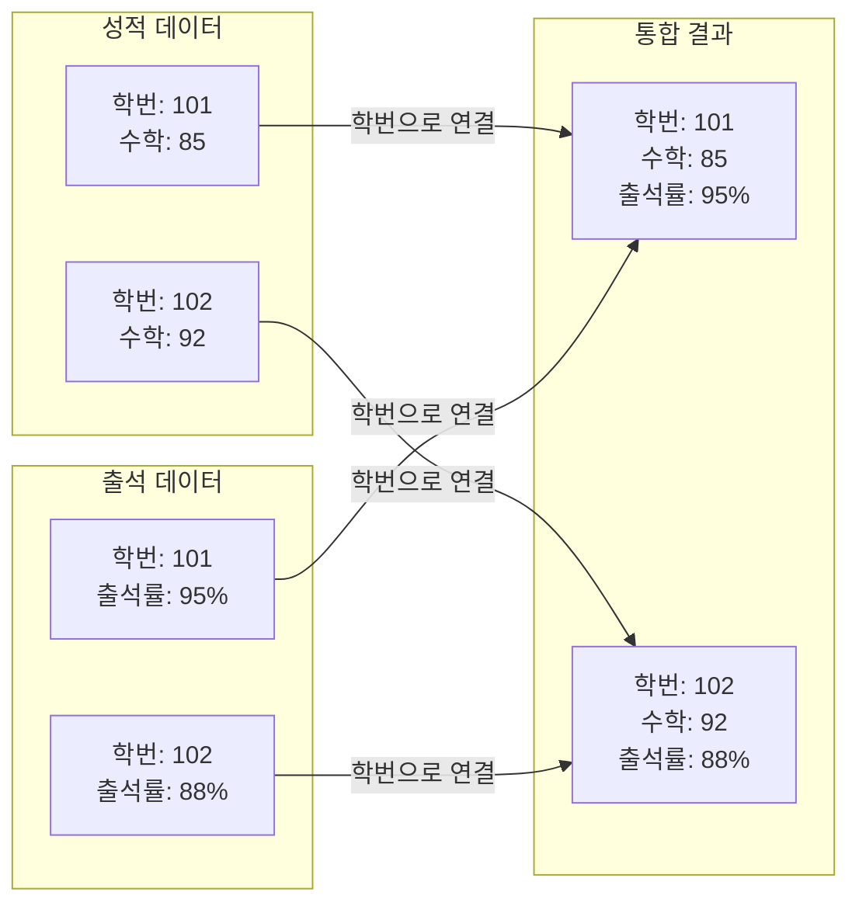
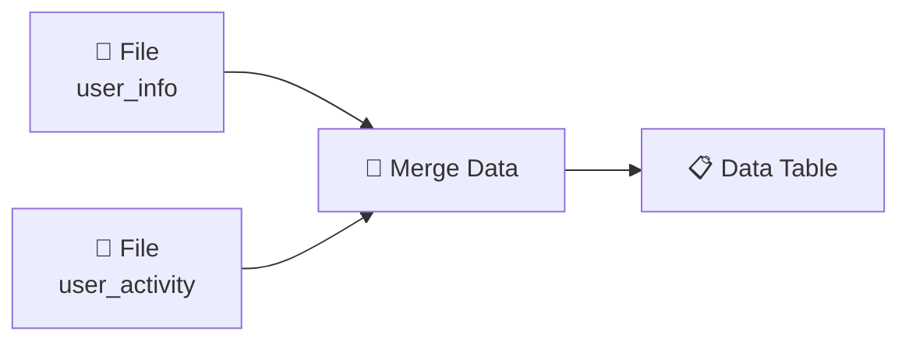

# 3-2. 데이터를 합치고 나누기 — 통합과 정규화

## 🎯 이 장에서 배우는 것

- [ ] 공통 속성(키값)을 기준으로 두 데이터셋을 통합할 수 있다
- [ ] 오렌지3의 Merge Data 위젯으로 데이터를 합칠 수 있다
- [ ] Discretize 위젯으로 연속형 데이터를 구간으로 나눌 수 있다

---

> **💭 생각해보기**
> 
> 학교에서 중간고사 성적표와 출석부가 따로 관리된다면, 이 두 자료를 합쳐서 "출석을 잘한 학생이 성적도 좋을까?"를 분석하려면 어떻게 해야 할까요?

---

## 📚 핵심 개념

### 개념 1: 데이터 통합과 키값

**비유로 시작하기** 🧩

데이터 통합은 마치 **퍼즐 맞추기**와 같아요. 두 퍼즐 조각이 맞닿는 부분이 같은 모양이어야 연결할 수 있죠. 데이터도 마찬가지로, 두 데이터셋을 연결하려면 **공통으로 일치하는 열**이 필요합니다.

**정확한 정의**

- **데이터 통합(Data Integration)**: 서로 다른 데이터셋을 하나로 합치는 과정
- **키값(Key)**: 두 데이터셋을 연결하는 기준이 되는 공통 속성 (예: 학번, 사용자ID)

**예시로 확인**



위 예시에서 **학번**이 키값입니다. 학번이 같은 행끼리 연결되어 하나의 완성된 데이터가 됩니다.

---

### 개념 2: 정규화(Discretize)

**비유로 시작하기** 📊

시험 점수가 73점, 81점, 92점으로 나왔을 때, 선생님이 "70점대는 C, 80점대는 B, 90점대는 A"라고 **등급으로 나누는 것**과 같아요. 연속적인 숫자를 의미 있는 구간으로 묶는 거죠.

**정확한 정의**

- **정규화(Discretization)**: 연속형 숫자 데이터를 일정한 구간으로 나누어 범주형 데이터로 변환하는 과정

**왜 필요할까?**

- 나이 18, 23, 27, 35... → "10대", "20대", "30대"로 묶으면 패턴 파악이 쉬움
- 복잡한 숫자를 단순한 그룹으로 정리하여 분석 효율 향상

---

## 🔨 따라하기: 오렌지3로 데이터 통합하기

### Step 1: 실습 데이터 준비하기

두 개의 CSV 파일을 만들어 저장합니다.

**파일 1: user_info.csv**
```
User_ID,Name,Age
U001,김철수,25
U002,이영희,32
U003,박민수,19
U004,정수진,45
```

**파일 2: user_activity.csv**
```
User_ID,Steps,Calories
U001,8500,320
U002,12000,450
U003,6000,240
U004,9500,380
```

### Step 2: 오렌지3에서 데이터 불러오기

1. **File 위젯** 2개를 캔버스에 배치
2. 각각 `user_info.csv`와 `user_activity.csv` 불러오기



### Step 3: Merge Data로 데이터 합치기

1. **Transform** 카테고리에서 **Merge Data** 위젯 추가
2. 두 File 위젯을 Merge Data에 연결
3. Merge Data 더블클릭하여 설정 확인

**설정 화면에서:**
- **Merge type**: Inner join (일치하는 것만 합침)
- **Match by**: User_ID 선택

### Step 4: 결과 확인하기

Data Table 위젯을 연결하면 통합된 결과를 볼 수 있습니다.

**실행 결과:**
```
User_ID | Name   | Age | Steps | Calories
--------|--------|-----|-------|----------
U001    | 김철수  | 25  | 8500  | 320
U002    | 이영희  | 32  | 12000 | 450
U003    | 박민수  | 19  | 6000  | 240
U004    | 정수진  | 45  | 9500  | 380
```

---

## 🔨 따라하기: Discretize로 나이 구간 나누기

### Step 1: Discretize 위젯 연결하기


### Step 2: 구간 설정하기

1. Discretize 위젯 더블클릭
2. **Age** 열 선택
3. 설정 변경:
   - **Method**: Fixed width (고정 간격)
   - **Width**: 10 (10살 단위)

### Step 3: 결과 확인하기

**변환 전**: Age = 19, 25, 32, 45

**변환 후**: Age = "10-20", "20-30", "30-40", "40-50"

> **📌 알아보기: Discretize 옵션들**
> 
> - **Equal width**: 동일한 간격으로 나누기 (예: 10살 단위)
> - **Equal frequency**: 각 구간에 같은 수의 데이터가 들어가도록 나누기
> - **Custom**: 직접 구간 경계 지정 (예: 0-19, 20-39, 40+)

---

## ⚠️ 주의할 점

**1. 키값이 일치해야 합니다**

통합하려는 두 데이터의 키값 형식이 다르면 연결되지 않습니다.
- ❌ "U001" vs "u001" (대소문자 다름)
- ❌ "001" vs "1" (앞자리 0 유무)

**2. 구간을 너무 많이 나누지 마세요**

정규화할 때 구간이 너무 많으면 원본 데이터와 차이가 없고, 너무 적으면 정보가 손실됩니다. 분석 목적에 맞게 적절히 설정하세요.

---

## ✅ 점검하기

**1. 다음 두 데이터를 합칠 때 키값으로 사용할 수 있는 열은 무엇인가요?**

- 데이터A: 상품코드, 상품명, 가격
- 데이터B: 상품코드, 판매수량, 판매일

<details><summary>정답 확인</summary>

**상품코드**입니다. 두 데이터셋에 모두 존재하고, 각 상품을 고유하게 식별할 수 있는 공통 속성이기 때문입니다.

</details>

**2. 키 180cm, 172cm, 165cm, 158cm를 "160미만", "160-170", "170-180", "180이상" 4개 구간으로 나눈다면 각각 어느 구간에 속하나요?**

<details><summary>정답 확인</summary>

- 180cm → "180이상"
- 172cm → "170-180"
- 165cm → "160-170"
- 158cm → "160미만"

</details>

**3. Inner join과 Outer join의 차이를 간단히 설명해보세요.**

<details><summary>정답 확인</summary>

- **Inner join**: 두 데이터셋 모두에 키값이 존재하는 행만 합침
- **Outer join**: 한쪽에만 있는 행도 포함 (없는 값은 빈칸 처리)

</details>

---

> **🎯 정리하기**
> 
> - **데이터 통합**: 공통 키값을 기준으로 여러 데이터셋을 하나로 합치는 과정
> - **키값**: 두 데이터를 연결하는 고리 역할 (학번, ID 등)
> - **정규화(Discretize)**: 연속형 숫자를 구간별 범주로 변환

---

## 🚀 도전 과제

반 친구들의 키와 체중 데이터, 좋아하는 과목 데이터를 각각 수집하여 두 개의 CSV 파일로 만들고, Merge Data로 통합해보세요. 그 후 Discretize로 키를 "160cm 미만", "160-170cm", "170cm 이상" 3구간으로 나누어보세요.

---

## 🔗 다음 장 미리보기

**3-3. 데이터 요약과 샘플링**에서는 방대한 데이터를 빠르게 파악하는 **통계 요약**과 전체 중 일부만 추출하는 **샘플링** 기법을 배웁니다. 수백만 건의 데이터를 어떻게 효율적으로 살펴볼 수 있을까요? 🔍