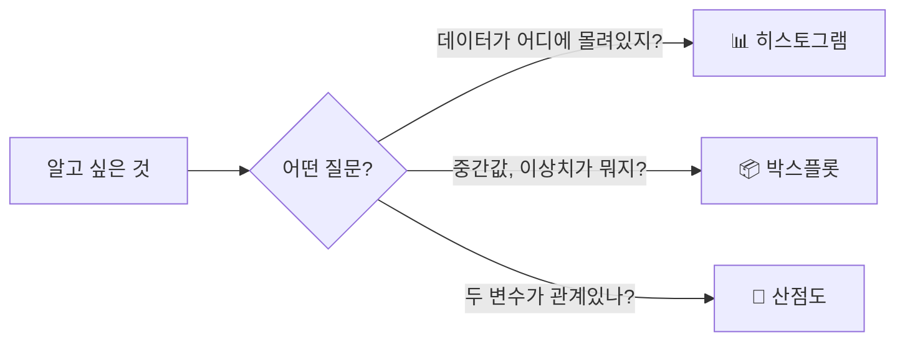
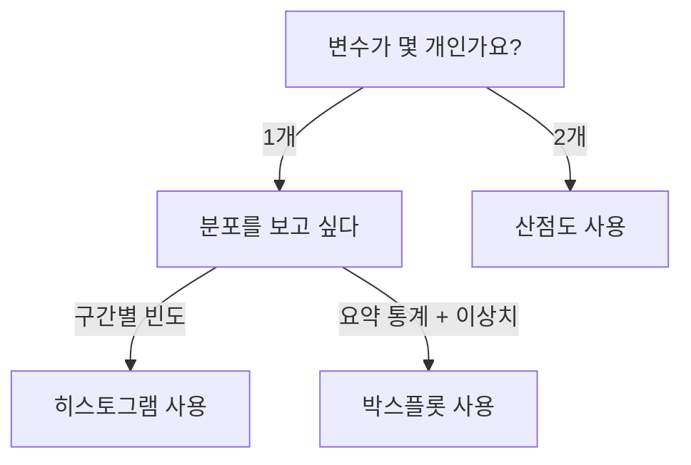
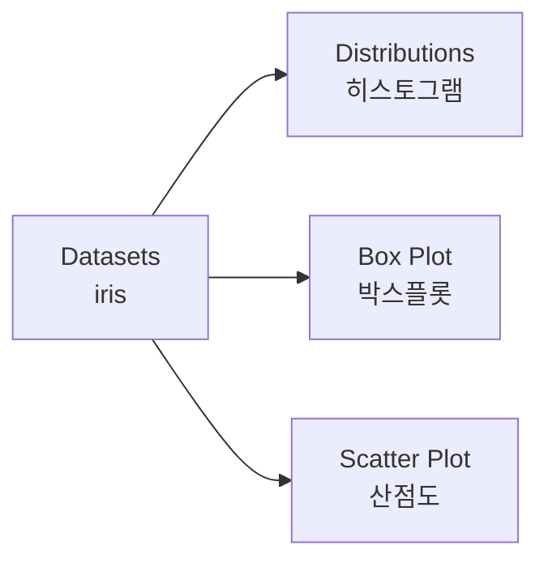

# 데이터를 그림으로 — 박스플롯, 히스토그램, 산점도

**Part 4. 데이터를 눈에 보이게 — 빅데이터 시각화 | 7차시**

---

## 🎯 이 장에서 배우는 것

- [ ] 박스플롯, 히스토그램, 산점도가 각각 언제 유용한지 설명할 수 있다
- [ ] 오렌지3에서 세 가지 시각화 위젯을 사용해 데이터를 시각화할 수 있다
- [ ] 시각화 결과에서 데이터의 분포와 관계를 해석할 수 있다

---

> **💭 생각해보기**
> 
> 우리 반 30명의 키 데이터가 있습니다. "우리 반 키가 대체로 어떤지"를 보여주려면 어떤 그래프가 좋을까요? 막대그래프? 원그래프? 아니면 다른 것? 데이터의 **목적**에 따라 최적의 시각화 방법이 달라집니다.

---

## 📚 핵심 개념

### 개념 1: 세 가지 시각화의 역할

시각화 방법은 "무엇을 알고 싶은가"에 따라 선택합니다.



**📊 히스토그램 (Histogram)**
- 비유: 마치 **키 별로 줄 세우기**와 같아요. 150~155cm 몇 명, 155~160cm 몇 명... 이렇게 구간별 인원수를 막대로 보여줍니다.
- 정의: 데이터를 구간으로 나누어 각 구간의 빈도(개수)를 막대로 표현한 그래프
- 예시: "우리 반은 160~165cm 구간에 가장 많이 분포해 있구나!"

**📦 박스플롯 (Box Plot)**
- 비유: 마치 **데이터의 건강검진표**와 같아요. 중간값, 상위 25%, 하위 25%, 그리고 튀는 값(이상치)을 한눈에 보여줍니다.
- 정의: 최솟값, 1사분위수, 중앙값, 3사분위수, 최댓값을 상자와 수염으로 표현한 그래프
- 예시: "한 명이 190cm라서 점으로 따로 찍혀 있네? 이상치구나!"

**🔵 산점도 (Scatter Plot)**
- 비유: 마치 **두 과목 성적표를 겹쳐 보는 것**과 같아요. 수학 점수와 과학 점수를 한 평면에 점으로 찍어 관계를 봅니다.
- 정의: 두 변수의 값을 x축과 y축에 배치하여 점으로 표현한 그래프
- 예시: "수학 점수가 높은 학생은 과학 점수도 높은 경향이 있네!"

---

### 개념 2: 시각화 선택 가이드



> **📌 알아보기: 언제 무엇을 쓸까?**
> 
> - **"시험 점수 분포가 어때?"** → 히스토그램
> - **"A반과 B반 점수를 비교하고 싶어"** → 박스플롯 (나란히 비교 가능)
> - **"공부 시간과 성적이 관련 있을까?"** → 산점도

---

## 🔨 따라하기

오렌지3의 내장 데이터 **iris(붓꽃)**로 세 가지 시각화를 만들어봅시다.

### Step 1: 데이터 불러오기

1. 오렌지3 실행 → **Datasets** 위젯을 캔버스에 배치
2. 더블클릭 → **iris** 선택 → **Send Data** 클릭

### Step 2: 히스토그램 만들기

1. **Distributions** 위젯을 배치하고 Datasets와 연결
2. 더블클릭 → **Variable**: `petal length` 선택

**실행 결과 해석**:
```
→ 꽃잎 길이가 1~2cm, 4~5cm 구간에 봉우리가 2개 보입니다
→ 이는 붓꽃 종류가 2~3개로 나뉜다는 힌트!
```

### Step 3: 박스플롯 만들기

1. **Box Plot** 위젯을 배치하고 Datasets와 연결
2. 더블클릭 → **Variable**: `sepal width` / **Subgroups**: `iris` 선택

**실행 결과 해석**:
```
→ 세 종류(setosa, versicolor, virginica)의 꽃받침 너비 분포 비교
→ setosa가 가장 넓고, versicolor가 가장 좁음을 한눈에 확인!
```

### Step 4: 산점도 만들기

1. **Scatter Plot** 위젯을 배치하고 Datasets와 연결
2. 더블클릭 → **X축**: `petal length` / **Y축**: `petal width` 선택
3. **Color**: `iris`로 설정하면 종류별로 색이 달라집니다

**실행 결과 해석**:
```
→ 꽃잎 길이가 길수록 너비도 넓어지는 경향 (양의 상관관계)
→ 세 종류가 서로 다른 영역에 모여 있음 (군집 발견!)
```

---

## 📝 워크플로우 전체 구조



> **🔧 Tip**: Scatter Plot에서 **Show regression line** 옵션을 체크하면 회귀선이 추가되어 두 변수의 관계 방향을 더 명확히 볼 수 있습니다!

---

## ⚠️ 주의할 점

**1. 히스토그램 ≠ 막대그래프**
- 히스토그램은 **연속적인 숫자 데이터**의 분포를 보여줍니다 (예: 키, 점수)
- 막대그래프는 **범주형 데이터**의 개수를 보여줍니다 (예: 좋아하는 과일)

**2. 박스플롯에서 점으로 찍힌 건 오류가 아니다**
- 상자 밖에 찍힌 점은 **이상치(outlier)**입니다
- 삭제하지 말고 "왜 이런 값이 나왔을까?"를 먼저 생각하세요

---

## ✅ 점검하기

**1. 다음 상황에서 어떤 시각화가 적합할까요?**

"학생들의 수면 시간 분포를 구간별로 확인하고 싶다"

<details><summary>정답 확인</summary>
<strong>히스토그램</strong> - 하나의 연속형 변수(수면 시간)의 구간별 빈도를 보여주기에 적합합니다.
</details>

**2. 박스플롯에서 상자 안의 선은 무엇을 의미하나요?**

<details><summary>정답 확인</summary>
<strong>중앙값(median)</strong> - 데이터를 크기순으로 나열했을 때 정확히 가운데에 있는 값입니다.
</details>

**3. 산점도에서 점들이 왼쪽 아래에서 오른쪽 위로 올라가는 패턴은 무엇을 의미하나요?**

<details><summary>정답 확인</summary>
<strong>양의 상관관계</strong> - X값이 커질수록 Y값도 커지는 경향이 있다는 의미입니다.
</details>

---

> **📋 정리하기**
> 
> - **히스토그램**: 하나의 변수가 어느 구간에 많이 분포하는지 확인
> - **박스플롯**: 중앙값, 분포 범위, 이상치를 한눈에 파악 (그룹 비교에 유용)
> - **산점도**: 두 변수 사이의 관계와 패턴 발견

---

## 🚀 도전 과제

자신이 가진 데이터(설문 결과, 성적 등)에 세 가지 시각화를 모두 적용해보세요. 각 시각화에서 발견한 점을 한 문장씩 적어봅시다!

---

## 🔗 다음 장 미리보기

**4-2. 범주형 데이터와 막대 그래프**에서는 "좋아하는 음식", "선호하는 계절"처럼 **숫자가 아닌 데이터**를 효과적으로 시각화하는 방법을 배웁니다. 🍕📊