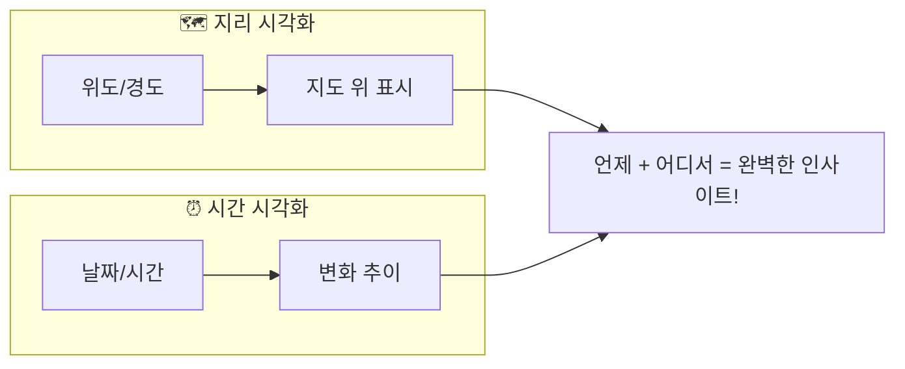
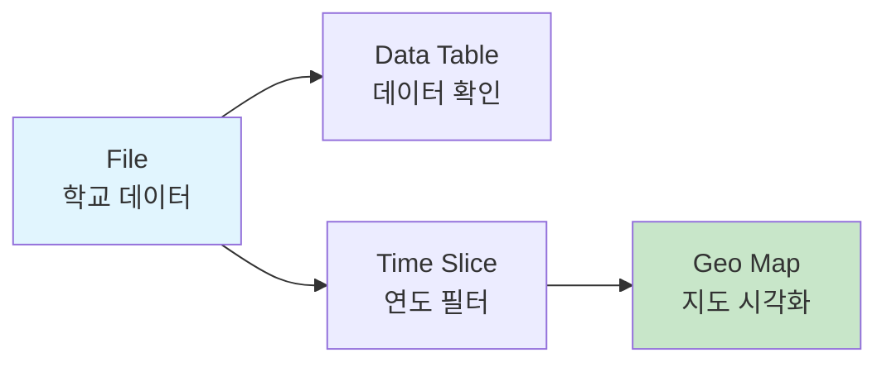

# 지도와 시간으로 보는 데이터 — 지리·시간 데이터 시각화

**Part 4. 데이터를 눈에 보이게 — 빅데이터 시각화 | Chapter 4-2**

---

## 🎯 이 장에서 배우는 것

- [ ] 지리 데이터와 시간 데이터 시각화의 특징을 설명할 수 있다
- [ ] 오렌지3의 Geo Map 위젯으로 데이터를 지도에 표현할 수 있다
- [ ] Time Slice 위젯으로 시간에 따른 변화를 확인할 수 있다

---

> **💡 생각해보기**
> 
> "전국의 학교가 언제, 어디에 많이 생겼을까?" 이 질문에 답하려면 수천 개 학교 데이터를 어떻게 봐야 할까요? 표로 보면 숫자만 가득하지만, **지도와 시간 그래프**로 보면 한눈에 패턴이 보입니다!

---

## 📚 핵심 개념

### 개념 1: 지리 데이터 시각화 (Geo Visualization)

**비유로 시작**: 지리 데이터 시각화는 마치 **날씨 앱의 기온 지도**와 같아요. 숫자로 "서울 25도, 부산 28도"라고 말하는 것보다, 지도 위에 색깔로 표시하면 어디가 더운지 바로 알 수 있죠!

**정확한 정의**: 위도(latitude)와 경도(longitude) 정보가 포함된 데이터를 지도 위에 점, 색상, 크기 등으로 표현하는 방법입니다.

**예시로 확인**:
- 🏫 전국 학교 위치 → 점으로 표시
- 🏪 편의점 분포 → 밀집도를 색상으로
- 🚗 교통사고 발생 지점 → 위험 구역 파악

---

### 개념 2: 시간 데이터 시각화 (Time Series Visualization)

**비유로 시작**: 시간 데이터 시각화는 마치 **타임랩스 영상**과 같아요. 꽃이 피는 과정을 빨리 감기로 보면 변화가 확 느껴지듯, 데이터의 시간 흐름을 압축해서 보여줍니다.

**정확한 정의**: 시간 정보(연도, 월, 일 등)가 포함된 데이터를 시간 축을 따라 변화 추이를 보여주는 방법입니다.

**예시로 확인**:
- 📈 연도별 학교 설립 수 변화
- 🌡️ 월별 평균 기온 추이
- 📱 시간대별 앱 사용량



---

## 🔨 따라하기: 전국 학교 데이터 시각화

> **실습 데이터**: 전국 초·중·고등학교 설립 정보 (학교명, 위도, 경도, 설립연도)

### Step 1: 데이터 불러오기

오렌지3를 실행하고 워크플로우를 구성합니다.

**위젯 배치**: `File` → `Data Table`로 연결

```
[File] ──▶ [Data Table]
```

File 위젯을 더블클릭하여 `school_locations.csv` 파일을 불러옵니다.

**확인할 내용**:
- `latitude` (위도): 숫자형
- `longitude` (경도): 숫자형  
- `year` (설립연도): 숫자형

---

### Step 2: Geo Map으로 학교 위치 표시하기

**위젯 추가**: `File` → `Geo Map`으로 연결

```
[File] ──▶ [Geo Map]
```

**Geo Map 설정**:
1. **Latitude**: `latitude` 선택
2. **Longitude**: `longitude` 선택
3. **Color**: `school_type` (학교 유형별 색상 구분)

**실행 결과**: 대한민국 지도 위에 학교들이 점으로 표시됩니다. 서울·경기 지역에 점이 밀집된 것이 보이나요?

---

### Step 3: Time Slice로 시간 흐름 보기

**위젯 추가**: `File` → `Time Slice` → `Geo Map`

```
[File] ──▶ [Time Slice] ──▶ [Geo Map]
```

**Time Slice 설정**:
1. **Time variable**: `year` 선택
2. 슬라이더를 드래그하여 연도 범위 조절

**실행 결과**: 1950년대 → 1980년대 → 2020년대로 이동하며 학교가 늘어나는 과정을 확인할 수 있습니다!

---

### Step 4: 인사이트 도출하기

시각화를 보며 다음 질문에 답해봅시다:

> **🔍 알아보기**
> 
> **Q1**: 어느 지역에 학교가 가장 많이 밀집되어 있나요?
> → 수도권(서울, 경기)에 점이 가장 밀집
> 
> **Q2**: 학교가 가장 많이 설립된 시기는 언제인가요?
> → 1980~1990년대에 급격히 증가 (인구 증가 시기와 일치!)

---

## 📝 전체 워크플로우



**완성된 연결 순서**:
1. **File**: 데이터 불러오기
2. **Time Slice**: 원하는 시간 범위 선택
3. **Geo Map**: 지도에 시각화

---

## ⚠️ 주의할 점

**1. 위도·경도 데이터 확인 필수!**
- 위도(latitude): 대한민국은 약 33°~43° 범위
- 경도(longitude): 대한민국은 약 124°~132° 범위
- 범위를 벗어나면 지도에 아무것도 안 보여요!

**2. 데이터 타입 확인**
- 위도, 경도, 연도는 반드시 **숫자형(numeric)** 이어야 합니다
- 문자형이면 위젯이 인식하지 못합니다

---

## ✅ 점검하기

**1. 지리 데이터 시각화에 반드시 필요한 두 가지 정보는?**

<details>
<summary>정답 확인</summary>

**위도(latitude)와 경도(longitude)**입니다. 이 두 좌표가 있어야 지도 위 정확한 위치에 데이터를 표시할 수 있습니다.

</details>

**2. Time Slice 위젯의 역할은 무엇인가요?**

<details>
<summary>정답 확인</summary>

**특정 시간 범위의 데이터만 필터링**하는 역할입니다. 슬라이더로 원하는 기간을 선택하면, 그 기간에 해당하는 데이터만 다음 위젯으로 전달됩니다.

</details>

**3. (도전) 공공데이터포털에서 지리 데이터를 찾아 Geo Map에 적용해보세요!**

<details>
<summary>힌트 보기</summary>

1. [공공데이터포털](https://data.go.kr) 접속
2. "위치", "좌표" 키워드로 검색 (예: 전국 도서관, 전기차 충전소)
3. CSV 다운로드 후 위도·경도 컬럼 확인
4. 오렌지3에서 불러와 Geo Map 연결!

</details>

---

> **📌 정리하기**
> 
> - **지리 시각화**: 위도+경도 → 지도 위에 표현 → "어디에 많은가?"
> - **시간 시각화**: 시간 정보 → 변화 추이 → "언제 변했는가?"
> - **두 가지를 결합**하면 더 풍부한 인사이트를 얻을 수 있습니다!

---

## 🔗 다음 장 미리보기

다음 장에서는 **인터랙티브 대시보드**를 만들어봅니다. 여러 시각화를 한 화면에 배치하고, 클릭 한 번으로 데이터를 탐색하는 방법을 배웁니다. 🎛️