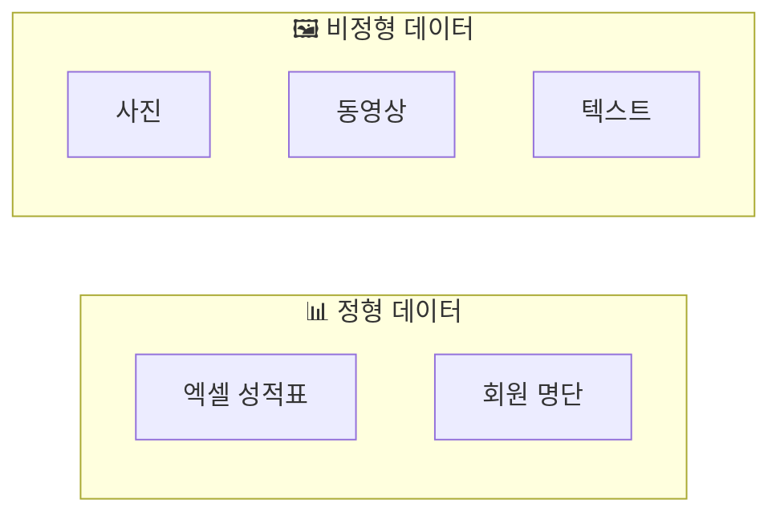
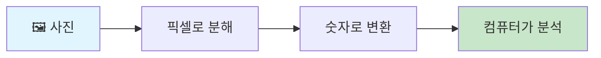
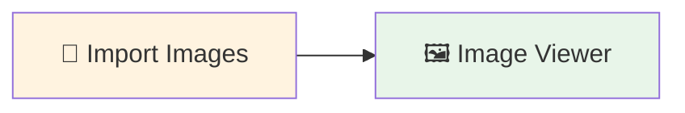
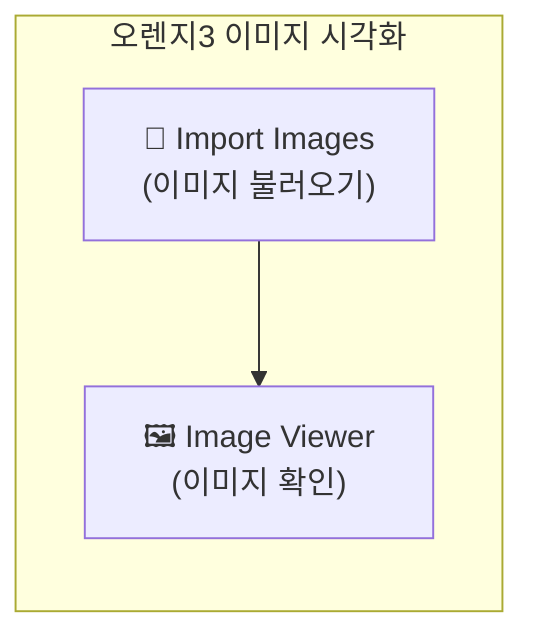

# 5-1. 사진도 데이터다 — 이미지 데이터 시각화

---

## 🎯 이 장에서 배우는 것

- [ ] 비정형 데이터로서 이미지 데이터의 특징을 설명할 수 있다
- [ ] 오렌지3의 Import Images, Image Viewer 위젯으로 이미지를 불러오고 시각화할 수 있다
- [ ] 이미지 데이터 시각화의 실생활 활용 사례를 설명할 수 있다

---

> **💭 생각해보기**
> 
> 인스타그램에 음식 사진을 올리면 자동으로 "음식" 태그가 붙고, 풍경 사진에는 "여행" 태그가 추천됩니다. 스마트폰 갤러리도 사람, 동물, 음식 사진을 알아서 분류해주죠. 컴퓨터는 어떻게 사진의 내용을 "알아보는" 걸까요?

---

## 📚 핵심 개념

### 개념 1: 비정형 데이터 vs 정형 데이터

**비유로 시작**: 정형 데이터는 마치 **잘 정리된 출석부**와 같아요. 이름, 학번, 점수가 깔끔하게 칸에 맞춰 정리되어 있죠. 반면 비정형 데이터는 **사진첩, 일기장, 녹음파일**처럼 정해진 형식 없이 다양한 모습으로 존재합니다.

**정확한 정의**:
- **정형 데이터**: 행과 열로 구성된 표 형태 데이터 (엑셀, 데이터베이스)
- **비정형 데이터**: 정해진 구조 없이 저장되는 데이터 (이미지, 텍스트, 음성, 영상)



**예시로 확인**:
- 정형: 학생 성적표(이름, 국어 90, 수학 85...)
- 비정형: 졸업사진, 체육대회 영상, 독후감

---

### 개념 2: 이미지는 숫자의 모음

**비유로 시작**: 이미지는 마치 **색칠된 모눈종이**와 같아요. 각 칸(픽셀)에 색깔 정보가 숫자로 저장되어 있습니다.

**정확한 정의**: 
디지털 이미지는 수많은 **픽셀(pixel)**로 구성되며, 각 픽셀은 0~255 사이의 숫자로 색상 밝기를 표현합니다.



**예시로 확인**:
- 흑백 이미지: 0(검정) ~ 255(흰색)
- 100×100 픽셀 이미지 = 10,000개의 숫자 데이터

> **📌 알아보기: 왜 이미지 분석이 중요할까?**
> 
> - **의료**: X-ray, CT 사진에서 질병 조기 발견
> - **자율주행**: 카메라로 신호등, 보행자 인식
> - **쇼핑**: 상품 사진 검색, 유사 상품 추천

---

## 🔨 따라하기: 오렌지3로 이미지 불러오기

### Step 1: 실습 데이터 준비

오렌지3에는 연습용 이미지 데이터가 내장되어 있습니다.

**준비물**: 오렌지3 프로그램 실행

---

### Step 2: Import Images 위젯 배치

1. 왼쪽 위젯 목록에서 **Image** 카테고리 클릭
2. **Import Images** 위젯을 캔버스로 드래그
3. 위젯을 더블클릭하여 설정 창 열기

---

### Step 3: 샘플 이미지 불러오기

1. Import Images 위젯의 설정 창에서 **Browse documentation datasets** 클릭
2. **bone-healing** 또는 다른 이미지 폴더 선택
3. **Open** 클릭하여 이미지 로드

**실행 결과**: 위젯 아래에 불러온 이미지 개수가 표시됩니다.

```
📁 bone-healing
   └── 26 images loaded
```

---

### Step 4: Image Viewer로 시각화

1. **Image Viewer** 위젯을 캔버스에 추가
2. Import Images → Image Viewer 연결 (선으로 이어주기)
3. Image Viewer 더블클릭하여 결과 확인



**실행 결과**: 불러온 이미지들이 격자 형태로 표시됩니다.

---

## 📝 완성된 워크플로우



> **🎯 정리하기**
> 
> - **Import Images**: 폴더에서 이미지 파일들을 데이터로 불러오는 위젯
> - **Image Viewer**: 불러온 이미지를 눈으로 확인하는 위젯
> - 두 위젯을 연결하면 이미지 데이터 시각화 완성!

---

## ⚠️ 주의할 점

**1. 이미지 파일 형식 확인**
- Import Images는 JPG, PNG 등 일반적인 이미지 형식 지원
- 특수 형식(RAW, PSD 등)은 미리 변환 필요

**2. 폴더 구조가 중요**
- 이미지 분류 작업 시, 폴더 이름이 자동으로 **카테고리(레이블)**가 됨
- 예: `강아지` 폴더의 사진들 → "강아지" 레이블 자동 부여

---

## ✅ 점검하기

**1. 다음 중 비정형 데이터가 아닌 것은?**

(가) 졸업 사진  
(나) 학생 성적 엑셀 파일  
(다) 유튜브 동영상  
(라) 카카오톡 대화 내용

<details>
<summary>정답 확인</summary>

**(나) 학생 성적 엑셀 파일**

엑셀 파일은 행과 열로 구조화된 정형 데이터입니다. 사진, 동영상, 텍스트 대화는 모두 비정형 데이터에 해당합니다.

</details>

---

**2. 컴퓨터가 이미지를 분석할 수 있는 이유는 무엇인가요?**

<details>
<summary>정답 확인</summary>

이미지가 **픽셀 단위의 숫자 데이터**로 변환되기 때문입니다. 각 픽셀의 색상 정보가 0~255 사이의 숫자로 표현되어, 컴퓨터가 계산하고 패턴을 찾을 수 있습니다.

</details>

---

**3. [도전 문제] 직접 찍은 사진 불러오기**

스마트폰으로 찍은 사진 3장을 하나의 폴더에 저장한 후, Import Images로 불러와 Image Viewer에서 확인해보세요.

<details>
<summary>힌트 보기</summary>

1. 바탕화면에 `내사진` 폴더 만들기
2. 사진 3장을 해당 폴더에 복사
3. Import Images에서 **폴더 열기** → `내사진` 폴더 선택
4. Image Viewer 연결하여 확인

</details>

---
