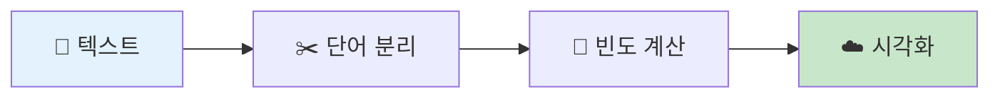
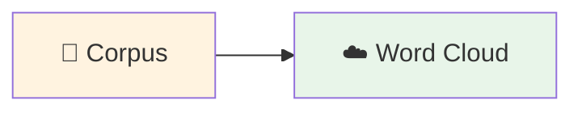
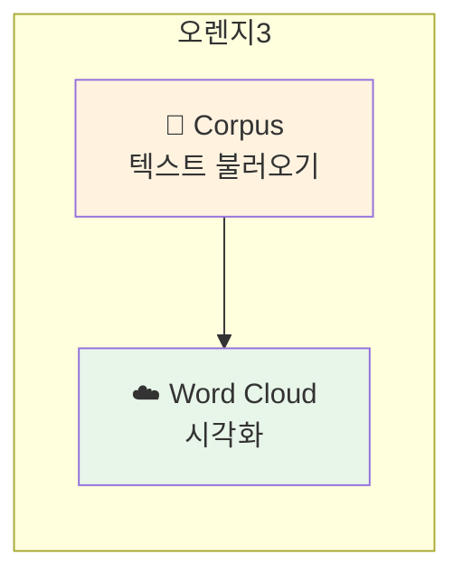

# 5-2. 글자도 데이터다 — 텍스트 데이터 시각화

---

## 🎯 이 장에서 배우는 것

- [ ] 텍스트 데이터의 특징과 워드클라우드의 의미를 설명할 수 있다
- [ ] 오렌지3의 Corpus, Word Cloud 위젯으로 텍스트 데이터를 시각화할 수 있다
- [ ] 워드클라우드 결과에서 핵심 키워드를 찾아 의미를 해석할 수 있다

---

> **💭 생각해보기**
> 
> 윤동주 시인의 시에서 가장 많이 등장하는 단어는 무엇일까요? 
> '별'일까요, '하늘'일까요? 직접 세어보지 않고도 알 수 있는 방법이 있습니다!

---

## 📚 핵심 개념

### 개념 1: 텍스트 데이터

**비유로 시작**: 텍스트 데이터는 마치 **레고 블록 더미**와 같아요. 문장은 단어들이 모여 만들어지고, 이 단어들을 분리하면 각각의 블록이 됩니다. 어떤 블록이 많은지 세어보면 전체 구조의 특징을 알 수 있죠!

**정확한 정의**: 텍스트 데이터란 문자로 이루어진 비정형 데이터입니다. 숫자처럼 바로 계산할 수 없어서, 분석하려면 **단어 분리 → 빈도 계산 → 시각화** 과정을 거칩니다.

**예시로 확인**: "별 하나에 추억과, 별 하나에 사랑과"라는 문장에서 '별'은 2번, '하나'는 2번 등장합니다.



---

### 개념 2: 워드클라우드

**비유로 시작**: 워드클라우드는 마치 **인기투표 결과판**과 같아요. 많이 등장한 단어는 크게, 적게 등장한 단어는 작게 표시되어 한눈에 핵심을 파악할 수 있습니다.

**정확한 정의**: 워드클라우드(Word Cloud)는 텍스트에서 단어의 등장 빈도를 **글자 크기로 표현**하는 시각화 기법입니다.

**예시로 확인**:
- 🔤 **"별"** ← 20번 등장 (가장 크게)
- 🔤 **"하늘"** ← 15번 등장 (중간 크기)
- 🔤 "추억" ← 5번 등장 (작게)

---

## 🔨 따라하기: 윤동주 시 워드클라우드 만들기

### Step 1: 텍스트 데이터 준비하기

먼저 분석할 텍스트 파일을 준비합니다.

**yun_poems.txt 파일 내용** (메모장에서 직접 만들기):
```
죽는 날까지 하늘을 우러러 한 점 부끄럼이 없기를
잎새에 이는 바람에도 나는 괴로워했다
별을 노래하는 마음으로 모든 죽어가는 것을 사랑해야지
그리고 나한테 주어진 길을 걸어가야겠다
오늘 밤에도 별이 바람에 스치운다
별 하나에 추억과 별 하나에 사랑과
별 하나에 쓸쓸함과 별 하나에 동경과
별 하나에 시와 별 하나에 어머니 어머니
```

> **📁 파일 저장**: 메모장에 위 내용을 복사한 후, `yun_poems.txt`로 저장하세요.

---

### Step 2: 오렌지3에서 Corpus 위젯 연결하기



**설정 방법**:
1. 왼쪽 패널에서 **Text Mining** 카테고리 클릭
2. **Corpus** 위젯을 캔버스에 드래그
3. Corpus 위젯 더블클릭 → 📂 버튼으로 `yun_poems.txt` 불러오기

---

### Step 3: Word Cloud 위젯으로 시각화하기

1. **Word Cloud** 위젯을 캔버스에 추가
2. Corpus → Word Cloud 연결선 그리기
3. Word Cloud 위젯 더블클릭

**실행 결과**:
```
[워드클라우드 화면]
    
      ★★ 별 ★★        하늘
   하나   사랑      바람
  어머니    추억   마음
```

> 💡 '별', '하나'가 가장 크게 표시됩니다!

---

### Step 4: 결과 해석하기

워드클라우드에서 발견한 것을 정리해봅시다.

> **🔍 알아보기: 윤동주 시의 핵심 주제**
> 
> **자주 등장하는 단어**: 별, 하나, 하늘, 바람, 사랑, 어머니
> 
> **해석**: 윤동주 시인은 '별'과 '하늘' 같은 자연물에 자신의 감정과 그리움을 담아 표현했습니다. '어머니', '사랑', '추억'이 함께 등장하는 것은 고향과 가족에 대한 그리움을 보여줍니다.

---

## 📝 전체 워크플로우



**완성된 연결**: `Corpus` → `Word Cloud`

---

## ⚠️ 주의할 점

**1. 한글 텍스트는 띄어쓰기가 중요해요**
- 오렌지3는 띄어쓰기로 단어를 구분합니다
- "별하나에" → 1단어로 인식 ❌
- "별 하나에" → 2단어로 인식 ✅

**2. 불용어(의미 없는 단어) 처리**
- '은', '는', '이', '가' 같은 조사가 많이 나올 수 있어요
- Word Cloud 위젯의 설정에서 제외할 수 있습니다

---

## 📌 핵심 정리

> **✨ 정리하기**
> 
> - **텍스트 데이터**: 문자로 이루어진 비정형 데이터, 단어 분리 후 분석
> - **워드클라우드**: 단어 빈도를 글자 크기로 표현하는 시각화
> - **분석 흐름**: 텍스트 → 단어 분리 → 빈도 계산 → 시각화 → 해석

---

## ✅ 점검하기

**1. 워드클라우드에서 글자가 크게 표시되는 기준은 무엇인가요?**

<details><summary>정답 확인</summary>

해당 단어가 텍스트에서 **많이 등장할수록** 크게 표시됩니다.

</details>

**2. 다음 워드클라우드 결과를 보고, 이 텍스트의 주제를 추측해보세요.**

```
    ★★ 환경 ★★     지구
  재활용   쓰레기   오염
    플라스틱   보호
```

<details><summary>정답 확인</summary>

**환경 보호** 또는 **환경 오염 문제**에 관한 텍스트입니다. '환경', '지구', '재활용', '오염' 등의 키워드가 핵심입니다.

</details>

**3. [도전 문제] 좋아하는 노래 가사를 텍스트 파일로 만들어 워드클라우드를 생성해보세요. 어떤 단어가 가장 크게 나타났나요?**

<details><summary>힌트</summary>

1. 가사를 메모장에 복사 → `.txt`로 저장
2. Corpus 위젯으로 불러오기
3. Word Cloud 연결
4. 반복되는 후렴구의 단어가 크게 나타날 거예요!

</details>

---

## 🔗 다음 장 미리보기

다음 장에서는 **이미지 데이터**를 다룹니다. 사진 속 색상 분포를 분석하고, 이미지를 숫자 데이터로 변환하는 방법을 배워봅시다. 텍스트에 이어 이미지도 데이터가 될 수 있다는 것을 경험하게 됩니다! 📸