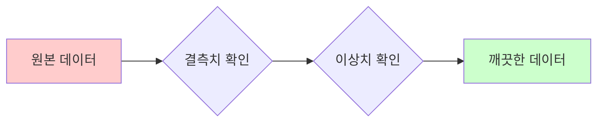
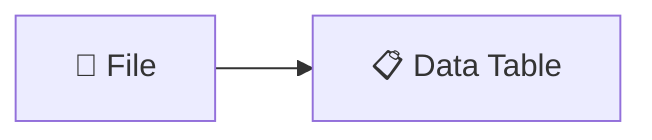
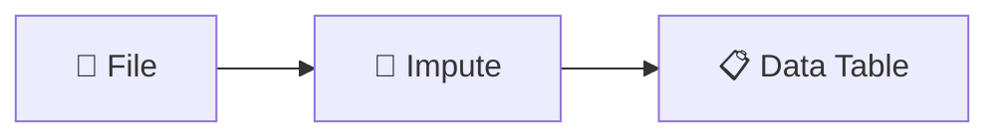
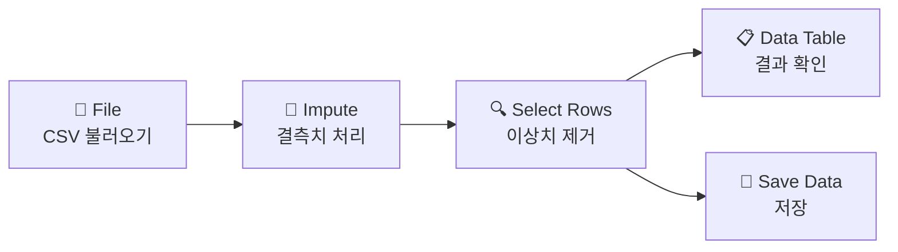
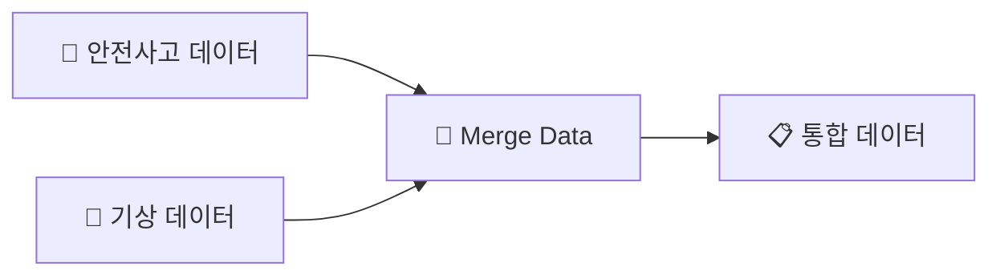

# 6-1. 문제를 발견하라 — 안전사고 데이터 수집과 전처리

**Part 6. 데이터로 문제를 해결하라 — 협력적 창의·융합 프로젝트**

---

> 💭 **생각해보기**
> 
> 매년 여름이면 뉴스에서 바다 익사 사고 소식이 들려옵니다. 왜 같은 사고가 반복될까요? "조심하세요"라는 말만으로는 부족합니다. **데이터로 사고의 패턴**을 찾으면 진짜 원인을 발견할 수 있지 않을까요?

---

## 🎯 이 장에서 배우는 것

- [ ] 공공데이터포털에서 여름철 안전사고 데이터를 검색하고 다운로드할 수 있다
- [ ] 오렌지3로 결측치와 이상치를 찾아 전처리할 수 있다
- [ ] 전처리 과정을 구글 슬라이드에 기록할 수 있다

---

## 📚 핵심 개념

### 개념 1: 공공데이터

**비유로 시작**: 공공데이터는 마치 **도서관의 무료 책**과 같아요. 누구나 빌려서 읽을 수 있듯이, 정부가 수집한 데이터를 누구나 무료로 활용할 수 있습니다.

**정확한 정의**: 공공데이터란 정부·지자체·공공기관이 업무 중 생산한 데이터로, 국민에게 개방된 정보입니다.

**예시로 확인**:
- 해양경찰청 → 해양 안전사고 통계
- 소방청 → 119 구급 출동 기록
- 기상청 → 일별 기온·파고 데이터

---

### 개념 2: 데이터 전처리

**비유로 시작**: 전처리는 마치 **요리 전 재료 손질**과 같아요. 흙 묻은 채소를 씻고, 상한 부분을 잘라내야 맛있는 요리가 되듯, 데이터도 분석 전에 정리해야 합니다.

**정확한 정의**: 데이터 전처리란 분석에 적합하도록 결측치(빈 값), 이상치(비정상적 값), 오류를 처리하는 과정입니다.

**예시로 확인**:

---

## 🔨 따라하기

### Step 1: 공공데이터포털에서 데이터 찾기

1. **data.go.kr** 접속
2. 검색창에 **"해양 안전사고"** 또는 **"여름철 익사"** 입력
3. **파일데이터** 탭 클릭 → **CSV 형식** 필터 선택
4. 적절한 데이터셋의 **다운로드** 버튼 클릭

> 📌 **알아보기**: CSV 파일이란?
> 
> Comma Separated Values의 약자로, 쉼표로 값을 구분한 텍스트 파일입니다. 엑셀, 오렌지3 등 대부분의 프로그램에서 열 수 있어요.

---

### Step 2: 오렌지3에 데이터 불러오기

1. 오렌지3 실행
2. 왼쪽 **Data** 메뉴에서 **File** 위젯을 캔버스에 드래그
3. File 위젯 더블클릭 → 다운로드한 CSV 파일 선택
4. **Data Table** 위젯 연결하여 데이터 확인

---

### Step 3: 결측치와 이상치 확인하기

**File 위젯**을 더블클릭하면 데이터 요약 정보가 나타납니다.

**확인할 것**:
- **Missing**: 결측치(빈 칸) 개수
- 숫자 열의 **최솟값/최댓값**: 이상치 여부

> ⚠️ **이상치 예시**: 나이 열에 **-5세** 또는 **200세**가 있다면? 명백한 오류입니다!

---

### Step 4: 전처리 실행하기

**결측치 처리**: **Impute** 위젯 사용

1. **Impute** 위젯 연결
2. 숫자형 → **Average/Median** (평균/중앙값으로 대체)
3. 문자형 → **Most frequent** (최빈값으로 대체)

**이상치 제거**: **Select Rows** 위젯 사용

예) 나이가 0~100 사이인 데이터만 선택:
- Conditions에서 `나이 ≥ 0` AND `나이 ≤ 100` 설정

---

## 📝 전처리 워크플로우 (전체)

---

## 📊 구글 슬라이드에 기록하기

첫 페이지에 다음 내용을 정리하세요:

**기록할 항목**:
- **데이터 출처**: 어디서 받았는지 (URL 포함)
- **원본 데이터 행 수**: 전처리 전 개수
- **결측치 처리**: 몇 개를 어떻게 처리했는지
- **이상치 처리**: 제거한 행 수와 이유
- **최종 데이터 행 수**: 전처리 후 개수

---

## ⚠️ 주의할 점

1. **데이터 출처 기록 필수**: 나중에 "이 데이터 어디서 났어요?"라고 물으면 대답할 수 있어야 합니다.

2. **원본 파일 따로 보관**: 전처리한 파일을 새 이름으로 저장하세요. 실수하면 원본으로 돌아갈 수 있어야 합니다.

---

## ✅ 점검하기

**1. 결측치와 이상치의 차이점은 무엇인가요?**

정답 확인

- **결측치**: 값이 비어있는 것 (빈 칸)
- **이상치**: 값은 있지만 비정상적으로 크거나 작은 것 (예: 나이 -5세)

**2. 오렌지3에서 결측치를 처리하는 위젯 이름은?**

정답 확인

**Impute** 위젯입니다.

**3. 전처리 결과를 기록해야 하는 이유는?**

정답 확인

- 분석 과정의 **투명성** 확보
- 나중에 **재현** 가능
- 팀원과 **협업** 시 공유 필요

---

## 🚀 도전 문제

> 두 개의 데이터셋(예: 안전사고 + 기상 데이터)을 **Merge Data** 위젯으로 합쳐보세요!

**힌트**: 두 데이터에 공통된 열(예: 날짜, 지역)이 있어야 합니다.

---
