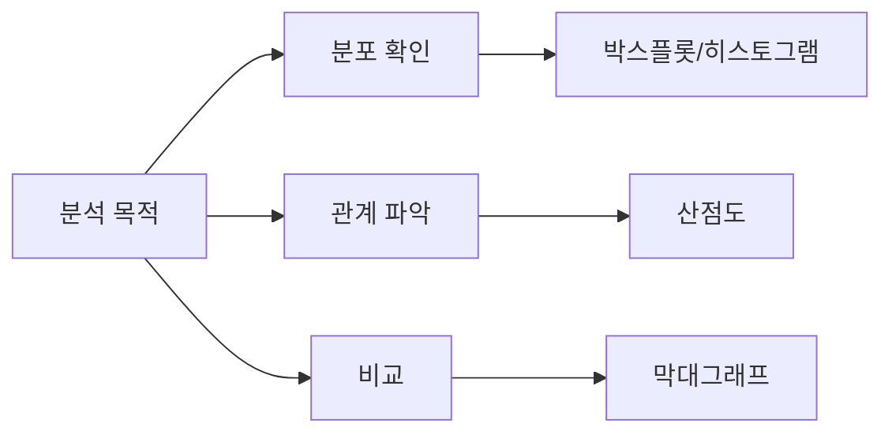
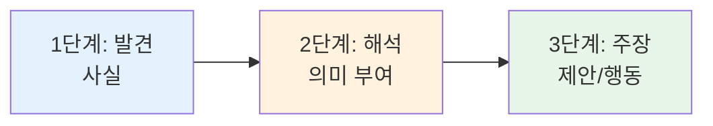

# 데이터로 이야기하라 — 안전사고 데이터 시각화와 인사이트 도출

## 🎯 이 장에서 배우는 것

- [ ] 안전사고 데이터를 목적에 맞는 시각화 방법(박스플롯, 산점도)으로 표현할 수 있다
- [ ] 시각화에서 발견한 패턴을 '사실 → 해석 → 주장' 3단계로 정리할 수 있다
- [ ] 사실(데이터)과 해석(내 생각)을 구분하여 인사이트 문장을 작성할 수 있다

---

> **💡 생각해보기**
> 
> "교통사고가 늘었다"를 막대그래프로 보여주면 '증가'가 강조되고, 원형그래프로 보여주면 '비율'이 강조됩니다. 같은 데이터도 **어떤 그래프를 선택하느냐**에 따라 전달되는 메시지가 달라집니다. 오늘은 우리 모둠의 안전사고 데이터를 가장 효과적으로 "이야기"하는 방법을 배워봅시다.

---

## 📚 핵심 개념

### 개념 1: 목적에 맞는 시각화 선택

**비유로 시작**: 시각화 방법을 고르는 것은 마치 **사진을 찍을 때 렌즈를 고르는 것**과 같아요. 광각 렌즈는 넓은 풍경을, 망원 렌즈는 먼 곳의 디테일을 담듯이, 각 그래프는 데이터의 다른 면을 보여줍니다.

**정확한 정의**: 시각화 선택이란 **분석 목적에 따라 가장 적합한 그래프 유형을 결정**하는 것입니다.

**목적별 시각화 선택 가이드**



**예시로 확인**
- "시간대별 사고 **분포**가 궁금해" → **박스플롯**
- "나이와 사고 심각도의 **관계**가 있을까?" → **산점도**
- "지역별 사고 **건수 비교**" → **막대그래프**

---

### 개념 2: 사실과 해석의 구분

**비유로 시작**: 날씨 앱에서 "기온 35도"는 **사실**이고, "더우니까 반팔을 입어야겠다"는 **해석**입니다. 데이터 분석도 마찬가지로, 그래프가 보여주는 것(사실)과 내가 생각하는 의미(해석)를 구분해야 합니다.

**정확한 정의**
- **사실**: 그래프에서 **숫자나 패턴으로 직접 확인**할 수 있는 것
- **해석**: 그 사실을 바탕으로 **내가 추론하거나 의미를 부여**한 것

**3단계 인사이트 정리법**



**예시로 확인**

| 단계 | 구분 | 예시 문장 |
|:--|:--|:--|
| 발견 | 사실 | "오후 4-6시 사고가 전체의 35%를 차지한다" |
| 해석 | 내 생각 | "하교 시간대에 사고가 집중되는 것 같다" |
| 주장 | 제안 | "하교 시간 교통 안전 캠페인이 필요하다" |

> **⚠️ 주의**: "~것 같다", "~추측된다"는 해석 표현입니다. 사실을 쓸 때는 "~이다", "~를 보인다"처럼 명확하게 씁니다.

---

## 🔨 따라하기: 오렌지3로 시각화하고 인사이트 도출하기

### Step 1: 박스플롯으로 분포 확인하기

오렌지3 캔버스에서 전처리한 데이터를 불러옵니다.

**위젯 연결 순서**
```
[File] → [Select Columns] → [Box Plot]
```

**Box Plot 설정**
- Variable: 분석할 수치형 변수 선택 (예: 사고건수, 피해규모)
- Group by: 범주형 변수 선택 (예: 시간대, 요일, 지역)

**실행 결과 예시**
```
시간대별 사고건수 박스플롯:
- 오전(6-12시): 중앙값 15건
- 오후(12-18시): 중앙값 28건 ← 가장 높음
- 저녁(18-24시): 중앙값 12건
```

---

### Step 2: 산점도로 관계 파악하기

**위젯 연결**
```
[File] → [Scatter Plot]
```

**Scatter Plot 설정**
- X축: 첫 번째 변수 (예: 연령)
- Y축: 두 번째 변수 (예: 사고심각도)
- Color: 범주 구분용 (예: 사고유형)

**읽는 방법**
- 점들이 **오른쪽 위로 향하면**: 양의 상관관계
- 점들이 **오른쪽 아래로 향하면**: 음의 상관관계
- 점들이 **흩어져 있으면**: 관계 없음

---

### Step 3: 인사이트 문장 작성하기

시각화 결과를 보고 3단계로 정리합니다.

**작성 템플릿**

```
📊 시각화 유형: [박스플롯/산점도]

1️⃣ 발견(사실): 
   "그래프에서 ___이/가 ___로 나타난다."
   
2️⃣ 해석(의미): 
   "이것은 ___을/를 의미하는 것 같다."
   
3️⃣ 주장(제안): 
   "따라서 ___이/가 필요하다."
```

**작성 예시**

```
📊 시각화 유형: 박스플롯 (시간대별 사고건수)

1️⃣ 발견: "오후 4-6시 사고건수 중앙값이 32건으로 
         다른 시간대(평균 15건)보다 2배 이상 높다."

2️⃣ 해석: "학생 하교와 직장인 퇴근이 겹치는 
         시간대라 통행량이 많기 때문인 것 같다."

3️⃣ 주장: "해당 시간대에 교통 지도 인력 배치를 
         늘려야 한다."
```

---

### Step 4: 구글 슬라이드에 정리하기

**슬라이드 구성 예시**

```
[슬라이드 제목]: 시간대별 안전사고 분석

┌─────────────────────────────────────┐
│  [박스플롯 이미지 캡처]              │
│                                     │
│  📍 발견: 오후 4-6시 사고가 2배 높음 │
│  💭 해석: 하교+퇴근 시간 중복       │
│  💡 제안: 해당 시간 안전 인력 배치  │
└─────────────────────────────────────┘
```

**팁**: 오렌지3에서 그래프 우클릭 → Save Image로 저장 후 슬라이드에 삽입

---

## ⚠️ 주의할 점

**1. 상관관계 ≠ 인과관계**
- ❌ "아이스크림 판매량이 늘면 익사 사고가 늘어난다" (인과관계처럼 표현)
- ⭕ "아이스크림 판매량과 익사 사고는 함께 증가하는 경향이 있다" (상관관계)
- 둘 다 여름에 늘어나는 것이지, 아이스크림이 익사의 원인은 아닙니다!

**2. 극단값(이상치)에 주의**
- 박스플롯에서 점으로 표시되는 이상치가 있다면, 입력 오류인지 실제 특이 사례인지 확인하세요.

---

## ✅ 점검하기

**1. 다음 중 "사실"에 해당하는 문장은?**

A) "10대의 자전거 사고가 많은 것은 안전 교육 부족 때문이다"  
B) "10대 자전거 사고가 전체의 42%를 차지한다"  
C) "10대에게 자전거 안전 교육을 강화해야 한다"

<details><summary>정답 확인</summary>

**B)** "42%를 차지한다"는 데이터에서 직접 확인 가능한 사실입니다.
- A는 해석(원인 추론)
- C는 주장(제안)

</details>

---

**2. "두 변수 사이의 관계"를 파악하고 싶을 때 가장 적합한 시각화는?**

<details><summary>정답 확인</summary>

**산점도(Scatter Plot)**입니다. 두 수치형 변수를 X축과 Y축에 배치하여 점의 분포 패턴으로 관계를 파악합니다.

</details>

---

**3. [도전] 여러분 모둠의 시각화에서 발견한 패턴에 대해 "왜 이런 패턴이 나타날까?" 가설을 세우고, 어떤 추가 데이터가 있으면 검증할 수 있을지 적어보세요.**

<details><summary>예시 답안</summary>

**가설**: "주말 오후에 놀이시설 사고가 많은 것은 이용객이 많기 때문일 것이다"

**검증용 추가 데이터**: 요일별·시간대별 놀이시설 이용객 수 데이터

</details>

---

## 📝 핵심 개념 요약

> **정리하기 📌**
> 
> - **시각화 선택**: 분포 확인은 박스플롯, 관계 파악은 산점도, 비교는 막대그래프
> - **사실 vs 해석**: 그래프에서 "보이는 것"은 사실, 내가 "생각하는 것"은 해석
> - **인사이트 3단계**: 발견(사실) → 해석(의미) → 주장(제안)
> - 상관관계를 인과관계로 착각하지 않기!

---

## 🔗 다음 장 미리보기

**6-3. 근거를 갖춘 제안서 — 데이터 기반 정책 제안 발표**

시각화와 인사이트를 바탕으로 실제 안전 정책을 제안하는 발표 자료를 완성합니다. 청중을 설득하는 데이터 스토리텔링 기법과 효과적인 발표 구조를 배워봅시다! 🎤