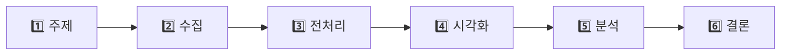
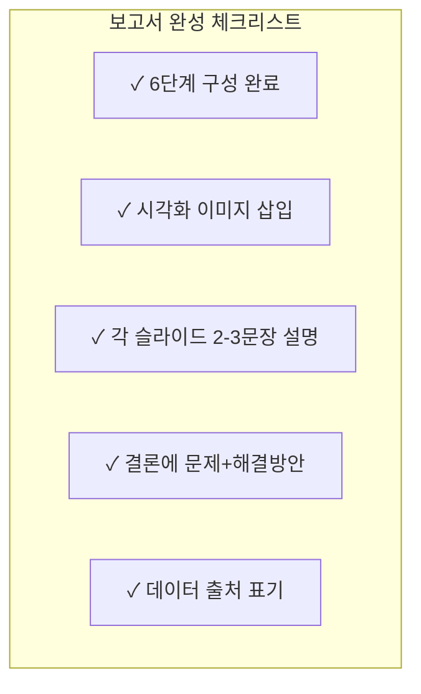

# 챕터 7-1. 보고서를 완성하라 — 구글 슬라이드로 분석 결과 정리하기

---

## 🎯 이 장에서 배우는 것

- [ ] 데이터 보고서의 6단계 구성(주제→수집→전처리→시각화→분석→결론)을 이해하고 슬라이드를 완성할 수 있다
- [ ] 오렌지3에서 만든 시각화 결과를 슬라이드에 삽입하고 핵심 설명을 추가할 수 있다
- [ ] 결론 슬라이드에서 데이터로 발견한 문제와 해결 방안을 제안할 수 있다

---

## 💭 생각해보기

> *"열심히 일주일 동안 데이터를 분석했는데, 발표할 때 친구들이 '그래서 뭐?'라고 물어본다면?"*

아무리 뛰어난 분석도 전달되지 않으면 의미가 없습니다. **좋은 보고서는 분석만큼 중요합니다.** 오늘은 지금까지의 분석 여정을 하나의 완성된 이야기로 정리해봅시다.

---

## 📚 핵심 개념

### 개념 1: 데이터 보고서의 6단계 구성

**비유로 시작하기** 🎬

데이터 보고서는 마치 **영화 예고편**과 같아요. 영화 전체를 2분 안에 핵심만 보여주듯, 보고서는 분석 과정을 핵심만 담아 전달합니다.

**6단계 구성**

**각 단계별 핵심 질문**

- **1️⃣ 주제**: 무엇을 왜 분석했나요?
- **2️⃣ 수집**: 데이터를 어디서 어떻게 얻었나요?
- **3️⃣ 전처리**: 데이터를 어떻게 정리했나요?
- **4️⃣ 시각화**: 어떤 그래프로 표현했나요?
- **5️⃣ 분석**: 그래프에서 무엇을 발견했나요?
- **6️⃣ 결론**: 그래서 무엇을 제안하나요?

---

### 개념 2: 슬라이드 작성의 3원칙

**비유로 시작하기** 📱

슬라이드는 **SNS 게시물**과 비슷해요. 긴 글보다 핵심 한 줄과 좋은 이미지가 더 효과적이죠!

**3가지 원칙**

- **🎯 한 슬라이드 = 한 메시지**: 하나의 슬라이드에는 하나의 핵심만 담기
- **📊 그래프 중심**: 텍스트보다 시각화가 먼저, 설명은 2~3문장으로
- **💡 인사이트 강조**: "~입니다"보다 "~을 발견했습니다"로 표현

---

## 🔨 따라하기: 보고서 슬라이드 완성하기

### Step 1: 오렌지3 시각화 이미지 저장하기

**오렌지3에서 그래프 저장 방법**

1. 오렌지3에서 저장할 시각화 위젯(Bar Plot, Line Plot 등)을 엽니다
2. 그래프 영역에서 **마우스 오른쪽 클릭**
3. **"Save Image"** 또는 **📷 아이콘** 클릭
4. 파일명을 `분석결과_막대그래프.png`처럼 알아보기 쉽게 저장

> 💡 **팁**: PNG 형식으로 저장하면 배경이 깔끔합니다!

---

### Step 2: 구글 슬라이드 6단계 구성하기

**구글 슬라이드에서 작업하기**

1. 지금까지 작성한 구글 슬라이드를 엽니다
2. 아래 순서대로 슬라이드가 있는지 확인하고, 없으면 추가합니다

**슬라이드 구성 예시**

- **슬라이드 1 - 표지**: 제목 + 팀명 + 날짜
- **슬라이드 2 - 주제**: 분석 목적과 질문
- **슬라이드 3 - 데이터 수집**: 데이터 출처와 크기
- **슬라이드 4 - 전처리**: 정리 과정 요약
- **슬라이드 5~6 - 시각화와 분석**: 그래프 + 발견한 내용
- **슬라이드 7 - 결론**: 문제와 해결 방안

---

### Step 3: 시각화 슬라이드에 이미지와 설명 추가하기

**이미지 삽입 방법**

1. 구글 슬라이드에서 해당 슬라이드 선택
2. 메뉴 → **삽입** → **이미지** → **컴퓨터에서 업로드**
3. 저장한 오렌지3 그래프 이미지 선택
4. 이미지 크기를 슬라이드의 **60~70%** 정도로 조절

**핵심 설명 작성하기 (2~3문장)**

> ❌ 나쁜 예: "이것은 막대그래프입니다. 월별 사고 건수를 보여줍니다."

> ✅ 좋은 예: "**5월과 10월에 학교 안전사고가 가장 많이 발생합니다.** 이 시기는 체육대회와 현장학습이 집중되는 때입니다. → 이 시기에 안전 교육을 강화해야 합니다."

---

### Step 4: 결론 슬라이드 작성하기

결론 슬라이드는 보고서의 **하이라이트**입니다!

**결론 슬라이드 구성**

- **📍 발견한 문제** (데이터가 보여준 사실)
  - 예: "체육 활동 중 사고가 전체의 40%를 차지함"

- **💡 제안하는 해결 방안** (우리의 아이디어)
  - 예: "체육 시간 전 5분 스트레칭 의무화 제안"

- **🔮 기대 효과** (해결 방안이 적용되면?)
  - 예: "체육 활동 부상 20% 감소 기대"

---

## ⚠️ 주의할 점

**1️⃣ 글자 크기 체크하기**
- 제목: 32pt 이상
- 본문: 24pt 이상
- 뒷자리에서도 읽을 수 있어야 합니다!

**2️⃣ 출처 반드시 표기하기**
- 모든 데이터에는 출처를 적어야 신뢰도가 올라갑니다
- 예: "출처: 학교안전공제중앙회, 2023년 학교 안전사고 통계"

---

## 📋 정리하기

---

## ✅ 점검하기

**1. 데이터 보고서 6단계를 순서대로 나열하면?**

정답 확인

주제 → 수집 → 전처리 → 시각화 → 분석 → 결론

**2. 시각화 슬라이드에서 설명은 몇 문장이 적당한가요?**

정답 확인

2~3문장이 적당합니다. 핵심 발견 내용을 간결하게 전달해야 청중이 집중할 수 있습니다.

**3. 결론 슬라이드에 반드시 포함해야 할 두 가지는?**

정답 확인

① 데이터로 발견한 문제, ② 우리가 제안하는 해결 방안

---

## 🚀 도전 문제

**발표 노트 작성하기**

구글 슬라이드 하단의 **발표자 노트** 영역에 각 슬라이드별로 말할 내용을 적어보세요.

- 슬라이드당 30초~1분 분량 (3~5문장)
- "이 그래프를 보시면..."으로 시작하기
- 발견한 내용 → 의미 → 다음 슬라이드 연결 순서로

---
