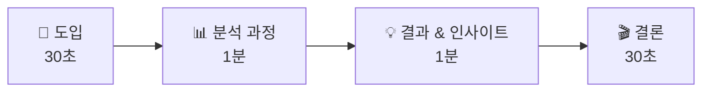

# 발표하고 피드백하라 — 모둠 발표와 동료 평가

## 🎯 이 장에서 배우는 것

- [ ] 구글 슬라이드 보고서를 활용해 분석 결과를 3분 이내로 발표할 수 있다
- [ ] 다른 모둠의 발표를 듣고 구체적인 피드백을 작성할 수 있다
- [ ] 동료 피드백을 반영하여 보고서를 보완할 수 있다

---

> **💭 생각해보기**
> 
> 내가 일주일간 분석한 데이터 이야기를 친구들에게 설득력 있게 전달하려면 어떻게 해야 할까요? 좋은 분석도 발표를 잘 못하면 빛을 잃습니다. 오늘은 여러분의 데이터 이야기를 완성하는 마지막 단계입니다!

---

## 📚 핵심 개념

### 개념 1: 3분 데이터 발표

**비유로 시작**: 3분 발표는 마치 **영화 예고편**과 같아요. 2시간 영화의 모든 장면을 보여주지 않고, 가장 흥미로운 장면만 선별해서 "이 영화를 꼭 봐야 해!"라고 설득하죠.

**정확한 정의**: 데이터 발표란 분석 과정과 결과를 청중이 이해하고 공감할 수 있도록 구조화하여 전달하는 것입니다.

**3분 발표의 황금 구조**:



**각 단계별 핵심 내용**:

- **도입 (30초)**: 왜 이 주제를 선택했나요? 궁금증을 유발하세요
- **분석 과정 (1분)**: 어떤 데이터를 어떻게 분석했나요?
- **결과 & 인사이트 (1분)**: 무엇을 발견했나요? 시각화 중심으로!
- **결론 (30초)**: 이 분석이 왜 의미 있나요?

---

### 개념 2: 동료 평가(Peer Feedback)

**비유로 시작**: 동료 평가는 마치 **거울**과 같아요. 내가 보지 못한 나의 모습을 친구의 눈을 통해 발견할 수 있죠.

**정확한 정의**: 동료 평가란 같은 학습자 입장에서 서로의 결과물을 평가하고 개선점을 제안하는 협력적 학습 방법입니다.

**좋은 피드백의 3가지 원칙**:

- **구체적으로**: "좋아요" ❌ → "막대그래프 색상 대비가 명확해서 비교가 쉬웠어요" ✅
- **건설적으로**: "그래프가 이상해요" ❌ → "Y축 범위를 조정하면 차이가 더 잘 보일 것 같아요" ✅
- **균형있게**: 잘한 점과 개선점을 함께 언급

---

## 🔨 따라하기: 발표 준비와 동료 평가 실습

### Step 1: 발표 스크립트 작성하기

발표 전 핵심 메시지를 정리하세요.

```python
# 발표 스크립트 템플릿
presentation_script = {
    "도입": {
        "시간": "30초",
        "핵심_질문": "여러분, 우리 반 학생들은 하루에 몇 시간 스마트폰을 사용할까요?",
        "주제_소개": "저희 모둠은 학생 스마트폰 사용 시간을 분석했습니다."
    },
    "분석_과정": {
        "시간": "1분",
        "데이터_설명": "30명의 일주일 사용 기록을 수집했고",
        "분석_방법": "요일별, 시간대별로 pandas를 활용해 분석했습니다."
    },
    "결과": {
        "시간": "1분",
        "핵심_발견": "주말 사용량이 평일의 2배였습니다!",
        "시각화_설명": "이 막대그래프를 보시면..."
    },
    "결론": {
        "시간": "30초",
        "의미": "주말 사용 습관 개선이 필요합니다.",
        "제안": "알람 앱 활용을 제안합니다."
    }
}

# 발표 시간 체크
total_time = 30 + 60 + 60 + 30
print(f"총 발표 시간: {total_time}초 = {total_time/60}분")
```

**실행 결과**:
```
총 발표 시간: 180초 = 3.0분
```

---

### Step 2: 동료 평가지 항목 만들기

구글 설문지에 넣을 평가 항목을 Python으로 구조화합니다.

```python
# 동료 평가 항목 정의
evaluation_criteria = {
    "내용의 명확성": {
        "질문": "분석 주제와 결과가 명확하게 전달되었나요?",
        "척도": [1, 2, 3, 4, 5]  # 1: 매우 부족 ~ 5: 매우 우수
    },
    "시각화의 적절성": {
        "질문": "그래프와 차트가 내용 이해에 도움이 되었나요?",
        "척도": [1, 2, 3, 4, 5]
    },
    "결론의 설득력": {
        "질문": "분석 결과에서 도출한 결론이 납득되나요?",
        "척도": [1, 2, 3, 4, 5]
    },
    "서술형_피드백": {
        "잘한_점": "구체적으로 적어주세요",
        "개선점": "건설적으로 적어주세요"
    }
}

# 평가 항목 출력
for criterion, details in evaluation_criteria.items():
    print(f"📋 {criterion}")
```

**실행 결과**:
```
📋 내용의 명확성
📋 시각화의 적절성
📋 결론의 설득력
📋 서술형_피드백
```

---

### Step 3: 피드백 결과 분석하기

발표 후 받은 동료 평가를 분석합니다.

```python
import pandas as pd

# 예시: 우리 모둠이 받은 피드백 데이터
feedback_data = {
    "내용_명확성": [4, 5, 4, 5, 4],
    "시각화_적절성": [3, 4, 3, 4, 3],
    "결론_설득력": [4, 4, 5, 4, 4]
}

df = pd.DataFrame(feedback_data)

# 항목별 평균 점수 계산
print("=== 우리 모둠 피드백 결과 ===")
for column in df.columns:
    avg = df[column].mean()
    print(f"{column}: 평균 {avg:.1f}점")

# 가장 개선이 필요한 항목 찾기
averages = df.mean()
weakest = averages.idxmin()
print(f"\n💡 개선 포인트: {weakest} ({averages[weakest]:.1f}점)")
```

**실행 결과**:
```
=== 우리 모둠 피드백 결과 ===
내용_명확성: 평균 4.4점
시각화_적절성: 평균 3.4점
결론_설득력: 평균 4.2점

💡 개선 포인트: 시각화_적절성 (3.4점)
```

---

### Step 4: 피드백 반영하여 보고서 수정하기

```python
# 피드백 반영 체크리스트
revision_plan = {
    "개선_항목": "시각화_적절성",
    "받은_피드백": [
        "그래프 제목이 없어서 무슨 내용인지 헷갈렸어요",
        "색상이 너무 비슷해서 구분이 어려웠어요"
    ],
    "수정_계획": [
        "모든 그래프에 명확한 제목 추가",
        "대비되는 색상 팔레트로 변경"
    ],
    "완료_여부": [True, True]
}

# 수정 완료 확인
completed = sum(revision_plan["완료_여부"])
total = len(revision_plan["완료_여부"])
print(f"✅ 수정 완료: {completed}/{total}개 항목")
```

**실행 결과**:
```
✅ 수정 완료: 2/2개 항목
```

---

## 📝 전체 코드

```python
import pandas as pd

# 1. 발표 시간 계산
def check_presentation_time(sections):
    """발표 섹션별 시간을 받아 총 시간 확인"""
    total = sum(sections.values())
    print(f"총 발표 시간: {total}초 ({total/60:.1f}분)")
    return total <= 180  # 3분 이내인지 확인

# 2. 피드백 분석
def analyze_feedback(feedback_df):
    """피드백 데이터프레임을 분석하여 개선점 도출"""
    averages = feedback_df.mean()
    print("=== 항목별 평균 점수 ===")
    for col, avg in averages.items():
        status = "⭐" if avg >= 4 else "📌"
        print(f"{status} {col}: {avg:.1f}점")
    
    weakest = averages.idxmin()
    return weakest, averages[weakest]

# 실행 예시
time_sections = {"도입": 30, "분석": 60, "결과": 60, "결론": 30}
is_valid = check_presentation_time(time_sections)
print(f"시간 준수: {'✅ 적절' if is_valid else '❌ 초과'}\n")

feedback = pd.DataFrame({
    "내용_명확성": [4, 5, 4, 5, 4],
    "시각화_적절성": [3, 4, 3, 4, 3],
    "결론_설득력": [4, 4, 5, 4, 4]
})
weak_point, score = analyze_feedback(feedback)
print(f"\n💡 집중 개선 항목: {weak_point}")
```

---

## ⚠️ 주의할 점

**1. 발표 시간 초과 금지!**
- 3분이 지나면 핵심 메시지가 흐려집니다
- 미리 3번 이상 연습하고 시간을 측정하세요

**2. 피드백은 사람이 아닌 결과물에 대해!**
- "네가 못했어" ❌ → "이 부분을 이렇게 바꾸면 더 좋겠어" ✅

---

> **📌 정리하기**
> 
> - **3분 발표**: 도입(30초) → 분석(1분) → 결과(1분) → 결론(30초)
> - **좋은 피드백**: 구체적, 건설적, 균형있게
> - **피드백 활용**: 점수가 낮은 항목을 우선 개선

---

## ✅ 점검하기

**1. 3분 데이터 발표에서 가장 많은 시간을 할애해야 하는 부분 2가지는?**

<details><summary>정답 확인</summary>

분석 과정(1분)과 결과 & 인사이트(1분)입니다. 이 두 부분이 발표의 핵심이며, 도입과 결론은 각각 30초로 간결하게 마무리합니다.

</details>

**2. "그래프가 별로예요"는 좋은 피드백일까요? 더 좋은 피드백으로 바꿔보세요.**

<details><summary>정답 확인</summary>

좋지 않은 피드백입니다. **개선 예시**: "막대그래프의 Y축 범위가 0부터 시작하면 데이터 차이가 더 명확하게 보일 것 같아요." 구체적이고 건설적인 피드백이 좋습니다.

</details>

**3. (도전) 다른 모둠의 분석에서 발표자가 언급하지 않은 새로운 인사이트를 하나 찾아보세요.**

<details><summary>힌트</summary>

발표에서 보여준 그래프를 다른 관점에서 해석해보세요. 예: "요일별 분석에서 수요일이 유독 낮은데, 혹시 동아리 활동일과 관련이 있을까요?"처럼 숨겨진 패턴이나 추가 질문을 제안해보세요.

</details>

---
