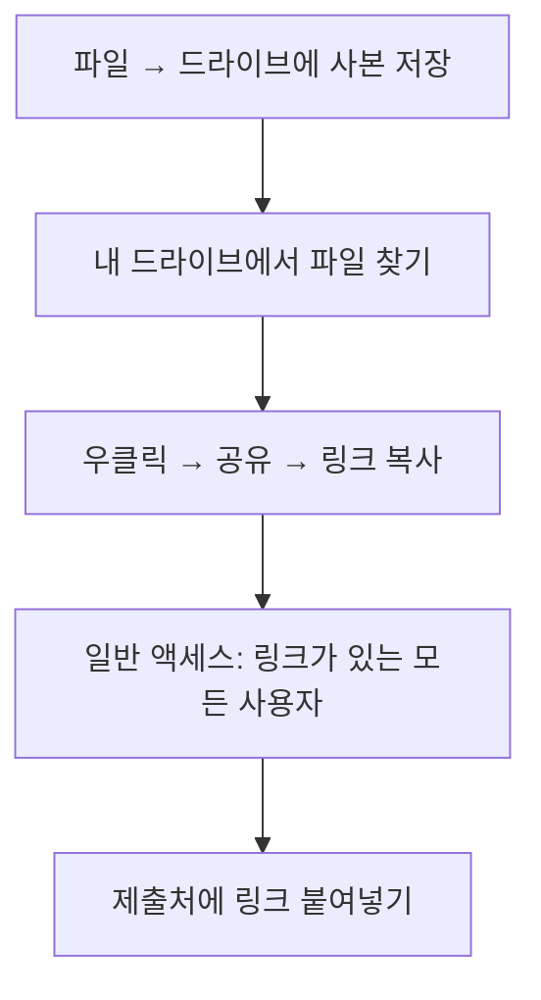

# 최종 점검 — 루브릭으로 셀프 체크하기

## 🎯 이 장에서 배우는 것

- [ ] 루브릭 5개 영역(데이터 수집·전처리·시각화·분석·보고서)으로 내 결과물을 점검할 수 있다
- [ ] 부족한 부분을 발견하고 보완하여 최종 보고서를 완성할 수 있다
- [ ] 구글 드라이브로 최종 결과물을 제출할 수 있다

---

> 💭 **생각해보기**: 시험 답안을 제출하기 전에 한 번 더 검토하면 실수를 발견하고 점수가 달라지는 경험, 해본 적 있나요? 데이터 분석 프로젝트도 마찬가지입니다. 마지막 점검이 결과물의 완성도를 결정합니다!

---

## 📚 핵심 개념

### 개념 1: 루브릭(Rubric)

**비유로 시작**: 루브릭은 마치 **요리 대회의 심사 기준표**와 같아요. "맛 30점, 플레이팅 20점, 창의성 20점..."처럼 각 영역별로 무엇을 어떻게 평가하는지 미리 알려주는 거죠.

**정확한 정의**: 루브릭은 과제의 **평가 기준을 영역별로 나누고**, 각 영역의 **수준(상·중·하)을 구체적으로 설명**한 평가 도구입니다.

**예시로 확인**: 데이터 분석 프로젝트 루브릭 5개 영역


---

### 개념 2: 셀프 체크(Self-Check)

**비유로 시작**: 셀프 체크는 **거울로 외출 전 자기 모습을 확인하는 것**과 같아요. 남들이 보기 전에 스스로 점검하면 문제를 미리 발견할 수 있죠.

**정확한 정의**: 셀프 체크는 **루브릭 기준에 따라 자신의 결과물을 스스로 평가**하고, 부족한 부분을 보완하는 과정입니다.

---

## 📋 루브릭 상세 기준

> 📌 **알아보기**: 각 영역별 상·중·하 기준을 확인하세요!

### 영역 1: 🗂️ 데이터 수집

- **상**: 신뢰할 수 있는 출처에서 목적에 맞는 데이터를 수집함
- **중**: 데이터를 수집했으나 출처 명시가 불완전함
- **하**: 데이터 출처가 불분명하거나 목적에 맞지 않음

### 영역 2: 🧹 전처리

- **상**: 결측치·이상치를 적절히 처리하고 과정을 설명함
- **중**: 기본적인 전처리는 했으나 설명이 부족함
- **하**: 전처리가 미흡하거나 오류가 있음

### 영역 3: 📊 시각화

- **상**: 데이터 특성에 맞는 그래프, 명확한 제목·축 라벨 포함
- **중**: 시각화는 했으나 라벨이나 제목이 부족함
- **하**: 그래프 유형이 부적절하거나 해석이 어려움

### 영역 4: 🔍 분석

- **상**: 데이터 기반으로 논리적 해석과 인사이트 도출
- **중**: 분석은 했으나 근거가 부족함
- **하**: 데이터와 무관한 주장이거나 분석이 없음

### 영역 5: 📝 보고서

- **상**: 구조가 명확하고, 코드·설명·결론이 잘 연결됨
- **중**: 내용은 있으나 구조가 산만함
- **하**: 필수 요소(서론/본론/결론)가 누락됨

---

## 🔨 따라하기

### Step 1: 셀프 체크리스트 작성하기

**코드** (Colab 마크다운 셀에 복사):
```python
# 텍스트 셀에 아래 내용을 복사하세요
"""
# 🔍 나의 셀프 체크리스트

## 1. 데이터 수집
- [ ] 데이터 출처를 명시했는가?
- [ ] 분석 목적에 맞는 데이터인가?

## 2. 전처리  
- [ ] 결측치를 확인하고 처리했는가?
- [ ] 처리 과정을 설명했는가?

## 3. 시각화
- [ ] 그래프에 제목이 있는가?
- [ ] x축, y축 라벨이 있는가?
- [ ] 적절한 그래프 유형인가?

## 4. 분석
- [ ] 데이터에 기반한 해석인가?
- [ ] 새로운 인사이트가 있는가?

## 5. 보고서
- [ ] 서론-본론-결론 구조가 있는가?
- [ ] 코드와 설명이 연결되는가?
"""
```

### Step 2: 내 보고서 점검하기

자신의 최종 보고서를 열고, 위 체크리스트를 하나씩 확인합니다.

**점검 예시 코드**:
```python
# 시각화 점검 예시 - 이렇게 되어 있어야 합니다!
import matplotlib.pyplot as plt

plt.figure(figsize=(8, 5))
plt.bar(['A', 'B', 'C'], [10, 25, 15])
plt.title('월별 판매량 비교')      # ✅ 제목 있음
plt.xlabel('제품 종류')            # ✅ x축 라벨
plt.ylabel('판매량 (개)')          # ✅ y축 라벨
plt.show()
```

### Step 3: 미흡한 부분 보완하기

체크리스트에서 체크하지 못한 항목을 보완합니다.

```python
# 보완 전: 라벨 없는 그래프 ❌
plt.bar(['A', 'B', 'C'], [10, 25, 15])
plt.show()

# 보완 후: 라벨 추가 ✅
plt.bar(['A', 'B', 'C'], [10, 25, 15])
plt.title('월별 판매량 비교')
plt.xlabel('제품 종류')
plt.ylabel('판매량 (개)')
plt.show()
```

### Step 4: 구글 드라이브로 제출하기



---

## ⚠️ 주의할 점

1. **"뷰어" 권한으로 공유하세요** - 편집 권한을 주면 다른 사람이 내용을 수정할 수 있습니다
2. **제출 전 링크가 작동하는지 확인하세요** - 시크릿 모드에서 링크를 열어보면 확실합니다

---

> 📌 **정리하기**: 루브릭은 평가 기준표이고, 셀프 체크는 제출 전 스스로 점검하는 과정입니다. 5개 영역(수집-전처리-시각화-분석-보고서)을 기준으로 점검하면 완성도 높은 결과물을 만들 수 있습니다!

---

## ✅ 점검하기

**1. 루브릭의 5개 평가 영역을 순서대로 나열하면?**

<details><summary>정답 확인</summary>
데이터 수집 → 전처리 → 시각화 → 분석 → 보고서
</details>

**2. 시각화 영역에서 '상' 평가를 받으려면 반드시 포함해야 하는 3가지는?**

<details><summary>정답 확인</summary>
① 데이터 특성에 맞는 그래프 유형 ② 명확한 제목 ③ x축, y축 라벨
</details>

**3. 구글 드라이브 공유 시 '일반 액세스'를 어떻게 설정해야 하나요?**

<details><summary>정답 확인</summary>
"링크가 있는 모든 사용자"로 설정하고, 권한은 "뷰어"로 지정합니다.
</details>

---

## 🏆 도전 문제

**모둠 교차 평가**: 모둠원끼리 서로의 보고서를 루브릭 기준으로 평가해보세요!

- 각 영역에 상·중·하 표시하기
- 잘한 점 1가지, 보완할 점 1가지 적어주기
- 피드백을 받은 후 최종 수정하기

---

## 🔗 다음 장 미리보기

다음 장에서는 **"배운 내용 정리와 앞으로의 활용"**을 학습합니다. 지금까지 배운 데이터 분석의 전 과정을 복습하고, 이 기술을 실생활과 진로에서 어떻게 활용할 수 있는지 탐색해봅니다! 🚀