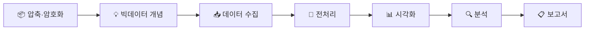
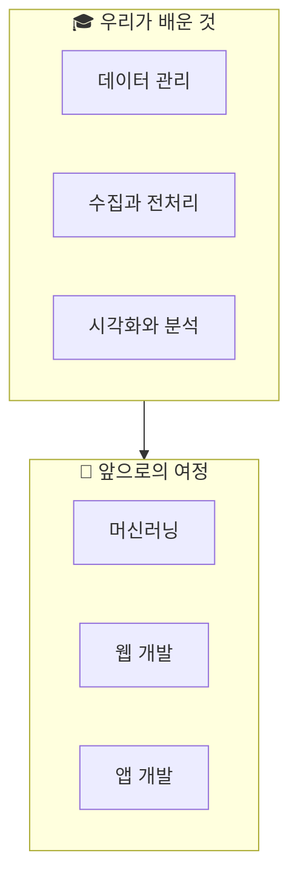

# 돌아보기 그리고 앞으로 — 성찰과 다음 여정

## 🎯 이 장에서 배우는 것

- [ ] 데이터 활용 전 과정을 흐름도로 요약할 수 있다
- [ ] 학습 과정을 성찰하고 다음 목표를 스스로 계획할 수 있다

---

## 💭 생각해보기

> "처음엔 오렌지3가 뭔지도 몰랐는데, 이제는 결측치도 처리하고 워드클라우드도 만들고 보고서도 완성했다!"

16차시의 여정을 마무리하는 시간입니다. 우리가 얼마나 성장했는지, 그리고 앞으로 어디로 나아갈지 함께 정리해봅시다.

---

## 📚 핵심 개념

### 개념 1: 데이터 분석 파이프라인

**비유로 시작**: 데이터 분석 파이프라인은 마치 **요리 레시피**와 같아요. 재료 준비(수집) → 손질(전처리) → 조리(분석) → 플레이팅(시각화) → 서빙(보고서)의 순서를 따라야 맛있는 요리가 완성되죠!

**정확한 정의**: 데이터 분석 파이프라인이란 원시 데이터를 수집하여 최종 인사이트를 도출하기까지의 **체계적인 단계별 흐름**입니다.

**우리가 배운 전체 흐름**:



### 개념 2: 메타인지와 학습 성찰

**비유로 시작**: 메타인지는 마치 **게임의 리플레이 영상**을 보는 것과 같아요. 자신의 플레이를 객관적으로 보면서 "여기서 이렇게 했어야 했는데"라고 깨닫는 것처럼, 학습도 돌아보면 더 잘 성장할 수 있어요.

**정확한 정의**: 메타인지란 **자신의 학습 과정을 객관적으로 인식하고 평가하는 능력**입니다.

---

## 🔨 따라하기: 나의 학습 여정 정리하기

### Step 1: 각 파트에서 배운 핵심 정리

각 파트에서 무엇을 배웠는지 떠올려봅시다.

**Part 1-2 (파일 관리)**: 압축 파일 다루기, 암호화로 데이터 보호하기

**Part 3 (빅데이터)**: 3V 특성, 데이터가 가치가 되는 과정

**Part 4 (수집)**: 공공데이터 포털, 웹 크롤링 기초

**Part 5 (전처리)**: 결측치 처리, 이상치 탐지, 데이터 정규화

**Part 6 (시각화)**: 막대·선·원 그래프, 워드클라우드

**Part 7 (분석)**: 패턴 발견, 상관관계 분석

**Part 8 (마무리)**: 보고서 작성, 성찰과 계획

### Step 2: 성찰 질문에 답하기

아래 질문에 솔직하게 답해보세요.

```
📝 나의 학습 성찰지

1. 가장 흥미로웠던 활동은?
   → 예: 워드클라우드로 뉴스 키워드 시각화하기

2. 가장 어려웠던 부분은?
   → 예: 결측치가 있는 데이터를 어떻게 처리할지 결정하기

3. 스스로 잘했다고 생각하는 점은?
   → 예: 끝까지 포기하지 않고 보고서를 완성한 것

4. 다음에 배우고 싶은 것은?
   → 예: 머신러닝으로 예측 모델 만들기
```

### Step 3: 다음 목표 세우기

**SMART 목표 설정법**으로 구체적인 계획을 세워봅시다.

- **S**(Specific): 구체적으로
- **M**(Measurable): 측정 가능하게
- **A**(Achievable): 달성 가능하게
- **R**(Relevant): 관련 있게
- **T**(Time-bound): 기한을 정해서

```
나의 다음 목표 예시:
"여름방학 동안(T) 우리 동네 미세먼지 데이터를(R) 
직접 수집하고 분석해서(A) 
월별 변화 추이 보고서 1개를(M) 
완성하겠다(S)"
```

---

## 📝 나의 성장 기록

아래 체크리스트로 스스로 점검해보세요.

```
✅ 나의 역량 체크리스트

[ ] ZIP 파일을 압축하고 해제할 수 있다
[ ] 데이터 보안의 중요성을 설명할 수 있다
[ ] 빅데이터의 3V를 예시와 함께 설명할 수 있다
[ ] 공공데이터 포털에서 원하는 데이터를 찾을 수 있다
[ ] 결측치와 이상치를 처리할 수 있다
[ ] 목적에 맞는 그래프 유형을 선택할 수 있다
[ ] 데이터에서 의미 있는 패턴을 발견할 수 있다
[ ] 분석 결과를 보고서로 정리할 수 있다
```

---

## ⚠️ 주의할 점

**1. 완벽하지 않아도 괜찮아요**: 모든 것을 다 이해하지 못했더라도 괜찮습니다. 중요한 것은 시작했다는 것, 그리고 계속 배워나가겠다는 마음입니다.

**2. 실패는 학습의 일부입니다**: 코드 에러, 분석 실수 모두 성장의 밑거름이에요. 실패한 경험이 오히려 더 오래 기억에 남습니다.

---

## 🌟 정리하기



**16차시 여정의 핵심**
- 데이터는 21세기의 새로운 언어입니다
- 도구보다 **문제 해결 사고방식**이 더 중요합니다
- 끊임없이 질문하고 탐구하는 자세가 데이터 과학자의 핵심 역량입니다

---

## ✅ 점검하기

**1. 데이터 분석의 올바른 순서는?**
수집 → ( ? ) → 시각화 → 분석 → 보고서

<details><summary>정답 확인</summary>
전처리 - 수집한 원시 데이터는 바로 분석할 수 없어요. 결측치 처리, 이상치 제거 등의 전처리 과정이 반드시 필요합니다.
</details>

**2. 메타인지가 학습에 중요한 이유는?**

<details><summary>정답 확인</summary>
자신이 무엇을 알고 모르는지 파악해야 효과적으로 학습할 수 있기 때문입니다. "모른다는 것을 아는 것"이 성장의 시작점이에요.
</details>

**3. [도전] 내가 데이터로 해결하고 싶은 사회 문제를 적어보세요.**

```
예시 답안:
"청소년 수면 부족 문제 - 전국 중고등학생의 수면 시간 
데이터를 분석해서 수면 부족의 원인(학원, 스마트폰 등)을 
찾고 해결책을 제안하고 싶다."
```

---

## 🎉 수고하셨습니다!

16차시의 여정을 함께 완주한 여러분, 정말 수고하셨습니다! 🎊

이제 여러분은 더 이상 데이터를 두려워하지 않는 **데이터 리터러시**를 갖춘 사람이 되었습니다.

> "모든 전문가는 한때 초보자였다."

오늘의 끝은 내일의 시작입니다. 배운 것을 실제 프로젝트에 적용해보고, 새로운 도구를 탐험하며, 데이터로 세상을 더 좋게 만들어가길 응원합니다! 🚀