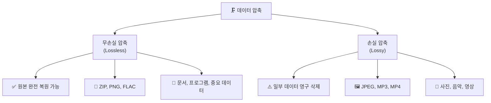
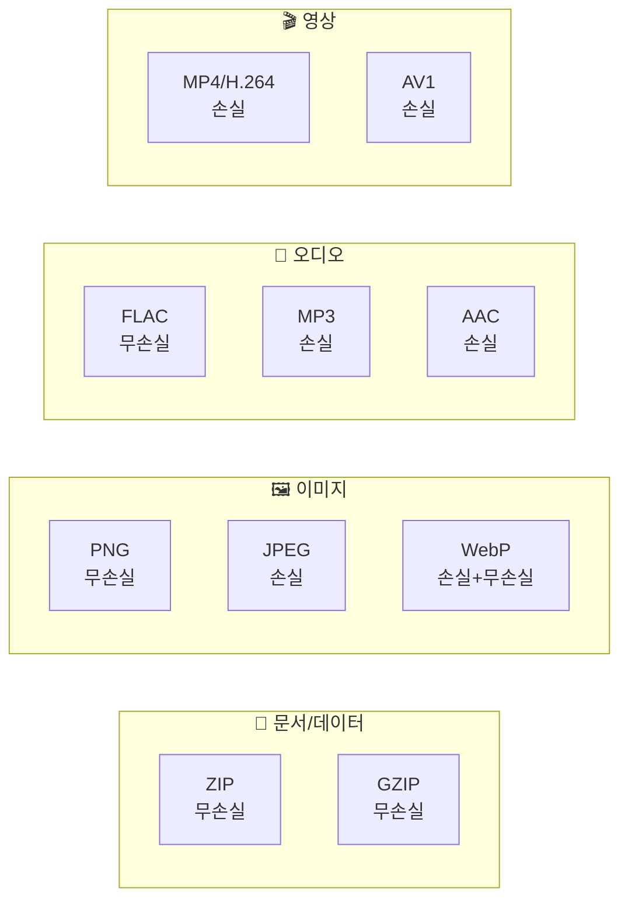
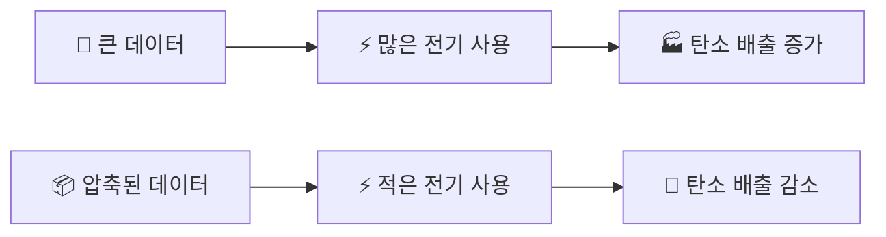

# Chapter 01: 데이터가 너무 커요! - 압축의 세계

---

## 🎯 이 장에서 배우는 것

- [ ] 데이터 압축이 필요한 이유를 일상 사례를 통해 설명할 수 있다.
- [ ] 손실 압축과 무손실 압축의 차이를 구분하고 각각의 예시를 들 수 있다.
- [ ] ZIP, JPEG 등 주요 압축 형식이 어떤 상황에 적합한지 판단할 수 있다.
- [ ] 데이터 압축이 에너지 절약과 탄소중립에 기여하는 이유를 설명할 수 있다.

---

## 💡 왜 이걸 배우나요?

여러분의 스마트폰을 한번 확인해 보세요. 사진이 몇 장이나 있나요? 100장? 1,000장? 요즘 스마트폰으로 찍은 사진 한 장의 원본 크기는 **약 20~30MB**에 달합니다. 만약 사진 1,000장을 압축 없이 저장한다면 무려 **20~30GB**가 필요합니다. 그런데 실제로는 그보다 훨씬 적은 용량을 사용하고 있죠. 비결이 바로 **압축(Compression)** 입니다.

압축 기술은 우리가 매일 사용하는 유튜브, 카카오톡, 클라우드 저장소의 근간이 되는 기술입니다. 이 기술을 이해하면 "왜 이 파일이 이렇게 크지?", "어떤 형식으로 저장해야 유리할까?"라는 실용적인 질문에 스스로 답할 수 있게 됩니다.

> **생각해보기:** 여행을 앞두고 캐리어에 옷을 넣을 때, 롤링(돌돌 말기) 기법을 써본 적 있나요? 같은 옷을 더 작은 공간에 욱여넣는 것 — 이것이 바로 압축의 본질입니다! 🧳

---

## 📚 핵심 개념

### 개념 1: 데이터 압축이란?

**비유로 시작하기**

캐리어에 옷을 넣는 상황을 상상해 봅시다. 두툼한 패딩을 그냥 넣으면 자리를 엄청 차지하지만, 진공 압축 팩에 넣으면 부피가 1/5로 줄어듭니다. 옷 자체는 없어지지 않았습니다. 단지 공기(불필요한 빈 공간)를 빼낸 것이죠.

데이터 압축도 마찬가지입니다. 파일 안에는 **반복되거나 예측 가능한 패턴**이 숨어 있고, 이 패턴을 영리하게 표현해서 전체 크기를 줄이는 기술입니다.

**정확한 정의**

> **데이터 압축(Data Compression)** 이란, 데이터를 더 적은 비트(bit)로 표현하여 저장 공간을 줄이거나 전송 속도를 높이는 기술입니다.

**예시로 확인**

아래 문장을 봅시다.

```
원본: AAAAAABBBBBCCDDDDDDDDD
길이: 21글자
```

이 문장은 같은 글자가 반복됩니다. "A가 6번, B가 5번, C가 2번, D가 9번"이라고 표현하면 어떨까요?

```
압축: 6A5B2C9D
길이: 8글자
```

21글자에서 8글자로 줄었습니다! 이처럼 **반복 패턴을 규칙으로 표현**하는 것이 압축의 핵심 원리입니다. 이 방식을 **RLE(Run-Length Encoding, 런 길이 부호화)** 라고 합니다.

---

### 개념 2: 손실 압축 vs 무손실 압축

압축에는 크게 두 가지 방식이 있습니다. 원본 데이터를 **완전히 복원할 수 있는지 없는지**에 따라 나뉩니다.



**무손실 압축 (Lossless Compression)**

캐리어에 진공 팩을 쓰는 것과 같습니다. 꺼내면 원래 모습 그대로 돌아옵니다. 데이터가 한 글자도 바뀌지 않습니다.

- **ZIP**: 여러 파일을 하나로 묶어 압축. 문서, 코드, 스프레드시트에 사용
- **PNG**: 이미지 파일. 픽셀 하나도 손상되지 않음
- **FLAC**: 음악 파일. 원음 품질 그대로 보존

> **언제 쓰나요?** 중요한 문서, 프로그램 설치 파일, 데이터베이스처럼 **내용이 달라지면 안 되는 파일**에 사용합니다.

**손실 압축 (Lossy Compression)**

옷을 여행에 맞게 일부 두고 가는 것과 같습니다. 공간을 많이 줄일 수 있지만, 두고 온 옷은 다시 가져올 수 없습니다.

- **JPEG**: 이미지에서 사람 눈에 잘 보이지 않는 색상 정보를 제거
- **MP3**: 음악에서 사람 귀에 잘 들리지 않는 주파수 대역을 제거
- **MP4(H.264)**: 영상에서 변화가 없는 배경 부분을 생략

> **언제 쓰나요?** 사진, 음악, 영상처럼 **약간의 품질 저하가 허용되고 파일 크기를 크게 줄여야 하는 경우**에 사용합니다.

> **알아보기:** JPEG 압축 비율 비교
> 같은 사진을 JPEG 품질 설정에 따라 저장하면 다음처럼 달라집니다.
> - **품질 100% (최고)**: 약 8MB → 원본과 거의 동일
> - **품질 80% (기본)**: 약 2MB → 육안으로 차이 없음 ✅
> - **품질 20% (최저)**: 약 300KB → 뭉개지고 블록 현상 발생 ❌

---

### 개념 3: 대표적인 압축 형식 한눈에 보기



**파일 크기 비교 (이미지 기준)**

같은 1920×1080 해상도 이미지를 다양한 형식으로 저장하면:

- **BMP (비압축)**: 약 6MB (압축 없음, 원본)
- **PNG (무손실)**: 약 2MB (원본 대비 약 67% 감소)
- **JPEG 80% (손실)**: 약 400KB (원본 대비 약 93% 감소) ✨

이 차이가 모이면 어마어마해집니다. 유튜브가 하루에 처리하는 영상 데이터만 해도 수백 페타바이트(PB)에 달하는데, 압축 없이 이 모든 데이터를 전송하는 건 현실적으로 불가능합니다.

---

### 개념 4: 압축과 탄소중립

> **생각해보기:** 데이터 압축이 환경과 무슨 관계가 있을까요? 🌱

데이터를 저장하고 전송하려면 반드시 **전기**가 필요합니다. 전기는 대부분 화석 연료를 태워서 만들고, 이 과정에서 이산화탄소(CO₂)가 발생합니다.



**구체적인 숫자로 이해하기**

- 전 세계 데이터 센터는 연간 약 **200TWh(테라와트시)** 의 전력을 소비합니다.
- 이는 대한민국 전체 연간 전력 소비량과 맞먹는 수준입니다.
- 압축 기술로 데이터 크기를 50%만 줄여도 이 소비량을 크게 낮출 수 있습니다.

> **정리하기:** 데이터 압축은 단순히 저장 공간을 아끼는 기술이 아닙니다. **적은 전기 → 적은 탄소 배출 → 기후 변화 완화**로 이어지는 환경 기술이기도 합니다. 우리가 사진 한 장을 어떤 형식으로 저장하느냐가 지구 환경과 연결되어 있다는 사실, 놀랍지 않나요?

---

## 🔨 따라하기: 윈도우에서 파일 압축·해제 실습

이제 직접 파일을 압축하고 해제해 봅시다. 윈도우 기본 기능만으로 충분합니다.

### Step 1: 실습용 폴더 만들기

1. 바탕화면에서 마우스 오른쪽 버튼 클릭
2. **[새로 만들기]** → **[폴더]** 선택
3. 폴더 이름을 `압축실습`으로 입력
4. 폴더 안에 메모장(`.txt`) 파일 3개를 만들어 각각 내용을 적어 저장

> **💡 팁:** 메모장 파일에 같은 단어를 수백 번 반복해서 입력해 보세요. 압축 효과가 더 잘 보입니다!
> 예: `안녕안녕안녕안녕안녕안녕...` 을 500번 붙여넣기

### Step 2: 압축 전 크기 확인하기

1. `압축실습` 폴더를 마우스 오른쪽 버튼으로 클릭
2. **[속성]** 클릭
3. **"크기"** 항목의 숫자를 메모해 두세요 📝

### Step 3: 폴더 압축하기

1. `압축실습` 폴더를 마우스 오른쪽 버튼으로 클릭
2. **[보내기]** → **[압축(ZIP) 폴더]** 클릭
3. 같은 위치에 `압축실습.zip` 파일이 생성됩니다

### Step 4: 압축 후 크기 비교하기

1. 생성된 `압축실습.zip`을 마우스 오른쪽 버튼으로 클릭
2. **[속성]** 클릭
3. 크기를 확인하고 **Step 2에서 메모한 값과 비교**

> **예상 결과:** 같은 단어가 반복되는 텍스트 파일은 압축률이 매우 높습니다. 원본의 5~10% 수준으로 줄어드는 경우도 있습니다!

### Step 5: 압축 해제하기

1. `압축실습.zip` 파일을 더블클릭하면 내용을 미리 볼 수 있습니다
2. 마우스 오른쪽 버튼 클릭 → **[모두 압축 풀기]**
3. 저장 위치를 선택하고 **[압축 풀기]** 클릭
4. 원본 파일이 그대로 복원되었는지 확인

### Step 6: 결과 기록하기

아래 내용을 노트에 직접 기록해 보세요.

- **압축 전 크기**: \_\_\_\_\_ KB
- **압축 후 크기**: \_\_\_\_\_ KB  
- **압축률**: `(압축 전 - 압축 후) ÷ 압축 전 × 100` = \_\_\_\_\_ %
- **원본 파일과 복원 파일의 내용이 같은가?** 예 / 아니오

> **알아보기:** 압축률(Compression Ratio)
> 압축률이 높을수록 같은 용량에 더 많은 데이터를 저장할 수 있습니다. 텍스트 파일은 반복 패턴이 많아 압축률이 높고, 이미 압축된 JPEG 이미지는 추가로 ZIP 압축해도 거의 줄어들지 않습니다. 이미 압축이 완료된 파일에는 중복 패턴이 거의 없기 때문입니다.

---

## 📝 핵심 개념 요약 코드

아래는 Python으로 RLE(런 길이 부호화) 압축의 원리를 직접 확인하는 간단한 코드입니다. 파이썬이 설치되어 있다면 바로 실행해 보세요.

```python
# RLE 압축 원리 체험하기
# 반복되는 문자를 '횟수+문자' 형태로 압축합니다

def rle_compress(text):
    """RLE 압축: 반복 문자를 개수+문자로 표현"""
    if not text:
        return ""
    
    result = []
    count = 1
    
    for i in range(1, len(text)):
        if text[i] == text[i-1]:
            count += 1
        else:
            result.append(f"{count}{text[i-1]}")
            count = 1
    
    result.append(f"{count}{text[-1]}")
    return "".join(result)


def rle_decompress(compressed):
    """RLE 해제: 압축된 문자열을 원래대로 복원"""
    result = []
    i = 0
    
    while i < len(compressed):
        # 숫자 부분 읽기
        num_str = ""
        while i < len(compressed) and compressed[i].isdigit():
            num_str += compressed[i]
            i += 1
        # 문자 부분 읽기
        if i < len(compressed):
            result.append(compressed[i] * int(num_str))
            i += 1
    
    return "".join(result)


# 실행해 보기
original = "AAAAAABBBBBCCDDDDDDDDD"
compressed = rle_compress(original)
restored = rle_decompress(compressed)

print(f"원본     : {original}")
print(f"압축     : {compressed}")
print(f"복원     : {restored}")
print(f"원본 길이 : {len(original)}글자")
print(f"압축 길이 : {len(compressed)}글자")
print(f"압축률   : {(1 - len(compressed)/len(original))*100:.1f}% 감소")
print(f"원본 복원 성공: {original == restored}")
```

**실행 결과:**
```
원본     : AAAAAABBBBBCCDDDDDDDDD
압축     : 6A5B2C9D
복원     : AAAAAABBBBBCCDDDDDDDDD
원본 길이 : 21글자
압축 길이 : 8글자
압축률   : 61.9% 감소
원본 복원 성공: True
```

> **코드 읽기 포인트:** `rle_compress` 함수는 앞 글자와 현재 글자를 비교해서 같으면 count를 늘리고, 다르면 결과에 추가합니다. 무손실 압축이기 때문에 `original == restored`가 항상 `True`가 됩니다.

---

## ⚠️ 자주 하는 실수

**실수 1: 이미 압축된 파일을 다시 ZIP으로 압축하기**

MP3 파일이나 JPEG 파일을 ZIP으로 다시 묶어도 크기가 거의 줄지 않습니다. 이 파일들은 이미 압축이 완료되어 있어 중복 패턴이 거의 없기 때문입니다. 오히려 ZIP 헤더 정보 때문에 약간 더 커질 수도 있습니다.

**실수 2: 손실 압축 파일을 여러 번 저장하면 계속 품질이 떨어진다**

JPEG 이미지를 열고 → 약간 수정하고 → 다시 JPEG로 저장하는 과정을 반복하면 저장할 때마다 화질이 조금씩 손실됩니다. 원본을 PNG나 RAW 형식으로 보관하고, JPEG는 최종 결과물에만 사용하는 습관을 들이세요.

**실수 3: "ZIP으로 압축하면 파일이 암호화된다"는 오해**

기본 ZIP 압축은 내용을 숨기거나 암호화하지 않습니다. 누구나 열어볼 수 있습니다. 파일을 보호하려면 ZIP 압축 시 **비밀번호 설정** 옵션을 별도로 적용하거나, 암호화 전용 프로그램을 사용해야 합니다.

**실수 4: 압축을 하면 원본 파일이 사라진다고 생각하기**

윈도우에서 ZIP으로 압축해도 원본 폴더는 그대로 남습니다. ZIP 파일은 원본의 **복사본**을 압축한 것입니다. 원본을 지우고 싶다면 별도로 삭제해야 합니다.

---

## ✅ 스스로 점검하기

**기본 문제**

**Q1.** 다음 중 무손실 압축 형식을 모두 고르세요.

- ① JPEG
- ② PNG
- ③ MP3
- ④ ZIP
- ⑤ FLAC

**(정답: ②④⑤)**

---

**Q2.** 아래 빈칸을 채워 RLE 압축 결과를 완성하세요.

```
원본: BBBBBAAAAAAA
압축: _____
```

**(정답: 5B7A)**

---

**Q3.** 다음 상황에서 어떤 압축 방식이 더 적합한지 고르고 이유를 쓰세요.

> 학교 과제로 제출할 한글 문서(.hwp)와 사진 여러 장을 선생님께 이메일로 보내려고 합니다.

- ① 손실 압축으로 모두 변환 후 전송
- ② ZIP으로 묶어 무손실 압축 후 전송

**(정답: ② / 이유: 한글 문서는 내용이 바뀌면 안 되므로 무손실 압축을 사용해야 합니다.)**

---

**응용 문제**

**Q4.** 아래 설명이 손실 압축(L)인지 무손실 압축(N)인지 빈칸에 표시하세요.

- 복원하면 원본과 100% 동일하다 → **\_\_\_**
- 파일 크기를 더 많이 줄일 수 있다 → **\_\_\_**
- 프로그램 설치 파일에 적합하다 → **\_\_\_**
- MP3, JPEG가 대표적인 예이다 → **\_\_\_**

**(정답: N, L, N, L)**

---

## 🚀 더 해보기

**도전 1: 내 스마트폰에서 가장 큰 파일 탐구하기** 📱

스마트폰의 설정 → 저장소에서 파일 종류별 용량을 확인해 보세요.

- 가장 용량이 큰 파일 종류는 무엇인가요?
- 왜 그 파일이 클까요? (영상? 앱? 사진?)
- 이미 손실 압축이 적용되어 있는 파일인가요, 그렇지 않은 파일인가요?

이 질문에 대한 답을 한 문단으로 써보세요.

**도전 2: 다양한 파일로 압축률 비교하기** 🔬

아래 종류의 파일을 각각 ZIP으로 압축하고 압축률을 비교해 보세요.

- 반복 텍스트가 많은 `.txt` 파일
- 일반 한글/워드 문서
- JPEG 사진 파일
- MP3 음악 파일

어떤 파일의 압축률이 가장 높았나요? 왜 그럴까요?

**도전 3: Python 코드 수정해 보기** 🐍

앞서 배운 RLE 압축 코드에서 숫자가 1인 경우 숫자를 생략하도록 수정해 보세요.

```
예: "1A3B" → "A3B" 로 표현
```

힌트: `if count > 1` 조건문을 활용해 보세요.

---

## 🔗 다음 장으로

이번 장에서는 데이터 압축의 **왜(Why)** 와 **무엇(What)** 을 배웠습니다. 큰 데이터를 작게 만들어야 하는 이유, 두 가지 압축 방식의 차이, 그리고 이것이 환경에까지 미치는 영향까지 살펴봤습니다.

다음 장에서는 데이터를 작게 만드는 것 못지않게 중요한 문제를 다룹니다.

> **"파일을 저장했는데, 과연 내일도 그 내용이 그대로일까요?"** 🤔

데이터가 변조되거나 손상되는 것을 어떻게 감지할 수 있는지, **데이터 무결성(Data Integrity)** 의 세계로 넘어가 봅시다!

---

### 📌 핵심 개념 한눈에 정리

- **데이터 압축**: 반복 패턴을 이용해 파일 크기를 줄이는 기술
- **무손실 압축**: 원본 완전 복원 가능 (ZIP, PNG, FLAC)
- **손실 압축**: 일부 데이터 제거, 크기 大폭 감소 (JPEG, MP3, MP4)
- **RLE**: 반복 문자를 '횟수+문자'로 표현하는 가장 기본적인 압축 알고리즘
- **압축과 환경**: 데이터 크기 감소 → 전력 소비 감소 → 탄소 배출 감소