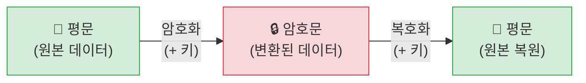
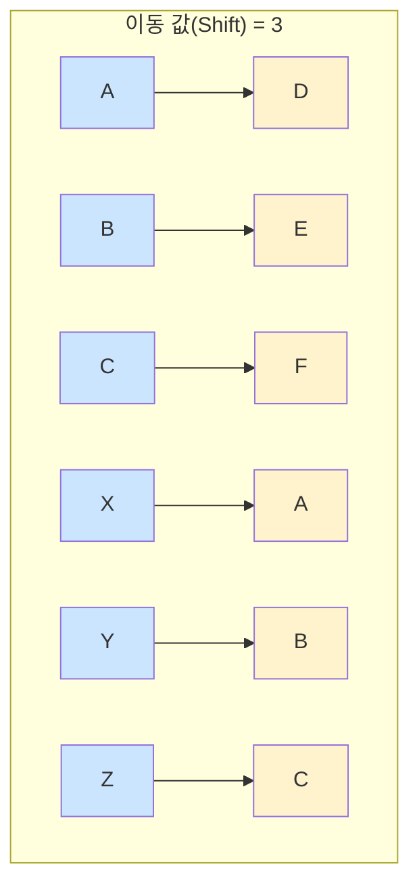
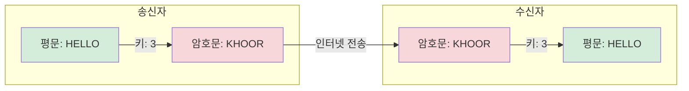
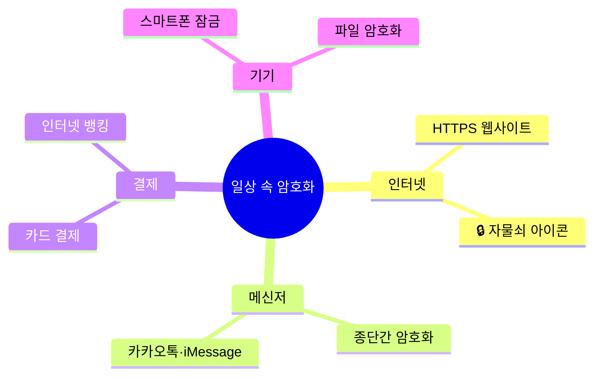

# Chapter 02. 비밀을 지켜라! — 암호화의 기본

---

## 🎯 이 장에서 배우는 것

- [ ] 암호화가 무엇인지, 왜 필요한지 설명할 수 있다.
- [ ] 카이사르 암호의 원리를 이해하고 메시지를 직접 암호화·복호화할 수 있다.
- [ ] 일상 속에서 암호화가 어디에 쓰이는지 사례를 들어 말할 수 있다.
- [ ] 파이썬으로 작성된 카이사르 암호 코드를 읽고 실행 결과를 예측할 수 있다.

---

## 💡 왜 이걸 배우나요?

여러분은 매일 수십 번씩 암호화를 사용하고 있습니다. 카카오톡 메시지를 보낼 때, 유튜브 영상을 볼 때, 학교 급식카드를 결제할 때—이 모든 순간에 여러분의 데이터는 암호화되어 이동합니다.

만약 암호화가 없다면 어떻게 될까요? 인터넷에서 주고받는 모든 정보가 날것 그대로 흘러다닙니다. 누군가 중간에서 그 데이터를 가로채면 비밀번호, 대화 내용, 개인정보를 그대로 볼 수 있겠죠.

암호화는 **"데이터를 읽을 수 없는 형태로 변환하여 허락된 사람만 볼 수 있게 하는 기술"** 입니다. 이 장에서는 수천 년 전부터 사용된 암호의 원리부터 시작해서, 현대 인터넷이 어떻게 우리의 정보를 지키는지까지 살펴봅니다.

> **생각해보기:** 친구에게 아무도 못 읽게 쪽지를 전달하고 싶다면 어떻게 할 것인가요? 잠깐 떠올려 보세요! 🤔

---

## 📚 핵심 개념

### 개념 1: 암호화(Encryption)란?

**비유로 시작하기**

자전거 자물쇠를 생각해보세요. 자전거를 아무 곳에나 세워두면 누구든 가져갈 수 있습니다. 하지만 자물쇠로 잠가두면, 열쇠(또는 번호)를 아는 사람만 자전거를 사용할 수 있죠. 암호화는 데이터에 자물쇠를 채우는 것과 같습니다.

**정확한 정의**

- **암호화(Encryption)**: 원래 읽을 수 있는 데이터(평문)를 특정 규칙에 따라 알아볼 수 없는 형태(암호문)로 변환하는 과정
- **복호화(Decryption)**: 암호문을 다시 평문으로 되돌리는 과정
- **키(Key)**: 암호화와 복호화에 사용하는 규칙 또는 값



**예시로 확인**

- **평문**: `HELLO`
- **암호화 규칙(키)**: 알파벳을 3칸 뒤로 밀기
- **암호문**: `KHOOR`
- **복호화**: `KHOOR`에서 각 글자를 3칸 앞으로 → `HELLO`

---

### 개념 2: 카이사르 암호

**비유로 시작하기**

알파벳 도넛을 상상해보세요. A부터 Z까지 도넛 모양으로 연결되어 있고, 전체를 일정 칸만큼 돌리는 것입니다. "3칸 돌리기"가 바로 카이사르 암호의 핵심입니다.

**정확한 정의**

카이사르 암호(Caesar Cipher)는 고대 로마의 율리우스 카이사르(Julius Caesar)가 군사 통신에 사용했다고 알려진 암호입니다. 알파벳의 각 글자를 일정한 수(이동 값, Shift)만큼 뒤로 밀어서 암호문을 만듭니다.



**예시로 확인**

이동 값이 3일 때:

- 원문 알파벳: A B C D E F G H I J K L M N O P Q R S T U V W X Y Z
- 암호 알파벳: D E F G H I J K L M N O P Q R S T U V W X Y Z A B C

> Z 다음은 다시 A로 돌아갑니다. (도넛처럼 연결!)

**직접 해보기** ✏️

`CAT`을 이동 값 3으로 암호화해봅시다.
- C → ? (C에서 3칸 뒤)
- A → ? (A에서 3칸 뒤)
- T → ? (T에서 3칸 뒤)

정답: `FDW`

---

### 개념 3: 키(Key)와 암호 해독의 관계

**비유로 시작하기**

자물쇠가 아무리 튼튼해도 열쇠가 없으면 아무 소용이 없습니다. 반대로 열쇠만 있다면 자물쇠를 바로 열 수 있죠. 암호의 세계에서 "열쇠" 역할을 하는 것이 바로 **키(Key)** 입니다.

**정확한 정의**

- 카이사르 암호에서 키는 **이동 값(숫자)** 입니다.
- 이동 값이 3이면, 받는 사람도 3이라는 숫자를 알아야 복호화할 수 있습니다.
- 이동 값을 모르면 1~25까지 전부 시도해야 합니다. (브루트포스 공격)



> **알아보기:** 카이사르 암호는 이동 값의 경우의 수가 고작 25가지뿐입니다. 현대 컴퓨터라면 0.0001초도 안 걸려 모두 시도할 수 있어요. 그래서 실제 보안에는 사용하지 않지만, **암호화 원리를 배우는 출발점** 으로는 최고입니다!

---

### 개념 4: 일상 속 암호화

**우리 주변의 암호화 사례**

현대의 암호화는 카이사르 암호보다 수백 배 복잡하지만, 핵심 원리는 같습니다. "허락된 사람만 읽을 수 있게 변환한다."

**🌐 HTTPS와 자물쇠 아이콘**

브라우저 주소창 왼쪽의 🔒 자물쇠 아이콘을 본 적 있나요? 이것은 해당 사이트와의 통신이 **TLS/SSL 암호화** 로 보호되고 있다는 표시입니다. 여러분이 입력한 비밀번호나 카드 번호가 암호화되어 전송됩니다.

**💬 메신저의 종단간 암호화(End-to-End Encryption)**

카카오톡, iMessage 등 일부 메신저는 "종단간 암호화"를 지원합니다. 메시지를 보내는 사람의 기기에서 암호화하고, 받는 사람의 기기에서만 복호화됩니다. 심지어 서비스 회사조차 내용을 볼 수 없죠.

**💳 결제 시스템**

체크카드나 신용카드로 결제할 때 카드 정보는 즉시 암호화됩니다. 상점의 단말기에서 카드사 서버까지 이동하는 동안 누군가 중간에서 데이터를 가로채도 암호화된 데이터만 볼 수 있습니다.



---

## 🔨 따라하기: 카이사르 암호 파이썬으로 구현하기

파이썬으로 카이사르 암호를 직접 만들어봅시다. 코드를 단계적으로 쌓아가며 전체 프로그램을 완성합니다.

> **준비물:** 파이썬 3.x가 설치된 컴퓨터, 또는 [replit.com](https://replit.com) 온라인 실행 환경

---

### Step 1: 글자 하나 암호화하기

먼저 알파벳 글자 하나를 이동 값만큼 밀어보겠습니다. 파이썬의 `ord()`와 `chr()` 함수를 사용합니다.

> **알아보기:** `ord('A')`는 문자 A의 아스키(ASCII) 번호인 65를 반환합니다. `chr(65)`는 반대로 65를 문자 A로 바꿉니다. 알파벳이 숫자로 저장된다는 것을 기억하세요!

```python
# 글자 하나를 3칸 뒤로 밀기
글자 = 'H'
이동값 = 3

번호 = ord(글자)          # 'H' → 72
새번호 = 번호 + 이동값    # 72 + 3 = 75
새글자 = chr(새번호)      # 75 → 'K'

print(새글자)  # 출력: K
```

**실행 결과:**
```
K
```

---

### Step 2: Z를 넘어가는 경우 처리하기

`X(88) + 3 = 91`인데, 91은 알파벳이 아닙니다! Z 다음에는 다시 A로 돌아와야 합니다. 이를 위해 **나머지 연산(%)** 을 사용합니다.

```python
# Z를 넘어가는 경우 처리
글자 = 'X'
이동값 = 3

# 대문자 기준: A=0, B=1, ..., Z=25로 변환 후 계산
위치 = ord(글자) - ord('A')   # X → 23
새위치 = (위치 + 이동값) % 26  # (23+3) % 26 = 0 → A
새글자 = chr(새위치 + ord('A')) # 0 → 'A'

print(새글자)  # 출력: A
```

**실행 결과:**
```
A
```

> **정리하기:** `% 26`이 핵심입니다. 26으로 나눈 나머지를 쓰면 Z 다음에 자동으로 A로 돌아옵니다. 도넛을 코드로 표현한 것이죠!

---

### Step 3: 문장 전체 암호화 함수 만들기

이제 글자 하나가 아닌 문장 전체를 처리하는 함수를 만들어봅니다.

```python
def 암호화(평문, 이동값):
    결과 = ""
    for 글자 in 평문:
        if 글자.isalpha():  # 알파벳인 경우만 처리
            if 글자.isupper():  # 대문자
                위치 = ord(글자) - ord('A')
                새글자 = chr((위치 + 이동값) % 26 + ord('A'))
            else:  # 소문자
                위치 = ord(글자) - ord('a')
                새글자 = chr((위치 + 이동값) % 26 + ord('a'))
            결과 += 새글자
        else:
            결과 += 글자  # 숫자, 공백, 특수문자는 그대로
    return 결과

# 테스트
원문 = "Hello, World!"
암호문 = 암호화(원문, 3)
print("원문:", 원문)
print("암호문:", 암호문)
```

**실행 결과:**
```
원문: Hello, World!
암호문: Khoor, Zruog!
```

---

### Step 4: 복호화 함수 만들기

복호화는 암호화의 반대입니다. 이동 값만큼 앞으로 돌아오면 됩니다. 이동 값에 음수(-)를 붙이거나, `26 - 이동값`을 사용합니다.

```python
def 복호화(암호문, 이동값):
    return 암호화(암호문, -이동값)  # 반대 방향으로 이동!

# 테스트
복원문 = 복호화("Khoor, Zruog!", 3)
print("복원문:", 복원문)
```

**실행 결과:**
```
복원문: Hello, World!
```

> **생각해보기:** 복호화 함수가 왜 이렇게 짧을까요? 암호화 함수에 `-이동값`을 주면 반대 방향으로 이동하기 때문입니다. 좋은 함수 설계의 예입니다!

---

### Step 5: 사용자 입력 받기

이제 실제로 사용자가 메시지와 이동 값을 직접 입력해서 암호화하는 프로그램으로 확장합니다.

```python
def 암호화(평문, 이동값):
    결과 = ""
    for 글자 in 평문:
        if 글자.isalpha():
            if 글자.isupper():
                위치 = ord(글자) - ord('A')
                새글자 = chr((위치 + 이동값) % 26 + ord('A'))
            else:
                위치 = ord(글자) - ord('a')
                새글자 = chr((위치 + 이동값) % 26 + ord('a'))
            결과 += 새글자
        else:
            결과 += 글자
    return 결과

def 복호화(암호문, 이동값):
    return 암호화(암호문, -이동값)

# 사용자 입력 받기
메시지 = input("메시지를 입력하세요: ")
이동값 = int(input("이동 값을 입력하세요 (1~25): "))

암호문 = 암호화(메시지, 이동값)
복원문 = 복호화(암호문, 이동값)

print("암호문:", 암호문)
print("복원문:", 복원문)
```

**실행 예시:**
```
메시지를 입력하세요: I love Python
이동 값을 입력하세요 (1~25): 7
암호문: P svcl Wfaovu
복원문: I love Python
```

---

### Step 6: 브루트포스 해독기 만들기

이동 값을 모를 때 1~25까지 전부 시도해보는 해독기입니다. 카이사르 암호의 약점을 직접 확인해봅니다.

```python
print("=== 브루트포스 해독 ===")
암호문 = "Khoor, Zruog!"

for 시도값 in range(1, 26):
    시도결과 = 암호화(암호문, -시도값)
    print(f"이동값 {시도값:2d}: {시도결과}")
```

**실행 결과 (일부):**
```
=== 브루트포스 해독 ===
이동값  1: Jgnnq, Yqtnf!
이동값  2: Ifemp, Xpsmf!
이동값  3: Hello, World!   ← 정답!
이동값  4: Gdkkn, Vnqkc!
...
```

> **알아보기:** 이동값 3에서 `Hello, World!`가 나타납니다. 실제로 사람이 읽었을 때 의미가 통하는 결과가 정답입니다. 이처럼 카이사르 암호는 경우의 수가 너무 적어 현대에는 보안에 사용할 수 없습니다.

---

## 📝 전체 코드

```python
# ==============================
# 카이사르 암호 프로그램
# Chapter 02 - 암호화의 기본
# ==============================

def 암호화(평문, 이동값):
    """평문을 이동값만큼 이동하여 암호화합니다."""
    결과 = ""
    for 글자 in 평문:
        if 글자.isalpha():
            if 글자.isupper():
                위치 = ord(글자) - ord('A')
                새글자 = chr((위치 + 이동값) % 26 + ord('A'))
            else:
                위치 = ord(글자) - ord('a')
                새글자 = chr((위치 + 이동값) % 26 + ord('a'))
            결과 += 새글자
        else:
            결과 += 글자  # 알파벳 외 문자는 그대로 유지
    return 결과

def 복호화(암호문, 이동값):
    """암호문을 복호화합니다."""
    return 암호화(암호문, -이동값)

def 브루트포스(암호문):
    """이동값 1~25를 전부 시도합니다."""
    print("\n=== 브루트포스 해독 시도 ===")
    for 시도값 in range(1, 26):
        결과 = 암호화(암호문, -시도값)
        print(f"이동값 {시도값:2d}: {결과}")

# --- 메인 실행 ---
print("=" * 35)
print("    카이사르 암호 프로그램")
print("=" * 35)
print("1. 암호화  2. 복호화  3. 브루트포스")
선택 = input("원하는 기능을 선택하세요: ")

if 선택 == "1":
    메시지 = input("암호화할 메시지: ")
    키 = int(input("이동값 (1~25): "))
    print("암호문:", 암호화(메시지, 키))

elif 선택 == "2":
    메시지 = input("복호화할 암호문: ")
    키 = int(input("이동값 (1~25): "))
    print("평문:", 복호화(메시지, 키))

elif 선택 == "3":
    메시지 = input("해독할 암호문: ")
    브루트포스(메시지)

else:
    print("올바른 번호를 입력해주세요.")
```

---

## ⚠️ 자주 하는 실수

**실수 1: 이동값에 음수를 넣었을 때 당황하는 경우**

`암호화(문자, -3)`처럼 음수 이동값을 넣으면 오류가 날 것 같지만, 파이썬의 `%` 연산자는 음수에도 올바르게 작동합니다. `(-3) % 26 = 23`이 되어 반대 방향으로 23칸 이동한 결과(앞으로 3칸)와 같습니다.

**실수 2: 대소문자를 구분하지 않아 결과가 이상해지는 경우**

`ord('A')`는 65이고 `ord('a')`는 97입니다. 대문자와 소문자의 기준점이 다르므로, 반드시 `isupper()`로 대소문자를 구분해서 처리해야 합니다. 구분하지 않으면 소문자를 암호화한 결과가 특수문자로 바뀌는 문제가 생깁니다.

**실수 3: 공백과 숫자도 암호화하려는 경우**

카이사르 암호는 알파벳만 이동합니다. 공백, 숫자, 쉼표 등은 그대로 유지해야 합니다. `if 글자.isalpha():`로 알파벳만 걸러내는 조건문이 꼭 필요한 이유입니다.

**실수 4: 이동값을 문자열로 받아 오류가 나는 경우**

`input()`은 항상 문자열을 반환합니다. 이동값으로 숫자를 받았다면 반드시 `int()`로 변환해야 합니다. `int(input("이동값: "))`처럼 감싸주는 것을 잊지 마세요.

---

## ✅ 스스로 점검하기

**기본 문제**

1. 다음 용어를 자신의 말로 설명해보세요.
   - 암호화란?
   - 복호화란?
   - 키(Key)란?

2. `DOG`를 이동값 4로 암호화하면 무엇이 되나요? 손으로 직접 계산해보세요.
   - D → ? B → ? G → ?
   
   *힌트: A=0, B=1, ..., Z=25*

3. `KHOOR`을 이동값 3으로 복호화하면 무엇인가요?

**응용 문제**

4. 다음 코드의 실행 결과를 예측해보세요.

```python
def 암호화(평문, 이동값):
    결과 = ""
    for 글자 in 평문:
        if 글자.isalpha():
            if 글자.isupper():
                위치 = ord(글자) - ord('A')
                새글자 = chr((위치 + 이동값) % 26 + ord('A'))
            else:
                위치 = ord(글자) - ord('a')
                새글자 = chr((위치 + 이동값) % 26 + ord('a'))
            결과 += 새글자
        else:
            결과 += 글자
    return 결과

print(암호화("Zoo", 2))
```

   정답: _______ (직접 예측하고, 실행해서 확인해보세요!)

5. 이동값 1로 암호화했다가 이동값 1로 다시 암호화하면 이동값 2로 암호화한 것과 같을까요? 직접 확인해보세요.

**심화 문제**

6. 브루트포스 공격이 가능한 이유는 무엇인가요? 카이사르 암호의 근본적인 약점을 설명해보세요.

7. 만약 알파벳 26글자가 아니라 한글 자모 21개(ㅏ~ㅣ)로 카이사르 암호를 만든다면 이동값의 범위는 얼마가 되어야 할까요?

---

**정답 확인**

- 문제 2: D→H, O→S, G→K / 정답: `HSK`
- 문제 3: `HELLO`
- 문제 4: `Bqq`
- 문제 6: 이동값의 경우의 수가 25개뿐이어서 모두 시도해도 순식간에 끝나기 때문
- 문제 7: 1~20 (21개 자모이므로 % 21 사용, 이동값 범위 1~20)

---

## 🚀 더 해보기

**도전 1: 나만의 암호 규칙 만들기**

카이사르 암호는 "일정 칸 이동"이라는 하나의 규칙만 씁니다. 아래 아이디어 중 하나를 선택해 나만의 암호 규칙을 만들어보세요.

- 홀수 위치 글자는 +3, 짝수 위치 글자는 +7로 이동
- 이동값을 1, 2, 3, 1, 2, 3... 순서로 반복 적용 (비즈네르 암호의 아이디어!)
- 모음(a, e, i, o, u)만 이동, 자음은 그대로

**도전 2: 암호문 해독 게임**

아래 암호문을 해독해보세요. 이동값은 직접 찾아야 합니다!

```
Gur dhvpx oebja sbk whzcf bire gur ynml qbt.
```

*힌트: 브