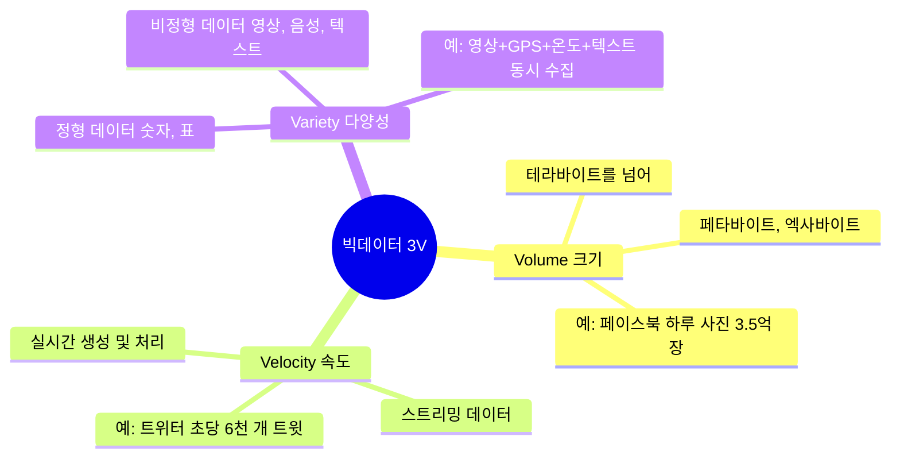
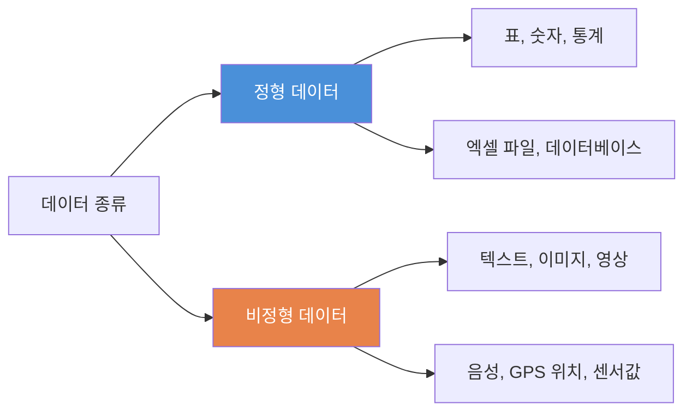
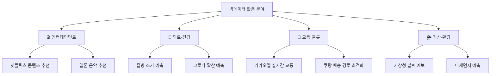

# Chapter 03. 빅데이터가 뭐야? - 데이터의 새로운 시대

---

## 🎯 이 장에서 배우는 것

- [ ] 빅데이터의 개념과 3V(Volume, Velocity, Variety)의 의미를 설명할 수 있다.
- [ ] 빅데이터가 실생활에서 활용되는 구체적인 사례를 3가지 이상 들 수 있다.
- [ ] 센서 데이터가 무엇인지 이해하고, 공공데이터포털에서 데이터를 탐색할 수 있다.
- [ ] 빅데이터와 일반 데이터의 차이를 비교하여 설명할 수 있다.

---

## 💡 왜 이걸 배우나요?

오늘 아침에 일어나서 지금까지, 여러분은 얼마나 많은 데이터를 만들어냈을까요?

스마트폰 알람을 끄는 순간, 날씨 앱을 확인하는 순간, 유튜브 영상을 재생하는 순간 — 이 모든 행동이 데이터가 됩니다. 전 세계 80억 명의 사람들이 매일 이런 행동을 반복하면 어떻게 될까요?

**매일 약 2.5엑사바이트(EB)의 데이터가 새로 생성됩니다.** 이 숫자가 얼마나 큰지 감이 오지 않죠? 1엑사바이트는 1,000,000 테라바이트(TB)입니다. 여러분이 쓰는 USB가 보통 128GB라면, 1엑사바이트는 그 USB 약 800만 개에 해당합니다.

이 엄청난 양의 데이터를 **어떻게 모으고, 분석하고, 활용하느냐**가 현대 사회의 핵심 경쟁력이 되었습니다. 넷플릭스가 여러분이 좋아할 영화를 먼저 추천하고, 병원이 환자의 병을 미리 예측하고, 교통 앱이 막히는 길을 피해주는 것 — 모두 빅데이터 덕분입니다.

이 장에서는 **빅데이터가 정확히 무엇인지**, 그리고 **어디서 데이터를 가져올 수 있는지** 배웁니다. 앞으로 여러분이 직접 데이터를 다루기 위한 첫 번째 발걸음입니다.

---

## 📚 핵심 개념

### 개념 1: 빅데이터란 무엇인가?

#### 🧃 비유로 시작하기

학교 급식실을 떠올려봅시다.

매일 500명의 학생이 급식을 먹습니다. 영양사 선생님이 학생 한 명 한 명에게 "오늘 뭐가 먹고 싶어?"라고 물어보고 메뉴를 정한다면 어떨까요? 500명의 의견을 종이에 적고, 분류하고, 집계하는 데만 하루가 꼬박 걸릴 것입니다.

그런데 만약 급식판에 센서가 달려서 **어떤 음식을 얼마나 남겼는지** 매일 자동으로 기록된다면? 1년 치 데이터를 보면 "수요일에는 피자가 항상 인기" "김치찌개는 겨울에 잘 먹힘"과 같은 패턴이 보이겠죠. 이게 바로 빅데이터의 힘입니다.

#### 📖 정확한 정의

> **빅데이터(Big Data)** 란, 기존의 방법으로는 수집·저장·분석하기 어려울 만큼 **방대하고, 빠르게 생성되며, 다양한 형태**를 가진 데이터의 총체를 말합니다.

단순히 "데이터가 많다"는 뜻이 아닙니다. **크기(Volume), 속도(Velocity), 다양성(Variety)** 이라는 세 가지 특성이 결합되어야 진정한 빅데이터라고 부릅니다.

#### ✅ 예시로 확인

일반 데이터와 빅데이터를 비교해봅시다.

```
일반 데이터 예시
- 우리 반 30명의 수학 성적표
- 지난달 우리 집 전기 요금 고지서
- 학교 도서관에 있는 책 목록 500권

빅데이터 예시
- 전국 모든 학생의 시험 성적 + 학습 패턴 + SNS 활동 데이터
- 전국 가정의 실시간 전력 사용량 (1초마다 업데이트)
- 유튜브에 하루 동안 올라오는 영상 500시간 분량
```

---

### 개념 2: 빅데이터의 3V - 핵심 특징 세 가지

빅데이터를 이해하는 가장 중요한 키워드는 **3V**입니다.



#### V1. Volume (크기) — "얼마나 많은가?"

**비유:** 모래사장의 모래알을 하나씩 세는 것 vs. 삽으로 퍼서 무게를 재는 것. 빅데이터는 그 양이 너무 많아서 세는 방식 자체를 바꿔야 합니다.

- 일반적인 데이터 크기: MB(메가바이트), GB(기가바이트)
- 빅데이터의 크기: TB(테라바이트) → PB(페타바이트) → EB(엑사바이트)
- **실제 사례:** 구글은 매일 약 8.5억 건의 검색을 처리합니다. 이 검색 데이터를 모두 저장하면 하루에만 수백 테라바이트가 됩니다.

> 💡 **크기 비교**
> - 1 TB = 1,000 GB → 영화 약 500편
> - 1 PB = 1,000 TB → 영화 약 50만 편
> - 1 EB = 1,000 PB → 영화 약 5억 편

#### V2. Velocity (속도) — "얼마나 빠른가?"

**비유:** 수도꼭지에서 물이 천천히 떨어지는 것 vs. 소방호스로 물이 쏟아지는 것. 빅데이터는 소방호스처럼 쏟아지는 데이터를 실시간으로 받아서 처리해야 합니다.

- **데이터 생성 속도:** 초당 수백만 건의 데이터가 동시에 생성
- **처리 요구:** 몇 초 안에 분석 결과가 나와야 실용적 가치 있음
- **실제 사례:** 신용카드 결제 사기 감지 시스템은 결제 후 **0.1초 이내**에 정상/사기 여부를 판단해야 합니다.

#### V3. Variety (다양성) — "얼마나 다양한가?"

**비유:** 음식 재료가 쌀, 고기, 채소만 있다면 요리가 단조롭겠죠. 다양한 재료가 있어야 풍성한 요리가 가능합니다. 데이터도 마찬가지입니다.

데이터는 크게 두 종류로 나뉩니다.



- **정형 데이터:** 행과 열로 정리된 데이터. 엑셀 표처럼 구조가 명확합니다.
- **비정형 데이터:** 구조 없이 다양한 형태로 존재. 카카오톡 메시지, 인스타그램 사진, 유튜브 댓글 등.

> 📌 **알아보기:** 전 세계 데이터의 약 80~90%는 비정형 데이터입니다. 텍스트, 이미지, 영상 같은 형태가 대부분이라는 뜻입니다. 빅데이터 기술의 큰 도전 중 하나가 이 비정형 데이터를 분석하는 것입니다.

---

### 개념 3: 빅데이터 실생활 활용 사례

빅데이터가 우리 삶 어디에 숨어 있는지 살펴봅시다.



#### 사례 1: 넷플릭스의 추천 알고리즘 🎬

넷플릭스에는 전 세계 2억 명 이상의 구독자가 있습니다. 이들이 **무슨 영상을 보고, 어디서 멈추고, 몇 번이나 되감기 했는지** 모든 행동이 데이터로 저장됩니다.

넷플릭스는 이 데이터를 분석해서:
- "이 사람은 액션 영화를 좋아하는데, 주인공이 악당인 영화를 특히 좋아하는 패턴이 있다"
- "비슷한 취향의 1,000만 명이 이 영화를 다음에 봤다"

이런 분석을 통해 여러분이 보고 싶은 영화를 여러분보다 먼저 아는 것입니다. **넷플릭스 시청량의 약 80%가 추천 알고리즘**으로 발생한다고 알려져 있습니다.

#### 사례 2: 기상청의 날씨 예보 🌦️

내일 날씨를 맞히려면 얼마나 많은 데이터가 필요할까요?

기상청은 전국 수백 개의 기상 관측소, 위성, 선박, 비행기에서 실시간으로 데이터를 수집합니다. **기온, 습도, 기압, 풍속, 풍향, 강수량** 등 수십 가지 변수를 분석합니다. 과거 100년치 날씨 데이터와 비교해서 내일 날씨를 예측하죠.

현재 최신 슈퍼컴퓨터는 10일 후 날씨까지 어느 정도 예측할 수 있는데, 이것이 가능한 이유가 바로 빅데이터 분석입니다.

#### 사례 3: 카카오맵의 실시간 교통 정보 🚗

카카오맵이 "이 길로 가면 15분 걸립니다"라고 알려줄 수 있는 이유는 무엇일까요?

수백만 명의 앱 사용자 스마트폰 GPS 위치 정보가 **익명으로** 실시간 수집됩니다. 특정 도로에서 차들이 얼마나 느리게 움직이는지 파악하면, 그 도로의 혼잡도를 알 수 있습니다. 이 정보와 역사적인 교통 데이터를 합쳐서 "지금 이 길로 가면 평소보다 10분 더 걸린다"를 계산해서 보여줍니다.

---

### 개념 4: 센서 데이터와 공공데이터

#### 🌡️ 센서 데이터 — 세상을 읽는 눈

우리 주변에는 수많은 **센서(Sensor)** 가 있습니다. 센서는 온도, 빛, 움직임, 소리 등 물리적인 현상을 측정해서 **숫자 데이터**로 변환하는 장치입니다.

> **IoT(사물인터넷, Internet of Things):** 센서가 달린 물건들이 인터넷에 연결되어 데이터를 주고받는 환경. 스마트 냉장고, 스마트 가로등, 스마트 공장 등이 대표적입니다.

우리 주변의 센서들을 찾아봅시다.

- **스마트폰:** 가속도 센서(기울기 감지), GPS(위치), 조도 센서(화면 밝기 자동 조절), 마이크(소리)
- **학교 건물:** CCTV(영상), 온도 센서(냉난방), 출입카드 리더기(출입 기록)
- **스마트워치:** 심박수 센서, 혈중 산소 센서, 걸음 수 측정
- **도시 인프라:** 미세먼지 측정 센서, 지하철 혼잡도 센서, 신호등 교통량 감지 센서

이 센서들이 24시간 쉬지 않고 데이터를 만들어냅니다. 이것이 빅데이터의 주요 원천 중 하나입니다.

> 🤔 **생각해보기:** 지금 여러분이 있는 교실에서 빅데이터를 활용할 수 있는 센서를 설치한다면 어디에 무엇을 달고 싶나요? (예: 좌석마다 집중도 측정 센서, 교실 문에 출석 확인 센서 등)

#### 🏛️ 공공데이터 — 누구나 쓸 수 있는 데이터

빅데이터 분석을 하려면 데이터가 있어야겠죠? 다행히 정부와 공공기관이 수집한 데이터를 **무료로 공개**하고 있습니다. 이것을 **공공데이터**라고 합니다.

**공공데이터포털(data.go.kr)** 에서는 다음과 같은 데이터를 무료로 다운로드할 수 있습니다.

- 전국 버스 정류장 위치 및 실시간 버스 정보
- 기상청 날씨 데이터 (과거 100년치 포함)
- 전국 코로나19 확진자 현황
- 학교별 급식 메뉴 정보
- 전국 공공 화장실 위치

---

## 🔨 따라하기: 공공데이터포털에서 데이터 탐색하기

실제 빅데이터를 직접 찾아봅시다. 인터넷 브라우저만 있으면 됩니다.

### Step 1: 공공데이터포털 접속하기

웹 브라우저 주소창에 다음을 입력합니다.

```
https://www.data.go.kr
```

접속하면 메인 화면에 다양한 데이터 카테고리가 보입니다. 오늘은 우리가 실생활에서 체감할 수 있는 데이터를 찾아볼 것입니다.

### Step 2: 원하는 데이터 검색하기

상단 검색창에 **"서울 미세먼지"** 를 입력하고 검색합니다.

검색 결과에서 다음을 확인합니다.
- **데이터 이름:** 어떤 데이터인지
- **제공 기관:** 누가 만든 데이터인지
- **갱신 주기:** 얼마나 자주 업데이트되는지
- **파일 형식:** CSV, JSON, XML 중 어떤 형태인지

### Step 3: 데이터 미리보기

검색 결과 중 **"서울시 대기환경 정보"** 를 클릭합니다. 상세 페이지에서 **미리보기** 버튼을 누르면 실제 데이터가 어떻게 생겼는지 볼 수 있습니다.

화면에 이런 형태의 데이터가 보일 것입니다.

```
측정일시        측정소명    PM10    PM2.5   오존    이산화질소
2024-01-15 09  종로구     45      28      0.021   0.034
2024-01-15 09  중구       51      31      0.019   0.041
2024-01-15 09  용산구     38      22      0.025   0.029
...
```

각 열(Column)이 무엇을 의미하는지 생각해봅시다.
- PM10: 미세먼지 농도 (㎍/㎥)
- PM2.5: 초미세먼지 농도 (㎍/㎥)
- 오존, 이산화질소: 대기 오염 물질

### Step 4: 3V 분석해보기

방금 찾은 서울 미세먼지 데이터를 3V 관점에서 분석해봅시다.

**Volume(크기):** 서울에 측정소가 약 40개 있고, 1시간마다 데이터가 생성됩니다. 하루 40 × 24 = 960개 행(row)이 생기고, 1년이면 35만 개 이상의 데이터가 됩니다.

**Velocity(속도):** 측정 주기를 확인해보세요. "1시간" 또는 "실시간"으로 표시된 것을 볼 수 있습니다.

**Variety(다양성):** 미세먼지 수치(숫자) + 측정소 이름(텍스트) + 날짜(날짜형) + 지역 GPS 좌표(위치 데이터)가 함께 들어 있습니다.

### Step 5: 다른 데이터셋 탐색하기

이번에는 여러분이 직접 관심 있는 주제로 검색해봅시다. 다음 키워드 중 하나를 골라 검색해보세요.

- "전국 편의점 위치"
- "서울 따릉이 이용 현황"
- "전국 학교 정보"
- "서울 지하철 승하차 인원"

> 📌 **정리하기:** 공공데이터는 이미 수집·정제된 데이터라서 초보자가 분석 연습을 시작하기에 가장 좋습니다. 다음 챕터부터 이 데이터들을 파이썬으로 직접 분석합니다!

### Step 6: 데이터 다운로드 해보기

관심 있는 데이터를 찾았다면, **다운로드** 버튼을 클릭해서 CSV 파일로 저장해봅니다.

CSV 파일은 엑셀로도 열 수 있고, 파이썬으로도 읽을 수 있습니다. 저장한 파일을 엑셀이나 메모장으로 열어서 데이터가 어떻게 생겼는지 구경해봅시다.

---

## 📝 핵심 개념 정리 코드

공공데이터를 다운로드했다면, 나중에 파이썬으로 이렇게 읽을 수 있다는 것을 미리 살펴봅시다. (지금 당장 실행하지 않아도 됩니다. 구조를 눈으로만 확인하세요!)

```python
# 공공데이터(CSV 파일) 읽기 예시 - 미리 보기용
import pandas as pd

# 다운로드한 CSV 파일 읽기
data = pd.read_csv('서울_미세먼지.csv', encoding='utf-8-sig')

# 데이터의 크기 확인 (Volume!)
print("데이터 크기:", data.shape)  # (행의 수, 열의 수)

# 처음 5행 미리보기
print(data.head())

# 기본 통계 정보 (평균, 최솟값, 최댓값 등)
print(data.describe())
```

```
출력 예시:
데이터 크기: (8760, 7)    ← 1년치 데이터, 7가지 측정 항목
   측정일시        측정소명  PM10  PM2.5
0  2024-01-01  종로구     42    25
1  2024-01-01  중구       48    29
...
```

> 📌 이 코드의 의미를 아직 몰라도 됩니다. 앞으로 챕터 5~6에서 pandas 라이브러리를 자세히 배울 예정입니다.

---

## ⚠️ 자주 하는 실수

**실수 1: "데이터가 많으면 무조건 빅데이터다"라고 생각하는 것**

데이터의 양만 많다고 빅데이터가 아닙니다. 3V(크기, 속도, 다양성)가 모두 갖춰져야 하며, 가장 중요한 것은 **그 데이터로 무엇을 할 수 있느냐**입니다. 10억 개의 데이터도 분석할 수 없거나 가치가 없으면 의미가 없습니다.

**실수 2: 빅데이터와 개인정보를 혼동하는 것**

빅데이터 분석에 사용되는 데이터는 대부분 **익명화(anonymization)** 처리됩니다. "홍길동이 오늘 강남역에서 버스를 탔다"는 개인정보이지만, "오늘 강남역에서 버스를 탄 사람이 2만 명이다"는 분석 데이터입니다. 빅데이터는 개인을 특정하지 않고 패턴을 찾는 것이 목적입니다.

**실수 3: 공공데이터가 항상 완벽하다고 생각하는 것**

공공데이터는 무료로 제공되지만, 실제로 사용해보면 **빠진 값, 오타, 형식 오류** 등이 종종 있습니다. 데이터를 분석하기 전에 데이터가 제대로 되어 있는지 확인하는 **데이터 전처리** 과정이 반드시 필요합니다. (챕터 7에서 배웁니다!)

**실수 4: 3V 중 하나만 있으면 빅데이터라고 부르는 것**

예를 들어, 용량이 1TB인 영화 파일 모음은 크기(Volume)는 크지만, 속도(Velocity)나 다양성(Variety) 측면에서 빅데이터라고 부르기 어렵습니다. 3V의 특성이 복합적으로 나타날 때 빅데이터라고 합니다.

---

## ✅ 스스로 점검하기

다음 문제를 풀어보며 이번 장에서 배운 내용을 확인합시다.

**[기본 문제]**

**Q1.** 빅데이터의 3V를 올바르게 연결하세요.

```
Volume   •          • 빠르게 생성되고 처리되어야 함
Velocity •          • 정형·비정형 등 여러 형태
Variety  •          • 테라바이트 이상의 방대한 양
```

**Q2.** 다음 중 비정형 데이터에 해당하는 것을 모두 고르세요.

- ① 엑셀로 정리한 학생 성적표
- ② 인스타그램에 올린 사진
- ③ 카카오톡 단체방의 대화 내용
- ④ 기상청의 날씨 수치 데이터
- ⑤ 유튜브 영상의 댓글

**Q3.** 공공데이터포털의 주소를 쓰고, 어떤 데이터를 무료로 제공하는지 예를 2가지 쓰세요.

---

**[응용 문제]**

**Q4.** 다음 상황을 읽고, 3V 관점에서 분석하세요.

> 배달의민족은 하루에 수백만 건의 주문 데이터를 처리합니다. 각 주문에는 주문 시각, 메뉴, 위치(GPS), 배달