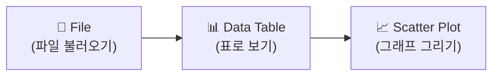
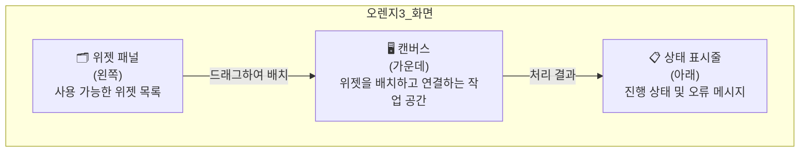
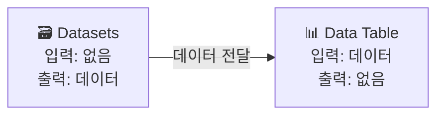
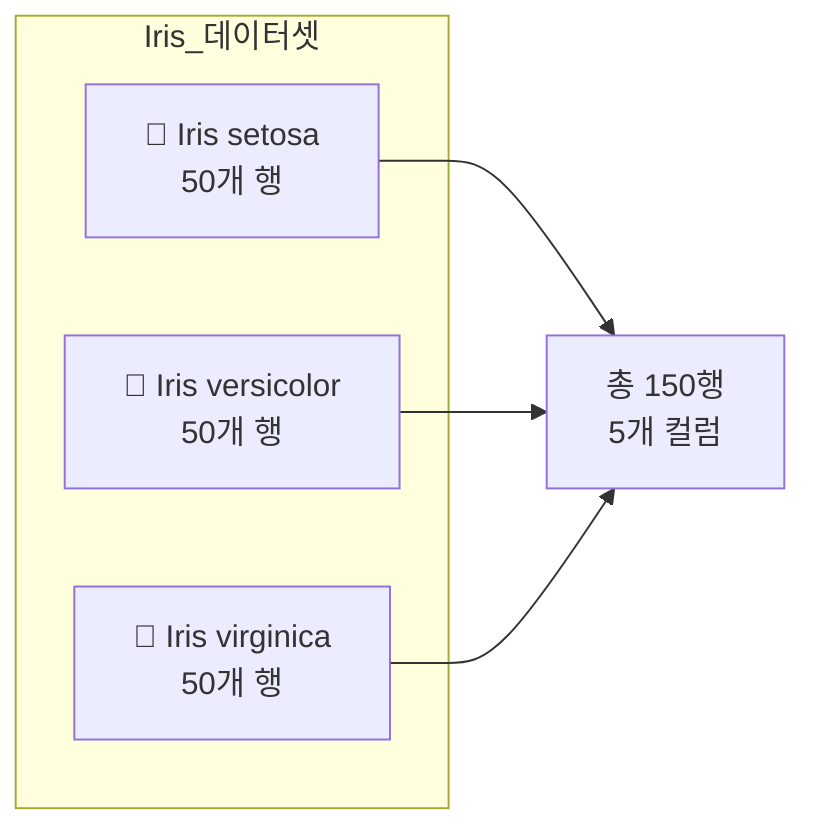
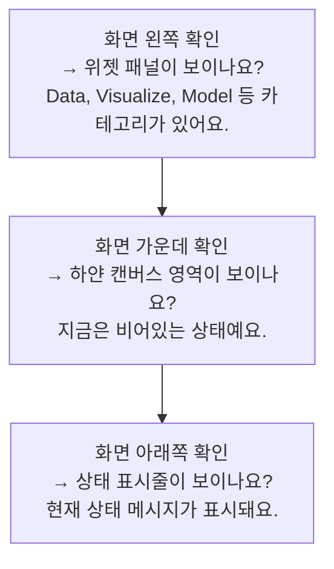
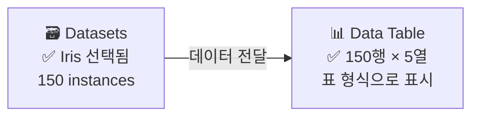
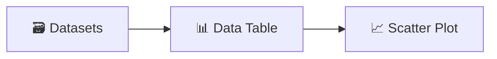

# Chapter 04: 오렌지3 첫 만남 - 나의 데이터 분석 도구

---

## 🎯 이 장에서 배우는 것

- [ ] 오렌지3를 설치하고 기본 화면의 구성 요소를 설명할 수 있다.
- [ ] 위젯을 캔버스에 배치하고 서로 연결하여 워크플로를 만들 수 있다.
- [ ] 내장 데이터셋(Iris)을 불러와 데이터 테이블로 확인할 수 있다.
- [ ] 파이썬 코드로 같은 Iris 데이터를 불러오는 방법을 이해할 수 있다.

---

## 💡 왜 이걸 배우나요?

데이터 분석은 어렵고 복잡한 프로그래밍 언어를 알아야만 할 수 있을까요? 그렇지 않습니다.

**오렌지3(Orange3)** 는 마치 레고 블록을 조립하듯, 시각적인 블록(위젯)을 연결하는 것만으로 데이터를 분석할 수 있는 도구입니다. 코딩을 처음 접하는 사람도, 데이터 분석의 개념을 빠르게 이해하고 싶은 학생도 누구나 쉽게 시작할 수 있죠.

이 장에서는 오렌지3를 설치하고, 기본 화면에 익숙해지며, 실제 데이터를 눈으로 확인하는 첫 번째 실습을 진행합니다. 데이터 분석의 문을 여는 첫 걸음이니 천천히, 꼼꼼하게 따라오세요! 🚀

---

## 📚 핵심 개념

### 개념 1: 오렌지3란 무엇인가?

**비유로 시작** 🎨

미술 수업에서 물감을 섞어 새로운 색을 만들어 본 적 있나요? 빨간색 + 파란색 = 보라색처럼, 결과물이 눈에 바로 보이기 때문에 훨씬 이해하기 쉽죠. 오렌지3는 데이터 분석도 이처럼 **눈에 보이는 방식**으로 할 수 있게 도와주는 도구입니다.

**정확한 정의**

오렌지3는 슬로베니아 류블랴나 대학교에서 개발한 **오픈 소스 데이터 시각화 및 머신러닝 도구**입니다. 파이썬 기반으로 만들어졌지만, 사용자는 코드를 직접 작성하지 않아도 됩니다. 대신 **위젯(Widget)** 이라는 기능 블록들을 연결하여 분석 흐름(워크플로)을 만듭니다.

**예시로 확인**

예를 들어, "파일을 불러와서 → 데이터를 표로 보고 → 그래프를 그린다"는 분석 과정을 오렌지3에서는 다음처럼 표현합니다.



각 블록이 하나의 **기능(위젯)** 이고, 화살표로 연결만 하면 됩니다. 직관적이죠?

---

### 개념 2: 인터페이스 구성 요소

**비유로 시작** 🏗️

건설 현장을 상상해보세요. 왼쪽에는 사용할 수 있는 **자재 목록(위젯 패널)** 이 있고, 가운데에는 실제로 자재를 조립하는 **작업장(캔버스)** 이 있으며, 아래쪽에는 공사 진행 상황을 알려주는 **현황판(상태 표시줄)** 이 있습니다. 오렌지3의 화면도 이와 똑같이 구성되어 있습니다.

**정확한 정의**

오렌지3 화면은 크게 세 영역으로 나뉩니다.

- **위젯 패널 (Widget Panel)**: 화면 왼쪽에 있는 도구 목록입니다. 데이터 불러오기, 시각화, 머신러닝 등 카테고리별로 위젯이 정리되어 있습니다.
- **캔버스 (Canvas)**: 화면 가운데의 넓은 작업 공간입니다. 위젯을 드래그해서 가져다 놓고, 서로 연결해 분석 흐름을 만드는 곳입니다.
- **상태 표시줄 (Status Bar)**: 화면 아래쪽에 있으며, 현재 처리 중인 작업의 진행 상태나 오류 메시지를 보여줍니다.



**예시로 확인**

위젯 패널에서 "Data Table" 위젯을 찾아 캔버스로 드래그하면, 캔버스 위에 Data Table 블록이 생깁니다. 분석이 실행되면 상태 표시줄에 "처리 완료"라는 메시지가 나타납니다.

---

### 개념 3: 위젯과 워크플로

**비유로 시작** 🔗

공장의 생산 라인을 떠올려 보세요. 원재료가 들어오면 → 세척하고 → 가공하고 → 포장해서 → 완제품이 나옵니다. 각 단계가 하나의 기계(위젯)이고, 컨베이어 벨트(연결선)로 이어져 있죠. 오렌지3의 **워크플로(Workflow)** 도 이와 같은 구조입니다.

**정확한 정의**

- **위젯(Widget)**: 데이터 분석의 특정 기능을 담당하는 단위 블록입니다. "데이터 불러오기", "표로 보기", "그래프 그리기" 등 각각의 역할이 있습니다.
- **워크플로(Workflow)**: 여러 위젯을 연결하여 만든 전체 분석 흐름입니다. 위젯과 위젯 사이를 선으로 이으면 데이터가 자동으로 흘러갑니다.
- **연결(Connection)**: 한 위젯의 출력을 다른 위젯의 입력에 연결하는 것입니다. 위젯 오른쪽 점에서 다른 위젯 왼쪽 점으로 드래그하면 연결됩니다.

**예시로 확인**



Datasets 위젯이 데이터를 만들어 내면, 그 데이터가 연결선을 통해 Data Table 위젯으로 전달됩니다. Data Table은 전달받은 데이터를 표 형식으로 보여줍니다.

---

### 개념 4: Iris 데이터셋

**비유로 시작** 🌸

요리를 배울 때 처음엔 볶음밥이나 라면처럼 쉽고 친숙한 음식부터 만들죠. 데이터 분석을 배울 때도 마찬가지로, 전 세계 모든 데이터 분석 교육에서 가장 먼저 등장하는 "연습용 표준 데이터"가 있습니다. 바로 **Iris 데이터셋**입니다.

**정확한 정의**

Iris 데이터셋은 1936년 통계학자 로널드 피셔가 소개한 데이터로, **붓꽃(Iris) 3종류** 의 꽃잎과 꽃받침 크기를 측정한 자료입니다. 총 150개의 데이터 행으로 구성되어 있으며, 다음과 같은 5개의 열(컬럼)을 가집니다.

- **sepal length**: 꽃받침 길이 (cm)
- **sepal width**: 꽃받침 너비 (cm)
- **petal length**: 꽃잎 길이 (cm)
- **petal width**: 꽃잎 너비 (cm)
- **iris**: 붓꽃 종류 (setosa / versicolor / virginica)

**예시로 확인**



이 데이터셋은 오렌지3에 기본으로 내장되어 있어서, 별도의 파일 없이 바로 불러올 수 있습니다.

---

## 🔨 따라하기

### Step 1: 오렌지3 설치하기

**준비물**: 인터넷이 연결된 컴퓨터 (Windows / macOS / Linux 모두 가능)

**① 공식 홈페이지 접속**

웹 브라우저를 열고 주소창에 아래 주소를 입력합니다.

```
https://orangedatamining.com/download/
```

**② 운영체제에 맞는 설치 파일 다운로드**

- Windows: `.exe` 파일 클릭
- macOS: `.dmg` 파일 클릭
- Linux: 터미널 방식 안내 페이지로 이동

> 💡 **알아보기**: 오렌지3는 무료(오픈 소스) 소프트웨어입니다. 회원가입 없이 바로 다운로드할 수 있어요.

**③ 설치 진행**

다운로드된 파일을 더블클릭하고, 안내에 따라 "다음(Next)" 버튼을 클릭하면 설치가 완료됩니다. 설치 중 "Miniconda를 함께 설치하겠습니까?" 라는 질문이 나오면 **"예(Yes)"** 를 선택하세요. 파이썬 환경이 자동으로 함께 설치됩니다.

---

### Step 2: 오렌지3 실행하고 화면 살펴보기

설치가 완료되면, 바탕화면이나 시작 메뉴에서 **Orange3** 아이콘을 찾아 실행합니다. 처음 실행하면 환영 화면이 나타납니다. "New Workflow"를 클릭해 새 작업 공간을 열어봅시다.

**화면을 구성하는 세 영역을 직접 확인해보세요.**



> 💡 **생각해보기**: 위젯 패널을 천천히 스크롤해보세요. 어떤 카테고리들이 있나요? 카테고리 이름만 보고 어떤 기능일지 추측해보세요.

---

### Step 3: 위젯 배치하기 - Datasets 위젯

이제 첫 번째 위젯을 캔버스에 올려봅시다.

**① 위젯 패널에서 "Data" 카테고리를 클릭합니다.**

**② "Datasets" 위젯을 찾습니다.**
(검색창에 "Datasets"라고 입력하면 더 빠르게 찾을 수 있어요.)

**③ "Datasets" 위젯을 캔버스로 드래그합니다.**
마우스로 클릭한 상태에서 캔버스 가운데로 끌어다 놓으면 됩니다.

**④ 캔버스에 Datasets 블록이 생겼나요?** ✅

위젯 블록의 모양을 살펴보세요. 왼쪽에는 입력 점(●), 오른쪽에는 출력 점(●)이 있습니다. Datasets 위젯은 데이터를 만들어내는 역할이므로 출력 점만 있습니다.

---

### Step 4: Iris 데이터셋 불러오기

**① Datasets 위젯을 더블클릭합니다.**

창이 열리면서 사용할 수 있는 데이터셋 목록이 나타납니다.

**② 검색창에 "iris"를 입력합니다.**

목록에서 **"Iris"** 데이터셋을 찾을 수 있습니다.

**③ Iris를 클릭하고 "Send" 버튼을 누릅니다.**

창을 닫으면, Datasets 위젯 아래에 "150 instances"(150개의 데이터)라는 표시가 나타납니다. 데이터가 성공적으로 불러와진 것입니다! 🎉

---

### Step 5: Data Table 위젯 연결하기

데이터를 불러왔으니, 이제 표 형태로 확인해봅시다.

**① 위젯 패널에서 "Data Table" 위젯을 찾아 캔버스로 드래그합니다.**
(Datasets 위젯 오른쪽 공간에 놓으세요.)

**② Datasets 위젯과 Data Table 위젯을 연결합니다.**
- Datasets 위젯 오른쪽의 출력 점(●)에 마우스를 가져다 대면 커서가 바뀝니다.
- 클릭한 채로 Data Table 위젯의 왼쪽 입력 점(●)까지 드래그합니다.
- 연결선이 생기면 성공입니다!

**③ Data Table 위젯을 더블클릭합니다.**

아래와 같은 표가 나타납니다. 150개의 행과 5개의 컬럼이 잘 보이나요?



> 💡 **정리하기**: 방금 만든 것이 바로 **워크플로**입니다! 두 개의 위젯이 연결되어 "데이터 불러오기 → 표로 보기"라는 분석 흐름이 완성되었어요.

---

### Step 6: 파이썬으로 같은 데이터 불러보기

오렌지3가 내부에서 어떻게 작동하는지 파이썬 코드로도 확인해봅시다. 파이썬을 아직 잘 몰라도 괜찮습니다. 코드의 **구조와 의미**만 파악해보세요.

```python
# 필요한 라이브러리 불러오기
from sklearn.datasets import load_iris
import pandas as pd

# Iris 데이터셋 불러오기
iris = load_iris()

# 데이터프레임으로 변환 (표 형식)
df = pd.DataFrame(
    iris.data,
    columns=iris.feature_names
)
df['iris'] = iris.target_names[iris.target]

# 처음 5개 행 출력
print(df.head())
print(f"\n총 데이터 수: {len(df)}개")
print(f"컬럼 목록: {list(df.columns)}")
```

**실행 결과 (예시)**

```
   sepal length (cm)  sepal width (cm)  petal length (cm)  petal width (cm)   iris
0                5.1               3.5                1.4               0.2  setosa
1                4.9               3.0                1.4               0.2  setosa
2                4.7               3.2                1.3               0.2  setosa
3                4.6               3.1                1.5               0.2  setosa
4                5.0               3.6                1.4               0.2  setosa

총 데이터 수: 150개
컬럼 목록: ['sepal length (cm)', 'sepal width (cm)', 'petal length (cm)', 'petal width (cm)', 'iris']
```

> 💡 **알아보기**: 오렌지3에서 클릭 몇 번으로 했던 일을, 파이썬에서는 이런 코드로 표현합니다. 어느 방법이 더 편한가요? 상황에 따라 두 방법을 모두 활용할 수 있어요.

---

## 📝 전체 코드

이 장에서 파이썬으로 확인한 전체 코드입니다. 복사해서 바로 실행할 수 있습니다.

```python
# =============================================
# Chapter 04: Iris 데이터셋 불러오기
# =============================================

# 필요한 라이브러리 불러오기
from sklearn.datasets import load_iris
import pandas as pd

# Iris 데이터셋 불러오기
iris = load_iris()

# 데이터프레임으로 변환
df = pd.DataFrame(
    iris.data,
    columns=iris.feature_names
)

# 붓꽃 종류 컬럼 추가
df['iris'] = iris.target_names[iris.target]

# 데이터 기본 정보 확인
print("=== 처음 5개 행 ===")
print(df.head())

print("\n=== 데이터 기본 정보 ===")
print(f"총 행 수: {len(df)}")
print(f"컬럼 목록: {list(df.columns)}")
print(f"붓꽃 종류: {list(df['iris'].unique())}")

print("\n=== 각 종류별 개수 ===")
print(df['iris'].value_counts())
```

---

## ⚠️ 자주 하는 실수

**① 위젯을 연결할 때 방향을 거꾸로 연결한다**

위젯은 반드시 **출력(오른쪽 점) → 입력(왼쪽 점)** 방향으로 연결해야 합니다. 반대로 연결하려 하면 연결이 되지 않거나, 연결되어도 데이터가 흐르지 않습니다. 연결선 위에 작은 경고 아이콘(⚠️)이 뜨면 방향을 다시 확인해보세요.

**② Datasets 위젯에서 "Send" 버튼을 누르지 않는다**

Iris를 선택하고 창을 그냥 닫으면 데이터가 전달되지 않을 수 있습니다. 반드시 **"Send" 버튼**을 누른 후 창을 닫아야 데이터가 다음 위젯으로 흘러갑니다. 위젯 아래에 "150 instances"라는 표시가 있는지 확인하세요.

**③ 위젯이 빨간색으로 표시된다**

위젯 블록이 빨간색이나 주황색으로 변하면 오류가 발생한 것입니다. 가장 흔한 원인은 **연결이 끊어진 경우**입니다. 연결선을 한 번 지웠다가 다시 연결해보세요. 그래도 해결이 안 되면 위젯을 더블클릭해 설정 창에서 오류 메시지를 읽어보세요.

**④ 파이썬 코드에서 라이브러리가 없다는 오류가 난다**

`ModuleNotFoundError: No module named 'sklearn'` 오류가 나타나면 라이브러리가 설치되지 않은 것입니다. 터미널(명령 프롬프트)에서 다음 명령어를 실행하세요.

```bash
pip install scikit-learn pandas
```

---

## ✅ 스스로 점검하기

다음 질문에 답할 수 있으면 이 장을 잘 이해한 것입니다. 답이 바로 떠오르지 않으면 해당 개념 부분으로 돌아가 다시 읽어보세요.

**기본 문제**

1. 오렌지3에서 분석 기능을 담당하는 단위 블록의 이름은 무엇인가요?
   > 힌트: 레고 블록에 비유했었습니다.

2. 오렌지3 화면에서 위젯을 배치하고 연결하는 작업 공간의 이름은 무엇인가요?

3. Iris 데이터셋에는 총 몇 개의 행(데이터)이 있나요?

**응용 문제**

4. Datasets 위젯과 Data Table 위젯을 연결할 때, 어느 방향으로 드래그해야 하나요?
   - ① Data Table의 오른쪽 점 → Datasets의 왼쪽 점
   - ② Datasets의 오른쪽 점 → Data Table의 왼쪽 점

5. 오렌지3에서 여러 위젯이 연결되어 만들어진 전체 분석 흐름을 무엇이라고 하나요?

**심화 문제**

6. 오렌지3와 파이썬 코드는 같은 Iris 데이터를 다루지만 방법이 다릅니다. 각각 어떤 상황에서 더 유리할지 자신의 생각을 써보세요.

---

## 🚀 더 해보기

### 도전 1: 위젯 3개 연결하기

이미 만든 워크플로에 **Scatter Plot(산점도)** 위젯을 하나 더 추가해서 3개 위젯을 연결해보세요.



**힌트**: 위젯 패널의 "Visualize" 카테고리에 Scatter Plot이 있습니다. Scatter Plot을 더블클릭하면 x축과 y축을 직접 설정할 수 있어요. `petal length`와 `petal width`를 각 축으로 설정해보세요. 어떤 패턴이 보이나요?

### 도전 2: 파이썬 코드 수정해보기

전체 코드에서 `df.head()`를 `df.head(10)`으로 바꾸면 어떻게 될까요? 직접 바꿔서 실행해보고 결과를 확인해보세요. 숫자를 바꾸면 어떤 변화가 생기는지 설명해보세요.

### 도전 3: 다른 내장 데이터셋 탐색하기

Datasets 위젯을 열면 Iris 말고도 다양한 데이터셋이 있습니다. 흥미로운 데이터셋을 하나 골라 Data Table로 확인해보세요. 어떤 컬럼(열)이 있는지, 총 몇 개의 행이 있는지 정리해보세요.

---

## 🔗 다음 장으로

이번 장에서는 오렌지3를 설치하고, 위젯을 연결하여 Iris 데이터를 불러오고 확인하는 첫 번째 워크플로를 완성했습니다.

**이 장에서 배운 것 정리**

- **오렌지3**: 코딩 없이 위젯 연결로 데이터를 분석하는 시각적 도구
- **인터페이스 3요소**: 위젯 패널 / 캔버스 / 상태 표시줄
- **워크플로**: 위젯들을 연결해 만든 전체 분석 흐름
- **Iris 데이터셋**: 150개 행 / 5개 컬럼 / 3종류 붓꽃

다음 장에서는 불러온 데이터를 **직접 탐색하고 분석하는 방법**을 배웁니다. 데이터에서 숨겨진 패턴을 찾아내는 과정이 시작됩니다. 오렌지3의 시각화 위젯들을 활용해 데이터를 다양한 각도로 바라보는 방법을 익혀봅시다! 👀

---

> 📌 **핵심 개념 요약**
>
> - **오렌지3**: 위젯 연결 방식의 시각적 데이터 분석 도구
>