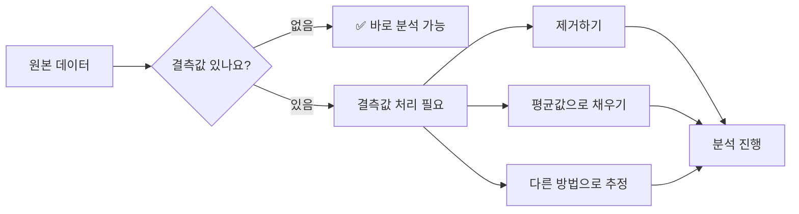
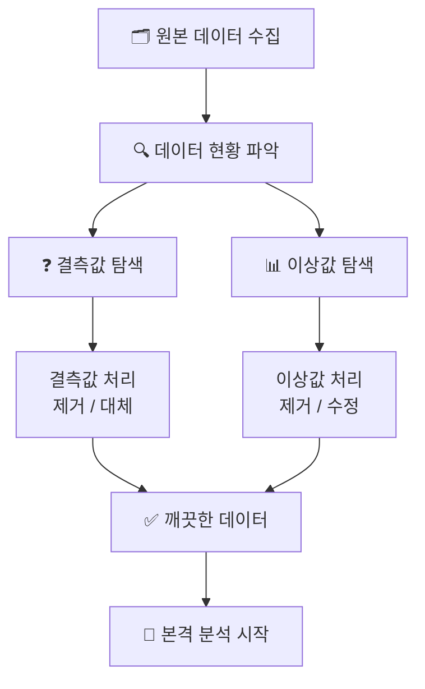
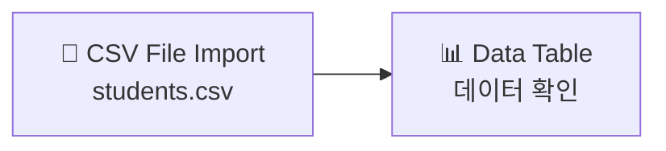
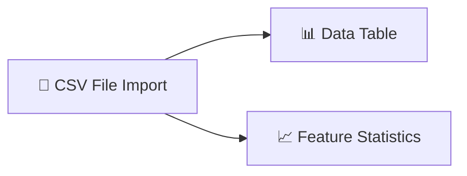
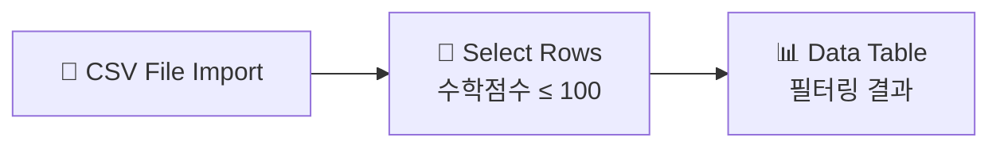
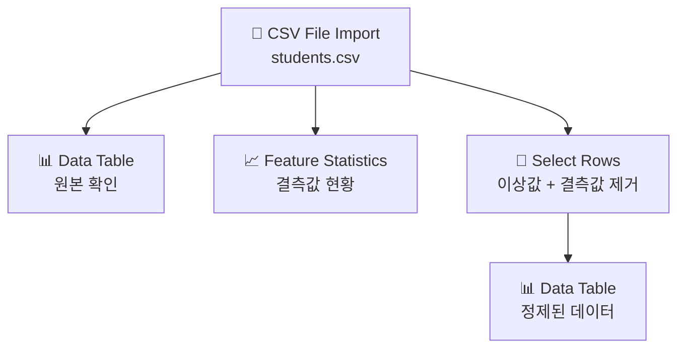

# Chapter 05. 데이터 다듬기 ① - 빈칸과 이상한 값 찾기

---

## 🎯 이 장에서 배우는 것

- [ ] 결측값(빈 데이터)이 무엇인지 설명하고, 실제 데이터에서 찾아낼 수 있다.
- [ ] 이상값(비정상적으로 튀는 값)의 개념을 이해하고 예시를 들 수 있다.
- [ ] 오렌지3의 Select Rows, Purge Domain 위젯으로 결측값을 처리할 수 있다.
- [ ] pandas 코드로 결측값을 확인하고 제거하는 기본 방법을 알 수 있다.
- [ ] 데이터 전처리가 분석 결과의 신뢰성에 어떤 영향을 미치는지 설명할 수 있다.

---

## 💡 왜 이걸 배우나요?

**생각해보기:** 기말고사 성적표를 받았는데, 수학 점수 칸이 비어 있습니다. 이 상태로 전 과목 평균을 계산하면 어떻게 될까요?

빈 칸을 0점으로 처리하면 평균이 뚝 떨어지고, 그냥 무시하면 과목 수가 달라집니다. 어느 쪽이든 "진짜 실력"을 제대로 반영하지 못합니다. 데이터 분석도 똑같습니다. **빈 칸이 있거나 말도 안 되는 값이 섞여 있으면, 아무리 좋은 분석 방법을 써도 결과를 믿을 수 없습니다.**

현실의 데이터는 항상 지저분합니다. 설문지에서 응답을 건너뛰거나, 센서가 잠깐 오작동하거나, 입력 실수로 나이가 999세가 되기도 합니다. 이런 문제를 발견하고 정리하는 작업을 **데이터 전처리(Data Preprocessing)** 라고 하고, 그 첫 번째 단계가 바로 이 챕터에서 배우는 **빈칸(결측값)과 이상한 값(이상값) 찾기**입니다.

> **알아보기:** 데이터 분석가들은 전체 작업 시간의 60~80%를 전처리에 씁니다. 분석보다 전처리가 훨씬 더 많은 시간을 차지한다는 뜻입니다. 전처리를 잘 해야 분석이 살아납니다.

---

## 📚 핵심 개념

### 개념 1: 결측값 (Missing Value)

**비유로 시작**

퍼즐 조각이 하나 빠진 상태를 상상해보세요. 전체 그림을 완성할 수 없고, 빠진 자리가 어떤 모양인지도 정확히 알 수 없습니다. 데이터의 결측값이 바로 이 '빠진 퍼즐 조각'입니다.

**정확한 정의**

결측값이란 **데이터셋에서 값이 기록되지 않아 비어 있는 칸**을 말합니다. 스프레드시트에서는 빈 셀로 보이고, 프로그래밍에서는 `NaN`(Not a Number) 또는 `None`으로 표시됩니다.

**예시로 확인**

아래는 학생 건강 기록 데이터의 예시입니다.

```
이름    나이    키(cm)    몸무게(kg)
김민준   15     172       58
이서연   16     160       (비어있음)
박지호   15     (비어있음) 65
최아름   17     168       52
```

이서연의 몸무게와 박지호의 키가 결측값입니다. 이 상태로 평균 키나 BMI를 계산하면 정확한 값이 나오지 않습니다.



---

### 개념 2: 이상값 (Outlier)

**비유로 시작**

반 친구 30명의 수학 시험 점수가 60~90점 사이에 분포해 있는데, 갑자기 한 명이 500점으로 기록되어 있습니다. 시험 만점은 100점인데 500점이 나올 수는 없죠. 이처럼 **정상적인 범위를 크게 벗어난 값**이 이상값입니다.

**정확한 정의**

이상값(Outlier)이란 **데이터의 전반적인 패턴에서 비정상적으로 벗어난 값**입니다. 이상값에는 두 가지 종류가 있습니다.

- **오류성 이상값**: 입력 실수, 센서 오작동 등으로 생긴 잘못된 값 → 제거 또는 수정이 필요
- **실제 이상값**: 드물지만 실제로 존재하는 극단적인 값 → 상황에 따라 보존하거나 별도 처리

**예시로 확인**

```
학생 키(cm) 데이터: 158, 163, 170, 165, 172, 1650, 168, 161
```

`1650`은 분명히 입력 오류입니다. 사람 키가 1650cm일 수는 없으니까요. 이런 값이 하나 섞여 있으면 평균 키 계산이 완전히 망가집니다.

> **생각해보기:** 이상값이 항상 오류일까요? 예를 들어 마라톤 기록 데이터에서 대부분 선수가 4~5시간인데 한 명이 2시간 1분이라면, 이 값은 오류가 아니라 세계 최고 기록일 수 있습니다. 이상값을 무조건 지우는 것은 위험합니다!

---

### 개념 3: 데이터 전처리 흐름

**비유로 시작**

요리를 시작하기 전에 재료를 씻고, 썩은 부분을 잘라내고, 크기를 맞춰 자르는 '손질' 과정이 있습니다. 전처리는 데이터 분석에서의 '재료 손질'입니다.

**정확한 정의**

데이터 전처리란 **원본 데이터를 분석에 적합한 형태로 정리하는 모든 과정**을 말합니다. 결측값 처리와 이상값 처리는 전처리의 핵심 단계입니다.



---

### 개념 4: 결측값 처리 방법

결측값을 발견했다면, 어떻게 처리할지 결정해야 합니다. 상황에 따라 방법이 달라집니다.

**방법 1. 행 제거 (삭제)**
- 결측값이 있는 행 전체를 삭제합니다.
- **장점**: 간단하고 확실합니다.
- **단점**: 데이터 양이 줄어듭니다. 결측값이 많으면 데이터가 너무 적어질 수 있습니다.
- **적합한 상황**: 결측값이 전체의 5% 미만이고, 무작위로 발생했을 때

**방법 2. 대표값으로 대체**
- 비어 있는 칸을 평균값, 중앙값, 최빈값으로 채웁니다.
- **장점**: 데이터를 보존할 수 있습니다.
- **단점**: 인위적으로 만든 값이므로 오차가 생길 수 있습니다.
- **적합한 상황**: 데이터가 귀하거나 결측값이 꽤 많을 때

**방법 3. 그대로 두기**
- 일부 분석 방법(예: 일부 머신러닝 알고리즘)은 결측값을 자체적으로 처리합니다.
- 오렌지3는 결측값을 자동으로 무시하는 기능이 있어서 이 방법이 가능할 때도 있습니다.

> **정리하기:** 결측값 처리의 황금 원칙은 "왜 빠졌는가를 먼저 파악하라"입니다. 이유를 모르고 무작정 삭제하거나 채우면 분석 결과가 왜곡될 수 있습니다.

---

## 🔨 따라하기

이제 오렌지3로 직접 실습해보겠습니다. 실습용 CSV 파일을 만들고, 결측값과 이상값을 찾아 처리해봅시다.

---

### Step 1: 실습 데이터 준비하기

먼저 실습에 사용할 CSV 파일을 만들겠습니다. 텍스트 편집기(메모장)를 열고 아래 내용을 그대로 입력한 뒤 `students.csv`로 저장하세요.

```
이름,나이,키,몸무게,수학점수
김민준,15,172,58,85
이서연,16,160,,72
박지호,15,,65,91
최아름,17,168,52,78
정현우,16,175,70,500
한소희,15,162,48,88
오준서,17,170,63,
임나연,16,158,45,77
```

**주목할 점:**
- **이서연의 몸무게**: 비어 있음 (결측값)
- **박지호의 키**: 비어 있음 (결측값)
- **정현우의 수학점수**: 500점 (이상값, 100점 만점인데 500점은 불가능)
- **오준서의 수학점수**: 비어 있음 (결측값)

---

### Step 2: 오렌지3에서 데이터 불러오기

1. 오렌지3를 실행합니다.
2. 왼쪽 위젯 패널에서 **Data** 카테고리를 찾습니다.
3. **CSV File Import** 위젯을 캔버스로 드래그합니다.
4. 위젯을 더블클릭하여 설정 창을 엽니다.
5. **Browse** 버튼을 클릭하고 방금 만든 `students.csv` 파일을 선택합니다.
6. **Import** 버튼을 클릭합니다.



7. **Data Table** 위젯을 캔버스에 추가하고, CSV File Import와 연결합니다.
8. Data Table을 더블클릭하면 불러온 데이터가 보입니다.

> **알아보기:** Data Table에서 빈 칸으로 보이는 셀이 결측값입니다. 오렌지3는 결측값을 회색 물음표(?) 또는 빈 칸으로 표시합니다.

---

### Step 3: 데이터 요약으로 결측값 현황 파악하기

데이터 전체를 눈으로 보는 것 외에, 오렌지3의 요약 기능을 활용하면 결측값 현황을 한눈에 파악할 수 있습니다.

1. **Data** 카테고리에서 **Feature Statistics** 위젯을 캔버스에 추가합니다.
2. CSV File Import → Feature Statistics로 연결합니다.
3. Feature Statistics를 더블클릭합니다.

Feature Statistics 창에서 각 변수(열)의 결측값 개수와 비율을 확인할 수 있습니다. 우리 데이터에서는 다음과 같이 보여야 합니다.

- **키**: 결측 1개
- **몸무게**: 결측 1개
- **수학점수**: 결측 1개 (이상값 500은 별도 확인 필요)



---

### Step 4: Select Rows로 이상값 필터링하기

수학 점수 500점처럼 말이 안 되는 값을 골라내 봅시다. **Select Rows** 위젯을 사용합니다.

1. **Data** 카테고리에서 **Select Rows** 위젯을 캔버스에 추가합니다.
2. CSV File Import → Select Rows로 연결합니다.
3. Select Rows를 더블클릭합니다.
4. **Add Condition** 버튼을 클릭합니다.
5. 조건을 아래와 같이 설정합니다.

**조건 설정:**
- 변수 선택: `수학점수`
- 조건 선택: `is at most` (이하)
- 값 입력: `100`

이 조건은 "수학점수가 100 이하인 행만 선택하라"는 뜻입니다. 즉, 500점짜리 행은 제외됩니다.

6. **Data Table**을 하나 더 추가하여 Select Rows의 출력과 연결하면, 필터링된 결과를 확인할 수 있습니다.



> **알아보기:** Select Rows는 조건에 맞는 행만 통과시키는 '체'와 같습니다. 조건을 여러 개 추가해서 복잡한 필터링도 가능합니다.

---

### Step 5: Purge Domain으로 결측값 행 제거하기

이번에는 결측값이 있는 행을 아예 제거해봅시다.

1. **Data** 카테고리에서 **Preprocess** → **Impute** 위젯 또는 **Purge Domain** 위젯을 찾습니다.
2. 더 간단한 방법으로, **Select Rows**에서 결측값 조건을 추가합니다.
3. 기존 Select Rows 위젯을 더블클릭하고 조건을 하나 더 추가합니다.

**추가 조건 설정 (AND 조건):**
- 변수: `키` / 조건: `is defined` (값이 존재함)

같은 방식으로 `몸무게`와 `수학점수`에도 `is defined` 조건을 추가합니다.

이제 세 조건이 모두 충족된 행만 통과합니다.
- 수학점수 ≤ 100
- 키가 존재함
- 몸무게가 존재함
- 수학점수가 존재함

결과적으로 결측값이 있거나 이상값이 있는 행은 모두 제거되고, 문제 없는 데이터만 남습니다.

---

### Step 6: 전체 워크플로우 완성 확인

아래 다이어그램이 최종 완성된 워크플로우입니다.



Data Table(정제된 데이터)을 열어보면 총 5행이 남아 있어야 합니다. (김민준, 최아름, 한소희, 임나연 + 결측값/이상값 없는 행)

---

## 📝 전체 코드

오렌지3로 한 작업을 파이썬 pandas로 하면 어떻게 될까요? 비교하며 살펴봅시다.

```python
import pandas as pd

# 1. 데이터 불러오기
df = pd.read_csv('students.csv')
print("=== 원본 데이터 ===")
print(df)
print()

# 2. 결측값 현황 확인
print("=== 결측값 개수 ===")
print(df.isnull().sum())
print()

# 3. 이상값 확인 (수학점수 > 100인 행)
print("=== 이상값 확인 ===")
print(df[df['수학점수'] > 100])
print()

# 4. 이상값 제거: 수학점수가 100 초과인 행 삭제
df_clean = df[df['수학점수'] <= 100]

# 5. 결측값 제거: 결측값이 있는 행 삭제
df_clean = df_clean.dropna()

print("=== 정제된 데이터 ===")
print(df_clean)
print(f"\n원본 행 수: {len(df)}행 → 정제 후: {len(df_clean)}행")
```

**실행 결과:**

```
=== 원본 데이터 ===
    이름  나이      키   몸무게  수학점수
0  김민준   15  172.0  58.0  85.0
1  이서연   16  160.0   NaN  72.0
2  박지호   15    NaN  65.0  91.0
3  최아름   17  168.0  52.0  78.0
4  정현우   16  175.0  70.0 500.0
5  한소희   15  162.0  48.0  88.0
6  오준서   17  170.0  63.0   NaN
7  임나연   16  158.0  45.0  77.0

=== 결측값 개수 ===
이름      0
나이      0
키       1
몸무게     1
수학점수    1

=== 이상값 확인 ===
    이름  나이      키   몸무게  수학점수
4  정현우   16  175.0  70.0 500.0

=== 정제된 데이터 ===
    이름  나이      키   몸무게  수학점수
0  김민준   15  172.0  58.0  85.0
3  최아름   17  168.0  52.0  78.0
5  한소희   15  162.0  48.0  88.0
7  임나연   16  158.0  45.0  77.0

원본 행 수: 8행 → 정제 후: 4행
```

> **알아보기:** `df.isnull().sum()`은 각 열에서 결측값이 몇 개인지 세어줍니다. `dropna()`는 결측값이 하나라도 있는 행을 모두 제거합니다. 오렌지3의 Select Rows가 하는 일을 코드 한 줄로 처리한 것입니다.

---

## ⚠️ 자주 하는 실수

**실수 1: 결측값을 0으로 채우기**

키나 몸무게가 비어 있을 때 습관적으로 0을 넣는 경우가 있습니다. 키가 0cm인 사람은 없습니다! 0은 "측정값이 0"을 의미하지, "값이 없음"을 의미하지 않습니다. 결측값과 0은 완전히 다른 개념입니다. 0으로 채우면 평균이 크게 낮아지는 등 심각한 왜곡이 생깁니다.

**실수 2: 이상값을 무조건 삭제하기**

500점 같은 명백한 오류는 삭제해도 됩니다. 하지만 "평균보다 조금 크다"는 이유만으로 이상값이라 판단하고 삭제하면 중요한 정보를 잃을 수 있습니다. 이상값을 삭제하기 전에 반드시 "왜 이 값이 나왔는가?"를 먼저 생각해야 합니다.

**실수 3: 결측값 처리 후 데이터 크기를 확인하지 않기**

결측값이 많은 데이터에서 무작정 행을 삭제하면, 데이터가 절반 이하로 줄어드는 경우도 있습니다. 처리 전후 데이터 크기를 항상 비교하세요. 너무 많이 줄었다면 삭제 대신 대체값으로 채우는 방법을 고려해야 합니다.

**실수 4: 처리 순서를 무시하기**

이상값 처리와 결측값 처리의 순서가 중요합니다. 평균값으로 결측값을 채울 계획이라면, **이상값을 먼저 제거한 뒤** 평균을 계산해서 채워야 합니다. 이상값이 섞인 상태에서 평균을 내면 그 평균 자체가 왜곡됩니다.

---

## ✅ 스스로 점검하기

아래 질문에 답할 수 있다면 이 챕터를 잘 이해한 것입니다.

**기본 문제**

**Q1.** 다음 중 결측값을 나타내는 표현으로 올바른 것은?

- ① `0`
- ② `NaN`
- ③ `-1`
- ④ `"없음"`

**Q2.** 오렌지3에서 특정 조건을 만족하는 행만 골라내는 위젯의 이름은 무엇인가요?

**응용 문제**

**Q3.** 학생 100명의 몸무게 데이터에서 결측값이 40개 발견되었습니다. 이 경우 결측값을 포함한 행을 모두 삭제하는 것이 좋은 방법일까요? 이유를 설명하세요.

**Q4.** 다음 데이터에서 이상값으로 의심되는 것을 모두 고르고, 그 이유를 설명하세요.

```
나이 데이터: 15, 16, 14, 17, 200, 15, 16, -3, 15
```

**심화 문제**

**Q5.** 결측값이 "무작위로 발생"한 경우와 "특정 패턴으로 발생"한 경우를 구분하는 것이 왜 중요한지 설명하세요. (힌트: 예를 들어, 소득이 높은 사람일수록 소득 공개를 거부하는 경향이 있다면?)

---

**정답 확인**

- **Q1 정답**: ② `NaN` — NaN은 "Not a Number"의 약자로, 값이 없음을 나타내는 표준 표기입니다.
- **Q2 정답**: Select Rows
- **Q3 정답**: 좋지 않습니다. 100명 중 40명의 행을 삭제하면 60명만 남아 데이터가 너무 부족해집니다. 이 경우 평균값이나 중앙값으로 결측값을 채우는 방법이 더 적절합니다.
- **Q4 정답**: `200`(사람 나이가 200살일 수 없음)과 `-3`(나이가 음수일 수 없음)이 이상값입니다.
- **Q5 정답**: 패턴이 있는 결측값(예: 소득 높은 사람이 응답 기피)은 무작정 삭제하면 분석 결과가 한쪽으로 치우칩니다. 이 경우 삭제보다 별도 처리나 패턴 자체를 분석에 반영하는 것이 필요합니다.

---

## 🚀 더 해보기

**도전 문제: 내가 직접 지저분한 데이터 정리하기**

아래 CSV 내용을 `messy_data.csv`로 저장하고, 오렌지3와 pandas 코드 두 가지 방법으로 정제해보세요.

```
제품명,가격,재고수량,평점
사과,1500,200,4.5
바나나,,150,3.8
포도,3000,-50,5.2
딸기,2500,100,4.1
수박,8000,,4.7
복숭아,2000,80,
망고,15000,30,4.9
```

**해결 과제:**
1. 결측값이 있는 열과 행을 Feature Statistics로 확인하세요.
2. 재고수량이 음수인 행을 Select Rows로 필터링하여 제거하세요.
3. 평점이 5.0을 초과하는 행을 찾아 이상값으로 처리하세요.
4. 결측값이 있는 행을 제거하고 최종 깨끗한 데이터를 확인하세요.
5. 최종적으로 몇 행의 데이터가 남았는지 확인하세요.

> **힌트:** 오렌지3