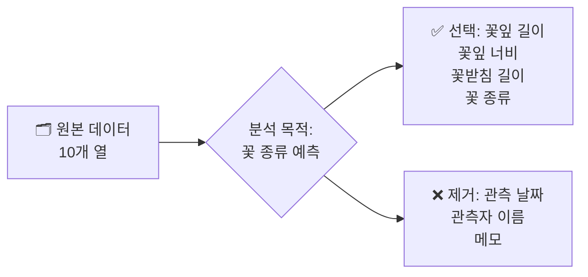
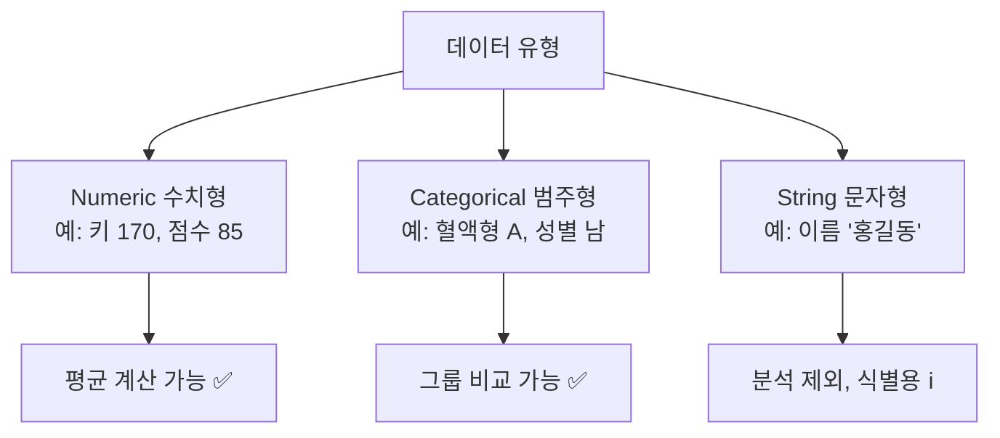
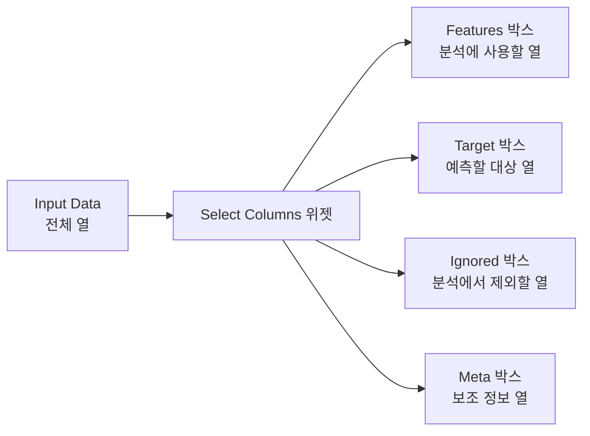
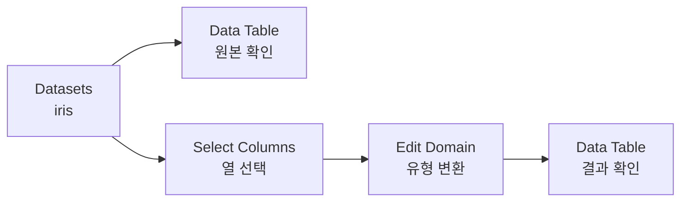
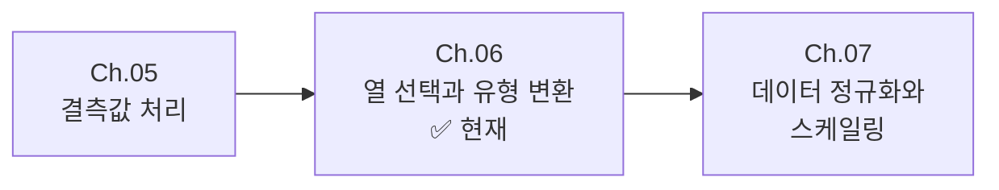

# Chapter 06. 데이터 다듬기 ② — 선택하고 변환하기

---

## 🎯 이 장에서 배우는 것

- [ ] 분석 목적에 맞게 필요한 열(속성)을 선택하고 불필요한 열을 제거할 수 있다.
- [ ] 오렌지3의 **Select Columns** 위젯으로 열을 골라내고 순서를 정리할 수 있다.
- [ ] 오렌지3의 **Edit Domain** 위젯으로 데이터 유형을 확인하고 변환할 수 있다.
- [ ] 전처리 전후 데이터를 Data Table에서 나란히 비교하여 달라진 점을 설명할 수 있다.

---

## 💡 왜 이걸 배우나요?

학교 급식 메뉴를 조사한다고 상상해 보세요. 설문지에는 "이름, 학번, 좋아하는 메뉴, 알레르기 여부, 오늘 날짜, 설문 담당 선생님 이름" 등 여러 항목이 담겨 있습니다. 그런데 막상 **"어떤 메뉴가 가장 인기 있나?"** 를 분석하려면 **"좋아하는 메뉴"** 열 하나만 있으면 충분합니다. 나머지는 분석을 복잡하게 만들 뿐이죠.

실제 데이터도 마찬가지입니다. 수십 개의 열 중 분석에 정말 필요한 것만 골라내지 않으면 컴퓨터가 엉뚱한 열을 학습에 사용하거나, 처리 속도가 느려지고, 결과 해석이 어려워집니다.

> **핵심 메시지**: 좋은 데이터 분석은 데이터를 '많이' 쓰는 것이 아니라 '필요한 것만 잘 골라' 쓰는 것입니다.

이 장에서는 오렌지3 도구와 파이썬 코드를 함께 사용해서 **열을 선택하고 데이터 유형을 변환**하는 방법을 익힙니다.

---

## 📚 핵심 개념

### 개념 1: 열(Column)과 속성(Feature)

**🧺 비유로 시작**

마트 장바구니를 생각해보세요. 진열대에는 수백 가지 상품이 있지만, 오늘의 목적(예: 파스타 만들기)에 맞는 재료만 담습니다. 데이터에서 **열(Column)** 은 바로 이 '상품'에 해당합니다. 분석 목적에 맞는 열만 골라 담는 행위가 **열 선택(Feature Selection)** 입니다.

**📖 정확한 정의**

- **열(Column)**: 데이터 표의 세로 방향 항목. 하나의 특성(속성)을 나타냅니다.
- **행(Row)**: 데이터 표의 가로 방향 항목. 하나의 관측값(데이터 한 건)을 나타냅니다.
- **속성(Feature/Attribute)**: 분석에 사용되는 열. 머신러닝에서는 **Feature**, 통계에서는 **변수(Variable)** 라고도 부릅니다.

**🔍 예시로 확인**

아래 구조를 살펴보세요.



---

### 개념 2: 데이터 유형(Data Type)

**🎭 비유로 시작**

배우가 역할에 따라 다른 옷을 입듯, 데이터도 **유형(Type)** 에 따라 다르게 다뤄야 합니다. 키(170cm)는 숫자로 계산할 수 있지만, 혈액형(A, B, O, AB)은 숫자로 더하거나 빼는 것이 말이 안 되죠.

**📖 정확한 정의**

오렌지3에서 사용하는 주요 데이터 유형은 다음과 같습니다.

- **Numeric(수치형)**: 숫자 데이터. 키, 몸무게, 나이처럼 계산이 가능합니다.
- **Categorical(범주형)**: 종류를 나타내는 데이터. 성별, 혈액형, 학년처럼 그룹을 구분합니다.
- **String(문자형)**: 자유로운 텍스트. 이름, 메모처럼 분석보다 식별 목적으로 씁니다.

**🔍 예시로 확인**



> **⚠️ 알아보기**: 숫자처럼 보여도 범주형인 경우가 있습니다! 예를 들어 우편번호(12345)는 숫자이지만 더하거나 평균을 내는 것이 의미가 없습니다. 이럴 때는 **Categorical로 변환**해야 합니다.

---

### 개념 3: Select Columns 위젯

**🛒 비유로 시작**

오렌지3의 **Select Columns**는 슈퍼마켓 계산대 컨베이어 벨트입니다. 장바구니(전체 열)에서 필요한 상품만 꺼내 계산대(분석 흐름)에 올려놓는 역할을 합니다.

**📖 정확한 정의**

Select Columns 위젯은 데이터에서 **사용할 열과 제외할 열을 직접 드래그해서 정리**하는 도구입니다. 또한 어떤 열을 **목표(Target)** 으로 쓸지, 어떤 열을 **속성(Feature)** 으로 쓸지도 지정합니다.

**위젯 내부 구조**



---

### 개념 4: Edit Domain 위젯

**🔧 비유로 시작**

**Edit Domain**은 데이터의 '신분증'을 수정하는 도구입니다. 숫자형으로 잘못 등록된 우편번호를 범주형으로 바꾸거나, 범주형 값의 이름(레이블)을 더 이해하기 쉽게 변경할 수 있습니다.

**📖 정확한 정의**

Edit Domain 위젯은 **각 열의 데이터 유형과 값 이름을 수정**하는 도구입니다. 원본 데이터를 바꾸지 않고, 오렌지3 분석 흐름 안에서만 변경이 적용됩니다.

**주요 기능**

- **Numeric → Categorical**: 숫자로 입력된 범주 변수를 범주형으로 변환
- **Categorical → Numeric**: 점수처럼 범주로 입력된 숫자를 수치형으로 변환
- **값 이름 변경**: `0 → 남성`, `1 → 여성` 처럼 코드를 이해하기 쉬운 이름으로 변경

---

## 🔨 따라하기

> **준비물**: 오렌지3 설치 완료, iris 데이터셋(오렌지3 내장)

### Step 1: 오렌지3 실행 후 데이터 불러오기

1. 오렌지3를 실행합니다.
2. 왼쪽 위젯 목록에서 **Data** 카테고리를 클릭합니다.
3. **Datasets** 위젯을 캔버스로 드래그합니다.
4. Datasets 위젯을 더블클릭하여 열고, 검색창에 **`iris`** 를 입력합니다.
5. **iris** 데이터셋을 선택하고 **Send** 버튼을 누릅니다.

> **생각해보기**: iris 데이터는 붓꽃 150송이의 꽃잎·꽃받침 크기와 종류가 담긴 유명한 학습용 데이터입니다. 총 5개의 열이 있습니다.

---

### Step 2: Data Table로 원본 데이터 확인하기

1. **Data** 카테고리에서 **Data Table** 위젯을 캔버스로 드래그합니다.
2. Datasets 위젯의 출력 포트를 Data Table의 입력 포트에 **연결**합니다.
3. Data Table을 더블클릭하여 열고, 5개의 열을 확인합니다.

**iris 데이터 열 목록**

- **sepal length**: 꽃받침 길이 (수치형)
- **sepal width**: 꽃받침 너비 (수치형)
- **petal length**: 꽃잎 길이 (수치형)
- **petal width**: 꽃잎 너비 (수치형)
- **iris**: 붓꽃 종류 (범주형) ← 예측 목표

> **정리하기**: 전처리를 시작하기 전에 항상 원본 데이터를 먼저 확인하는 습관을 가지세요. 몇 개의 행과 열이 있는지, 어떤 유형인지 파악하는 것이 첫 번째 단계입니다.

---

### Step 3: Select Columns로 필요한 열만 선택하기

**시나리오**: 이번 분석에서는 **꽃잎(petal)** 정보만으로 붓꽃 종류를 예측해보려 합니다. 꽃받침(sepal) 관련 열은 제외합니다.

1. **Data** 카테고리에서 **Select Columns** 위젯을 캔버스로 드래그합니다.
2. Datasets 위젯의 출력을 Select Columns의 입력에 **연결**합니다.
3. Select Columns를 더블클릭하여 엽니다.
4. 왼쪽 **Features** 목록에서 `sepal length`와 `sepal width`를 선택합니다.
5. 아래쪽 **Ignored** 박스로 **드래그**하여 이동시킵니다.
6. `iris` 열을 **Target** 박스로 드래그합니다.
7. **Apply** 버튼을 클릭합니다.

**결과 확인**: Features에는 `petal length`, `petal width`만 남고, Target에는 `iris`가 위치해야 합니다.

---

### Step 4: Edit Domain으로 데이터 유형 확인·변환하기

**시나리오**: 실제 데이터에서는 학년(1, 2, 3학년)이 숫자로 입력되어 있는 경우가 많습니다. Edit Domain으로 이를 범주형으로 바꾸는 방법을 실습합니다.

> **참고**: iris 데이터는 이미 유형이 잘 설정되어 있어서, 아래는 **연습 목적**으로 petal length를 범주형으로 바꿨다가 다시 되돌리는 과정을 체험합니다.

1. **Data** 카테고리에서 **Edit Domain** 위젯을 캔버스로 드래그합니다.
2. Select Columns의 출력을 Edit Domain의 입력에 **연결**합니다.
3. Edit Domain을 더블클릭하여 엽니다.
4. 왼쪽 목록에서 **`petal length`** 를 클릭합니다.
5. 오른쪽 패널에서 **Type** 드롭다운을 `Numeric`에서 `Categorical`로 변경합니다.
6. **Apply** 버튼을 클릭합니다.
7. 변화를 확인한 후, **다시 `Numeric`으로 되돌리고** Apply를 누릅니다.

> **알아보기**: Edit Domain에서 **Reset** 버튼을 누르면 원래 상태로 돌아갑니다. 잘못 변경해도 걱정할 필요가 없습니다!

---

### Step 5: 전처리 전후 비교하기

전처리 결과가 올바른지 확인하는 단계입니다.

1. **Data Table** 위젯을 하나 더 드래그합니다.
2. Edit Domain의 출력을 새 Data Table에 **연결**합니다.
3. 두 개의 Data Table을 나란히 열어 비교합니다.

**비교 포인트**

- **원본 Data Table**: 열 5개 (sepal length, sepal width, petal length, petal width, iris)
- **전처리 후 Data Table**: 열 3개 (petal length, petal width, iris)
- 상단에 각 열의 아이콘(🔢 수치형, 🏷️ 범주형)이 올바르게 표시되는지 확인

**현재 오렌지3 워크플로우 구조**



---

### Step 6: 워크플로우 저장하기

1. 메뉴에서 **File → Save As**를 선택합니다.
2. 파일 이름을 `chapter06_select_columns.ows`로 저장합니다.

> **정리하기**: `.ows` 파일은 오렌지3의 워크플로우 파일입니다. 나중에 열면 모든 위젯 연결과 설정이 그대로 복원됩니다.

---

## 📝 전체 코드

오렌지3 위젯으로 한 작업을 파이썬 코드로도 수행할 수 있습니다. 아래 코드를 복사하여 Jupyter Notebook이나 Python 파일에서 실행해 보세요.

```python
# 필요한 라이브러리 불러오기
import pandas as pd
from sklearn.datasets import load_iris

# ① 데이터 불러오기
iris_data = load_iris()
df = pd.DataFrame(iris_data.data, columns=iris_data.feature_names)
df['iris'] = iris_data.target  # 0, 1, 2로 표시되는 붓꽃 종류

print("=== 원본 데이터 ===")
print(f"행: {df.shape[0]}개, 열: {df.shape[1]}개")
print(df.head(3))
print()
print("=== 열별 데이터 유형 ===")
print(df.dtypes)
```

```python
# ② Select Columns: 필요한 열만 선택
selected_columns = ['petal length (cm)', 'petal width (cm)', 'iris']
df_selected = df[selected_columns]

print("=== 열 선택 후 ===")
print(f"행: {df_selected.shape[0]}개, 열: {df_selected.shape[1]}개")
print(df_selected.head(3))
```

```python
# ③ Edit Domain: 데이터 유형 변환
# iris 열(0, 1, 2 숫자)을 범주형으로 변환
df_selected = df_selected.copy()
df_selected['iris'] = df_selected['iris'].astype('category')

# 범주 이름 지정 (0→setosa, 1→versicolor, 2→virginica)
category_names = {0: 'setosa', 1: 'versicolor', 2: 'virginica'}
df_selected['iris'] = df_selected['iris'].map(category_names)

print("=== 유형 변환 후 ===")
print(df_selected.dtypes)
print()
print(df_selected.head(5))
```

```python
# ④ 전처리 전후 비교
print("=== 전처리 전 ===")
print(f"열 목록: {list(df.columns)}")
print(f"데이터 유형:\n{df.dtypes}\n")

print("=== 전처리 후 ===")
print(f"열 목록: {list(df_selected.columns)}")
print(f"데이터 유형:\n{df_selected.dtypes}")
```

**예상 출력**

```
=== 전처리 전 ===
열 목록: ['sepal length (cm)', 'sepal width (cm)', 'petal length (cm)', 'petal width (cm)', 'iris']

=== 전처리 후 ===
열 목록: ['petal length (cm)', 'petal width (cm)', 'iris']
petal length (cm)     float64
petal width (cm)      float64
iris                   object
```

---

## ⚠️ 자주 하는 실수

**실수 1: 목표(Target) 열을 Features에 남겨두기**

예측하려는 값(예: 붓꽃 종류 `iris`)을 Features 박스에 그대로 두면, 컴퓨터가 "정답을 보고 정답을 맞추는" 상황이 됩니다. 실제 세계에서는 정답을 모르기 때문에 이 모델은 쓸모가 없어집니다.

✅ **해결**: 예측 목표 열은 반드시 **Target 박스**로 이동하세요.

---

**실수 2: 유형 변환 후 Apply 버튼을 누르지 않기**

Edit Domain에서 유형을 바꾸고 Apply를 클릭하지 않으면 변경 사항이 적용되지 않습니다. 위젯 창을 닫을 때도 변경이 저장되지 않을 수 있습니다.

✅ **해결**: 유형을 변경할 때마다 **반드시 Apply 버튼**을 클릭하세요.

---

**실수 3: 숫자처럼 보이는 범주형 변수를 Numeric으로 방치하기**

학년(1, 2, 3), 반(1, 2, 3, 4)처럼 숫자로 된 범주형 데이터를 수치형으로 두면, 분석 모델이 "3학년이 1학년보다 3배 더 크다"는 엉뚱한 해석을 합니다.

✅ **해결**: 계산 의미 없는 숫자 변수는 **Edit Domain에서 Categorical로 변환**하세요.

---

**실수 4: 열을 너무 많이 제거하기**

"적을수록 좋다"는 생각에 열을 과도하게 줄이면, 분석에 실제로 필요한 정보까지 잃을 수 있습니다.

✅ **해결**: 제거 전에 항상 "이 열이 분석 목적과 정말 무관한가?"를 스스로에게 질문하세요.

---

## ✅ 스스로 점검하기

아래 질문에 답할 수 있다면 이 장의 내용을 잘 이해한 것입니다.

**기본 확인 문제**

**Q1.** 다음 중 **범주형(Categorical)** 으로 저장해야 하는 데이터는 무엇인가요?

- ① 키 (단위: cm)
- ② 체온 (단위: °C)
- ③ 혈액형 (A, B, O, AB)
- ④ 몸무게 (단위: kg)

> 정답: ③ — 혈액형은 그룹을 나타낼 뿐, 더하거나 평균을 내는 것이 의미가 없습니다.

---

**Q2.** Select Columns 위젯에서 분석에 사용하지 않을 열은 어느 박스로 이동해야 하나요?

> 정답: **Ignored** 박스

---

**Q3.** 아래 전처리 단계를 올바른 순서로 나열하세요.

- (가) Edit Domain으로 데이터 유형 확인 및 변환
- (나) Data Table로 원본 데이터 확인
- (다) Select Columns로 필요한 열 선택
- (라) Data Table로 전처리 결과 확인

> 정답: **나 → 다 → 가 → 라**

---

**응용 문제**

**Q4.** 학생 성적 데이터에 다음 열이 있습니다.

- 학번, 이름, 국어 점수, 수학 점수, 영어 점수, 결석 횟수, 담임 선생님 이름

**"수학 점수가 높은 학생의 특징을 파악하는 분석"** 을 한다면, 어느 열을 Features로, 어느 열을 Target으로, 어느 열을 Ignored로 설정해야 할까요? 이유도 함께 써보세요.

---

## 🚀 더 해보기

**도전 문제: 나만의 열 선택 이유 쓰기**

아래 조건에 따라 직접 실습해보세요.

1. 오렌지3에서 **Datasets** 위젯으로 `titanic` 데이터셋을 불러옵니다.
2. Data Table을 연결해 어떤 열들이 있는지 확인합니다.
3. **"타이타닉 생존자 예측"** 이라는 분석 목적에 맞게, 아래 작업을 수행합니다.
   - Select Columns에서 **분석에 사용할 열 3개** 를 Features로 선택합니다.
   - **예측 목표** 열(생존 여부)을 Target으로 지정합니다.
   - 나머지는 Ignored로 이동합니다.
4. 선택한 3개의 열과 **선택 이유**를 직접 노트에 적어보세요.

**예시 형식**

- **선택한 열**: `age`, `pclass`, `sex`
- **선택 이유**: 나이, 객실 등급, 성별이 생존 여부에 영향을 미쳤을 것으로 예상하기 때문입니다.

> **힌트**: 정답은 없습니다. 중요한 것은 **"왜 이 열이 필요한가?"** 를 스스로 설명할 수 있는 것입니다.

---

## 🔗 다음 장으로

이 장에서는 데이터에서 **필요한 열을 선택**하고, **데이터 유형을 올바르게 변환**하는 방법을 배웠습니다.



다음 장인 **Chapter 07 — 데이터 정규화와 스케일링**에서는, 잘 골라낸 데이터의 **숫자 범위를 통일**하는 방법을 배웁니다. 키(cm)와 몸무게(kg)처럼 단위가 다른 데이터를 같은 기준으로 맞추지 않으면 분석 결과가 왜곡될 수 있습니다. 다음 장에서 그 이유와 해결법을 알아봅시다!

---

> **📌 핵심 개념 정리**
>
> - **열 선택**: 분석 목적에 맞는 열만 골라 불필요한 정보를 제거하는 과정
> - **데이터 유형**: Numeric(수치형), Categorical(범주형), String(문자형)으로 구분
> - **Select Columns**: Features / Target / Ignored / Meta 박스로 열 역할을 지정하는 오렌지3 위젯
> - **Edit Domain**: 데이터 유형을 변환하고 값 이름을 수정하는 오렌지3 위젯
> - **전처리 순서**: 원본 확인 → 열 선택 → 유형 변환 → 결과 확인