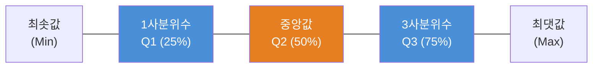
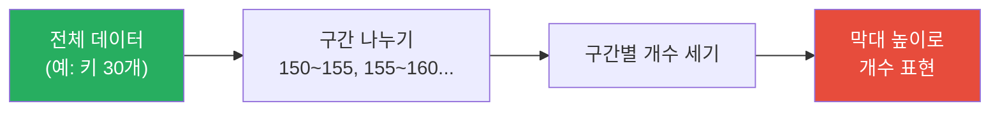
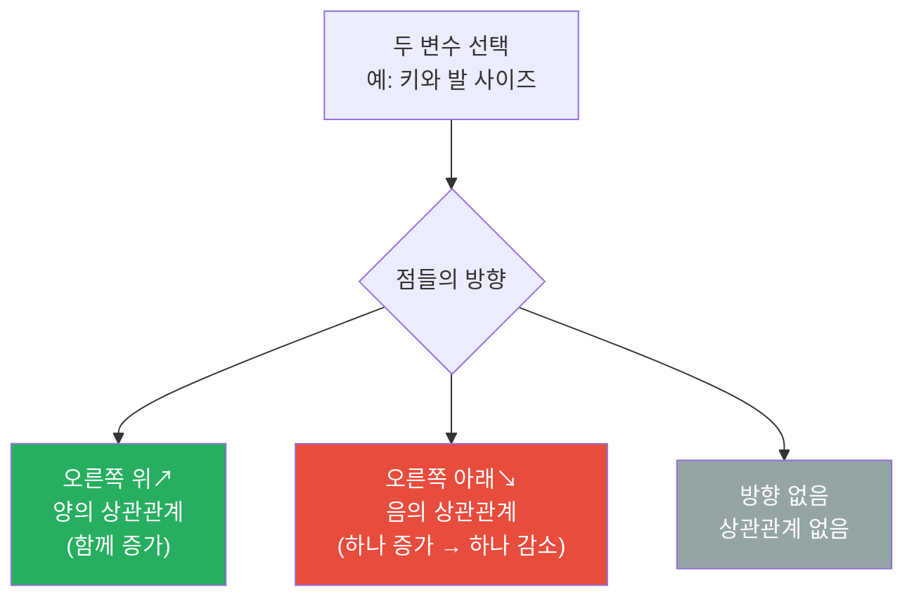
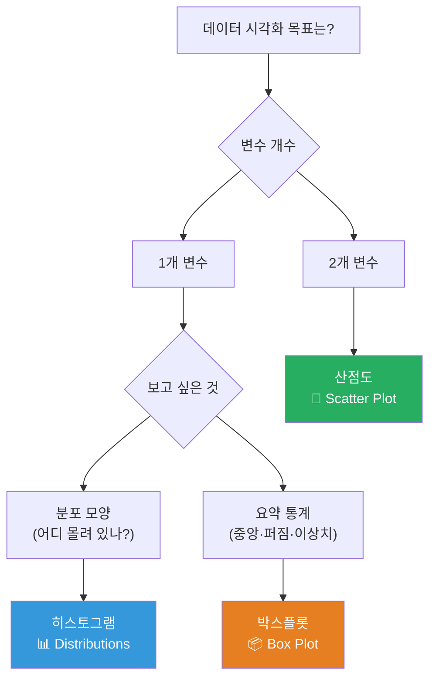
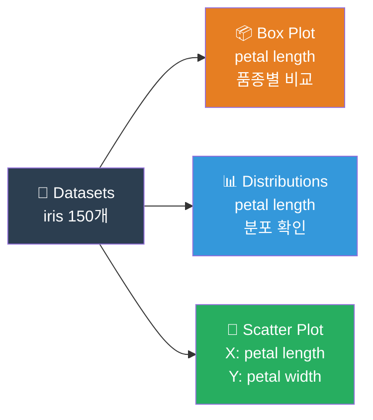

# Chapter 07. 데이터를 그림으로 ① - 기본 차트 마스터

**Part 4 | [2권] 데이터 시각화 - 그림으로 말하기**

---

## 🎯 이 장에서 배우는 것

- [ ] 박스플롯, 히스토그램, 산점도가 각각 어떤 상황에 적합한지 구분하여 설명할 수 있다.
- [ ] 오렌지3에서 Box Plot, Distributions, Scatter Plot 위젯을 연결하여 데이터를 시각화할 수 있다.
- [ ] 시각화 결과를 보고 데이터의 분포와 변수 간 관계를 자신의 말로 해석할 수 있다.
- [ ] matplotlib을 사용한 파이썬 코드로 세 가지 기본 차트를 직접 그릴 수 있다.

---

## 💡 왜 이걸 배우나요?

여러분 반 친구들의 키 데이터가 있다고 생각해 보세요. 숫자 30개가 쭉 나열된 표를 눈으로 훑으면 "음... 대충 160cm 근처가 많은 것 같은데?" 정도밖에 파악하기 어렵습니다.

그런데 같은 데이터를 그래프로 그리면 어떨까요?

> "150cm 이하가 5명, 160~170cm 구간에 몰려 있고, 180cm 이상인 친구가 2명 있네. 그리고 딱 한 명이 유난히 작거나 크게 튀어나와 있어."

이렇게 **데이터의 이야기**가 한눈에 들어옵니다. 숫자를 그림으로 바꾸는 순간, 숨어 있던 패턴이 모습을 드러냅니다.

데이터 분석가들은 새로운 데이터를 받으면 가장 먼저 이 작업을 합니다. 표를 읽기 전에 그래프부터 그립니다. 그 이유를 이번 챕터에서 직접 경험해 봅시다.

---

## 📚 핵심 개념

### 개념 1: 박스플롯 (Box Plot) - 데이터를 5개 숫자로 요약하다

#### 비유로 시작

반 아이들이 모두 키 순서대로 일렬로 서 있다고 상상해 보세요. 맨 앞(가장 작은 아이)부터 맨 뒤(가장 큰 아이)까지 쭉 줄을 섰습니다. 이제 다음을 관찰합니다.

- **가장 앞**: 제일 작은 아이 (최솟값)
- **앞에서 25% 지점**: 앞에서 4분의 1 지점에 선 아이 (1사분위수, Q1)
- **정중앙**: 딱 가운데 선 아이 (중앙값, Q2)
- **앞에서 75% 지점**: 앞에서 4분의 3 지점에 선 아이 (3사분위수, Q3)
- **가장 뒤**: 제일 큰 아이 (최댓값)

박스플롯은 이 5개 지점을 그림으로 그린 것입니다.

#### 정확한 정의

박스플롯(상자 수염 그림)은 데이터의 **분포와 퍼짐 정도**를 5가지 통계값으로 요약하는 차트입니다. 사각형 "상자"와 상자 위아래로 뻗은 "수염"으로 구성됩니다.



**핵심 용어 정리**

- **IQR (사분위 범위)**: Q3 - Q1, 상자의 세로 길이. 중간 50% 데이터가 퍼진 범위
- **이상치(Outlier)**: IQR의 1.5배를 벗어난 값. 수염 밖에 점으로 표시됨

#### 예시로 확인

> 🧠 **알아보기**: 박스가 크면 데이터가 넓게 퍼져 있다는 뜻이고, 박스가 작으면 데이터가 중앙값 근처에 모여 있다는 뜻입니다. 중앙값 선이 상자의 위쪽에 치우쳐 있으면 낮은 값들이 촘촘하고, 아래쪽에 치우쳐 있으면 높은 값들이 촘촘한 것입니다.

**박스플롯이 특히 유용한 상황**
- 여러 그룹(예: 반별, 성별)을 **나란히 비교**할 때
- 이상치(튀는 값)가 있는지 **빠르게 확인**할 때
- 데이터의 **중앙값과 퍼짐**을 동시에 보고 싶을 때

---

### 개념 2: 히스토그램 (Histogram) - 데이터가 어디에 얼마나 모여 있나

#### 비유로 시작

학교 앞 문구점에서 하루 동안 팔린 물건들의 가격 데이터가 있습니다. 500원짜리 지우개도 있고, 2000원짜리 공책도 있고, 5000원짜리 파일도 있습니다. "가격대별로 몇 개씩 팔렸을까?"를 보고 싶다면 어떻게 할까요?

500원~999원 구간에 막대 하나, 1000원~1999원 구간에 막대 하나, 이런 식으로 구간별로 막대를 세우면 됩니다. 이것이 히스토그램입니다.

#### 정확한 정의

히스토그램은 **연속형 수치 데이터**를 일정 구간(bin)으로 나누어 각 구간에 속한 데이터 개수를 막대 높이로 표현한 차트입니다.



**막대그래프와 히스토그램의 차이**

히스토그램을 처음 보면 막대그래프와 헷갈리기 쉽습니다.

- **막대그래프**: 막대와 막대 사이에 **간격이 있음**, 카테고리형 데이터(국어·수학·영어 점수처럼 분리된 항목)
- **히스토그램**: 막대와 막대가 **딱 붙어 있음**, 연속형 데이터(키, 온도, 시간처럼 연결된 값)

#### 예시로 확인

> 🧠 **알아보기**: 히스토그램의 모양을 보면 데이터의 "성격"을 알 수 있습니다.
> - **종 모양(정규분포)**: 중앙에 몰려 있고 양쪽이 대칭 → 자연스러운 분포
> - **왼쪽으로 치우침**: 높은 값이 많고 낮은 값이 드문드문
> - **오른쪽으로 치우침**: 낮은 값이 많고 높은 값이 드문드문
> - **두 개의 봉우리**: 두 그룹이 섞여 있을 가능성

**히스토그램이 특히 유용한 상황**
- 데이터의 **전체적인 분포 모양**을 파악할 때
- **어느 값이 가장 많이 나타나는지** 확인할 때
- 데이터가 **정규분포**를 따르는지 대략 확인할 때

---

### 개념 3: 산점도 (Scatter Plot) - 두 변수는 사이좋게 움직이나?

#### 비유로 시작

여러분 반 친구들의 키와 발 사이즈 데이터가 있다고 합시다. "키가 크면 발도 클까?"라는 궁금증이 생겼습니다. 이걸 확인하는 가장 직관적인 방법은 각 친구를 점 하나로 찍는 것입니다.

- 가로축(X축): 키
- 세로축(Y축): 발 사이즈
- 친구 한 명 = 점 하나

30명을 모두 찍으면 점들이 어떤 방향으로 모여 있는지 보입니다. 오른쪽 위 방향으로 몰려 있다면 "키가 클수록 발도 크다"는 이야기입니다.

#### 정확한 정의

산점도는 두 개의 수치형 변수를 X축과 Y축으로 설정하고, 각 데이터 포인트를 평면 위의 점으로 표시하는 차트입니다. 두 변수 사이의 **관계(상관관계)** 를 시각적으로 파악하는 데 사용합니다.



#### 예시로 확인

> 🧠 **알아보기**: 점들이 일직선에 가깝게 모여 있을수록 상관관계가 **강하고**, 사방으로 흩어져 있을수록 **약합니다**. 산점도만으로 "원인과 결과"는 알 수 없고, 오직 "함께 변하는지"만 알 수 있다는 점을 기억하세요.

**산점도가 특히 유용한 상황**
- 두 변수 사이에 **관계가 있는지** 탐색할 때
- **이상치(특이한 점)**를 시각적으로 찾을 때
- 여러 그룹을 **색으로 구분**해서 패턴을 비교할 때

---

### 개념 4: 세 가지 차트, 어떻게 고를까?

> 💡 **생각해보기**: "어떤 차트를 써야 할지 모르겠어요!" 라는 고민, 당연합니다. 아래 흐름도를 기억하면 대부분의 상황에서 올바른 선택을 할 수 있습니다.



---

## 🔨 따라하기

오렌지3와 파이썬 matplotlib을 모두 사용해봅니다. 오렌지3는 코딩 없이 시각화를 체험하고, 파이썬 코드는 직접 커스터마이징하는 방법을 익히는 데 활용합니다.

**사용할 데이터**: `iris` 데이터셋 (붓꽃 150송이의 꽃잎 길이·너비 등 4가지 수치, 3가지 품종)

---

### Step 1: 오렌지3 — 데이터 불러오기

1. 오렌지3를 실행합니다.
2. 왼쪽 위젯 패널에서 **Data** 탭을 클릭합니다.
3. **Datasets** 위젯을 캔버스로 드래그합니다.
4. Datasets 위젯을 더블클릭하고 검색창에 `iris`를 입력합니다.
5. `iris` 데이터셋을 선택한 뒤 **Send** 버튼을 클릭합니다.

> ✅ **확인**: 위젯 아래쪽에 `150 instances, 5 features`라고 표시되면 성공입니다.

---

### Step 2: 오렌지3 — Box Plot으로 박스플롯 그리기

1. **Visualize** 탭에서 **Box Plot** 위젯을 캔버스로 드래그합니다.
2. Datasets 위젯의 출력 포트(오른쪽 점)에서 Box Plot 위젯의 입력 포트(왼쪽 점)로 선을 연결합니다.
3. Box Plot 위젯을 더블클릭하여 설정창을 엽니다.
4. **Variable** 항목에서 `petal length`를 선택합니다.
5. **Subgroups** 항목에서 `iris`(품종)를 선택합니다.

> ✅ **확인**: 세 품종(setosa, versicolor, virginica)의 박스플롯이 나란히 그려지면 성공입니다. setosa의 상자가 월등히 작고 낮은 위치에 있음을 확인하세요.

---

### Step 3: 오렌지3 — Distributions로 히스토그램 그리기

1. **Visualize** 탭에서 **Distributions** 위젯을 캔버스로 드래그합니다.
2. Datasets 위젯과 Distributions 위젯을 연결합니다.
3. Distributions 위젯을 더블클릭합니다.
4. **Variable** 항목에서 `petal length`를 선택합니다.
5. **Group by** 항목에서 `iris`를 선택합니다.

> ✅ **확인**: 히스토그램이 두 개의 봉우리를 가진 모양(setosa 그룹과 나머지 두 그룹이 분리)으로 나타나면 성공입니다.

---

### Step 4: 오렌지3 — Scatter Plot으로 산점도 그리기

1. **Visualize** 탭에서 **Scatter Plot** 위젯을 캔버스로 드래그합니다.
2. Datasets 위젯과 Scatter Plot 위젯을 연결합니다.
3. Scatter Plot 위젯을 더블클릭합니다.
4. **X 축**에 `petal length`, **Y 축**에 `petal width`를 설정합니다.
5. **Color** 항목에서 `iris`를 선택합니다.

> ✅ **확인**: 세 가지 색의 점 무리가 왼쪽 아래(setosa), 중간(versicolor), 오른쪽 위(virginica)로 나뉘어 오른쪽 위 방향으로 배열되면 성공입니다. 꽃잎 길이와 너비가 강한 양의 상관관계를 보이는 것을 확인하세요.

---

### Step 5: 완성된 오렌지3 워크플로우 확인

세 위젯을 모두 연결한 전체 구조는 다음과 같습니다.



---

### Step 6: 파이썬 matplotlib으로 직접 그려보기

오렌지3로 클릭만으로 그린 차트를 이번엔 파이썬 코드로 직접 그려봅니다. 아래 코드를 복사해서 실행해보세요.

---

## 📝 전체 코드

```python
import matplotlib.pyplot as plt
from sklearn.datasets import load_iris
import pandas as pd

# 데이터 불러오기
iris = load_iris()
df = pd.DataFrame(iris.data, columns=iris.feature_names)
df['species'] = [iris.target_names[i] for i in iris.target]

# 한글 깨짐 방지 (윈도우 사용 시)
plt.rcParams['axes.unicode_minus'] = False

# ─────────────────────────────────────────
# 그림 1: 박스플롯 - 품종별 꽃잎 길이 비교
# ─────────────────────────────────────────
fig, ax = plt.subplots(figsize=(7, 5))

species_list = df['species'].unique()
data_by_species = [df[df['species'] == s]['petal length (cm)'].values
                   for s in species_list]

ax.boxplot(data_by_species, labels=species_list)
ax.set_title('품종별 꽃잎 길이 - 박스플롯')
ax.set_xlabel('품종')
ax.set_ylabel('꽃잎 길이 (cm)')
plt.tight_layout()
plt.savefig('boxplot.png', dpi=100)
plt.show()

# ─────────────────────────────────────────
# 그림 2: 히스토그램 - 꽃잎 길이 전체 분포
# ─────────────────────────────────────────
fig, ax = plt.subplots(figsize=(7, 5))

colors = ['#E74C3C', '#3498DB', '#27AE60']
for species, color in zip(species_list, colors):
    subset = df[df['species'] == species]['petal length (cm)']
    ax.hist(subset, bins=10, alpha=0.6, color=color, label=species)

ax.set_title('꽃잎 길이 분포 - 히스토그램')
ax.set_xlabel('꽃잎 길이 (cm)')
ax.set_ylabel('개수')
ax.legend()
plt.tight_layout()
plt.savefig('histogram.png', dpi=100)
plt.show()

# ─────────────────────────────────────────
# 그림 3: 산점도 - 꽃잎 길이 vs 꽃잎 너비
# ─────────────────────────────────────────
fig, ax = plt.subplots(figsize=(7, 5))

for species, color in zip(species_list, colors):
    subset = df[df['species'] == species]
    ax.scatter(subset['petal length (cm)'],
               subset['petal width (cm)'],
               color=color, label=species, alpha=0.7)

ax.set_title('꽃잎 길이 vs 꽃잎 너비 - 산점도')
ax.set_xlabel('꽃잎 길이 (cm)')
ax.set_ylabel('꽃잎 너비 (cm)')
ax.legend()
plt.tight_layout()
plt.savefig('scatterplot.png', dpi=100)
plt.show()
```

**코드 실행 전 설치 확인**

터미널에서 아래 명령어로 필요한 라이브러리를 설치하세요.

```bash
pip install matplotlib scikit-learn pandas
```

> 💡 **코드 해설 포인트**
> - `alpha=0.6` → 투명도를 60%로 설정, 겹치는 막대나 점이 비쳐 보임
> - `labels=species_list` → 박스플롯의 X축에 품종 이름 표시
> - `plt.savefig(...)` → 차트를 이미지 파일로 저장 (제출 시 활용 가능)

---

## ⚠️ 자주 하는 실수

**실수 1: 오렌지3에서 위젯 연결 포트 방향을 반대로 연결한다**

위젯의 왼쪽 포트는 **입력**, 오른쪽 포트는 **출력**입니다. 데이터는 왼쪽에서 오른쪽으로 흐릅니다. Datasets(출력) → Box Plot(입력) 방향으로 연결해야 합니다. 반대로 연결하면 데이터가 전달되지 않아 차트가 비어 있게 됩니다.

**실수 2: 히스토그램과 막대그래프를 혼동한다**

히스토그램은 막대가 **서로 붙어 있고**, 연속형 수치 데이터(키, 온도, 점수)에 사용합니다. 막대그래프는 막대 사이에 **간격이 있고**, 카테고리형 데이터(품종, 지역, 과목)에 사용합니다. matplotlib에서도 히스토그램은 `ax.hist()`, 막대그래프는 `ax.bar()`로 함수가 다릅니다.

**실수 3: 산점도에서 "상관관계 = 인과관계"로 해석한다**

점들이 오른쪽 위 방향으로 모여 있어도, 그것은 단지 "두 값이 함께 변하는 경향이 있다"는 것일 뿐입니다. "A가 B를 일으킨다"는 뜻이 아닙니다. 예를 들어 아이스크림 판매량과 익사 사고 건수는 양의 상관관계를 보이지만, 아이스크림이 익사를 일으키는 것은 아닙니다(더운 날씨라는 공통 원인이 있음).

**실수 4: 박스플롯의 수염 끝을 최댓값/최솟값으로 오해한다**

박스플롯의 수염 끝은 **이상치를 제외한** 최댓값/최솟값입니다. 수염 밖에 따로 찍힌 점들이 이상치입니다. 수염 끝 = 절대 최솟값/최댓값이라고 외우면 틀립니다.

---

## ✅ 스스로 점검하기

**기본 문제**

**Q1.** 다음 상황에 가장 적합한 차트를 고르세요.

- 상황 A: 학생 50명의 수학 점수가 어느 구간에 얼마나 분포하는지 보고 싶다.
- 상황 B: 학생들의 공부 시간과 시험 점수 사이에 관계가 있는지 보고 싶다.
- 상황 C: 남학생과 여학생의 키를 중앙값과 퍼짐 정도로 비교하고 싶다.

**Q2.** 박스플롯에서 상자(박스)의 위아래 길이가 크다는 것은 무엇을 의미하나요?

- ① 데이터 개수가 많다
- ② 중간 50% 데이터가 넓게 퍼져 있다
- ③ 이상치가 많다
- ④ 평균값이 높다

**Q3.** 히스토그램에서 봉우리가 두 개(쌍봉) 모양으로 나타났습니다. 이것은 어떤 상황을 의심할 수 있나요?

---

**응용 문제**

**Q4.** 파이썬 코드에서 `alpha=0.6`을 `alpha=1.0`으로 바꾸면 히스토그램이 어떻게 달라질지 예상하고, 실제로 코드를 수정해서 확인해 보세요.

**Q5.** 오렌지3 산점도에서 X축을 `sepal length`, Y축을 `sepal width`로 바꿔보세요. 꽃잎(petal) 데이터와 비교했을 때 상관관계가 더 강한가요, 약한가요? 이유를 두 줄로 설명해 보세요.

---

**정답 확인**

- Q1: A → 히스토그램, B → 산점도, C → 박스플롯
- Q2: ②
- Q3: 서로 다른 두 그룹(예: 두 품종)이 하나의 데이터셋에 섞여 있을 가능성

---

## 🚀 더 해보기 — 우리 반 데이터로 산점도 그리기

**도전 과제**: 우리 반 친구들의 키와 발 사이즈를 직접 수집해서 산점도로 그리고 관계를 해석해 보세요.

**Step 1: 데이터 수집**

반 친구들에게 (동의를 구한 후) 키(cm)와 발 사이즈(mm 또는 호)를