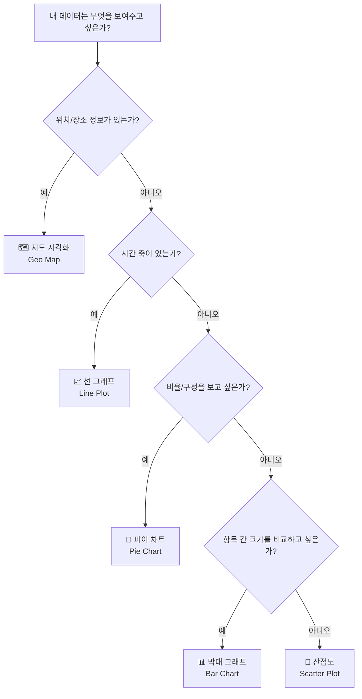
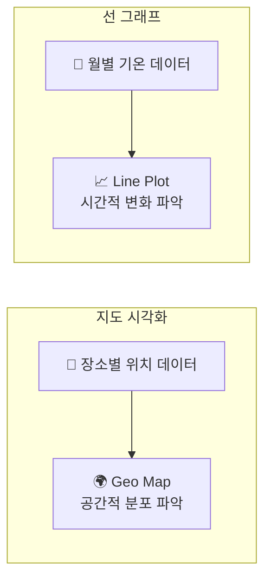

# Chapter 08. 데이터를 그림으로 ② — 지도와 시간 시각화

---

## 🎯 이 장에서 배우는 것

- [ ] 위치 정보가 포함된 데이터를 지도 위에 시각화할 수 있다
- [ ] 오렌지3 Geo Map 위젯을 사용하여 지리 데이터를 표현할 수 있다
- [ ] 시간에 따라 변화하는 데이터를 선 그래프(Line Plot)로 그릴 수 있다
- [ ] 데이터의 성격에 맞는 시각화 유형을 스스로 선택하고 그 이유를 설명할 수 있다

---

## 💡 왜 이걸 배우나요?

뉴스를 보다 보면 선거 결과를 지도 위에 색깔로 표시하거나, 코로나 확진자 수가 시간에 따라 오르내리는 그래프를 본 적이 있을 거예요. 이런 시각화들은 단순한 숫자 표보다 훨씬 빠르게 "어디에", "언제" 무슨 일이 일어났는지를 보여줍니다.

데이터가 담고 있는 이야기는 크게 두 가지 축에서 펼쳐집니다.

- **공간(어디서?)** — 위치와 지역에 관한 이야기
- **시간(언제?)** — 변화와 흐름에 관한 이야기

이번 장에서는 이 두 가지 축을 다루는 시각화를 직접 만들어 보면서, 내가 가진 데이터에 가장 잘 어울리는 그림을 고르는 눈을 키워봅니다.

> **생각해보기:** 우리 동네 편의점 위치를 그냥 주소 목록으로 보는 것과, 지도 위에 점으로 찍어 보는 것 중 어느 쪽이 더 많은 것을 알 수 있을까요? 왜 그럴까요?

---

## 📚 핵심 개념

### 개념 1: 지리 데이터와 지도 시각화

**비유로 시작**

보물찾기 지도를 떠올려 보세요. "북쪽으로 10걸음, 동쪽으로 5걸음"이라는 설명 대신, 지도 위에 X 표시 하나가 있으면 훨씬 쉽게 보물을 찾을 수 있죠. 데이터도 마찬가지입니다. 위도(latitude)와 경도(longitude)라는 좌표를 가진 데이터는, 표 안에 숫자로 있을 때보다 지도 위에 점으로 찍혔을 때 훨씬 많은 정보를 전달합니다.

**정확한 정의**

**지리 데이터(Geospatial Data)**란 위치 정보(위도·경도 또는 주소)를 포함하는 데이터를 말합니다. **지도 시각화(Map Visualization)**는 이런 데이터를 지도 위에 표현하는 방식으로, 점의 색깔이나 크기를 바꿔 추가 정보(예: 매출액, 인구수)까지 함께 나타낼 수 있습니다.

**예시로 확인**

아래는 지리 데이터의 예시입니다.

- **학교 이름**: 행복중학교 / **위도**: 37.5665 / **경도**: 126.9780 / **학생 수**: 850명
- **학교 이름**: 미래중학교 / **위도**: 37.4979 / **경도**: 127.0276 / **학생 수**: 620명
- **학교 이름**: 희망중학교 / **위도**: 37.5172 / **경도**: 127.0473 / **학생 수**: 1020명

이 데이터를 지도 위에 점으로 그리면, 학교들이 어느 지역에 몰려 있는지, 어느 학교의 학생 수가 많은지를 한눈에 볼 수 있습니다.

---

### 개념 2: 오렌지3 Geo Map 위젯

**비유로 시작**

오렌지3의 Geo Map 위젯은 내비게이션 앱과 비슷합니다. 내비게이션에 목적지 좌표를 입력하면 지도 위에 핀이 꽂히듯, Geo Map은 위도·경도 컬럼을 알려주면 자동으로 지도 위에 데이터를 그려줍니다.

**정확한 정의**

**Geo Map 위젯**은 오렌지3에서 지리 데이터를 인터랙티브 지도 위에 시각화해 주는 도구입니다. 데이터에 위도(Latitude)와 경도(Longitude) 컬럼이 있어야 사용할 수 있으며, 점의 색상과 크기를 다른 변수로 설정해 다차원 정보를 표현할 수 있습니다.

**핵심 설정 항목**

- **Latitude**: 위도 컬럼 지정
- **Longitude**: 경도 컬럼 지정
- **Color**: 점 색상으로 표현할 변수 (예: 카테고리, 수치)
- **Size**: 점 크기로 표현할 변수 (예: 매출액, 인구수)

---

### 개념 3: 시간 데이터와 선 그래프

**비유로 시작**

심장 박동 모니터를 본 적 있나요? 화면에 계속 선이 그려지면서 심장이 뛰는 리듬을 보여주죠. 선 그래프는 이것과 같습니다. 시간이 흐르면서 어떤 값이 어떻게 변했는지, 그 "흐름"을 선으로 연결해 보여주는 그래프입니다.

**정확한 정의**

**선 그래프(Line Plot)**는 x축에 시간(날짜, 월, 연도 등)을, y축에 측정값을 놓고, 각 시점의 값을 선으로 연결한 그래프입니다. 데이터가 시간 순서를 따라 연속적으로 변화할 때 사용하며, 상승·하락·반복 패턴을 파악하기에 적합합니다.

**선 그래프가 적합한 경우**

- 월별 평균 기온 변화
- 연도별 인구 증감
- 주간 판매량 추이
- 시간별 웹사이트 방문자 수

**선 그래프가 적합하지 않은 경우**

- 과일 종류별 판매량 비교 → 막대 그래프가 더 적합
- 전체 예산에서 항목별 비율 → 파이 차트가 더 적합

---

### 개념 4: 데이터 성격에 따른 시각화 유형 선택

좋은 데이터 시각화의 핵심은 **"데이터가 무슨 이야기를 하고 싶은가"**를 먼저 파악하는 것입니다. 아래 흐름도를 참고해 시각화 유형을 선택해 보세요.



> **알아보기:** 같은 데이터도 목적에 따라 다른 시각화가 더 효과적일 수 있습니다. 예를 들어 전국 편의점 데이터는 지역 분포를 볼 때는 지도로, 연도별 점포 수 변화를 볼 때는 선 그래프로 그리면 됩니다.

---

## 🔨 따라하기

### 준비 사항

- 오렌지3 설치 완료
- 파이썬 3.x + folium, matplotlib, pandas 라이브러리 설치

### Step 1: 실습용 데이터 확인하기

이번 실습에서는 두 가지 데이터를 사용합니다.

**데이터 A — 서울 주요 장소 위치 데이터** (geo_data.csv)

각 행에 장소 이름, 위도, 경도, 방문자 수(단위: 만 명)가 들어 있습니다.

- 경복궁 / 위도 37.5796 / 경도 126.9770 / 방문자 320만
- 남산타워 / 위도 37.5512 / 경도 126.9882 / 방문자 580만
- 롯데월드 / 위도 37.5111 / 경도 127.0982 / 방문자 760만
- 한강공원 / 위도 37.5285 / 경도 126.9345 / 방문자 430만
- 코엑스 / 위도 37.5115 / 경도 127.0595 / 방문자 290만

**데이터 B — 서울 월별 평균 기온 데이터** (temp_data.csv)

월(1~12월)과 평균 기온(°C)이 들어 있습니다.

- 1월: -2.5°C, 2월: 0.4°C, 3월: 6.2°C, 4월: 13.1°C
- 5월: 18.6°C, 6월: 23.1°C, 7월: 27.3°C, 8월: 27.8°C
- 9월: 22.4°C, 10월: 15.8°C, 11월: 7.9°C, 12월: 0.3°C

---

### Step 2: 오렌지3에서 Geo Map으로 지도 시각화하기

**2-1. 워크플로 구성**

오렌지3를 실행한 뒤, 다음 순서로 위젯을 연결합니다.


**2-2. File 위젯 설정**

- File 위젯을 캔버스에 드래그합니다
- 더블클릭 → `geo_data.csv` 파일을 불러옵니다
- 컬럼이 올바르게 인식되는지 확인합니다

**2-3. Geo Map 위젯 설정**

Geo Map 위젯을 추가하고 File과 연결합니다. 더블클릭해 설정 창을 열고:

- **Latitude** 드롭다운 → `위도` 선택
- **Longitude** 드롭다운 → `경도` 선택
- **Color** → `방문자수` 선택 (방문자가 많을수록 다른 색으로 표시)
- **Size** → `방문자수` 선택 (방문자가 많을수록 점이 크게 표시)

지도 위에 다섯 개의 점이 나타나면 성공입니다! 점의 크기와 색상이 방문자 수에 따라 다르게 표시되는지 확인해 보세요.

> **생각해보기:** 롯데월드와 경복궁을 지도에서 찾아보세요. 두 장소의 점 크기가 왜 다를까요?

---

### Step 3: 오렌지3에서 Line Plot으로 시간 시각화하기

**3-1. 워크플로 구성**


**3-2. Line Plot 위젯 설정**

Line Plot 위젯을 추가하고 File과 연결합니다. 더블클릭해 설정 창을 열고:

- **X축(Group by)** → `월` 선택
- **Y축(Values)** → `평균기온` 선택

1월부터 12월까지 기온이 올라갔다가 내려오는 산 모양의 선 그래프가 그려집니다. 여름(7~8월)에 가장 높고 겨울(1월)에 가장 낮은 것이 한눈에 보이죠?

> **알아보기:** 오렌지3의 Line Plot 위젯은 기본 위젯 목록에 없을 수 있습니다. 없다면 `Visualize` 카테고리에서 찾거나, 메뉴에서 `Options → Add-ons`를 통해 추가 설치할 수 있습니다.

---

### Step 4: 파이썬으로 지도 시각화하기 (folium)

오렌지3로 만든 지도를 파이썬 코드로도 구현해 봅시다.

```python
import folium
import pandas as pd

# 데이터 준비
data = {
    '장소': ['경복궁', '남산타워', '롯데월드', '한강공원', '코엑스'],
    '위도': [37.5796, 37.5512, 37.5111, 37.5285, 37.5115],
    '경도': [126.9770, 126.9882, 127.0982, 126.9345, 127.0595],
    '방문자수': [320, 580, 760, 430, 290]
}
df = pd.DataFrame(data)

# 서울 중심을 기준으로 지도 생성
m = folium.Map(location=[37.5502, 127.0410], zoom_start=11)

# 각 장소에 원형 마커 추가
for _, row in df.iterrows():
    folium.CircleMarker(
        location=[row['위도'], row['경도']],
        radius=row['방문자수'] / 60,   # 방문자수에 비례한 크기
        popup=f"{row['장소']}: {row['방문자수']}만 명",
        color='steelblue',
        fill=True,
        fill_opacity=0.7
    ).add_to(m)

# 지도를 HTML 파일로 저장
m.save('seoul_map.html')
print("seoul_map.html 파일을 브라우저로 열어보세요!")
```

> **실행 결과:** `seoul_map.html` 파일이 생성되고, 브라우저로 열면 서울 지도 위에 방문자 수에 비례한 크기의 원이 그려집니다. 원을 클릭하면 장소 이름과 방문자 수가 팝업으로 나타납니다.

---

### Step 5: 파이썬으로 선 그래프 그리기 (matplotlib)

```python
import matplotlib.pyplot as plt
import matplotlib
matplotlib.rcParams['font.family'] = 'Malgun Gothic'  # 한글 폰트 설정
matplotlib.rcParams['axes.unicode_minus'] = False

# 데이터 준비
months = list(range(1, 13))
temperatures = [-2.5, 0.4, 6.2, 13.1, 18.6, 23.1, 27.3, 27.8, 22.4, 15.8, 7.9, 0.3]
month_labels = ['1월','2월','3월','4월','5월','6월',
                '7월','8월','9월','10월','11월','12월']

# 선 그래프 그리기
plt.figure(figsize=(10, 5))
plt.plot(months, temperatures, marker='o', color='tomato', linewidth=2.5)

# 각 점에 기온 값 표시
for i, temp in enumerate(temperatures):
    plt.text(months[i], temp + 0.8, f'{temp}°C', ha='center', fontsize=9)

# 축과 제목 설정
plt.xticks(months, month_labels)
plt.xlabel('월')
plt.ylabel('평균 기온 (°C)')
plt.title('서울 월별 평균 기온')
plt.grid(True, linestyle='--', alpha=0.5)
plt.tight_layout()
plt.show()
```

> **실행 결과:** 1월부터 12월까지 기온 변화를 보여주는 선 그래프가 그려집니다. 각 점에 기온 값이 표시되어 읽기 쉽습니다.

---

### Step 6: 두 시각화를 나란히 비교해보기

이제 우리가 만든 두 시각화를 비교해 봅시다.



- **지도 시각화**는 "어디에 많이 분포하는가?"를 답합니다
- **선 그래프**는 "시간이 지나면서 어떻게 바뀌었는가?"를 답합니다

---

## 📝 전체 코드

아래는 이번 장의 실습 전체를 한 파일에 정리한 코드입니다.

```python
# =============================================
# Chapter 08 전체 실습 코드
# =============================================

import folium
import pandas as pd
import matplotlib.pyplot as plt
import matplotlib
matplotlib.rcParams['font.family'] = 'Malgun Gothic'
matplotlib.rcParams['axes.unicode_minus'] = False

# ── [1] 지도 시각화 ──────────────────────────
geo_data = {
    '장소': ['경복궁', '남산타워', '롯데월드', '한강공원', '코엑스'],
    '위도': [37.5796, 37.5512, 37.5111, 37.5285, 37.5115],
    '경도': [126.9770, 126.9882, 127.0982, 126.9345, 127.0595],
    '방문자수': [320, 580, 760, 430, 290]
}
df_geo = pd.DataFrame(geo_data)

m = folium.Map(location=[37.5502, 127.0410], zoom_start=11)
for _, row in df_geo.iterrows():
    folium.CircleMarker(
        location=[row['위도'], row['경도']],
        radius=row['방문자수'] / 60,
        popup=f"{row['장소']}: {row['방문자수']}만 명",
        color='steelblue', fill=True, fill_opacity=0.7
    ).add_to(m)
m.save('seoul_map.html')
print("[완료] 지도: seoul_map.html 저장됨")

# ── [2] 선 그래프 ─────────────────────────────
months = list(range(1, 13))
temperatures = [-2.5, 0.4, 6.2, 13.1, 18.6, 23.1,
                27.3, 27.8, 22.4, 15.8, 7.9, 0.3]
month_labels = ['1월','2월','3월','4월','5월','6월',
                '7월','8월','9월','10월','11월','12월']

plt.figure(figsize=(10, 5))
plt.plot(months, temperatures, marker='o', color='tomato', linewidth=2.5)
for i, temp in enumerate(temperatures):
    plt.text(months[i], temp + 0.8, f'{temp}°C', ha='center', fontsize=9)
plt.xticks(months, month_labels)
plt.xlabel('월')
plt.ylabel('평균 기온 (°C)')
plt.title('서울 월별 평균 기온')
plt.grid(True, linestyle='--', alpha=0.5)
plt.tight_layout()
plt.show()
print("[완료] 선 그래프 출력됨")
```

---

## ⚠️ 자주 하는 실수

**실수 1: 위도와 경도를 반대로 입력하기**

위도(Latitude)는 북-남 방향(약 -90~90), 경도(Longitude)는 동-서 방향(약 -180~180)입니다. 오렌지3 Geo Map이나 folium에서 순서를 바꾸면 지도가 엉뚱한 곳을 가리키거나 아예 표시되지 않습니다. 서울의 위도는 약 37, 경도는 약 127임을 기억하세요.

**실수 2: 선 그래프에서 x축을 시간 순서로 정렬하지 않기**

데이터가 월 순서대로 정렬되어 있지 않으면 선이 앞뒤로 뒤엉킵니다. 시간 데이터를 시각화하기 전에 반드시 `df.sort_values('월')` 같은 코드로 정렬해야 합니다.

**실수 3: 시간 데이터에 막대 그래프를 쓰기**

월별 기온 같은 연속적인 시간 변화 데이터에 막대 그래프를 쓰면, 값들이 서로 연결된 흐름처럼 보이지 않아 추세를 파악하기 어렵습니다. 시간의 흐름을 보여주고 싶다면 선 그래프를 선택하세요.

**실수 4: 한글이 깨져서 □□□로 출력될 때**

matplotlib은 기본 폰트가 한글을 지원하지 않습니다. 코드 시작 부분에 아래 두 줄을 반드시 추가하세요.

```python
matplotlib.rcParams['font.family'] = 'Malgun Gothic'  # Windows
matplotlib.rcParams['axes.unicode_minus'] = False
```

Mac에서는 `'Malgun Gothic'` 대신 `'AppleGothic'`을 사용합니다.

---

## ✅ 스스로 점검하기

다음 질문에 답해보며 이번 장을 잘 이해했는지 확인해 보세요.

**기본 문제**

- 지리 데이터를 시각화하려면 데이터에 어떤 정보가 반드시 있어야 할까요?
- 오렌지3 Geo Map에서 점의 크기를 방문자 수에 비례하게 만들려면 어떤 설정을 해야 할까요?
- 선 그래프의 x축에는 어떤 종류의 데이터가 주로 들어갈까요?

**응용 문제**

아래 데이터 중 지도 시각화가 적합한 것과 선 그래프가 적합한 것을 각각 골라보세요.

- ① 연도별 한국 스마트폰 판매량 (2010~2024년)
- ② 전국 지진 발생 위치와 규모
- ③ 주요 도시의 인구밀도
- ④ 일별 주식 가격 변동 (1년치)

> **정답 확인:** 지도 시각화 → ②③ / 선 그래프 → ①④

**심화 문제**

folium 코드에서 `radius=row['방문자수'] / 60` 이 부분의 숫자 60을 30으로 바꾸면 지도가 어떻게 달라질까요? 직접 바꿔보고 결과를 설명해 보세요.

---

## 🚀 더 해보기

**도전 과제: 내 관심 데이터에 맞는 시각화 제안서 작성하기**

아래 양식을 참고해서 나만의 시각화 제안서를 작성해 보세요.

**제안서 양식**

- **주제**: (예: 우리 학교 주변 음식점 분포)
- **사용할 데이터**: (어떤 정보가 담긴 데이터인지 설명)
- **선택한 시각화 유형**: 지도 시각화 / 선 그래프 / 막대 그래프 / 파이 차트 중 선택
- **선택 이유**: (이 데이터에 이 시각화가 왜 적합한지 2~3문장으로)
- **점의 색상/크기로 표현하고 싶은 것**: (지도 선택 시) 또는 **x축/y축에 놓을 변수**: (선 그래프 선택 시)

**추가 도전**

- folium의 `folium.Marker()`를 사용해 원 대신 핀 마커로 지도를 그려보세요
- matplotlib의 `plt.fill_between()`으로 선 아래 면적을 색으로 채운 그래프(Area Chart)를 만들어 보세요

---

## 🔗 다음 장으로

이번 장에서는 공간(지도)과 시간(선 그래프)이라는 두 가지 강력한 시각화 방법을 배웠습니다. 이제 우리는 데이터의 성격을 보고 적합한 시각화를 선택할 수 있게 되었어요.


**다음 장 미리보기:** Chapter 09에서는 "어떻게 하면 더 보기 좋고 전달력 높은 시각화를 만들 수 있을까?"라는 