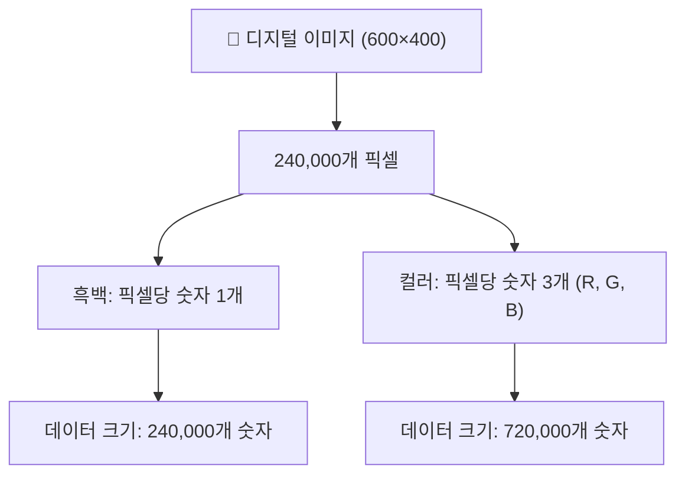
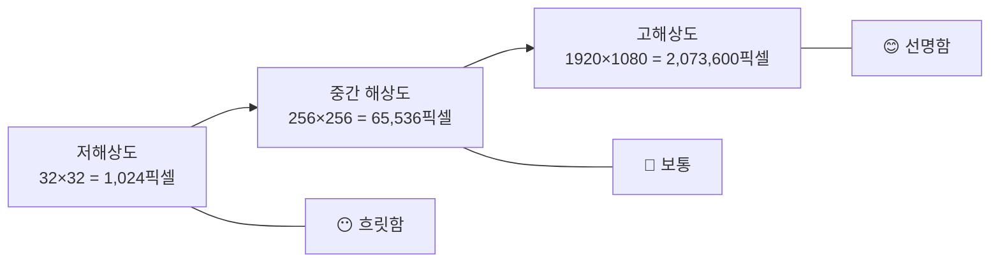
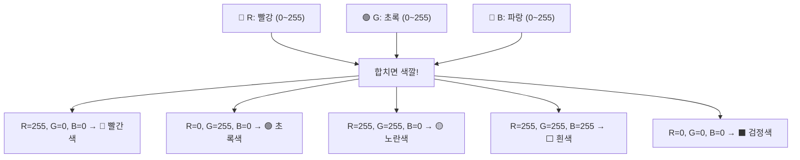
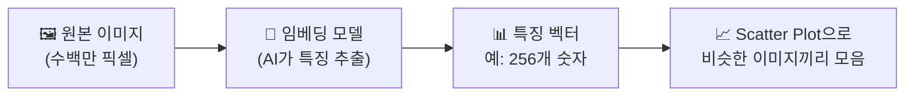
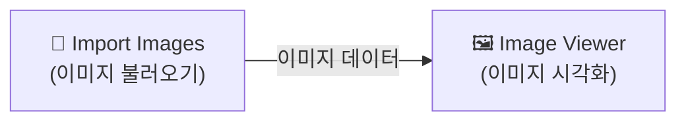
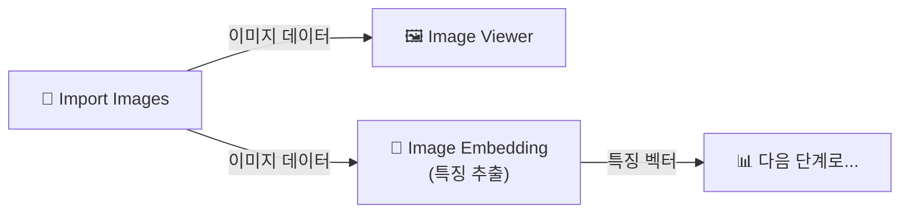
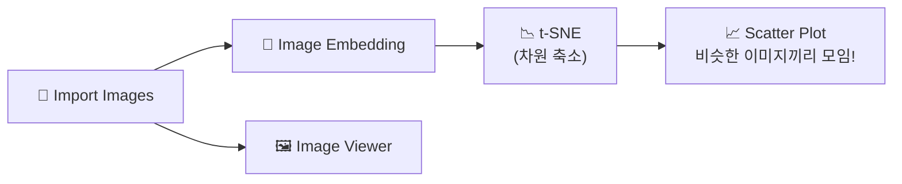
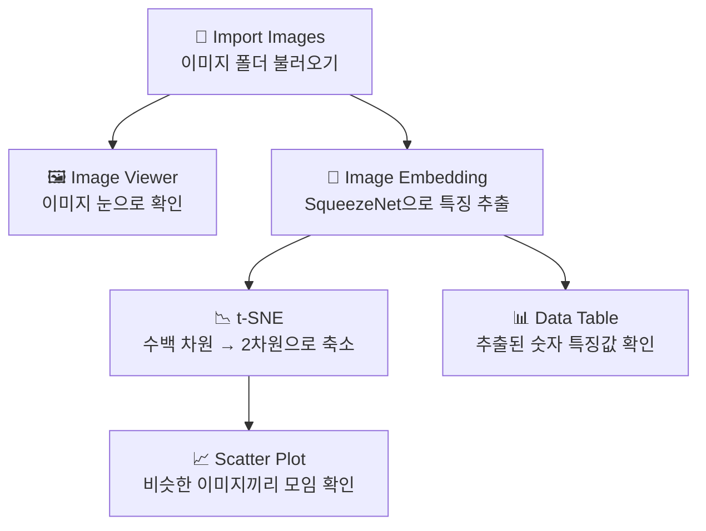
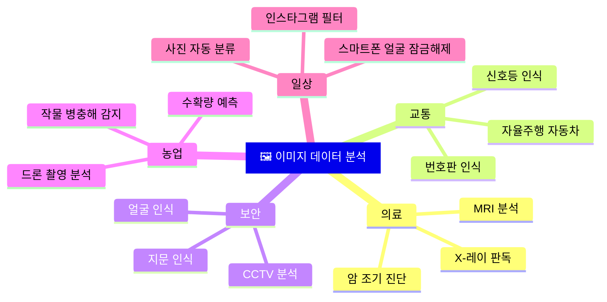

# Chapter 09: 이미지 데이터 - 사진도 데이터야! 📸

---

## 🎯 이 장에서 배우는 것

- [ ] 이미지가 픽셀이라는 숫자 데이터로 구성되는 원리를 설명할 수 있다.
- [ ] 오렌지3 Image Viewer 위젯으로 이미지 데이터셋을 탐색할 수 있다.
- [ ] Image Embedding과 Scatter Plot을 연결해 비슷한 이미지끼리 모이는 시각화를 체험할 수 있다.
- [ ] 이미지 데이터 분석이 실생활에서 어떻게 활용되는지 설명할 수 있다.

---

## 💡 왜 이걸 배우나요?

스마트폰으로 셀카를 찍었을 때, 카메라 앱이 여러분의 얼굴을 자동으로 인식하고 네모 박스를 그려준 경험이 있나요? 또는 구글 포토에 올린 사진이 "강아지", "해변", "생일 파티"처럼 자동으로 분류되는 것을 본 적 있나요?

이런 일들이 가능한 이유는 **사진도 결국 숫자로 이루어진 데이터**이기 때문입니다. 컴퓨터는 이 숫자들을 분석해서 "아, 이건 고양이 얼굴이구나!"를 알아내는 것이죠.

이번 장에서는 이미지 데이터의 구조를 이해하고, 오렌지3 도구를 사용해 이미지들을 탐색하고 시각화하는 방법을 배웁니다. 데이터 분석이 텍스트나 숫자에만 머무는 게 아니라, 우리 눈에 보이는 **사진과 그림에도 적용**된다는 것을 직접 체험해 봅시다!

---

## 📚 핵심 개념

### 개념 1: 픽셀(Pixel) - 이미지를 구성하는 최소 단위

**🔍 비유로 시작**

모자이크 타일 벽화를 상상해 보세요. 멀리서 보면 아름다운 그림처럼 보이지만, 가까이 다가가면 수많은 작은 색깔 타일들이 붙어있다는 걸 알 수 있습니다. 디지털 이미지도 똑같습니다. 이 작은 타일 하나하나가 바로 **픽셀(Pixel)**입니다.

**📖 정확한 정의**

픽셀(Pixel)은 **Picture Element(그림 요소)**의 줄임말로, 디지털 이미지를 구성하는 가장 작은 점입니다. 모든 디지털 이미지는 픽셀들이 격자 모양으로 모여 만들어집니다.

각 픽셀은 숫자로 색깔 정보를 저장합니다.
- **흑백 이미지**: 픽셀 하나 = 숫자 1개 (0~255, 0은 완전한 검정, 255는 완전한 흰색)
- **컬러 이미지**: 픽셀 하나 = 숫자 3개 (빨강R, 초록G, 파랑B 각각 0~255)



**✅ 예시로 확인**

아주 작은 4×4 크기의 흑백 이미지를 생각해 봅시다. 이 이미지는 딱 16개의 픽셀로 이루어져 있고, 각 픽셀에는 0~255 사이의 숫자 하나가 들어있습니다.

```
픽셀 값 예시 (4×4 흑백 이미지):
0    0    255  255
0    0    255  255
255  255  0    0
255  255  0    0
```

위 숫자들을 그림으로 그리면 왼쪽 위와 오른쪽 아래는 검정, 오른쪽 위와 왼쪽 아래는 흰색인 네모 패턴이 됩니다.

> **💬 생각해보기:** 스마트폰으로 찍은 사진이 1200만 화소(픽셀)라면, 컬러 이미지일 때 몇 개의 숫자로 이루어져 있을까요? (힌트: 1,200만 × 3 = ?)

---

### 개념 2: 이미지 해상도(Resolution) - 선명함의 비밀

**🔍 비유로 시작**

같은 모자이크 벽화라도, 타일이 작을수록(더 많을수록) 훨씬 세밀하고 선명하게 보입니다. 이미지 해상도도 마찬가지입니다. 픽셀이 많을수록 더 선명하고 세밀한 이미지가 됩니다.

**📖 정확한 정의**

해상도(Resolution)는 이미지의 픽셀 수를 나타냅니다. 보통 **가로 픽셀 수 × 세로 픽셀 수**로 표현합니다.

- **해상도 높음** → 픽셀 많음 → 파일 크기 큼 → 선명함
- **해상도 낮음** → 픽셀 적음 → 파일 크기 작음 → 흐릿함



**✅ 예시로 확인**

머신러닝에서는 처리 속도를 위해 이미지를 일정 크기로 줄이는 경우가 많습니다. 예를 들어, 유명한 AI 학습 데이터셋인 **CIFAR-10**의 이미지는 겨우 32×32 픽셀입니다. 작지만 "고양이인지 개인지" 분류하기에는 충분하죠!

---

### 개념 3: RGB 색상 모델 - 세 가지 색으로 모든 색을 만드는 방법

**🔍 비유로 시작**

물감을 섞어본 적 있나요? 빨강과 파랑을 섞으면 보라색, 노랑과 파랑을 섞으면 초록색이 됩니다. 디지털 색깔도 비슷한 원리로, **빛의 삼원색인 빨강(Red), 초록(Green), 파랑(Blue)**을 섞어서 모든 색을 표현합니다.

**📖 정확한 정의**

**RGB 색상 모델**은 빨강(R), 초록(G), 파랑(B) 세 가지 값을 조합해 색을 표현하는 방식입니다. 각 값은 0~255 범위를 가집니다.



**✅ 예시로 확인**

컬러 이미지는 실제로 **3개의 층(채널)**으로 이루어져 있다고 생각하면 쉽습니다. 빨강 채널, 초록 채널, 파랑 채널이 각각 따로 있고, 이 세 층을 겹치면 우리가 보는 컬러 이미지가 됩니다.

> **💬 알아보기:** R=128, G=0, B=128이면 무슨 색일까요? 빨강과 파랑을 반반 섞었으니 보라색(Purple)이 됩니다!

---

### 개념 4: 이미지 임베딩(Image Embedding) - 이미지를 숫자 벡터로 변환

**🔍 비유로 시작**

사람을 설명할 때 "키 170cm, 몸무게 60kg, 나이 15세"처럼 숫자로 특징을 나타낼 수 있습니다. 이미지도 마찬가지로, 수백만 개의 픽셀 값을 훨씬 작은 수십~수백 개의 특징 숫자들로 요약할 수 있습니다. 이 과정을 **임베딩(Embedding)**이라고 합니다.

**📖 정확한 정의**

이미지 임베딩은 이미지의 핵심 특징을 추출해서 **숫자 벡터(숫자들의 목록)**로 표현하는 것입니다. 잘 훈련된 AI 모델이 "이 이미지에서 무엇이 중요한가"를 판단해 핵심 정보만 뽑아냅니다.



**✅ 예시로 확인**

비슷하게 생긴 이미지들은 임베딩 결과도 비슷한 숫자들을 가지게 됩니다. 그래서 임베딩 결과를 그래프에 점으로 찍으면, **고양이 사진들끼리는 가까이 모이고, 자동차 사진들끼리는 다른 곳에 모이는** 패턴이 나타납니다. 이것이 바로 이미지를 시각화하는 강력한 방법입니다!

---

## 🔨 따라하기

> **⚙️ 준비물**: 오렌지3(Orange3)가 설치된 컴퓨터

---

### Step 1: 오렌지3 실행하고 새 워크플로우 만들기

1. 오렌지3를 실행합니다.
2. 시작 화면에서 **"New"** 버튼을 눌러 빈 워크플로우를 만듭니다.
3. 화면 왼쪽 위 메뉴에서 **File → Save As**를 눌러 `이미지탐색.ows` 이름으로 저장합니다.

> **💬 알아보기:** 오렌지3의 워크플로우는 위젯(도구)들을 연결하는 방식으로 작동합니다. 마치 블록처럼 원하는 기능의 위젯을 끌어다 놓고, 선으로 연결하면 데이터가 흘러갑니다.

---

### Step 2: 이미지 데이터셋 불러오기

오렌지3에는 연습용 이미지 데이터셋이 내장되어 있습니다. 직접 불러와 봅시다.

1. 왼쪽 위젯 패널에서 **Data** 카테고리를 클릭합니다.
2. **Import Images** 위젯을 캔버스(작업 공간)로 끌어다 놓습니다.
3. **Import Images** 위젯을 **더블클릭**합니다.
4. 팝업창에서 **"..."** 버튼을 눌러 폴더를 선택합니다.

> **⚠️ 만약 직접 이미지 폴더가 없다면:**
> 오렌지3 설치 폴더 안의 `datasets` 폴더를 찾아보세요.
> 또는 인터넷에서 **"Datasets for Orange3"**를 검색하면 무료로 받을 수 있는 연습용 이미지 데이터셋을 찾을 수 있습니다.

5. 폴더 선택 후 **Reload** 버튼을 눌러 이미지를 불러옵니다.

---

### Step 3: Image Viewer로 이미지 탐색하기

불러온 이미지가 어떻게 생겼는지 눈으로 확인해 봅시다.

1. 왼쪽 패널에서 **Visualize** 카테고리를 클릭합니다.
2. **Image Viewer** 위젯을 캔버스로 끌어다 놓습니다.
3. **Import Images** 위젯에서 **Image Viewer** 위젯으로 선을 연결합니다.
   - Import Images의 오른쪽 동그라미 → Image Viewer의 왼쪽 동그라미로 드래그
4. **Image Viewer**를 더블클릭해서 열면, 불러온 이미지들이 격자 형태로 보입니다.



> **💬 확인하기:** Image Viewer 화면에서 이미지 하나를 클릭하면 더 크게 볼 수 있습니다. 상단의 **"Columns"** 슬라이더를 조절해서 한 줄에 보이는 이미지 수를 바꿔보세요!

---

### Step 4: Image Embedding으로 이미지 특징 추출하기

이제 AI를 사용해 이미지의 핵심 특징을 숫자로 뽑아봅시다.

1. 왼쪽 패널에서 **Image Analytics** 카테고리를 클릭합니다.
   - 이 카테고리가 안 보이면 오렌지3에 **Image Analytics 애드온(Add-on)**을 설치해야 합니다.
   - **Options → Add-ons** 메뉴에서 `Image Analytics`를 찾아 설치하세요.
2. **Image Embedding** 위젯을 캔버스로 끌어다 놓습니다.
3. **Import Images → Image Embedding**으로 연결합니다.
4. **Image Embedding**을 더블클릭해서 열면 설정창이 나타납니다.
5. **Embedder** 항목에서 **"SqueezeNet"** 또는 **"Inception v3"**를 선택합니다.
6. 잠시 기다리면 (처음에는 모델을 다운로드하므로 시간이 걸릴 수 있습니다) 하단에 "Done"이 표시됩니다.



> **💬 알아보기:** SqueezeNet은 작고 빠른 AI 모델입니다. 이 모델이 각 이미지를 보고 "이 이미지의 특징"을 수십~수백 개의 숫자로 요약해줍니다.

---

### Step 5: Scatter Plot으로 비슷한 이미지끼리 모아보기

임베딩 결과를 그래프로 시각화해 봅시다.

1. 이미지 임베딩 결과는 수십~수백 차원입니다. 이를 2차원 그래프에 표시하려면 **차원 축소**가 필요합니다.
2. 왼쪽 패널 **Unsupervised** 카테고리에서 **t-SNE** 위젯을 캔버스로 끌어다 놓습니다.
3. **Image Embedding → t-SNE**로 연결합니다.
4. **t-SNE**를 더블클릭하면 그래프가 나타납니다.
5. 왼쪽 **Color** 항목에서 `label`(이미지 분류 레이블)을 선택합니다.
6. 같은 종류의 이미지들이 같은 색으로 모여있는 것을 확인합니다!



> **💬 생각해보기:** t-SNE 그래프에서 같은 종류의 이미지들이 모여있나요? 만약 잘 모여있다면 AI가 이미지의 특징을 잘 파악했다는 의미입니다!

---

### Step 6: 내 사진 직접 불러와서 탐색하기 (도전!)

1. 컴퓨터에서 사진 5장을 하나의 폴더에 모아둡니다.
   - 예: `내사진` 폴더에 `사진1.jpg`, `사진2.jpg`, ... `사진5.jpg`
2. **Import Images** 위젯을 더블클릭하고, **"..."** 버튼으로 내 사진 폴더를 선택합니다.
3. **Reload** 버튼을 누르면 내 사진들이 불러와집니다.
4. **Image Viewer**에서 내 사진들을 확인합니다.

> **⚠️ 주의:** 개인 사진이 아닌, 저작권 없는 무료 이미지를 사용해도 됩니다. [Unsplash.com](https://unsplash.com)에서 무료 이미지를 다운받을 수 있어요.

---

## 📝 전체 워크플로우 구성

아래는 이번 실습의 전체 오렌지3 워크플로우입니다.



> **💬 추가 탐색:** **Data Table** 위젯을 Image Embedding에 연결하면, 각 이미지에서 추출된 숫자 특징값들을 표로 볼 수 있습니다. 하나의 이미지가 수백 개의 숫자로 표현된 것을 직접 확인해보세요!

---

## 🌍 이미지 데이터 분석의 실생활 활용

이미지 데이터 분석 기술은 우리 주변 곳곳에서 사용되고 있습니다.



**특히 주목할 분야:**
- **의료 영상 분석**: AI가 X-레이 사진을 분석해서 폐암, 골절 등을 의사보다 빠르게 찾아낼 수 있습니다.
- **자율주행**: 자동차에 달린 카메라가 매 순간 수천 장의 이미지를 캡처하고, AI가 실시간으로 "이건 사람이다", "이건 신호등이다"를 분류합니다.
- **스마트 농업**: 드론으로 농지를 촬영하고, AI가 이미지를 분석해서 어느 구역에 병충해가 생겼는지 찾아냅니다.

---

## ⚠️ 자주 하는 실수

**실수 1: 이미지 파일 형식 문제**

오렌지3 Import Images는 `.jpg`, `.jpeg`, `.png`, `.bmp` 파일을 지원합니다. `.heic` (아이폰 기본 형식)나 `.webp` 파일은 인식이 안 될 수 있습니다. 이런 경우 파일 형식을 `.jpg`로 변환해서 사용하세요.

**실수 2: Image Embedding이 느릴 때 포기하기**

Image Embedding은 처음 실행 시 AI 모델을 인터넷에서 다운로드합니다. 수십 MB 크기이므로 시간이 걸릴 수 있습니다. 진행 표시줄이 움직이고 있으면 기다리세요. 인터넷 연결이 필요합니다!

**실수 3: 이미지 수가 너무 적을 때**

t-SNE 시각화가 의미있으려면 최소 20~30장 이상의 이미지가 필요합니다. 5장 이하로는 패턴을 발견하기 어렵습니다. 연습할 때는 카테고리별로 10장 이상 준비하는 것이 좋습니다.

**실수 4: 이미지 폴더 구조 오해**

Import Images는 **폴더 이름을 레이블(분류)**로 사용합니다. 예를 들어, `고양이` 폴더 안의 이미지는 자동으로 "고양이" 레이블이 붙습니다. 분류 분석을 하려면 카테고리별로 폴더를 만들어 이미지를 넣어야 합니다.

```
✅ 올바른 폴더 구조
동물사진/
  ├── 고양이/  (고양이 사진 10장)
  └── 강아지/  (강아지 사진 10장)

❌ 잘못된 폴더 구조
동물사진/  (고양이, 강아지 사진이 한 폴더에 섞임)
```

**실수 5: 픽셀 값 범위 혼동**

픽셀 값은 0~255 사이입니다. 0이 "없음(검정/어두움)", 255가 "최대(흰색/밝음)"입니다. 간혹 0~1 사이로 정규화된 값을 쓰는 경우도 있으니 데이터 확인이 중요합니다.

---

## ✅ 스스로 점검하기

**기본 문제** (개념 확인)

1. 픽셀(Pixel)이 무엇인지 설명하고, 흑백 이미지와 컬러 이미지에서 픽셀 하나가 몇 개의 숫자로 표현되는지 쓰세요.

2. RGB에서 R, G, B는 각각 무엇을 의미하나요? R=0, G=0, B=255인 픽셀은 무슨 색인가요?

3. 해상도 1280×720인 흑백 이미지는 총 몇 개의 숫자로 이루어져 있나요? 계산 과정도 함께 쓰세요.

**응용 문제** (적용 확인)

4. 오렌지3에서 이미지 데이터를 탐색하는 과정을 순서대로 써보세요. (Import Images → ? → ?)

5. 이미지 임베딩(Image Embedding)이 왜 필요한지, 없으면 어떤 문제가 생기는지 설명해보세요.

6. t-SNE 그래프에서 같은 종류의 이미지들이 한 곳에 모여있다면, 이것이 의미하는 바는 무엇인가요?

**심화 문제** (분석과 추론)

7. 의료 AI가 X-레이 사진을 보고 병을 진단할 때, 이미지 데이터는 어떤 과정을 거쳐 분석될까요? 이번 장에서 배운 개념(픽셀, 임베딩 등)을 사용해 설명해보세요.

---

## 