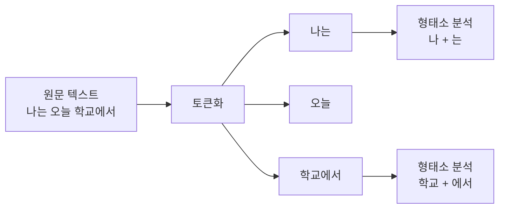
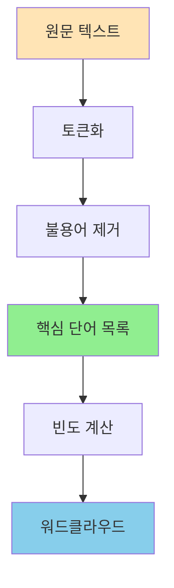
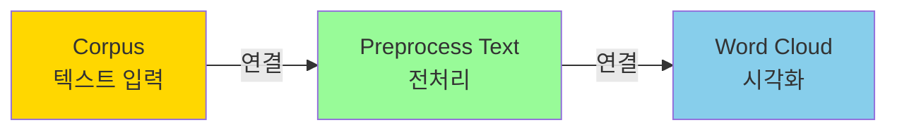
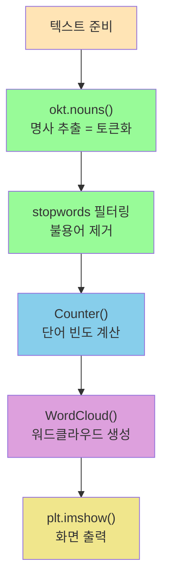

# Chapter 10. 텍스트 데이터 - 글에서 패턴 찾기

---

## 🎯 이 장에서 배우는 것

- [ ] 텍스트 데이터의 특성을 이해하고, 토큰화와 불용어 제거의 개념을 설명할 수 있다.
- [ ] 오렌지3의 Corpus, Preprocess Text, Word Cloud 위젯을 연결하여 텍스트를 시각화할 수 있다.
- [ ] 워드클라우드 결과를 읽고 텍스트의 핵심 주제와 키워드를 해석할 수 있다.
- [ ] 파이썬 KoNLPy 코드의 기본 구조를 이해하고 텍스트 분석 흐름을 설명할 수 있다.

---

## 💡 왜 이걸 배우나요?

여러분이 좋아하는 아이돌 노래 가사를 생각해보세요. 그 노래에서 **가장 많이 나오는 단어**는 무엇일까요? '사랑'일까요, '너'일까요, '우리'일까요?

가사 한 편이면 몇 백 단어입니다. 눈으로 일일이 세려면 시간이 엄청 걸리죠. 하지만 컴퓨터에게 맡기면 0.1초 만에 분석이 끝납니다. 그리고 그 결과를 **워드클라우드(Word Cloud)** 라는 그림으로 표현하면, 중요한 단어일수록 크게 표시되어 텍스트의 핵심이 한눈에 보입니다.

이게 바로 **텍스트 데이터 분석**입니다.

텍스트 분석은 실생활 곳곳에서 쓰입니다.

- **기업의 고객 리뷰 분석**: "이 제품에 대한 불만이 뭔지 빠르게 파악하자"
- **선거 여론조사**: "후보자에 대해 사람들이 어떤 단어를 가장 많이 쓰는지 보자"
- **뉴스 트렌드 파악**: "오늘 가장 많이 언급된 키워드는?"

숫자 데이터(키, 몸무게, 점수)와 달리, 텍스트는 **의미를 담은 데이터**입니다. 이걸 분석하면 사람들의 생각과 감정을 읽어낼 수 있어요. 이 장에서는 텍스트 분석의 첫걸음, **전처리와 시각화**를 배웁니다.

---

## 📚 핵심 개념

### 개념 1: 텍스트 데이터(Text Data)란?

> **비유로 시작** 🍱
> 숫자 데이터가 도시락통 안에 정갈하게 담긴 반찬이라면, 텍스트 데이터는 냉장고 안에 뒤섞여 있는 재료들입니다. 요리(분석)를 하려면 먼저 재료를 **다듬고 정리**해야 합니다.

**정확한 정의**: 텍스트 데이터란 문자로 이루어진 비정형 데이터입니다. 숫자처럼 바로 계산할 수 없고, 컴퓨터가 이해할 수 있는 형태로 **변환(전처리)** 하는 과정이 반드시 필요합니다.

**예시로 확인**:

아래 두 가지를 비교해보세요.

- **숫자 데이터**: 82, 75, 91, 68 → 바로 평균 계산 가능
- **텍스트 데이터**: "오늘 날씨가 정말 맑고 좋다" → 바로 계산 불가, 전처리 필요

텍스트 데이터의 특징을 정리하면 이렇습니다.

- **비정형(Unstructured)**: 행과 열이 없고 길이도 제각각
- **맥락 의존적**: 같은 단어도 문맥에 따라 뜻이 달라짐 ("배가 고프다" vs "배가 뜬다")
- **노이즈가 많음**: 문법, 맞춤법 오류, 특수문자 등 불필요한 요소가 섞여 있음

---

### 개념 2: 토큰화(Tokenization)

> **비유로 시작** ✂️
> 긴 문장을 분석하는 건 통째로 삼키는 것처럼 어렵습니다. 토큰화는 문장을 **한 입 크기로 잘라주는 것**입니다. 마치 빵을 한 조각씩 잘라 먹기 좋게 만드는 것처럼요.

**정확한 정의**: 토큰화란 텍스트를 분석 단위(토큰, Token)로 쪼개는 과정입니다. 보통 단어 단위로 나누지만, 문장 단위, 형태소 단위로 나누기도 합니다.

**예시로 확인**:

```
원문: "나는 오늘 학교에서 친구를 만났다"

단어 토큰화 결과:
["나는", "오늘", "학교에서", "친구를", "만났다"]

형태소 토큰화 결과 (한국어):
["나", "는", "오늘", "학교", "에서", "친구", "를", "만나", "았", "다"]
```

한국어는 영어와 달리 **조사(은/는/이/가)** 와 **어미(았/었/겠)** 가 단어에 붙어 있어서, 단순히 띄어쓰기로 자르면 부정확합니다. 그래서 한국어는 **형태소 분석기**가 필요합니다.



---

### 개념 3: 불용어(Stopword) 제거

> **비유로 시작** 🧹
> 책상을 청소할 때 필요한 물건만 남기고 잡동사니는 버리죠? 불용어 제거는 텍스트 분석에서 **의미 없는 단어를 버리는 청소 작업**입니다.

**정확한 정의**: 불용어(Stopword)란 분석에 도움이 되지 않는, 너무 자주 등장하는 단어들입니다. 한국어에서는 조사, 접속사, 일부 부사가 이에 해당합니다.

**예시로 확인**:

```
토큰화된 단어들:
["나", "는", "오늘", "학교", "에서", "친구", "를", "만나", "았", "다"]

불용어 목록: ["는", "에서", "를", "았", "다"]

불용어 제거 후:
["나", "오늘", "학교", "친구", "만나"]
```

불용어를 제거하면 **핵심 단어만 남아** 분석이 훨씬 정확해집니다. 만약 제거하지 않으면, "은/는/이/가"가 가장 큰 단어로 워드클라우드에 표시되어 아무 의미도 없는 결과가 나옵니다.



---

### 개념 4: 워드클라우드(Word Cloud)

> **비유로 시작** 🌤️
> 워드클라우드는 단어들이 구름처럼 모여 있는 그림입니다. 많이 나온 단어는 크게, 적게 나온 단어는 작게 표시됩니다. 마치 **인기투표 결과를 그림으로 그린 것**과 같습니다.

**정확한 정의**: 워드클라우드는 텍스트에서 단어의 등장 빈도를 시각화한 그래프입니다. 단어의 크기가 빈도에 비례하며, 색상이나 위치는 강조 효과를 위해 사용됩니다.

**예시로 확인**:

뉴스 기사 100개를 분석했더니 이런 빈도가 나왔다고 가정해봅시다.

- 경제: 450회 → **매우 크게 표시**
- 성장: 280회 → 크게 표시
- 수출: 190회 → 보통 크기
- 기업: 150회 → 보통 크기
- 회의: 40회 → 작게 표시

이 결과를 워드클라우드로 만들면, '경제'라는 단어가 가장 크게 중앙을 차지하고, 나머지 단어들이 크기 순으로 주변에 배치됩니다. 보는 사람은 "아, 이 뉴스들은 경제 성장에 관한 내용이구나"를 단번에 알 수 있습니다.

> 💡 **알아보기**: 워드클라우드의 한계
> 워드클라우드는 빈도만 보여줍니다. "좋다"와 "나쁘다"가 같은 빈도면 같은 크기로 표시되죠. 긍정/부정 감정을 구분하는 **감성 분석(Sentiment Analysis)** 은 더 고급 기술이 필요합니다.

---

## 🔨 따라하기 - 오렌지3로 워드클라우드 만들기

오렌지3는 코딩 없이 블록을 연결해서 데이터를 분석하는 도구입니다. 텍스트 분석 기능도 포함되어 있어 워드클라우드를 쉽게 만들 수 있습니다.

> ⚠️ **사전 준비**: 오렌지3 Text 애드온이 설치되어 있어야 합니다.
> 오렌지3 실행 → 상단 메뉴 Options → Add-ons → Text 체크 → 설치 후 재시작

---

### Step 1: 텍스트 파일 준비하기

실습에 사용할 텍스트 파일을 만듭니다. 메모장(Windows) 또는 텍스트 편집기를 열고 아래 내용을 붙여넣은 뒤, `news_sample.txt`로 저장합니다.

```
인공지능 기술이 빠르게 발전하고 있다. 딥러닝과 머신러닝을 활용한 인공지능 
서비스가 의료, 교육, 금융 분야에서 활발히 사용되고 있다. 특히 인공지능 
챗봇은 고객 서비스 분야에서 혁신을 이끌고 있다. 전문가들은 인공지능이 
미래 산업의 핵심 기술이 될 것이라고 전망한다. 기업들은 인공지능 연구개발에 
막대한 투자를 아끼지 않고 있으며, 인공지능 전문 인재 확보 경쟁도 치열하다.
```

파일 저장 시 인코딩을 **UTF-8**로 설정하는 것이 중요합니다. (메모장에서 저장 시 인코딩 선택 가능)

---

### Step 2: Corpus 위젯으로 텍스트 불러오기

오렌지3를 실행하고 새 워크플로우를 시작합니다.

**위젯 추가 방법**:
- 왼쪽 패널에서 **Text Mining** 카테고리를 찾습니다.
- **Corpus** 위젯을 캔버스로 드래그합니다.

**Corpus 위젯 설정**:
- Corpus 위젯을 더블클릭합니다.
- 상단의 폴더 아이콘(📁)을 클릭해서 준비한 `news_sample.txt` 파일을 불러옵니다.
- 파일이 로드되면 하단에 문서 수와 내용이 표시됩니다.

> 💡 **알아보기**: Corpus란?
> Corpus(코퍼스)는 '말뭉치'라는 뜻으로, 분석할 텍스트 문서들의 모음입니다. 오렌지3에서는 텍스트 분석의 시작점이 항상 Corpus 위젯입니다.

---

### Step 3: Preprocess Text 위젯으로 전처리하기

**위젯 추가 및 연결**:
- Text Mining 카테고리에서 **Preprocess Text** 위젯을 캔버스로 드래그합니다.
- Corpus 위젯의 출력 포트(오른쪽 점)를 Preprocess Text 위젯의 입력 포트(왼쪽 점)로 드래그하여 연결합니다.

**Preprocess Text 위젯 설정**:
Preprocess Text를 더블클릭하면 여러 전처리 옵션이 나타납니다.

- **Transformation** 탭: `Lowercase` 체크 → 모든 글자를 소문자로 변환
- **Tokenization** 탭: `Word & Punctuation` 선택 → 단어 단위로 토큰화
- **Normalization** 탭: (한국어의 경우 기본값 유지)
- **Filtering** 탭: `Stop words` 체크 → 기본 불용어 제거, `Min frequency: 1` 설정



---

### Step 4: Word Cloud 위젯 연결하기

**위젯 추가 및 연결**:
- Text Mining 카테고리에서 **Word Cloud** 위젯을 캔버스로 드래그합니다.
- Preprocess Text의 출력 포트를 Word Cloud의 입력 포트에 연결합니다.

**Word Cloud 위젯 더블클릭** → 결과 확인

화면에 워드클라우드가 나타납니다! '인공지능'이라는 단어가 가장 크게 표시될 것입니다. 텍스트에서 가장 많이 등장한 단어이기 때문입니다.

---

### Step 5: 결과 해석하기

워드클라우드를 보면서 다음을 확인해봅니다.

**크기로 보는 중요도**:
- 가장 크게 표시된 단어 = 가장 자주 등장한 단어 = 핵심 주제
- 작게 표시된 단어 = 드물게 등장한 단어 = 부수적 내용

**우리 예시에서 예상 결과**:
- **인공지능** → 가장 크게 (6회 등장)
- **기술, 서비스, 분야** → 중간 크기
- **의료, 교육, 금융** → 작은 크기

> 🤔 **생각해보기**: 만약 '있다', '이다', '되다' 같은 단어가 크게 나타난다면 어떻게 해야 할까요? 이런 단어들은 불용어로 추가 등록해야 합니다. Preprocess Text의 Filtering 탭에서 불용어를 직접 추가할 수 있습니다.

---

### Step 6: 불용어 커스터마이징

분석 결과에서 의미 없는 단어가 보인다면 직접 불용어를 추가할 수 있습니다.

- Preprocess Text 위젯을 더블클릭합니다.
- Filtering 탭 → Stop words 옆의 편집 버튼 클릭
- 직접 단어를 입력합니다. (예: 있다, 이다, 하다, 것이다)
- 저장 후 Word Cloud가 자동으로 업데이트됩니다.

> 📝 **정리하기**: 오렌지3 텍스트 분석 3단계
> 1. **Corpus** → 텍스트 파일 불러오기
> 2. **Preprocess Text** → 토큰화 + 불용어 제거
> 3. **Word Cloud** → 결과 시각화

---

## 📝 파이썬 코드로 보는 텍스트 분석

오렌지3로 클릭만으로 분석했다면, 같은 작업을 파이썬 코드로도 할 수 있습니다. 코드의 전체 흐름을 이해하는 것이 목표입니다. (직접 실행해보는 것은 선택 사항입니다)

```python
# 필요한 라이브러리 불러오기
from konlpy.tag import Okt          # 한국어 형태소 분석기
from collections import Counter      # 단어 빈도 계산
from wordcloud import WordCloud      # 워드클라우드 생성
import matplotlib.pyplot as plt      # 그래프 출력

# 1단계: 분석할 텍스트 준비
text = """
인공지능 기술이 빠르게 발전하고 있다. 딥러닝과 머신러닝을 활용한 인공지능 
서비스가 의료, 교육, 금융 분야에서 활발히 사용되고 있다. 인공지능 챗봇은 
고객 서비스 분야에서 혁신을 이끌고 있다.
"""

# 2단계: 형태소 분석 (토큰화)
okt = Okt()
tokens = okt.nouns(text)   # 명사만 추출
print("추출된 명사:", tokens[:10])

# 3단계: 불용어 제거
stopwords = ["것", "수", "등", "때", "및"]
tokens = [t for t in tokens if t not in stopwords and len(t) > 1]

# 4단계: 단어 빈도 계산
word_freq = Counter(tokens)
print("상위 5개 단어:", word_freq.most_common(5))

# 5단계: 워드클라우드 생성
wc = WordCloud(
    font_path="malgun.ttf",    # 한글 폰트 설정
    width=800,
    height=400,
    background_color="white"
)
wc.generate_from_frequencies(word_freq)

# 6단계: 화면에 출력
plt.figure(figsize=(12, 6))
plt.imshow(wc, interpolation="bilinear")
plt.axis("off")
plt.title("뉴스 기사 워드클라우드")
plt.show()
```

**코드 흐름 한눈에 보기**:



> 💡 **알아보기**: KoNLPy란?
> KoNLPy(코엔엘파이)는 한국어 자연어 처리를 위한 파이썬 라이브러리입니다. 내부에 여러 형태소 분석기(Okt, Kkma, Komoran 등)가 있으며, `okt.nouns()`는 문장에서 명사만 뽑아줍니다. 명사는 의미를 담은 핵심 단어이기 때문에 텍스트 분석에 가장 많이 사용됩니다.

---

## ⚠️ 자주 하는 실수

**실수 1: 불용어를 제거하지 않고 워드클라우드 생성**

"은", "는", "이", "가", "을", "를" 같은 조사가 가장 크게 표시되는 결과가 나옵니다. 이 단어들은 어떤 텍스트에나 많이 나오기 때문에 전혀 의미 있는 정보를 주지 않습니다. **반드시 불용어 제거 단계를 포함하세요.**

**실수 2: 파일 인코딩 오류**

텍스트 파일을 EUC-KR 인코딩으로 저장했는데 UTF-8로 불러오면 오류가 발생합니다. 한국어 텍스트 파일은 항상 **UTF-8 인코딩**으로 저장하는 습관을 들이세요. 메모장 저장 시 인코딩 선택창에서 UTF-8을 선택합니다.

**실수 3: 너무 짧은 텍스트로 분석**

텍스트가 두세 문장 수준이면 워드클라우드가 의미 없게 나옵니다. 의미 있는 분석을 위해서는 **최소 100단어 이상**, 가능하면 300단어 이상의 텍스트를 사용하세요.

**실수 4: 오렌지3 위젯 연결 방향 혼동**

위젯의 **왼쪽 포트는 입력(Input)**, **오른쪽 포트는 출력(Output)** 입니다. Corpus(출력) → Preprocess Text(입력) → Word Cloud(입력) 순서로 연결해야 합니다. 반대로 연결하면 데이터가 흐르지 않습니다.

---

## ✅ 스스로 점검하기

아래 질문에 답해보세요. 모두 답할 수 있으면 이 장을 완벽히 이해한 것입니다!

**기본 문제**

1. 텍스트 데이터와 숫자 데이터의 가장 큰 차이점은 무엇인가요?

2. 다음 문장을 단어 토큰화하면 어떻게 되나요?
   "오늘은 맑은 하늘 아래 산책을 했다"

3. 아래 단어 목록에서 불용어를 골라보세요.
   `["학교", "는", "정말", "좋다", "를", "친구", "와"]`

4. 워드클라우드에서 단어의 크기는 무엇을 의미하나요?

**응용 문제**

5. 오렌지3에서 텍스트 분석을 위한 위젯 연결 순서를 빈칸에 써넣으세요.
   `(      )` → `Preprocess Text` → `(      )`

6. 뉴스 기사를 분석했더니 워드클라우드에 "있다", "된다", "한다"가 가장 크게 나왔습니다. 어떻게 해결해야 할까요?

**심화 문제**

7. 같은 텍스트를 분석하더라도 불용어 목록에 따라 워드클라우드 결과가 달라집니다. 이것이 분석에서 어떤 의미를 가질까요? 분석자의 역할에 대해 생각해보세요.

> 📝 **정답 확인**
> 1. 텍스트는 비정형 데이터로 바로 계산할 수 없으며 전처리가 필요합니다.
> 2. ["오늘은", "맑은", "하늘", "아래", "산책을", "했다"]
> 3. "는", "를", "와"
> 4. 해당 단어의 등장 빈도(자주 나올수록 크게 표시)
> 5. Corpus → Word Cloud
> 6. "있다", "된다", "한다"를 불용어 목록에 추가하여 제거합니다.

---

## 🚀 더 해보기 - 도전 문제

**도전: 뉴스 기사 워드클라우드 만들고 핵심 주제 추론하기**

1. 포털 사이트(네이버, 다음 등)에서 관심 있는 뉴스 기사 하나를 선택합니다.
2. 기사 본문 전체를 복사해서 텍스트 파일로 저장합니다.
3. 오렌지3에서 워드클라우드를 만들어봅니다.
4. 결과를 보고 아래 질문에 답해보세요.
   - 가장 크게 나온 단어 TOP 5는?
   - 이 단어들을 보고 기사의 핵심 주제를 한 문장으로 요약하면?
   - 워드클라우드만 봐도 기사 제목을 유추할 수 있나요?

**추가 아이디어**:
- 좋아하는 노래 가사 전체를 분석해보세요
- 소설 첫 번째 챕터를 분석해서 주인공과 배경을 유추해보세요
- 친구들의 SNS 게시물을 모아 분석하면 어떤