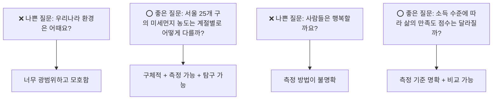
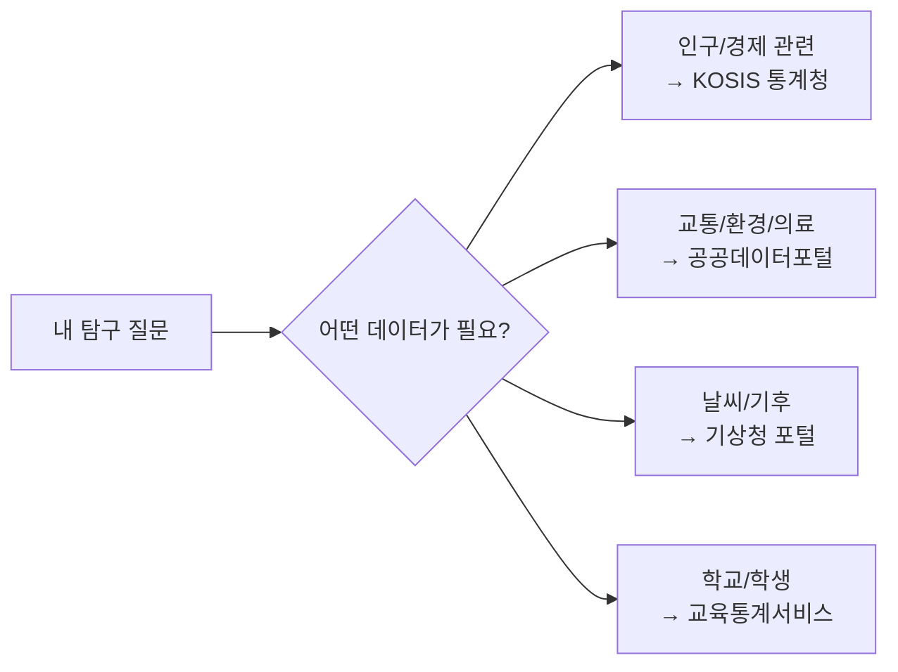
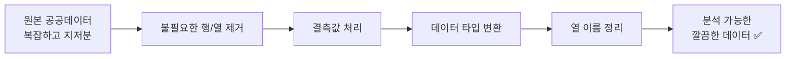
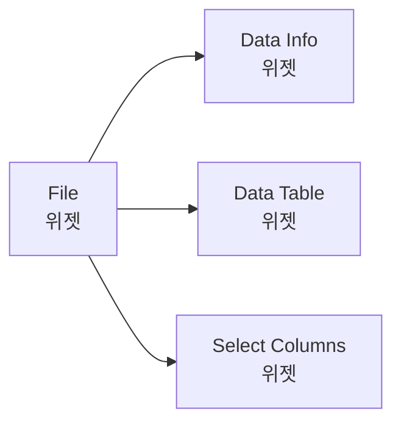
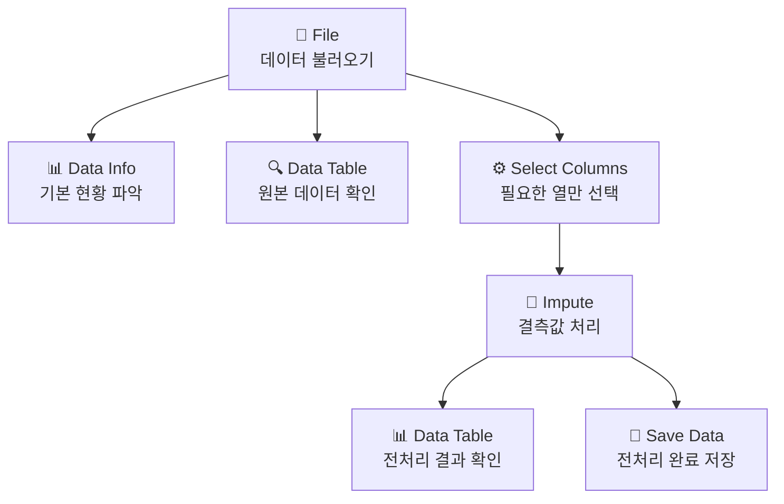

# Chapter 11: 프로젝트 시작! - 질문하고 데이터 모으기

---

## 🎯 이 장에서 배우는 것

- [ ] 데이터로 탐구할 수 있는 좋은 질문의 조건을 설명할 수 있다.
- [ ] 공공데이터포털과 통계청 KOSIS에서 원하는 데이터를 검색하고 다운로드할 수 있다.
- [ ] 수집한 데이터를 오렌지3에 불러와 기본 전처리를 완료할 수 있다.
- [ ] 데이터 수집 과정의 어려움을 기록하고 해결 방법을 찾을 수 있다.

---

## 💡 왜 이걸 배우나요?

지금까지 우리는 이미 준비된 데이터를 가지고 분석을 연습했습니다. 하지만 진짜 데이터 탐구자는 스스로 질문을 만들고, 직접 데이터를 찾아옵니다.

마치 훌륭한 요리사가 레시피만 따라 하다가 언젠가 자신만의 요리를 만드는 것처럼, 여러분도 이제 **나만의 데이터 이야기**를 만들 차례입니다.

> 🍳 **비유로 이해하기**
> 지금까지는 마트에서 밀키트를 사서 요리했다면, 이제는 직접 시장에 가서 재료를 고르고 나만의 요리를 만드는 단계입니다. 어떤 재료를 고를지(데이터 선택), 어떻게 손질할지(전처리), 어떤 요리를 만들지(분석 목표)를 모두 스스로 결정합니다.

이 챕터에서는 프로젝트의 가장 중요한 첫 번째 단계인 **질문 설정**과 **데이터 수집**을 배웁니다. 좋은 질문이 좋은 프로젝트를 만들고, 적합한 데이터가 좋은 분석을 만듭니다.

---

## 📚 핵심 개념

### 개념 1: 좋은 탐구 질문이란?

**🌱 비유로 시작**

"우리 반 친구들은 어떤 음식을 좋아할까요?"라는 질문과 "우리 반 친구들이 좋아하는 급식 메뉴 1위는 무엇일까요?"라는 질문 중 어느 쪽이 데이터로 탐구하기 더 쉬울까요?

두 번째 질문입니다. 왜냐하면 **무엇을 측정해야 하는지 명확**하기 때문입니다.

**📖 정확한 정의**

좋은 탐구 질문(Research Question)이란, 데이터를 수집하고 분석하여 답을 찾을 수 있는 구체적이고 명확한 질문입니다.

좋은 탐구 질문의 3가지 조건:

- **구체적(Specific)**: 무엇을, 누구를, 언제, 어디서 조사할지 명확하다.
- **데이터로 확인 가능(Measurable)**: 숫자나 카테고리로 측정하고 비교할 수 있다.
- **관심 분야(Relevant)**: 내가 진짜 궁금하고 탐구할 의욕이 생기는 주제다.

**✅ 예시로 확인**

> 💬 **생각해보기**: 내가 평소에 궁금했던 것 중 데이터로 확인할 수 있는 게 있을까요? 잠깐 3가지만 떠올려 보세요.

---

### 개념 2: 공공데이터란 무엇인가?

**🌱 비유로 시작**

도서관에는 누구나 빌릴 수 있는 책이 있습니다. 공공데이터는 **정부와 공공기관이 국민 누구나 사용할 수 있도록 공개한 데이터 도서관**과 같습니다.

**📖 정확한 정의**

공공데이터(Public Data)란 공공기관이 법령 등에 따라 생성하거나 취득하여 관리하는 정보로, 국민 누구나 자유롭게 활용할 수 있도록 개방한 데이터입니다.

주요 공공데이터 출처:

- **공공데이터포털(data.go.kr)**: 정부 부처, 지자체의 다양한 데이터 (교통, 의료, 환경 등)
- **통계청 KOSIS(kosis.kr)**: 인구, 경제, 사회 통계 데이터
- **기상청 기상자료개방포털(data.kma.go.kr)**: 날씨, 기온, 강수량 데이터
- **교육통계서비스(kess.kedi.re.kr)**: 학교, 학생 관련 교육 통계

**✅ 예시로 확인**

---

### 개념 3: 데이터 수집 전 확인할 것들

**🌱 비유로 시작**

마트에서 식재료를 고를 때 유통기한을 확인하듯, 데이터도 수집하기 전에 반드시 확인해야 할 사항들이 있습니다.

**📖 정확한 정의**

데이터 수집 전 체크리스트(Data Collection Checklist)란 수집한 데이터가 프로젝트에 적합한지 판단하기 위한 확인 항목들입니다.

확인할 4가지 항목:

- **형식(Format)**: CSV, Excel, JSON 등 오렌지3에서 읽을 수 있는 형식인가?
- **최신성(Recency)**: 언제 수집된 데이터인가? 분석 목적에 맞게 최신인가?
- **완전성(Completeness)**: 결측값(비어 있는 값)이 너무 많지 않은가?
- **관련성(Relevance)**: 내 질문에 답하는 데 필요한 변수(열)가 포함되어 있는가?

**✅ 예시로 확인**

> 📌 **알아보기**: 데이터 파일을 다운로드했더니 행이 10만 개입니다. 이것이 문제일까요? 꼭 그렇지 않습니다. 오렌지3은 수만 행의 데이터도 잘 처리합니다. 오히려 행이 너무 적으면(50개 미만) 분석 결과가 신뢰하기 어려울 수 있습니다.

---

### 개념 4: 전처리의 중요성 재확인

**🌱 비유로 시작**

공공데이터는 '날 것의 재료'와 같습니다. 아무리 신선한 재료도 요리 전에 씻고, 다듬고, 불필요한 부분을 제거해야 맛있는 요리가 됩니다. 데이터도 마찬가지입니다.

**📖 정확한 정의**

전처리(Preprocessing)란 원본 데이터를 분석에 적합한 형태로 정리하는 과정입니다. 공공데이터는 특히 다음과 같은 전처리가 자주 필요합니다.

실제 공공데이터에서 자주 만나는 문제들:

- **불필요한 행/열**: 파일 상단에 설명 텍스트가 포함된 경우
- **결측값**: 빈 칸, '-', 'N/A', '미집계' 등 다양한 형태
- **숫자가 텍스트로 저장**: "1,234명"처럼 쉼표나 단위가 포함된 경우
- **열 이름이 복잡**: "2023년_서울_미세먼지_평균농도(㎍/㎥)"처럼 긴 경우

**✅ 예시로 확인**

---

## 🔨 따라하기

이제 실제로 공공데이터를 찾아서 오렌지3에 불러오는 전체 과정을 따라해 봅시다.

**우리의 예시 프로젝트 질문**: "서울시 25개 자치구의 연도별 인구 변화 추이는 어떻게 다를까?"

---

### Step 1: 공공데이터포털에서 데이터 검색하기

1. 웹 브라우저를 열고 **data.go.kr** 에 접속합니다.
2. 상단 검색창에 **"서울시 자치구 인구"** 를 입력하고 검색합니다.
3. 검색 결과 목록에서 데이터를 찾을 때 다음 기준으로 선택합니다:
   - 파일 형식이 **CSV** 또는 **XLS/XLSX** 인 것
   - 최근 1~2년 이내에 업데이트된 것
   - 제공 기관이 공신력 있는 기관인 것 (서울특별시, 통계청 등)

> 💡 **팁**: 검색이 잘 안 된다면 **kosis.kr (통계청)** 을 이용해 보세요. 상단 메뉴에서 [통계표] → [주제별 통계] → [인구]로 찾을 수 있습니다.

4. 원하는 데이터 파일을 찾았으면 **다운로드** 버튼을 클릭합니다.
5. 다운로드된 파일을 바탕화면의 **"내_프로젝트"** 폴더에 저장합니다.

---

### Step 2: 다운로드한 파일 미리 확인하기

오렌지3에 불러오기 전에 엑셀이나 메모장으로 파일을 먼저 열어봅니다.

확인할 내용:
- **몇 행, 몇 열**인지 파악하기
- **첫 번째 행**이 열 이름(헤더)인지 확인하기
- **결측값**이 어떤 형태로 표현되어 있는지 확인하기 ('-', '미집계', 빈 칸 등)
- **인코딩 문제**가 있는지 확인하기 (글자가 깨져 보이면 인코딩 문제)

> ⚠️ **중요**: 만약 파일 첫 몇 행이 데이터 설명 텍스트라면, 엑셀에서 해당 행을 삭제하고 다시 저장하세요. 오렌지3은 첫 행을 열 이름으로 인식합니다.

---

### Step 3: 오렌지3에 데이터 불러오기

1. 오렌지3을 실행합니다.
2. 왼쪽 위젯 패널에서 **[Data] → [File]** 위젯을 캔버스로 드래그합니다.
3. File 위젯을 더블클릭하여 설정 창을 엽니다.
4. **[Browse]** 버튼을 클릭하고 저장한 데이터 파일을 선택합니다.
5. 데이터가 잘 로드되었는지 미리보기 화면에서 확인합니다.

**인코딩 문제 해결**: 한글이 깨져 보일 때

- File 위젯 설정 창 하단에서 **Encoding** 옵션을 찾습니다.
- **UTF-8** 또는 **CP949 (EUC-KR)** 로 변경해 봅니다.
- 한국 정부 데이터는 대부분 **CP949** 인코딩을 사용합니다.

---

### Step 4: 데이터 기본 현황 파악하기

1. File 위젯에 **[Data Info]** 위젯을 연결하여 기본 정보를 확인합니다.

확인할 정보:
- **Instances (행 수)**: 데이터가 몇 개의 행으로 구성되어 있나요?
- **Features (열 수)**: 몇 개의 변수가 있나요?
- **Missing Values**: 결측값이 있나요? 있다면 몇 퍼센트나 되나요?

2. **[Data Table]** 위젯도 연결하여 실제 데이터 내용을 눈으로 직접 확인합니다.

---

### Step 5: 필요한 열만 선택하고 전처리하기

1. **[Select Columns]** 위젯을 File 위젯에 연결합니다.
2. 분석에 필요 없는 열은 **Ignored** 칸으로 옮깁니다.
3. 분석에 사용할 열은 **Features** 또는 **Target** 칸에 배치합니다.

**결측값 처리**:
1. **[Impute]** 위젯을 Select Columns 위젯 뒤에 연결합니다.
2. 결측값 처리 방법을 선택합니다:
   - 수치 데이터: **평균값으로 대체** 또는 **행 삭제**
   - 문자 데이터: **최빈값으로 대체** 또는 **행 삭제**
3. 결측값 비율이 30% 이상인 열은 아예 제거하는 것을 고려합니다.

---

### Step 6: 전처리 결과 확인 및 저장하기

1. 전처리가 완료된 위젯 뒤에 **[Data Table]** 위젯을 다시 연결합니다.
2. 처음과 비교하여 데이터가 깔끔해졌는지 확인합니다:
   - 결측값이 처리되었나요?
   - 불필요한 열이 제거되었나요?
   - 데이터 행 수는 적절한가요?
3. 최종 확인이 되었으면 **[Save Data]** 위젯으로 전처리된 데이터를 저장합니다.
   - 파일명: `프로젝트명_전처리완료.csv` (예: `서울인구_전처리완료.csv`)

> 📌 **정리하기**: 오늘 배운 전체 워크플로우는 다음과 같습니다.
> **질문 설정 → 데이터 검색 → 다운로드 → 파일 확인 → 오렌지3 불러오기 → 전처리 → 저장**
> 이 순서를 기억하세요. 모든 데이터 프로젝트는 이 흐름을 따릅니다.

---

## 📝 전체 워크플로우 정리

오렌지3에서 완성된 전처리 워크플로우의 전체 모습입니다.

**각 위젯의 역할 요약**:

- **File**: 컴퓨터에 저장된 CSV, Excel 파일을 오렌지3으로 불러옵니다.
- **Data Info**: 행 수, 열 수, 결측값 현황을 한눈에 보여줍니다.
- **Data Table**: 실제 데이터 내용을 스프레드시트 형태로 봅니다.
- **Select Columns**: 분석에 필요한 열만 골라내고 나머지는 제외합니다.
- **Impute**: 결측값을 평균, 최빈값 등으로 채우거나 해당 행을 삭제합니다.
- **Save Data**: 전처리 완료된 데이터를 파일로 저장합니다.

---

## ⚠️ 자주 하는 실수

**실수 1: 질문이 너무 막연하다**

"우리나라 교육은 좋은가요?" 같은 질문은 데이터로 답하기 어렵습니다. 질문을 구체화할 때는 **"누가, 어디서, 언제, 무엇을"** 을 생각해 보세요. "2015~2023년 서울시 고등학교의 학급당 학생 수는 어떻게 변했을까?"처럼 바꾸면 훨씬 탐구하기 좋은 질문이 됩니다.

**실수 2: 데이터를 확인하지 않고 바로 분석한다**

많은 학생들이 데이터를 다운로드하자마자 오렌지3에 넣고 분석을 시작합니다. 하지만 전처리 없이 분석하면 결과가 틀리거나 오류가 납니다. 반드시 **Data Table로 원본을 먼저 눈으로 확인**하는 습관을 들이세요.

**실수 3: 파일 인코딩 문제를 그냥 넘어간다**

한글 데이터에서 글자가 깨져 보이는데 그냥 분석을 진행하면, 나중에 결과를 해석할 때 완전히 엉뚱한 결론이 납니다. 인코딩 오류는 반드시 처음에 해결하고 넘어가세요. File 위젯의 Encoding 옵션에서 **CP949** 로 변경하면 대부분 해결됩니다.

**실수 4: 데이터 출처를 기록하지 않는다**

어디서 다운로드했는지 기록해 두지 않으면 나중에 다시 찾기 어렵고, 발표할 때 출처를 밝히지 못합니다. 데이터를 저장할 때 **메모장에 URL, 다운로드 날짜, 데이터 설명**을 함께 기록해 두세요.

**실수 5: 결측값이 많은 데이터를 억지로 사용한다**

전체 데이터의 50% 이상이 결측값이라면, 그 데이터로 분석한 결과는 신뢰하기 어렵습니다. 이런 경우에는 다른 데이터를 찾거나, 결측값이 적은 기간/지역으로 질문을 좁히는 것이 더 좋습니다.

---

## ✅ 스스로 점검하기

다음 문제를 풀어보며 오늘 배운 내용을 확인해 보세요.

**문제 1 (기본)** 다음 중 좋은 탐구 질문의 조건에 해당하지 않는 것은?

- ㄱ. 구체적이어야 한다
- ㄴ. 데이터로 측정하고 확인할 수 있어야 한다
- ㄷ. 반드시 사회 문제와 관련이 있어야 한다
- ㄹ. 탐구하는 사람이 관심 있는 분야여야 한다

**문제 2 (기본)** 다음 중 공공데이터를 수집할 수 있는 웹사이트가 아닌 것은?

- ㄱ. data.go.kr (공공데이터포털)
- ㄴ. kosis.kr (통계청 KOSIS)
- ㄷ. naver.com (네이버 검색)
- ㄹ. data.kma.go.kr (기상청)

**문제 3 (응용)** 다음 질문들을 보고, 어떤 것이 좋은 탐구 질문인지 이유와 함께 설명해 보세요.

- **질문 A**: "코로나19는 우리 사회에 어떤 영향을 미쳤나요?"
- **질문 B**: "2019년과 2021년 서울시의 대중교통 월별 이용객 수는 얼마나 차이가 있을까?"

**문제 4 (심화)** 오렌지3의 Data Info 위젯에서 다음과 같은 정보를 확인했습니다.

- 전체 행(Instances): 1,200개
- 전체 열(Features): 15개
- 결측값 비율: 열 3개에 각각 2%, 5%, 68%

이 상황에서 어떤 전처리 전략이 적절한지 설명해 보세요.

> 💡 **정답 힌트**: 문제 1의 답은 ㄷ입니다. 꼭 사회 문제가 아니어도 됩니다. 스포츠, 게임, 음악 등 어떤 분야든 데이터로 탐구할 수 있습니다.

---

## 🚀 더 해보기

**도전 1 (★☆☆) - 질문 목록 만들기**

자신이 관심 있는 분야(게임, 스포츠, 음식, 환경, 학교생활 등)에서 데이터로 탐구할 수 있는 질문을 3가지 만들어 보세요. 각 질문마다 좋은 탐구 질문의 3가지 조건(구체적, 측정 가능, 관심 분야)을 갖추고 있는지 체크해 보세요.

**도전 2 (★★☆) - 데이터 수집 일지 작성하기**

오늘 데이터를 수집하는 과정에서 겪은 어려움과 해결 방법을 기록해 보세요. 아래 형식으로 작성하면 됩니다.

기록할 내용:
- **처음 검색한 키워드**: 무엇으로 검색했나요?
- **겪은 어려움**: 데이터를 찾기 어려웠나요? 인코딩 문제가 있었나요?
- **해결 방법**: 어떻게 해결했나요?
- **최종 선택한 데이터**: 어느 사이트에서, 어떤 파일을 선택했나요?
- **느낀 점**: 데이터 수집 과정에서 새롭게 알게 된 것은 무엇인가요?

이 기록은 나중에 프로젝트 발표 자료를 만들 때 소중한 자료가 됩니다!

**도전 3 (★★★) - 두 개의 데이터 연결 시도하기**

예를 들어 "강수량과 대중교통 이용객 수의 관계"를 탐구하려면 기상 데이터와 교통 데이터, 두 가지가 필요합니다. 자신의 탐구 질문에 답하기 위해 두 가지 이상의 데이터가 필요한지 생각해 보고, 필요하다면 두 번째 데이터를 추가로 찾아보세요.

---

## 🔗 다음 장으로

이번 챕터에서는 프로젝트의 핵심 첫 단계인 **질문 설정과 데이터 수집**을 완료했습니다.

핵심 내용 요약:

- **좋은 탐구 질문**은 구체적이고, 데이터로 측정 가능하며, 내가 관심 있는 주제여야 합니다.
- **공공데이터**는 data.go.kr, kosis.kr 등에서 무료로 수집할 수 있습니다.
- 데이터를 불러오기 전에 **파일을 미리 확인**하고 인코딩, 결측값 현황을 파악해야 합니다.
- 오렌지3에서 **File → Select Columns →