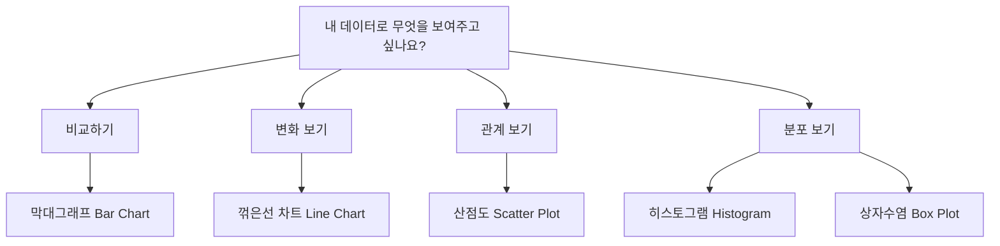
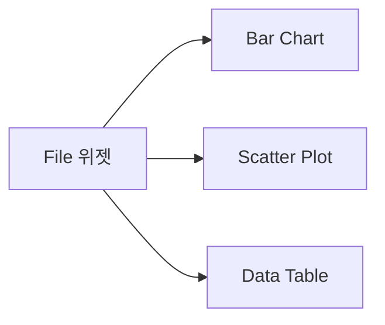
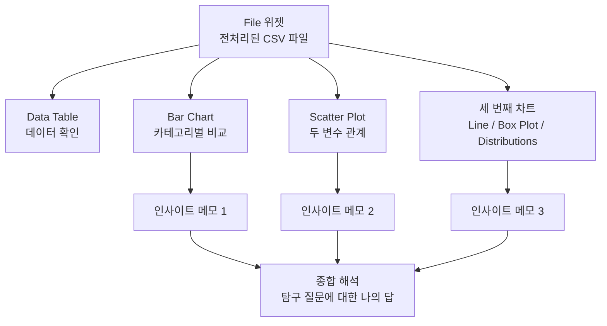

# Chapter 12: 프로젝트 시각화 - 데이터로 이야기 만들기

---

## 🎯 이 장에서 배우는 것

- [ ] 전처리된 데이터를 2가지 이상의 시각화 방법으로 표현할 수 있다.
- [ ] 시각화 결과에서 패턴이나 경향성을 발견하여 인사이트를 도출할 수 있다.
- [ ] 같은 데이터도 관점에 따라 다르게 해석될 수 있음을 이해하고 설명할 수 있다.

---

## 💡 왜 이걸 배우나요?

숫자가 가득한 표를 보면 어떤 느낌이 드나요? 눈이 피로하고, 무슨 의미인지 한눈에 들어오지 않죠. 그런데 같은 숫자를 막대그래프나 꺾은선 차트로 바꾸면 순간적으로 "아, 이쪽이 높구나!" 또는 "시간이 지날수록 늘어나고 있네!"라는 사실이 보이기 시작합니다.

데이터 시각화는 단순히 예쁜 그림을 만드는 작업이 아닙니다. **데이터 속에 숨어 있는 이야기를 꺼내는 도구**입니다. 전처리를 통해 깨끗하게 정리된 데이터는, 시각화를 통해 비로소 '의미 있는 정보'로 변환됩니다.

이번 챕터에서는 여러분이 이전 챕터에서 정리한 데이터를 오렌지3(Orange3)로 시각화하고, 그 안에서 직접 패턴과 인사이트를 발견해 볼 것입니다. 같은 데이터라도 어떤 차트를 선택하느냐, 어떤 관점으로 보느냐에 따라 전혀 다른 이야기가 만들어질 수 있다는 사실도 함께 경험하게 됩니다.

> 📌 **알아보기:** 데이터 시각화를 잘 활용하는 직업에는 데이터 분석가, 저널리스트, 과학자, 경영자 등이 있습니다. 뉴스에서 보이는 '코로나 확진자 추이 그래프'나 '선거 결과 지도'도 모두 데이터 시각화의 결과물입니다.

---

## 📚 핵심 개념

### 개념 1: 데이터 시각화란 무엇인가?

**비유로 시작:** 요리사가 식재료를 다듬고 나서 맛있는 요리로 완성하듯이, 데이터 분석가는 전처리된 데이터를 시각화라는 과정으로 '완성된 요리'처럼 만들어냅니다. 재료(데이터)가 아무리 좋아도 제대로 요리(시각화)하지 않으면 그 맛(가치)을 전달하기 어렵습니다.

**정확한 정의:** 데이터 시각화(Data Visualization)란 숫자와 텍스트로 이루어진 데이터를 그래프, 차트, 지도 등 시각적 형태로 변환하여 패턴, 경향성, 이상값 등을 직관적으로 파악할 수 있게 만드는 과정입니다.

**예시로 확인:**

아래 두 가지를 비교해 보세요.

**[숫자만 있는 경우]**
- 1월: 120명, 2월: 135명, 3월: 98명, 4월: 160명, 5월: 175명

**[꺾은선 차트로 표현한 경우]**
- 1월부터 2월까지 증가 → 3월 급감 → 4월~5월 다시 증가

꺾은선 차트로 보면 "3월에 무슨 일이 있었을까?"라는 탐구 질문이 자연스럽게 떠오릅니다. 이것이 시각화의 힘입니다.

---

### 개념 2: 차트 유형 선택하기

**비유로 시작:** 도구 상자에는 망치, 드라이버, 톱 등 다양한 도구가 있습니다. 못을 박을 때 드라이버를 쓰면 안 되듯이, 데이터의 성격에 맞는 차트를 선택해야 올바른 이야기를 전달할 수 있습니다.

**정확한 정의:** 각 차트 유형은 특정 유형의 데이터와 특정 질문에 최적화되어 있습니다. 목적에 맞는 차트를 선택하는 것이 좋은 시각화의 첫걸음입니다.

**예시로 확인:**

- **막대그래프**: 카테고리별 값을 비교할 때 (예: 반별 평균 점수 비교)
- **꺾은선 차트**: 시간에 따른 변화를 볼 때 (예: 월별 기온 변화)
- **산점도**: 두 변수 사이의 관계를 볼 때 (예: 공부 시간과 성적의 관계)
- **히스토그램**: 하나의 수치 데이터가 어떻게 분포되어 있는지 볼 때 (예: 학생들의 키 분포)

---

### 개념 3: 인사이트 도출하기

**비유로 시작:** 탐정이 단서들을 연결해서 범인을 추리하듯이, 데이터 분석가는 차트에서 보이는 패턴들을 연결하여 의미 있는 결론(인사이트)을 이끌어냅니다.

**정확한 정의:** 인사이트(Insight)란 데이터 시각화를 통해 발견한 패턴, 경향성, 예외적인 값 등을 해석하여 탐구 질문에 대한 답이나 새로운 발견을 표현한 문장입니다.

**예시로 확인:**

좋은 인사이트는 다음 구조로 작성합니다.

> **"[무엇을] 보면, [어떤 패턴]이 보인다. 이것은 [무슨 의미]일 수 있다."**

예시:
- ❌ 나쁜 인사이트: "3월 방문자가 적었다."
- ✅ 좋은 인사이트: "3월 방문자 수가 다른 달보다 약 27% 적었는데, 이것은 방학이 끝나고 학기 초라 야외 활동이 줄어들었기 때문일 수 있다."

---

### 개념 4: 다양한 해석 가능성

**비유로 시작:** 같은 하늘을 보고 화가는 "오늘 노을이 아름답다"고 하고, 농부는 "내일 비가 오겠구나"라고 합니다. 보는 사람의 관점과 목적에 따라 같은 것에서 다른 의미를 읽어냅니다.

**정확한 정의:** 데이터 시각화 결과는 보는 사람의 배경 지식, 관심사, 목적에 따라 다르게 해석될 수 있습니다. 이것은 분석의 약점이 아니라, 데이터가 가진 다층적인 의미를 보여주는 특성입니다. 중요한 것은 자신의 해석이 **데이터에 근거**하고 있는지 항상 확인하는 것입니다.

> 📌 **생각해보기:** "우리 반 수학 평균 점수가 지난 학기보다 5점 올랐다"는 차트를 보고, 학생은 "공부를 열심히 한 덕분이다", 선생님은 "시험이 쉬워진 것일 수 있다", 학부모는 "학원 효과가 있었다"고 각각 다르게 해석할 수 있습니다. 누가 맞고 틀린 게 아니라, 각자의 관점이 다른 것입니다.

---

## 🔨 따라하기

이번 실습에서는 오렌지3(Orange3)를 사용하여 데이터를 시각화하고, 발견한 인사이트를 기록하는 과정을 따라합니다. 이전 챕터에서 전처리한 데이터 파일을 준비하세요. 예제에서는 '학교 급식 잔반량 데이터'를 사용합니다.

---

### Step 1: 오렌지3에서 데이터 불러오기

1. 오렌지3를 실행합니다.
2. 좌측 위젯 패널에서 **Data → File** 위젯을 캔버스로 드래그합니다.
3. File 위젯을 더블클릭하고, 이전 챕터에서 저장한 전처리 완료 CSV 파일을 선택합니다.
4. **Data → Data Table** 위젯을 캔버스에 추가하고, File 위젯과 연결합니다.
5. Data Table을 열어 데이터가 올바르게 불러와졌는지 확인합니다.

> ✅ **확인 포인트:** 빈 값(결측치)이 없는지, 숫자 열이 숫자로 인식되고 있는지 Data Table에서 반드시 점검하세요.

---

### Step 2: 첫 번째 시각화 - 막대그래프 만들기

1. 좌측 패널에서 **Visualize → Bar Chart** 위젯을 캔버스에 드래그합니다.
2. File 위젯과 Bar Chart 위젯을 연결합니다.
3. Bar Chart 위젯을 더블클릭하여 설정 창을 엽니다.
4. 아래와 같이 설정합니다.
   - **Variable**: 비교하고 싶은 카테고리 열 선택 (예: '요일')
   - **Bars**: 수치 열 선택 (예: '잔반량_kg')
   - **Group by**: 추가로 색상으로 구분하고 싶은 열이 있으면 선택 (선택사항)
5. 차트가 생성되면, 가장 높은 막대와 가장 낮은 막대가 어떤 카테고리인지 메모합니다.

> 📌 **알아보기:** 막대그래프에서 가장 높거나 낮은 값은 분석의 출발점이 됩니다. "왜 이 카테고리가 다른 것보다 유독 높을까?"라는 질문이 바로 인사이트로 이어집니다.

---

### Step 3: 두 번째 시각화 - 산점도 만들기

1. 좌측 패널에서 **Visualize → Scatter Plot** 위젯을 캔버스에 드래그합니다.
2. File 위젯과 Scatter Plot 위젯을 연결합니다.
3. Scatter Plot 위젯을 더블클릭합니다.
4. 아래와 같이 설정합니다.
   - **X축**: 원인으로 생각하는 변수 (예: '기온_도씨')
   - **Y축**: 결과로 생각하는 변수 (예: '잔반량_kg')
   - **Color**: 카테고리 열을 선택하면 색상으로 구분됩니다 (예: '계절')
5. 점들의 분포를 관찰합니다.
   - 점들이 오른쪽 위로 모인다면 → 양의 상관관계
   - 점들이 오른쪽 아래로 모인다면 → 음의 상관관계
   - 점들이 퍼져 있다면 → 관계 없음

---

### Step 4: 세 번째 시각화 선택하기 (자율)

지금까지 막대그래프와 산점도 두 가지를 만들었습니다. 이제 데이터의 특성에 맞춰 세 번째 시각화를 직접 선택해 보세요.

**선택 가이드:**
- 데이터에 날짜/시간 열이 있다면 → **Line Chart** 선택
- 하나의 수치 데이터가 어떻게 퍼져있는지 보고 싶다면 → **Box Plot** 선택
- 전체 중 각 항목의 비율을 보고 싶다면 → **Distributions** 선택

선택한 위젯을 File 위젯과 연결하고, Step 2~3과 같은 방식으로 설정합니다.

---

### Step 5: 인사이트 메모하기

시각화를 보면서 발견한 내용을 아래 형식으로 메모지나 노트에 기록합니다. 적어도 각 차트당 인사이트 1개 이상을 작성하세요.

**인사이트 작성 템플릿:**

> **차트 종류**: (예: 막대그래프)
> **발견한 패턴**: (예: 금요일 잔반량이 월요일보다 2배 많다)
> **가능한 해석**: (예: 주말이 다가올수록 학생들이 점심에 집중하지 않는 것 같다)
> **추가로 확인하고 싶은 것**: (예: 금요일 메뉴가 특별히 인기 없는 메뉴인지 확인해야 한다)

---

### Step 6: 같은 데이터, 다른 이야기 실험하기

이번 단계는 '다양한 해석 가능성'을 직접 경험하는 단계입니다.

1. Step 2에서 만든 Bar Chart 설정 창을 다시 엽니다.
2. X축에 있는 변수를 다른 카테고리 열로 바꿔봅니다. (예: '요일' → '메뉴 종류')
3. 새롭게 바뀐 차트를 보고, 이전 차트와 어떤 다른 이야기가 보이는지 비교합니다.
4. 모둠원 또는 옆 친구와 서로의 차트를 보여주고, 같은 차트에서 다른 해석이 나오는지 이야기해 봅니다.

> 📌 **정리하기:** 시각화 변수를 바꾸면 같은 데이터에서 완전히 다른 질문에 대한 답을 얻을 수 있습니다. 이것이 데이터 분석에서 '탐색적 분석(Exploratory Analysis)'이라고 부르는 과정입니다.

---

## 📝 전체 워크플로우 정리

오렌지3에서 이번 실습의 전체 연결 구조는 다음과 같습니다.

---

## ⚠️ 자주 하는 실수

**실수 1: 모든 데이터에 막대그래프만 쓰기**

막대그래프는 범용적이지만, 시간 변화를 볼 때는 꺾은선 차트가, 두 변수의 관계를 볼 때는 산점도가 훨씬 더 명확한 이야기를 전달합니다. 데이터의 성격과 탐구 질문을 먼저 생각하고 차트를 선택하세요.

**실수 2: 인사이트 없이 차트만 나열하기**

"막대그래프를 만들었습니다"는 분석이 아닙니다. 차트를 만드는 것은 과정이고, 그 차트에서 **무엇을 발견했는지** 서술하는 것이 진짜 분석입니다. 차트를 만들고 나서 반드시 "그래서 뭘 알게 됐지?"라고 스스로 질문하세요.

**실수 3: 데이터에 없는 해석 만들기**

차트에서 보이지 않는 내용을 상상으로 채우는 것은 위험합니다. 예를 들어 잔반량이 많은 것을 보고 "학생들이 밥을 싫어한다"고 결론짓는 것은 데이터 근거가 없습니다. 항상 "이 해석의 근거가 차트 어디에 있나?"를 확인하세요.

**실수 4: Y축 범위를 조작하여 과장된 차트 만들기**

오렌지3에서 Y축 시작값을 0이 아닌 다른 숫자로 설정하면, 작은 차이가 매우 크게 보일 수 있습니다. 이것은 의도치 않게 잘못된 인상을 줄 수 있으므로, 가능하면 Y축은 0에서 시작하도록 설정하세요.

**실수 5: 첫 번째 차트에서 결론 내리고 멈추기**

하나의 차트만 보고 최종 결론을 내리는 것은 섣부른 판단입니다. 다른 차트로 같은 질문을 다시 확인하거나, 다른 각도에서 데이터를 탐색하여 결론을 검증하는 습관을 가지세요.

---

## ✅ 스스로 점검하기

**기본 문제**

1. 오렌지3에서 두 가지 이상의 차트를 만들었나요? 어떤 차트를 선택했고, 그 이유는 무엇인가요?

2. 각 차트에서 발견한 패턴을 한 문장으로 써보세요.
   - 첫 번째 차트에서 발견한 패턴:
   - 두 번째 차트에서 발견한 패턴:

3. 아래 빈칸을 채워 좋은 인사이트 문장을 완성해보세요.
   > "[     ]을/를 보면, [     ]이/가 보인다. 이것은 [     ] 때문일 수 있다."

**응용 문제**

4. 같은 데이터를 보고 두 가지 다른 해석이 가능한 상황을 하나 만들어보세요. (예: "잔반량이 많다 → 해석 A: 음식이 맛없어서 / 해석 B: 양이 너무 많아서") 두 해석 중 어느 것이 더 설득력 있는지, 그 이유도 함께 쓰세요.

5. 내 차트에서 가장 인상적인 발견 하나를 골라, 그것이 탐구 질문의 답과 어떻게 연결되는지 설명해 보세요.

---

## 🚀 더 해보기

**도전 문제: 예상과 달랐던 것 찾기**

시각화 결과를 보면서, 처음에 예상했던 것과 **다르게 나온 부분을 하나** 찾아보세요. 그리고 아래 형식으로 작성해 봅니다.

> **내가 예상했던 것**: (예: 더운 날일수록 잔반량이 줄어들 것이라 생각했다)
> **실제 데이터가 보여준 것**: (예: 오히려 기온이 높을수록 잔반량이 약간 증가했다)
> **내가 추론하는 이유**: (예: 더운 날에는 식욕이 없어서 음식을 먹기 싫어하기 때문일 수 있다)
> **이를 확인하려면 추가로 필요한 데이터**: (예: 날씨별 학생 설문 데이터)

이 연습이 중요한 이유는, 예상과 다른 결과야말로 새로운 발견의 씨앗이 되기 때문입니다. 과학적 발견의 많은 부분이 "왜 예상대로 안 됐을까?"라는 질문에서 시작됩니다.

**보너스 활동:** 모둠원들과 각자의 차트와 인사이트를 공유하고, "가장 흥미로운 발견"을 하나씩 투표로 선정해 보세요. 왜 그 발견이 흥미로운지 이야기해 보는 것도 훌륭한 데이터 토론 경험이 됩니다.

---

## 핵심 개념 요약

- **데이터 시각화**: 숫자와 텍스트 데이터를 그래프/차트로 변환하여 패턴을 직관적으로 파악하는 과정
- **차트 선택 원칙**: 탐구 목적에 맞는 차트 선택 — 비교는 막대그래프, 변화는 꺾은선, 관계는 산점도, 분포는 히스토그램
- **좋은 인사이트**: "[무엇]을 보면 [어떤 패턴]이 보인다. 이는 [무슨 의미]일 수 있다" 구조로 데이터 근거를 포함하여 서술
- **다양한 해석 가능성**: 같은 차트도 보는 사람의 관점에 따라 다르게 해석될 수 있으며, 중요한 것은 해석이 데이터에 근거하는지 확인하는 것

---

## 🔗 다음 장으로

이번 챕터에서 여러분은 데이터를 차트로 만들고, 그 안에서 패턴과 인사이트를 발견하는 경험을 했습니다. 이제 분석의 재료가 준비된 셈입니다.

**다음 챕터 (Chapter 13)**에서는 지금까지 수집, 전처리, 시각화한 모든 과정을 하나의 완성된 '데이터 스토리'로 엮어서 발표 자료를 만드는 방법을 배웁니다. 어떻게 하면 나의 분석 결과를 다른 사람에게 설득력 있게 전달할 수 있을지, 데이터 스토리텔링의 핵심 기술을 익혀봅시다.

> 💬 **준비 과제:** 이번 챕터에서 작성한 인사이트 메모를 잘 보관해 두세요. 다음 챕터에서 발표 자료를 만들 때 핵심 내용으로 활용할 것입니다.

---