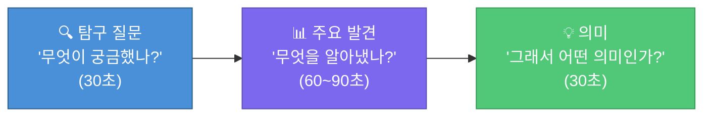
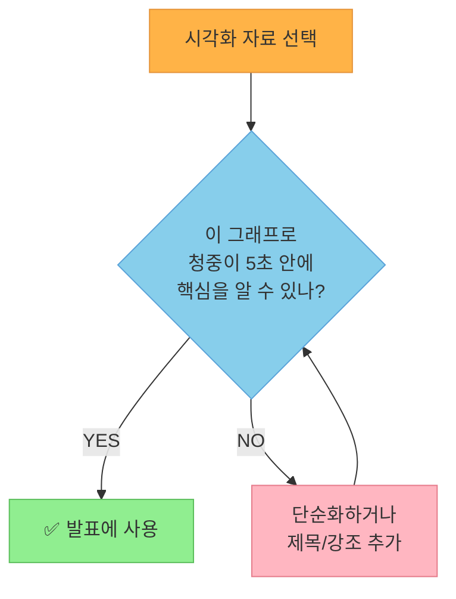
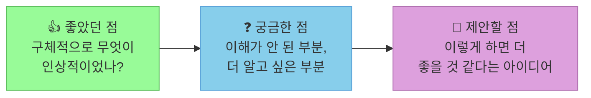

# Chapter 14: 발표와 피드백 - 데이터로 소통하기

**Part 5: [2권] 프로젝트 - 나만의 데이터 이야기 | 16차시 중 14차시**

---

## 🎯 이 장에서 배우는 것

- [ ] 데이터 분석 결과를 논리적인 흐름으로 발표할 수 있다.
- [ ] 시각화 자료를 활용하여 핵심 인사이트를 2~3분 안에 전달할 수 있다.
- [ ] 다른 학생의 발표를 듣고 건설적인 피드백을 작성할 수 있다.
- [ ] 받은 피드백을 분석하여 보고서 개선 계획을 세울 수 있다.

---

## 💡 왜 이걸 배우나요?

여러분은 지금까지 데이터를 수집하고, 분석하고, 시각화하고, 보고서까지 작성했습니다. 그런데 아무리 훌륭한 분석도 **다른 사람에게 전달되지 않으면** 의미가 절반으로 줄어듭니다.

실제로 데이터 과학자들이 가장 어렵다고 꼽는 기술 중 하나가 바로 **"비전문가에게 데이터 이야기를 전달하는 것"** 입니다. 복잡한 숫자와 그래프를 누구나 이해할 수 있는 이야기로 바꾸는 것, 그것이 이번 장의 핵심입니다.

또한 친구들의 발표를 듣고 **좋은 피드백**을 주는 것도 중요한 능력입니다. 좋은 피드백은 발표자를 성장시키고, 피드백을 주는 사람도 스스로의 사고를 정리하는 기회가 됩니다.

> **생각해보기:** 여러분이 지금까지 들어본 발표 중 가장 기억에 남는 발표는 무엇인가요? 왜 기억에 남았나요?

---

## 📚 핵심 개념

### 개념 1: 발표의 3단계 구조 - "탐구 질문 → 주요 발견 → 의미"

**비유로 시작:** 발표는 탐정이 사건을 해결하는 과정과 같습니다. 탐정은 "어떤 사건이 있었는가?(질문)"를 먼저 설명하고, "무엇을 발견했는가?(증거)"를 보여준 다음, "그래서 범인은 누구인가?(결론)"를 제시합니다. 데이터 발표도 정확히 같은 구조입니다.

**정확한 정의:** 데이터 발표의 3단계 구조는 청중이 자연스럽게 이야기를 따라올 수 있도록 설계된 논리적 흐름입니다.



**예시로 확인:**

> **나쁜 발표 예시:**
> "저는 편의점 음료 데이터를 분석했습니다. 탄산음료가 234개, 주스가 145개, 에너지음료가 89개였습니다. 평균 가격은 1,823원이고 표준편차는 412원이었습니다..."
>
> **좋은 발표 예시:**
> "(질문) 저는 '편의점에서 10대가 가장 많이 사는 음료는 무엇인가?'라는 질문에서 시작했습니다. (발견) 분석 결과, 가격이 1,500원 이하인 탄산음료가 전체의 48%를 차지했고, 특히 월요일 아침 판매량이 급증했습니다. (의미) 이는 10대가 등굣길에 저렴한 탄산음료를 선호한다는 의미입니다. 편의점은 이 시간대에 할인 프로모션을 강화하면 효과적일 것입니다."

---

### 개념 2: 시각화 자료를 발표에서 활용하는 법

**비유로 시작:** 시각화 자료는 발표의 "조연"입니다. 영화에서 좋은 조연이 주인공(발표자)을 더 빛나게 하듯, 잘 활용된 그래프는 여러분의 말을 더 강력하게 만들어 줍니다. 하지만 조연이 너무 많으면 이야기가 산만해지죠.

**정확한 정의:** 발표용 시각화는 보고서용 시각화와 다릅니다. 보고서는 독자가 천천히 읽으며 이해하지만, 발표는 청중이 **5초 안에** 핵심을 파악해야 합니다.



**발표용 시각화 3가지 원칙:**

- **하나의 그래프 = 하나의 메시지**: 그래프 하나에서 하나의 사실만 전달합니다.
- **핵심을 강조**: 파이썬 코드로 특정 막대나 점을 빨간색으로 강조합니다.
- **제목은 결론으로**: "월별 판매량 그래프"가 아니라 "3월에 판매량이 2배 급증!"처럼 제목 자체가 메시지입니다.

---

### 개념 3: 건설적인 피드백의 구조 - "칭찬 / 질문 / 제안"

**비유로 시작:** 피드백은 선물 포장과 같습니다. 좋은 선물(제안)도 포장(칭찬)이 예쁘면 더 기꺼이 받게 됩니다. 반대로 포장 없이 그냥 던지면 아무리 좋은 내용이라도 상처가 될 수 있습니다.

**정확한 정의:** 건설적인 피드백이란 발표자가 실제로 개선에 활용할 수 있도록 구체적이고 친절하게 작성된 의견입니다.



**예시로 확인:**

> **나쁜 피드백:**
> "발표가 좋았어요. 그래프가 좀 복잡했어요."
>
> **좋은 피드백:**
> - **좋았던 점**: 탐구 질문이 명확해서 발표 전체를 따라가기 쉬웠습니다. 특히 3월 데이터를 빨간색으로 강조한 그래프가 한눈에 들어왔습니다.
> - **궁금한 점**: 3월에 판매량이 급증한 이유가 날씨 때문인지, 아니면 다른 이유(행사, 할인 등)가 있는지 궁금했습니다.
> - **제안할 점**: 마지막 결론 부분에서 "만약 이 분석이 맞다면, 실제로 어떤 행동을 제안하는가?"를 한 문장 더 추가하면 발표가 더 완성도 있을 것 같습니다.

---

### 개념 4: 피드백을 개선으로 연결하는 방법

**비유로 시작:** 피드백을 받는 것은 거울을 보는 것과 같습니다. 거울은 내가 보지 못하는 뒷모습을 보여줍니다. 하지만 거울을 본다고 해서 자동으로 머리가 정돈되지는 않죠. 거울(피드백)을 보고 **직접 행동(개선)**해야 합니다.

**정확한 정의:** 피드백을 개선으로 연결하는 과정은 피드백을 분류하고, 우선순위를 정하고, 구체적인 행동 계획을 세우는 3단계로 이루어집니다.

**피드백 분류 방법:**

- **바로 적용 가능**: 오탈자 수정, 그래프 제목 변경, 색상 강조 추가 등
- **추가 분석 필요**: "3월 급증 이유가 날씨인지 확인해줬으면" → 날씨 데이터 수집 후 분석
- **다음 프로젝트에 반영**: 발표 시간 배분, 전체 구조 개선 등

> **알아보기:** 모든 피드백을 반드시 반영할 필요는 없습니다! 피드백이 서로 충돌하거나, 자신의 분석 방향과 맞지 않는다면 **왜 반영하지 않는지**를 논리적으로 설명하는 것도 훌륭한 역량입니다.

---

## 🔨 따라하기

이번 따라하기는 코드보다 **실제 발표 준비와 피드백 작성**에 집중합니다. 파이썬 코드는 발표용 시각화 강조 방법을 중심으로 다룹니다.

---

### Step 1: 발표 스크립트 초안 작성하기 (15분)

3단계 구조에 맞춰 발표 스크립트를 직접 작성합니다. 아래 템플릿을 활용하세요.

**발표 스크립트 템플릿:**

**[탐구 질문 - 30초]**
"저는 \_\_\_\_\_\_에 대해 궁금했습니다. 구체적으로 '\_\_\_\_\_\_인가?'라는 질문을 탐구했습니다."

**[주요 발견 - 60~90초]**
"분석 결과, 첫 번째로 \_\_\_\_\_\_ 를 발견했습니다. (그래프 1 제시)
두 번째로 \_\_\_\_\_\_ 라는 흥미로운 패턴이 보였습니다. (그래프 2 제시)"

**[의미 - 30초]**
"이 결과가 의미하는 것은 \_\_\_\_\_\_ 입니다. 만약 이 분석이 맞다면, \_\_\_\_\_\_ 를 제안합니다."

> **생각해보기:** 스크립트를 소리 내어 읽어보세요. 2분이 넘으면 어떤 부분을 줄일 수 있을지 표시해 보세요.

---

### Step 2: 발표용 시각화 강조하기 (코드 실습)

청중이 5초 안에 핵심을 파악하도록 그래프에서 **중요한 부분을 강조**합니다.

```python
import matplotlib.pyplot as plt
import matplotlib.patches as mpatches
import numpy as np

# 예시 데이터: 월별 음료 판매량
months = ['1월', '2월', '3월', '4월', '5월', '6월']
sales = [120, 135, 280, 190, 210, 230]

# 강조할 달 설정 (3월 = 인덱스 2)
highlight_index = 2

# 색상 설정: 강조 달은 빨강, 나머지는 회색
colors = ['#BBBBBB'] * len(months)
colors[highlight_index] = '#E74C3C'

fig, ax = plt.subplots(figsize=(10, 6))

bars = ax.bar(months, sales, color=colors, edgecolor='white', linewidth=0.5)

# 핵심 메시지를 제목으로
ax.set_title('3월에 판매량이 2배 급증!', fontsize=16, fontweight='bold', pad=15)
ax.set_ylabel('판매량 (개)', fontsize=12)

# 강조 막대 위에 값 표시
for i, (bar, val) in enumerate(zip(bars, sales)):
    if i == highlight_index:
        ax.text(bar.get_x() + bar.get_width()/2, val + 5,
                f'{val}개 ⬆', ha='center', va='bottom',
                fontsize=12, fontweight='bold', color='#E74C3C')

# 설명 텍스트 추가
ax.annotate('이전 달보다\n107% 증가',
            xy=(highlight_index, sales[highlight_index]),
            xytext=(highlight_index + 1.2, sales[highlight_index] + 30),
            arrowprops=dict(arrowstyle='->', color='#E74C3C'),
            fontsize=10, color='#E74C3C')

plt.tight_layout()
plt.savefig('presentation_chart.png', dpi=150, bbox_inches='tight')
plt.show()
```

> **알아보기:** 위 코드에서 `highlight_index`를 바꾸면 다른 달을 강조할 수 있습니다. 여러분의 데이터에서 가장 중요한 시점의 인덱스로 바꿔 적용해 보세요.

---

### Step 3: 피드백 시트 작성하기 (친구 발표 청취 후)

친구의 발표를 들으면서 아래 피드백 시트를 작성합니다.

**피드백 시트 (발표자 이름: \_\_\_\_\_\_ / 내 이름: \_\_\_\_\_\_)**

**👍 좋았던 점 (최소 2가지, 구체적으로):**
- 좋았던 점 1: 어떤 장면에서 어떤 점이 좋았나요?
- 좋았던 점 2:

**❓ 궁금한 점 (최소 1가지):**
- 발표를 듣고 더 알고 싶어진 것, 이해가 안 된 부분

**💬 제안할 점 (최소 1가지, 구체적이고 친절하게):**
- "~하면 더 좋을 것 같다"는 형식으로 작성

**⭐ 한 줄 총평:**
- 이 발표를 한 단어 또는 한 문장으로 표현한다면?

---

### Step 4: 받은 피드백 분류하기

발표 후 받은 피드백 시트를 모아서 아래 기준으로 분류합니다.

```python
# 피드백 분류 정리 (코드로 기록하기)
# 실제 피드백 내용으로 채워넣으세요

feedback_list = [
    {"내용": "그래프 제목이 너무 길었다", "유형": "바로 적용"},
    {"내용": "3월 급증 이유를 더 분석해줬으면", "유형": "추가 분석"},
    {"내용": "발표 속도가 너무 빨랐다", "유형": "다음 프로젝트"},
    # 받은 피드백을 여기에 추가하세요
]

# 유형별 분류 출력
바로적용 = [f for f in feedback_list if f["유형"] == "바로 적용"]
추가분석 = [f for f in feedback_list if f["유형"] == "추가 분석"]
다음프로젝트 = [f for f in feedback_list if f["유형"] == "다음 프로젝트"]

print("=== 피드백 분류 결과 ===")
print(f"\n✅ 바로 적용 가능 ({len(바로적용)}개):")
for f in 바로적용:
    print(f"  - {f['내용']}")

print(f"\n🔍 추가 분석 필요 ({len(추가분석)}개):")
for f in 추가분석:
    print(f"  - {f['내용']}")

print(f"\n📌 다음 프로젝트 반영 ({len(다음프로젝트)}개):")
for f in 다음프로젝트:
    print(f"  - {f['내용']}")
```

---

### Step 5: 개선 계획 작성하기

가장 인상 깊었던 피드백 1개를 선택하고, 아래 형식으로 개선 계획을 작성합니다.

**개선 계획 템플릿:**

**선택한 피드백:** "\_\_\_\_\_\_\_\_\_\_"

**이 피드백을 선택한 이유:** 이 의견이 가장 중요하다고 생각한 이유는 \_\_\_\_\_\_ 입니다.

**구체적인 개선 방법:**
- 변경할 내용: (예: 그래프 제목을 "월별 판매량"에서 "3월에 판매량 2배 급증!"으로 수정)
- 필요한 추가 작업: (예: 날씨 데이터를 추가 수집하여 상관관계 분석)
- 예상 소요 시간: \_\_\_\_분

**반영하지 않을 피드백과 이유:** \_\_\_\_\_\_ 피드백은 \_\_\_\_\_\_ 이유로 이번에는 반영하지 않겠습니다.

---

### Step 6: 개선된 스크립트로 다시 발표해보기 (선택)

피드백을 반영하여 스크립트를 수정하고, 짝과 함께 **1분 30초** 안에 발표를 다시 해봅니다.

> **생각해보기:** 처음 발표와 두 번째 발표의 차이가 느껴지나요? 어떤 점이 달라졌나요?

---

## 📝 전체 코드

발표용 강조 시각화 완성 버전입니다. 여러분의 실제 데이터로 교체하여 사용하세요.

```python
import matplotlib.pyplot as plt
import matplotlib.font_manager as fm

# 한글 폰트 설정 (환경에 따라 다를 수 있음)
plt.rcParams['font.family'] = 'Malgun Gothic'  # Windows
# plt.rcParams['font.family'] = 'AppleGothic'  # Mac
plt.rcParams['axes.unicode_minus'] = False

def create_presentation_chart(categories, values, highlight_index,
                               title, ylabel, save_path=None):
    """
    발표용 강조 막대 차트를 생성합니다.
    
    Parameters:
        categories: x축 카테고리 리스트
        values: y축 값 리스트
        highlight_index: 강조할 항목의 인덱스
        title: 그래프 제목 (핵심 메시지!)
        ylabel: y축 라벨
        save_path: 저장 경로 (None이면 화면에만 표시)
    """
    colors = ['#BBBBBB'] * len(categories)
    colors[highlight_index] = '#E74C3C'
    
    fig, ax = plt.subplots(figsize=(10, 6))
    bars = ax.bar(categories, values, color=colors,
                  edgecolor='white', linewidth=0.8, width=0.6)
    
    # 제목은 반드시 핵심 메시지
    ax.set_title(title, fontsize=16, fontweight='bold', pad=20)
    ax.set_ylabel(ylabel, fontsize=12)
    
    # 모든 막대 위에 값 표시
    for i, (bar, val) in enumerate(zip(bars, values)):
        color = '#E74C3C' if i == highlight_index else '#555555'
        weight = 'bold' if i == highlight_index else 'normal'
        ax.text(bar.get_x() + bar.get_width()/2, val + max(values)*0.01,
                str(val), ha='center', va='bottom',
                fontsize=11, fontweight=weight, color=color)
    
    # 강조 막대에 테두리 추가
    bars[highlight_index].set_edgecolor('#C0392B')
    bars[highlight_index].set_linewidth(2.5)
    
    # 배경 격자 (연하게)
    ax.yaxis.grid(True, linestyle='--', alpha=0.4, color='gray')
    ax.set_axisbelow(True)
    ax.spines['top'].set_visible(False)
    ax.spines['right'].set_visible(False)
    
    plt.tight_layout()
    
    if save_path:
        plt.savefig(save_path, dpi=150, bbox_inches='tight')
        print(f"✅ 그래프 저장 완료: {save_path}")
    
    plt.show()

# ===== 실제 사용 예시 =====
# 아래 값들을 여러분의 데이터로 교체하세요!

categories = ['1월', '2월', '3월', '4월', '5월', '6월']
values = [120, 135, 280, 190, 210, 230]
highlight_index = 2  # 강조할 항목 인덱스

create_presentation_chart(
    categories=categories,
    values=values,
    highlight_index=highlight_index,
    title='3월에 판매량이 2배 급증!',  # ← 핵심 메시지로 작성!
    ylabel='판매량 (개)',
    save_path='my_presentation_chart.png'
)
```

---

## ⚠️ 자주 하는 실수

**실수 1: 숫자를 너무 많이 보여주기**

발표 중에 "평균은 1,823원, 중앙값은 1,500원, 표준편차는 412원, 최솟값은 800원, 최댓값은 3,200원입니다"처럼 모든 통계량을 읽는 경우가 있습니다. 청중은 이 숫자들을 전부 기억하지 못합니다. **가장 중요한 숫자 1~2개만** 강조하고, 나머지는 보고서에서 확인하도록 안내하세요.

**실수 2: 그래프를 화면에 띄워놓고 그냥 서 있기**

그래프를 보여줄 때는 반드시 **"이 그래프에서 중요한 점은 빨간 막대, 즉 3월입니다"** 처럼 구체적으로 짚어줘야 합니다. 청중은 발표자가 무엇을 보라고 하는지 모릅니다.

**실수 3: 피드백을 개인적으로 받아들이기**

"그래프가 복잡했다"는 피드백은 "내가 부족하다"는 의미가 아니라 "이 그래프를 더 단순하게 만들면 더 좋다"는 기술적 제안입니다. 피드백은 **작업물**에 대한 것이지, **사람**에 대한 평가가 아닙니다.

**실수 4: "좋았습니다"로 끝나는 피드백 주기**

"발표가 좋았어요"는 발표자에게 아무런 도움이 되지 않습니다. 반드시 **어떤 점이, 왜** 좋았는지 구체적으로 작성하세요. 예: "탐구 질문을 첫 문장에 바로 제시해서 발표 전체 방향을 이해하기 쉬웠습니다."

**실수 5: 모든 피드백을 반드시 반영해야 한다고 생각하기**

서로 모순되는 피드백(한 친구는 "더 빠르게", 다른 친구는 "더 천천히")을 동시에 반영할 수는 없습니다. 자신의 분석 목적과 청중을 고려하여 **선택적으로 반영**하고, 반영하지 않는 이유를 논리적으로 설명할 수 있으면 됩니다.

---

## ✅ 스스로 점검하기

**기본 문제 (발표 구조 이해)**

아래 발표 내용의 빈칸에 들어갈 단계를 적어보세요.

> "저는 '중학생이 가장 많이 사용하는 SNS는 무엇인가?'를 탐구했습니다." → 이것은 **( ① )** 단계입니다.
>
> "설문 결과, 인스타그램이 67%로 1위였고, 유튜브가 58%로 2위였습니다." → 이것은 **( ② )** 단계입니다.
>
> "이는 10대가 텍스트보다 이미지/영상 콘텐츠를 선호한다는 의미입니다." → 이것은 **( ③ )** 단계입니다.

**응용 문제 (피드