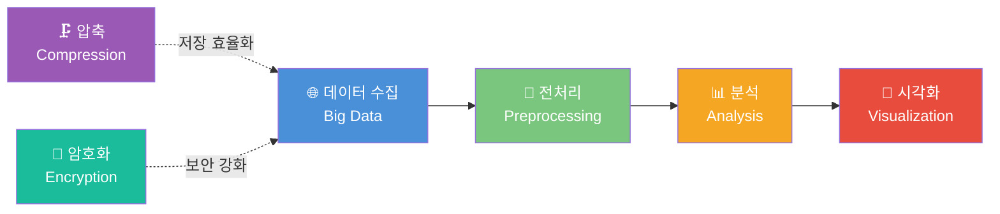
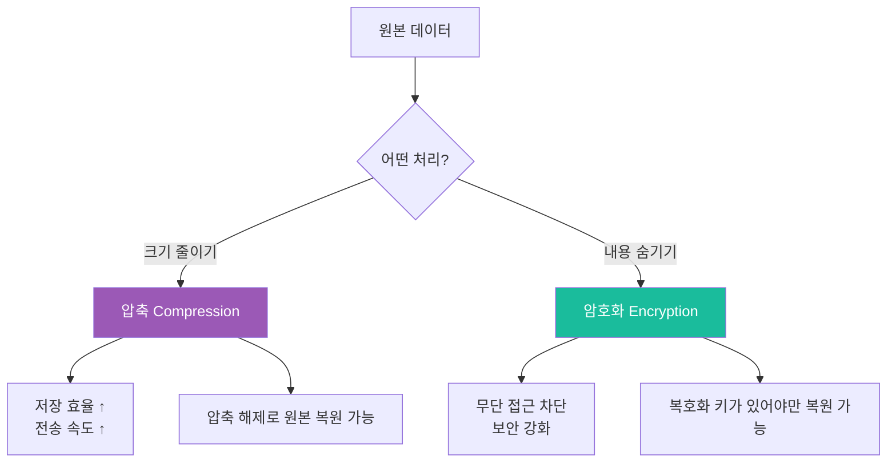
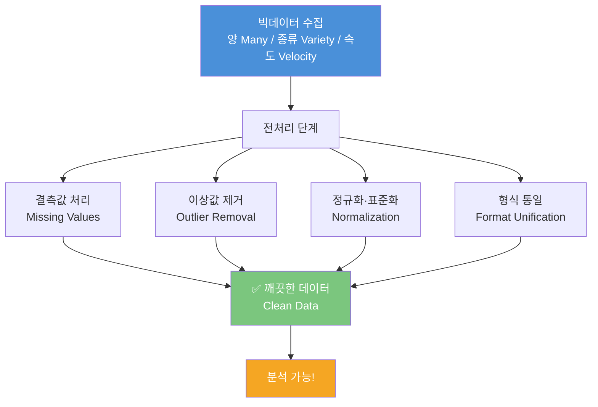
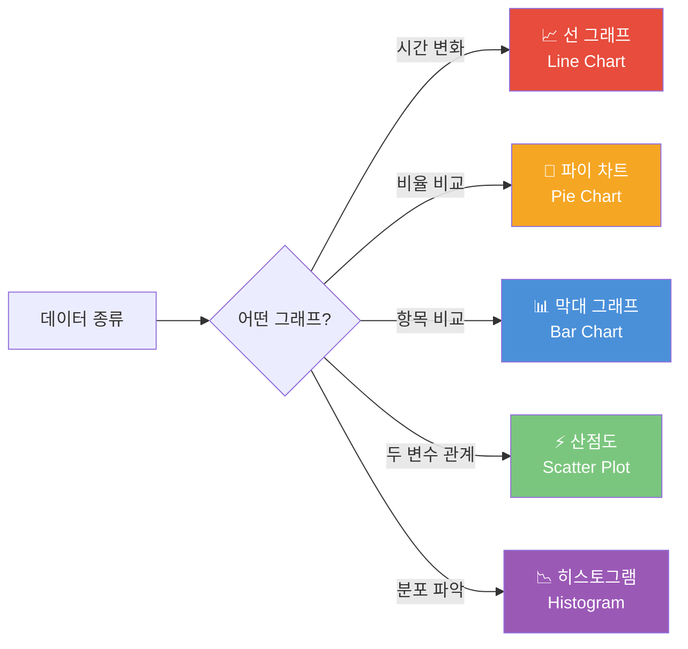

# Chapter 15: 최종 점검 - 한눈에 보는 데이터와 나

---

## 🎯 이 장에서 배우는 것

- [ ] 압축, 암호화, 빅데이터, 전처리, 시각화의 핵심 개념을 하나의 흐름으로 연결하여 설명할 수 있다.
- [ ] 데이터 분석의 전체 과정(수집 → 전처리 → 분석 → 시각화)을 순서대로 서술할 수 있다.
- [ ] 성취기준별 자기 점검 체크리스트를 활용하여 내가 부족한 부분을 스스로 파악할 수 있다.
- [ ] 배운 개념들을 활용하여 실제 문제를 해결하는 짧은 글을 작성할 수 있다.

---

## 💡 왜 이걸 배우나요?

여러분은 지금까지 꽤 긴 여정을 함께했습니다.

데이터를 **압축**하고 **암호화**하는 방법, 세상에 넘쳐나는 **빅데이터**의 특징, 지저분한 데이터를 깔끔하게 만드는 **전처리**, 그리고 숫자 속에 숨은 이야기를 그림으로 꺼내는 **시각화**까지.

그런데 이 개념들이 따로따로 머릿속에 흩어져 있다면 실제로는 쓸 수가 없습니다. 마치 부품만 잔뜩 있고 설계도가 없는 것과 같죠.

이번 장은 바로 그 **설계도**를 그리는 시간입니다. 흩어진 지식을 하나의 지도로 연결하면, 새로운 문제를 만났을 때 "어디서부터 시작해야 할지" 바로 알 수 있게 됩니다.

> 💬 **생각해보기:** 여러분이 배운 개념 중 가장 자신 있는 것과 가장 헷갈리는 것은 무엇인가요? 이 장을 마친 후에 다시 확인해 보세요.

---

## 📚 핵심 개념

### 개념 1: 데이터 분석의 전체 흐름

**📦 비유로 시작 - 음식점 운영에 비유하면?**

데이터를 다루는 과정은 음식점을 운영하는 것과 똑같습니다.

- **재료 구입(수집)**: 시장에서 신선한 재료를 가져옵니다 → 빅데이터 수집
- **재료 손질(전처리)**: 흙을 씻고, 썩은 부분을 잘라냅니다 → 결측값 처리, 이상값 제거
- **냉장 보관(압축·저장)**: 재료를 효율적으로 저장합니다 → 데이터 압축
- **레시피 보호(암호화)**: 비밀 레시피를 잠근 금고에 보관합니다 → 데이터 암호화
- **요리 완성(분석·시각화)**: 손님이 먹을 수 있는 음식으로 만듭니다 → 시각화로 인사이트 도출

**정확한 정의**

데이터 분석의 전체 흐름이란, **원시 데이터(raw data)를 가치 있는 정보(insight)로 변환하는 일련의 단계적 과정**을 말합니다.



**예시로 확인**

기상청이 날씨 예보를 만드는 과정을 생각해 봅시다.

- 전국 기상 관측소에서 온도, 습도, 풍속 데이터를 수집 (빅데이터)
- 오류 데이터(예: 온도 999°C) 제거, 빠진 값 채우기 (전처리)
- 내일 기온 패턴 분석 (분석)
- 일기예보 그래프와 지도로 표현 (시각화)
- 이 모든 데이터를 압축하여 보관하고, 개인정보는 암호화하여 보호

---

### 개념 2: 압축과 암호화 - 데이터를 지키는 두 가지 방법

**🧳 비유로 시작 - 여행 가방 vs 자물쇠**

짐을 여행용 압축 팩에 넣으면 부피가 줄어들지만, 내용물은 그대로입니다. 이것이 **압축**입니다. 반면 가방에 자물쇠를 채우면, 열쇠 없이는 아무도 열 수 없습니다. 이것이 **암호화**입니다. 둘 다 중요하지만 **목적이 다릅니다.**

**정확한 정의**

- **압축(Compression)**: 데이터의 크기를 줄여 저장 공간을 절약하고 전송 속도를 높이는 기술. 데이터의 내용은 변하지 않음.
- **암호화(Encryption)**: 데이터를 특정 키(key) 없이는 읽을 수 없도록 변환하는 기술. 데이터 보안을 위한 것.



**예시로 확인**

- **압축 예시**: 사진 파일(10MB)을 ZIP으로 압축 → 3MB로 줄어듦. 내용은 똑같음.
- **암호화 예시**: 인터넷 뱅킹 비밀번호는 암호화되어 서버에 저장됨. 해커가 서버를 해킹해도 원래 비밀번호를 알 수 없음.

> **알아보기: 무손실 압축 vs 손실 압축**
> - **무손실 압축**: 압축 해제하면 원본과 100% 동일 (예: ZIP, PNG)
> - **손실 압축**: 일부 데이터를 버려 더 많이 줄이지만 원본과 약간 다름 (예: MP3, JPEG)
> - 어떤 것을 선택할지는 용도에 따라 다릅니다!

---

### 개념 3: 빅데이터와 전처리 - 많다고 좋은 건 아니다

**🌊 비유로 시작 - 탁한 강물에서 깨끗한 물 뽑기**

큰 강에는 엄청난 양의 물이 있지만, 그 물을 그대로 마실 수는 없습니다. 정수 과정을 거쳐야 비로소 마실 수 있는 깨끗한 물이 됩니다. 빅데이터도 마찬가지입니다. 데이터가 아무리 많아도 **전처리** 없이는 쓸 수 없습니다.

**정확한 정의**

- **빅데이터(Big Data)**: 기존 방법으로는 수집·저장·분석이 어려울 만큼 방대한 양의 데이터. 흔히 3V(Volume·Variety·Velocity)로 특징을 설명함.
- **전처리(Preprocessing)**: 분석하기 전에 데이터를 정제하고 변환하는 과정. 결측값 처리, 이상값 제거, 정규화 등이 포함됨.



**예시로 확인**

학생 성적 데이터를 예로 들어봅시다.

- **결측값**: 시험을 결석한 학생의 점수가 비어 있음 → 0점으로 채우거나 평균으로 대체
- **이상값**: 100점 만점 시험에서 150점이 입력됨 → 오류로 판단하고 제거
- **형식 불일치**: 날짜가 어떤 건 "2024-01-15", 어떤 건 "24/1/15" → 통일된 형식으로 변환

---

### 개념 4: 시각화 - 숫자를 이야기로 만들기

**🎨 비유로 시작 - 악보와 음악**

"도레미파솔라시도"라는 음계를 머릿속으로 생각하는 것과, 실제로 피아노로 연주해 듣는 것은 전혀 다른 경험입니다. 숫자로 가득 찬 데이터를 그래프로 보여주는 것도 똑같습니다. **시각화는 데이터를 눈으로 들을 수 있게 만드는 것**입니다.

**정확한 정의**

**시각화(Visualization)**: 데이터를 그래프, 차트, 지도 등 시각적 요소로 표현하여 패턴, 추세, 관계를 직관적으로 파악하게 하는 기술.



**예시로 확인**

- 월별 강수량 변화 → **선 그래프** (시간에 따른 변화)
- 지역별 미세먼지 비율 → **파이 차트** (전체 중 비율)
- 학급별 평균 성적 비교 → **막대 그래프** (항목 간 비교)
- 키와 몸무게의 관계 → **산점도** (두 변수의 관계)

---

## 🔨 따라하기 - 전체 흐름 코드로 경험하기

이제 배운 개념들을 하나의 코드로 연결해 봅시다. 학생 성적 데이터를 가지고 **전처리 → 분석 → 시각화**의 전체 흐름을 직접 실행해 보세요.

> **준비물**: Python 환경 (구글 코랩 https://colab.research.google.com 에서 무료로 사용 가능)

---

### Step 1: 데이터 준비 (의도적으로 문제 있는 데이터)

```python
import pandas as pd
import matplotlib.pyplot as plt
import matplotlib
matplotlib.rcParams['font.family'] = 'Malgun Gothic'  # 한글 폰트 설정

# 일부러 결측값과 이상값을 포함한 데이터 생성
data = {
    '이름': ['민준', '서연', '지호', '하은', '도윤', '수아', '준서', '예린'],
    '수학': [85, 92, None, 78, 200, 88, 76, 95],   # None=결측값, 200=이상값
    '영어': [78, 88, 91, None, 82, 77, 85, 90],
    '과학': [90, 85, 88, 92, 79, None, 83, 87]
}

df = pd.DataFrame(data)
print("=== 원본 데이터 (문제 있는 상태) ===")
print(df)
print(f"\n결측값 개수:\n{df.isnull().sum()}")
```

---

### Step 2: 전처리 - 이상값 제거 및 결측값 처리

```python
# 이상값 제거 (점수는 0~100 사이여야 함)
df['수학'] = df['수학'].apply(lambda x: None if x is not None and x > 100 else x)

# 결측값을 각 과목 평균으로 대체
for col in ['수학', '영어', '과학']:
    col_mean = df[col].mean()
    df[col] = df[col].fillna(round(col_mean, 1))

print("=== 전처리 후 데이터 (깨끗한 상태) ===")
print(df)
```

---

### Step 3: 분석 - 기본 통계 계산

```python
# 총점과 평균 계산
df['총점'] = df['수학'] + df['영어'] + df['과학']
df['평균'] = (df['총점'] / 3).round(1)

# 등수 계산
df['등수'] = df['총점'].rank(ascending=False).astype(int)

print("=== 분석 결과 ===")
print(df[['이름', '수학', '영어', '과학', '총점', '평균', '등수']])
print(f"\n전체 평균 점수: {df['평균'].mean():.1f}점")
```

---

### Step 4: 시각화 - 막대 그래프로 표현

```python
# 학생별 과목 점수 시각화
fig, axes = plt.subplots(1, 2, figsize=(14, 5))

# 그래프 1: 학생별 과목 점수 비교
subjects = ['수학', '영어', '과학']
x = range(len(df))
width = 0.25

axes[0].bar([i - width for i in x], df['수학'], width=width, label='수학', color='#4A90D9')
axes[0].bar(x, df['영어'], width=width, label='영어', color='#7BC67E')
axes[0].bar([i + width for i in x], df['과학'], width=width, label='과학', color='#F5A623')
axes[0].set_xticks(x)
axes[0].set_xticklabels(df['이름'])
axes[0].set_title('학생별 과목 점수 비교')
axes[0].set_ylabel('점수')
axes[0].legend()
axes[0].set_ylim(0, 110)

# 그래프 2: 학생별 평균 점수 (내림차순)
df_sorted = df.sort_values('평균', ascending=False)
axes[1].barh(df_sorted['이름'], df_sorted['평균'], color='#E74C3C', alpha=0.8)
axes[1].set_title('학생별 평균 점수 순위')
axes[1].set_xlabel('평균 점수')
axes[1].set_xlim(0, 100)

plt.tight_layout()
plt.savefig('성적_분석.png', dpi=150, bbox_inches='tight')
plt.show()
print("그래프가 저장되었습니다!")
```

---

### Step 5: 압축 개념 직접 경험하기

```python
import zlib
import sys

# 텍스트 데이터를 문자열로 변환
data_str = df.to_string()
data_bytes = data_str.encode('utf-8')

# 압축 실행
compressed = zlib.compress(data_bytes, level=9)

original_size = sys.getsizeof(data_bytes)
compressed_size = sys.getsizeof(compressed)
ratio = (1 - compressed_size / original_size) * 100

print("=== 압축 결과 ===")
print(f"원본 크기: {original_size} bytes")
print(f"압축 후 크기: {compressed_size} bytes")
print(f"압축률: {ratio:.1f}% 절약!")

# 압축 해제 (원본 복원)
decompressed = zlib.decompress(compressed).decode('utf-8')
print(f"\n압축 해제 성공! 원본과 동일한가요? {data_str == decompressed}")
```

---

### Step 6: 암호화 개념 직접 경험하기

```python
# 간단한 Caesar 암호로 암호화 개념 이해
def caesar_encrypt(text, shift=3):
    """텍스트를 shift만큼 밀어서 암호화"""
    result = ""
    for char in text:
        if char.isalpha():
            base = ord('A') if char.isupper() else ord('a')
            result += chr((ord(char) - base + shift) % 26 + base)
        else:
            result += char
    return result

def caesar_decrypt(text, shift=3):
    """암호화된 텍스트를 복호화"""
    return caesar_encrypt(text, -shift)

secret_message = "My score is TOP SECRET"
encrypted = caesar_encrypt(secret_message)
decrypted = caesar_decrypt(encrypted)

print("=== 암호화 결과 ===")
print(f"원본 메시지: {secret_message}")
print(f"암호화 후: {encrypted}")
print(f"복호화 후: {decrypted}")
print(f"원본 복원 성공: {secret_message == decrypted}")
```

---

## 📝 전체 코드

> 아래 코드를 구글 코랩에 붙여넣으면 Step 1~6을 한 번에 실행할 수 있습니다.

```python
# ============================================================
# Chapter 15 최종 점검 - 전체 흐름 종합 코드
# ============================================================

import pandas as pd
import matplotlib.pyplot as plt
import matplotlib
import zlib, sys
matplotlib.rcParams['font.family'] = 'Malgun Gothic'

# [1단계] 데이터 준비
data = {
    '이름': ['민준', '서연', '지호', '하은', '도윤', '수아', '준서', '예린'],
    '수학': [85, 92, None, 78, 200, 88, 76, 95],
    '영어': [78, 88, 91, None, 82, 77, 85, 90],
    '과학': [90, 85, 88, 92, 79, None, 83, 87]
}
df = pd.DataFrame(data)

# [2단계] 전처리
df['수학'] = df['수학'].apply(lambda x: None if x is not None and x > 100 else x)
for col in ['수학', '영어', '과학']:
    df[col] = df[col].fillna(round(df[col].mean(), 1))

# [3단계] 분석
df['총점'] = df['수학'] + df['영어'] + df['과학']
df['평균'] = (df['총점'] / 3).round(1)

# [4단계] 시각화
fig, axes = plt.subplots(1, 2, figsize=(14, 5))
x = range(len(df)); width = 0.25
axes[0].bar([i-width for i in x], df['수학'], width=width, label='수학', color='#4A90D9')
axes[0].bar(x, df['영어'], width=width, label='영어', color='#7BC67E')
axes[0].bar([i+width for i in x], df['과학'], width=width, label='과학', color='#F5A623')
axes[0].set_xticks(x); axes[0].set_xticklabels(df['이름'])
axes[0].set_title('과목별 점수'); axes[0].legend()
df_sorted = df.sort_values('평균', ascending=False)
axes[1].barh(df_sorted['이름'], df_sorted['평균'], color='#E74C3C', alpha=0.8)
axes[1].set_title('평균 점수 순위')
plt.tight_layout(); plt.show()

# [5단계] 압축
data_bytes = df.to_string().encode('utf-8')
compressed = zlib.compress(data_bytes, level=9)
print(f"압축률: {(1 - len(compressed)/len(data_bytes))*100:.1f}% 절약")

# [6단계] 암호화
def caesar_encrypt(text, shift=3):
    return ''.join(chr((ord(c)-ord('A')+shift)%26+ord('A')) if c.isupper()
                   else chr((ord(c)-ord('a')+shift)%26+ord('a')) if c.islower()
                   else c for c in text)

msg = "Data Science is Fun"
print(f"암호화: {caesar_encrypt(msg)}")
print(f"복호화: {caesar_encrypt(caesar_encrypt(msg), -3)}")
print("✅ 전체 흐름 완료!")
```

---

## ⚠️ 자주 하는 실수

**실수 1: 압축과 암호화를 같은 것으로 혼동**

많은 학생들이 "압축하면 다른 사람이 못 읽겠지?"라고 생각합니다. 하지만 압축은 보안 도구가 아닙니다. 압축 파일은 압축 프로그램만 있으면 누구나 열 수 있습니다. 보안이 필요하면 반드시 **암호화를 별도로** 해야 합니다.

**실수 2: 결측값을 무조건 0으로 채우기**

결측값을 0으로 채우면 계산이 크게 왜곡됩니다. 성적 데이터에서 결석한 학생의 점수를 0점으로 처리하면 평균이 뚝 떨어지죠. 결측값 처리 방법(평균, 중앙값, 삭제 등)은 **데이터의 성격에 맞게** 선택해야 합니다.

**실수 3: 이상값을 무조건 오류로 판단하고 삭제**

100명의 키 데이터에서 195cm가 나왔다고 무조건 이상값이 아닙니다. 키가 정말 195cm인 사람일 수 있습니다. 이상값인지 판단하려면 **도메인 지식(해당 분야의 상식)**을 함께 고려해야 합니다.

**실수 4: 데이터 없이 시각화부터 하려는 것**

화려한 그래프에 눈이 멀어 전처리를 건너뛰고 바로 시각화하는 경우가 많습니다. 결측값이 있는 상태로 그래프를 그리면 **틀린 결론**이 나올 수 있습니다. 반드시 순서를 지키세요: **수집 → 전처리 → 분석 → 시각화**.

**실수 5: 시각화 그래프 종류를 잘못 선택**

시간 변화를 파이 차트로 표현하거나, 비율을 선 그래프로 표현하면 의미가 전달되지 않습니다. 데이터의 성격에 맞는 그래프를 선택하는 것이 시각화의 핵심입니다.

---

## ✅ 스스로 점검하기

### 📋 성취기준별 자기 점검 체크리스트

아래 문항을 읽고, 스스로 솔직하게 체크해 보세요.

**[압축·암호화 영역]**
- [ ] 압축과 암호화의 목적이 다름을 설명할 수 있다
- [ ] 무손실 압축과 손실 압축의 차이를 예를 들어 말할 수 있다
- [ ] 암호화가 필요한 상황과 필요하지 않은 상황을 구분할 수 있다

**[빅데이터 영역]**
- [ ] 빅데이터의 3V(Volume, Variety, Velocity)를 설명할 수 있다
- [ ] 빅데이터가 활용되는 실제 사례를 2가지 이상 말할 수 있다

**[전처리 영역]**
- [ ] 결측값, 이상값, 중복값이 무엇인지 설명할 수 있다
- [ ] pandas로 결측값을 처리하는 코드를 작성할 수 있다
- [ ] 전처리를 하지 않았을 때 생기는 문제를 설명할 수 있다

**[시각화 영역]**
- [ ] 데이터 종류에 따라 적절한 그래프를 선택할 수 있다
- [ ] matplotlib으로 기본 그래프를 그리는 코드를 작성할 수 있다
- [ ] 그래프를 보고 의미 있는 인사이트를 한 문장으로 설명할 수 있다

**[전체 흐름 영역]**
- [ ] 수집 → 전처리 