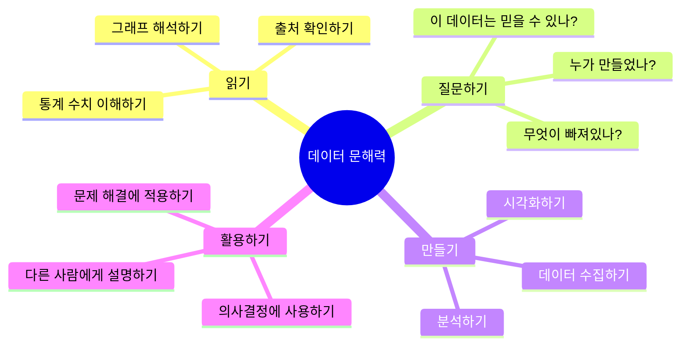

# Chapter 16: 돌아보기 - 데이터와 함께한 나의 성장

---

## 🎯 이 장에서 배우는 것

- [ ] 학습 전후 자신의 데이터 이해 수준 변화를 스스로 평가하고 기술할 수 있다.
- [ ] 가장 인상 깊었던 활동과 그 이유를 구체적으로 설명할 수 있다.
- [ ] 데이터 문해력을 앞으로 어떤 상황에서 활용할 수 있을지 자신의 계획을 제시할 수 있다.

---

## 💡 왜 이걸 배우나요?

여행을 마친 후 사진첩을 펼쳐보는 순간을 상상해보세요. 처음 출발했던 날의 설렘, 낯선 곳에서 헤맸던 기억, 드디어 목적지에 도착했을 때의 뿌듯함이 한 장 한 장 되살아납니다. 그 순간 우리는 단순히 추억을 떠올리는 것이 아니라, **내가 얼마나 멀리 왔는지**를 실감합니다.

이번 마지막 챕터는 바로 그 사진첩을 함께 펼쳐보는 시간입니다.

처음 '데이터'라는 단어를 들었을 때 어떤 느낌이었나요? 어렵고 낯선 단어였을 수도 있고, 뉴스에서 자주 들었지만 막연하게 느껴졌을 수도 있습니다. 하지만 지금의 여러분은 다릅니다. 데이터를 수집하고, 정리하고, 시각화하고, 분석하는 과정을 직접 경험했습니다. 그 과정에서 쌓인 지식과 경험이 바로 여러분의 **데이터 문해력**입니다.

마지막 수업의 목적은 세 가지입니다.

- **돌아보기**: 내가 무엇을 배웠고, 어떻게 성장했는지 확인하기
- **정리하기**: 흩어진 지식을 하나의 지도로 연결하기
- **내다보기**: 앞으로 이 능력을 어떻게 활용할지 상상하기

---

## 📚 핵심 개념

### 개념 1: 메타인지 - 나의 배움을 바라보는 눈

**비유로 시작**

축구 선수가 경기 영상을 다시 보며 자신의 플레이를 분석하는 장면을 떠올려보세요. 경기 중에는 느끼지 못했던 것들, 예를 들어 어떤 순간에 판단이 느렸는지, 어떤 동작이 좋았는지를 영상으로 보면서야 비로소 알게 됩니다. 이처럼 **자신의 생각과 행동을 한 발짝 물러서서 바라보는 능력**을 메타인지(Metacognition)라고 합니다.

**정확한 정의**

메타인지란 **내가 무엇을 알고 무엇을 모르는지 스스로 인식하는 능력**입니다. 단순히 공부를 열심히 하는 것과는 다릅니다. 메타인지가 높은 학습자는 "나는 이 부분은 이해했지만, 저 부분은 아직 헷갈린다"고 정확히 파악합니다. 그래서 더 효율적으로, 더 깊이 배울 수 있습니다.

**예시로 확인**

> 🧐 **메타인지가 낮은 경우**: "다 배운 것 같은데 왜 문제가 안 풀리지?"
>
> 💡 **메타인지가 높은 경우**: "데이터 수집 방법은 알겠는데, 이상값(outlier)을 처리하는 방법이 아직 헷갈려. 그 부분을 다시 봐야겠어."

이번 챕터의 성찰 활동은 여러분의 메타인지를 자극하기 위해 설계되었습니다.

---

### 개념 2: 학습 여정 타임라인 - 성장의 지도

**비유로 시작**

등산을 할 때 산 중턱에서 뒤를 돌아보면, 처음에는 까마득하게 높아 보였던 산이 지금 내가 서 있는 곳에서 보면 그리 멀지 않았음을 알게 됩니다. 그리고 앞으로 얼마나 더 가야 정상인지도 가늠할 수 있게 됩니다. **타임라인**은 바로 이 '뒤돌아보기'입니다.

**정확한 정의**

학습 여정 타임라인이란 **학습의 흐름을 시간 순서에 따라 시각적으로 정리한 것**입니다. 각 챕터에서 무엇을 배웠는지, 어떤 활동이 인상 깊었는지, 어떤 어려움이 있었는지를 한눈에 볼 수 있게 합니다.

**예시로 확인**

아래는 이 과정 전체의 학습 여정을 타임라인으로 표현한 것입니다.

```mermaid
timeline
    title 데이터와 나 - 학습 여정 타임라인
    section 1권: 데이터의 세계로
        Ch.1 데이터란 무엇인가 : 데이터의 정의와 종류 이해
        Ch.2 데이터 수집하기 : 설문, 관찰, 공공데이터 활용
        Ch.3 데이터 정리하기 : 정리와 분류의 원칙
        Ch.4 데이터 시각화 : 그래프와 차트 만들기
        Ch.5 데이터 분석 기초 : 평균, 중앙값, 최빈값
        Ch.6 데이터와 이야기 : 데이터 스토리텔링
        Ch.7 프로젝트 1 : 학교 데이터 분석
        Ch.8 마무리 1 : 1권 총정리
    section 2권: 데이터 심화
        Ch.9 파이썬과 데이터 : 코딩으로 데이터 다루기
        Ch.10 데이터 정제 : 오류와 이상값 처리
        Ch.11 고급 시각화 : 복잡한 데이터 표현하기
        Ch.12 통계적 사고 : 상관관계와 인과관계
        Ch.13 머신러닝 입문 : AI가 데이터를 배우는 법
        Ch.14 데이터 윤리 : 책임 있는 데이터 사용
        Ch.15 프로젝트 2 : 실전 데이터 분석
        Ch.16 마무리 2 : 돌아보기와 미래
```

---

### 개념 3: 데이터 문해력 - 평생 써먹는 능력

**비유로 시작**

글을 읽고 쓸 줄 아는 능력을 '문해력'이라고 합니다. 문해력이 있어야 책도 읽고, 편지도 쓰고, 뉴스도 이해할 수 있죠. 마찬가지로, **데이터를 읽고 해석하고 활용할 줄 아는 능력**을 데이터 문해력(Data Literacy)이라고 합니다.

**정확한 정의**

데이터 문해력이란 **데이터를 비판적으로 읽고, 의미를 파악하고, 의사결정에 활용하는 능력의 총합**입니다. 단순히 그래프를 그리는 기술이 아니라, 데이터에 담긴 이야기를 읽고 올바른 판단을 내리는 사고방식입니다.

**예시로 확인**



---

### 개념 4: 성찰적 글쓰기 - 생각을 정리하는 힘

**비유로 시작**

일기를 꾸준히 쓰는 사람은 시간이 지나 일기를 다시 읽으며 과거의 자신을 만납니다. "그때 나는 이런 생각을 했구나", "그 문제는 결국 이렇게 해결됐었지"라는 깨달음이 찾아옵니다. 글로 쓰는 행위 자체가 생각을 정리하고 깊게 만드는 힘이 있습니다.

**정확한 정의**

성찰적 글쓰기(Reflective Writing)란 **자신의 경험, 배움, 감정을 돌아보며 의미를 찾는 글쓰기**입니다. 단순한 사실 기록이 아니라, "왜 그랬을까?", "그것이 나에게 어떤 의미인가?", "앞으로 어떻게 할 것인가?"를 탐구합니다.

**예시로 확인**

> 📝 **사실 기록** (성찰적 글쓰기 아님): "챕터 4에서 막대그래프를 배웠다."
>
> 💭 **성찰적 글쓰기**: "챕터 4에서 막대그래프를 처음 만들었을 때, 데이터가 눈으로 보이는 것이 신기했다. 숫자만 볼 때는 몰랐던 '1학년이 가장 많다'는 사실이 그래프를 그리고 나서야 바로 눈에 들어왔다. 이후 뉴스를 볼 때 그래프를 훨씬 주의 깊게 보게 되었다."

---

## 🔨 따라하기 - 나의 성장 기록 만들기

이번 따라하기는 코드를 작성하는 것이 아닙니다. **나 자신을 탐구하는 활동**입니다. 각 단계를 천천히, 솔직하게 채워보세요.

---

### Step 1: 학습 전후 비교하기 🌱

아래 질문에 답하면서 처음과 지금을 비교해보세요.

> **생각해보기:**
>
> 이 과정을 시작하기 전, '데이터'라는 단어를 들으면 어떤 생각이 떠올랐나요?
>
> - 그때의 나: _______________________________________________
>
> 지금 '데이터'라는 단어를 들으면 무엇이 떠오르나요?
>
> - 지금의 나: _______________________________________________

**내가 새롭게 알게 된 것 TOP 3**

솔직하게 채워보세요. 거창하지 않아도 됩니다.

1. 새롭게 알게 된 것: ___________________________________
   - 왜 중요하다고 생각하나요?: ___________________________

2. 새롭게 알게 된 것: ___________________________________
   - 왜 중요하다고 생각하나요?: ___________________________

3. 새롭게 알게 된 것: ___________________________________
   - 왜 중요하다고 생각하나요?: ___________________________

---

### Step 2: 감정 지도 그리기 😊😰🤩

학습하는 동안 느꼈던 감정들을 기록합니다. 아래 활동들 중 자신이 느꼈던 감정에 표시해보세요.

> **알아보기:** 감정을 기록하는 것은 단순한 감상이 아닙니다. **어떤 상황에서 배움이 잘 일어나는지** 파악하는 중요한 데이터입니다!

아래 체크리스트에 자신의 경험을 표시해보세요.

**😄 가장 재미있었던 활동**
- [ ] 데이터 직접 수집하기
- [ ] 그래프/차트 만들기
- [ ] 파이썬 코드 실행하기
- [ ] 프로젝트 주제 정하고 분석하기
- [ ] 데이터 윤리 토론하기
- [ ] 기타: _______________

**😰 가장 어려웠던 활동**
- [ ] 데이터 정제(오류 찾고 수정하기)
- [ ] 통계 개념 이해하기(평균, 분산 등)
- [ ] 파이썬 코딩
- [ ] 상관관계와 인과관계 구분하기
- [ ] 분석 결과를 글로 설명하기
- [ ] 기타: _______________

**🤩 가장 놀라웠던 발견**

자유롭게 적어보세요: _______________________________________

---

### Step 3: 나의 학습 여정 타임라인 만들기 🗺️

아래 파이썬 코드를 실행하면 자신의 학습 여정을 간단한 텍스트 타임라인으로 출력할 수 있습니다. 각 챕터에 대한 자신의 점수와 키워드를 입력해보세요.

```python
# 나의 데이터 학습 여정 타임라인 만들기

# 각 챕터에서 자신의 이해도를 1~5점으로 입력하세요
# (1: 어려웠다, 3: 보통, 5: 완벽히 이해했다)

my_journey = {
    "Ch.1 데이터란 무엇인가": {"score": 4, "keyword": "종류, 정의"},
    "Ch.2 데이터 수집":       {"score": 3, "keyword": "설문, 공공데이터"},
    "Ch.3 데이터 정리":       {"score": 4, "keyword": "분류, 정렬"},
    "Ch.4 시각화 기초":       {"score": 5, "keyword": "막대, 꺾은선 그래프"},
    "Ch.5 데이터 분석":       {"score": 3, "keyword": "평균, 중앙값"},
    "Ch.9 파이썬과 데이터":   {"score": 2, "keyword": "pandas, 데이터프레임"},
    "Ch.10 데이터 정제":      {"score": 3, "keyword": "이상값, 결측치"},
    "Ch.12 통계적 사고":      {"score": 2, "keyword": "상관관계"},
    "Ch.14 데이터 윤리":      {"score": 5, "keyword": "편향, 프라이버시"},
}

print("=" * 50)
print("     📊 나의 데이터 학습 여정 타임라인")
print("=" * 50)

for chapter, info in my_journey.items():
    score = info["score"]
    keyword = info["keyword"]
    
    # 점수에 따라 막대 길이 설정
    bar = "⭐" * score + "☆" * (5 - score)
    
    print(f"\n📌 {chapter}")
    print(f"   이해도: {bar} ({score}/5)")
    print(f"   핵심어: {keyword}")

# 가장 잘 이해한 챕터와 어려웠던 챕터 찾기
scores = {ch: info["score"] for ch, info in my_journey.items()}
best = max(scores, key=scores.get)
hard = min(scores, key=scores.get)

print("\n" + "=" * 50)
print(f"🏆 가장 잘 이해한 챕터: {best} ({scores[best]}점)")
print(f"💪 다시 도전할 챕터: {hard} ({scores[hard]}점)")
print("=" * 50)
```

> **실행 방법**: `my_journey` 딕셔너리의 `score` 값을 자신의 실제 이해도로 바꿔보세요. `keyword`도 자신이 기억하는 핵심어로 수정해보세요.

---

### Step 4: 데이터 문해력 자기 평가 📊

아래 항목들을 솔직하게 평가해보세요.

```python
# 데이터 문해력 자기 평가 레이더 차트 만들기
import matplotlib.pyplot as plt
import matplotlib
import numpy as np

matplotlib.rcParams['font.family'] = 'Malgun Gothic'  # 윈도우
# matplotlib.rcParams['font.family'] = 'AppleGothic'  # 맥

# 평가 항목과 자신의 점수 (1~5)
categories = [
    '데이터 수집',
    '데이터 정리',
    '시각화',
    '통계 분석',
    '파이썬 코딩',
    '데이터 윤리',
    '결과 발표'
]

# 여기에 자신의 점수를 입력하세요 (1~5점)
my_scores = [4, 3, 5, 2, 3, 4, 3]

# 레이더 차트 그리기
N = len(categories)
angles = np.linspace(0, 2 * np.pi, N, endpoint=False).tolist()
my_scores_plot = my_scores + [my_scores[0]]
angles += angles[:1]

fig, ax = plt.subplots(figsize=(7, 7), subplot_kw=dict(polar=True))
ax.plot(angles, my_scores_plot, 'o-', linewidth=2, color='royalblue')
ax.fill(angles, my_scores_plot, alpha=0.25, color='royalblue')
ax.set_xticks(angles[:-1])
ax.set_xticklabels(categories, size=12)
ax.set_ylim(0, 5)
ax.set_yticks([1, 2, 3, 4, 5])
ax.set_yticklabels(['1', '2', '3', '4', '5'])
ax.set_title('나의 데이터 문해력 지도', size=16, fontweight='bold', pad=20)

plt.tight_layout()
plt.savefig('my_data_literacy.png', dpi=150, bbox_inches='tight')
plt.show()
print("✅ 나의 데이터 문해력 지도가 저장되었습니다!")
```

> **💡 팁**: 완성된 레이더 차트를 출력해서 포트폴리오에 붙여두세요. 6개월 뒤 다시 그려서 비교해보면 성장이 눈에 보입니다!

---

### Step 5: 데이터 문해력 활용 계획 세우기 🔭

배운 것을 어디에 쓸 수 있을지 구체적으로 생각해봅시다.

> **생각해보기:** 아래 영역에서 데이터 문해력을 어떻게 활용할 수 있을지 각각 한 가지씩 적어보세요.

**🏫 다른 교과목에서**
- 예시: 사회 시간에 인구 변화 데이터를 그래프로 분석해서 발표하기
- 나의 계획: ___________________________________________

**🌍 일상생활에서**
- 예시: 뉴스에서 그래프를 볼 때 "이 데이터의 출처는 어디지?"라고 비판적으로 생각하기
- 나의 계획: ___________________________________________

**🎯 미래 진로에서**
- 예시: 스포츠 선수라면 경기 기록 데이터를 분석해서 약점을 보완하기
- 나의 계획: ___________________________________________

---

### Step 6: 미래의 나에게 보내는 데이터 편지 쓰기 ✉️

이것이 이번 챕터의 핵심 활동입니다. 1년 후의 나에게 편지를 써보세요.

> **알아보기:** 미래의 자신에게 편지를 쓰는 것은 단순한 감상이 아닙니다. 지금 자신이 무엇을 알고 있는지, 무엇을 목표로 하는지를 **명확한 언어로 기록**하는 행위입니다. 이것 자체가 데이터입니다!

**편지 작성 가이드**

아래 구조를 참고해서 편지를 완성해보세요.

```
-------------------------------------------
📬 미래의 나에게 보내는 데이터 편지
작성일: 20__년 __월 __일
열어볼 날: 20__년 __월 __일 (1년 후)
-------------------------------------------

안녕, 미래의 나!

지금 나는 데이터 문해력 과정을 막 마쳤어.

이 과정에서 내가 가장 인상 깊었던 것은
_____________________________________________
왜냐하면 _____________________________________

솔직히 가장 어려웠던 것은
_____________________________________________
하지만 나는 _________________________________

1년 뒤 너(미래의 나)는
_____________________________________________
을 할 수 있을 거라고 기대해.

데이터 문해력을 가장 써먹고 싶은 상황은
_____________________________________________

마지막으로, 한 가지 당부하고 싶은 것은
_____________________________________________

지금의 나로부터,
_______________ 올림
-------------------------------------------
```

---

## 📝 전체 코드 - 나의 성장 리포트 생성기

아래 코드는 지금까지의 활동을 종합해서 하나의 성장 리포트를 출력합니다.

```python
# 나의 데이터 학습 성장 리포트 생성기

def create_growth_report(name, best_activity, hard_activity, 
                          future_plan, one_thing_learned):
    """
    개인 맞춤형 성장 리포트를 생성합니다.
    """
    report = f"""
{'='*55}
       📊 데이터 학습 성장 리포트
{'='*55}
이름: {name}
작성일: 이 과정을 마친 날

【 나의 데이터 여정 】

✨ 가장 인상 깊었던 활동:
   → {best_activity}

💪 가장 도전적이었던 활동:
   → {hard_activity}

🌟 이 과정에서 딱 하나만 꼽는다면:
   → {one_thing_learned}

🚀 앞으로의 계획:
   → {future_plan}

【 나의 데이터 문해력 선언 】

나, {name}은/는 이제 데이터를 무서워하지 않습니다.
숫자 뒤에 숨은 이야기를 읽을 수 있습니다.
그래프가 거짓말을 할 때 알아챌 수 있습니다.
데이터로 세상을 더 잘 이해할 수 있습니다.

{'='*55}
    """
    return report


# ✏️ 여기에 자신의 정보를 입력하세요!
my_report = create_growth_report(
    name="홍길동",
    best_activity="파이썬으로 직접 그래프를 그렸을 때 - 코드 몇 줄로 데이터가 시각화되는 게 신기했다",
    hard_activity="상관관계와 인과관계를 구분하는 것 - 비슷해 보이는데 완전히 다른 개념이었다",
    future_plan="사회 시간 발표에서 공공데이터를 직접 분석해서 활용하기",
    one_thing_learned="데이터는 항상 비판적으로 봐야 한다 - 출처와 맥락이 중요하다"
)

print(my_report)
```

---

## ⚠️ 자주 하는 실수

**실수 1: 성찰을 '정답 찾기'로 오해하기**

성찰 활동에는 정답이 없습니다. "가장 재미있었던 활동이 뭐가 맞는 정답일까?"라고 생각하지 마세요. 선생님이나 친구가 좋아할 것 같은 답이 아니라, **자신에게 진짜로 의미 있었던 것**을 솔직하게 적는 것이 맞습니다. 성찰의 가치는 정확성이 아니라 진솔함에 있습니다.

**실수 2: 어려웠던 것을 숨기거나 부끄러워하기**

"파이썬 코딩이 너무 어려웠어요"라고 적는 것을 부끄러워하는 학생들이 있습니다. 하지만 **무엇이 어려웠는지 정확히 아는 것**이 다음 성장의 출발점입니다. 어려움을 인정하는 것은 약점이 아니라 메타인지의 증거입니다.

**실수 3: 미래 계획을 너무 거창하게만 세우기**

"나중에 데이터 과학자가 될 것이다"처럼 큰 목표만 적지 마세요. "다음 주 뉴스를 볼 때 그래프 출처를 한 번 확인해보겠다"처럼 **구체적이고 당장 실행 가능한 계획**이 훨씬 가치 있습니다. 작은 실천이 쌓여 큰 변화가 됩니다.

**실수 4: 배운 내용을 각각 분리된 조각으로만 기억하기**

챕터 4