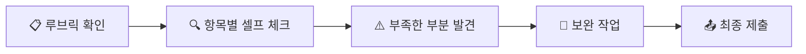

# Chapter 17. 수행평가 최종 점검 — 루브릭으로 셀프 체크하기

---

## 🎯 이 장에서 배우는 것

- [ ] 수행평가 루브릭(5개 평가요소)을 기준으로 자신의 결과물을 스스로 점검할 수 있다
- [ ] 부족한 부분을 발견하고 구체적으로 보완할 수 있다
- [ ] 최종 결과물을 파일로 정리하여 제출할 수 있다

---

> **💡 생각해보기:** 시험이 끝나고 답안지를 제출하기 전, 한 번 더 검토하면 실수를 발견한 경험이 있나요? 수행평가도 마찬가지입니다. 제출 전 체계적으로 점검하면 점수가 달라집니다. 오늘은 **"루브릭"이라는 채점 기준표**를 활용해 내 결과물을 스스로 검토하는 방법을 배웁니다.

---

## 📚 핵심 개념

### 개념 1: 루브릭(Rubric)

1. **비유로 시작**: 루브릭은 마치 **요리 대회의 심사 기준표**와 같아요. "맛 30점, 플레이팅 20점, 창의성 20점…" 처럼, 어떤 항목을 얼마나 잘해야 좋은 점수를 받는지 미리 알려주는 표입니다.

2. **정확한 정의**: 루브릭이란 **평가 요소별로 상·중·하 수준을 구체적으로 기술한 채점 기준표**입니다. 학생은 이를 통해 "무엇을 어떻게 해야 좋은 평가를 받는지" 명확하게 알 수 있습니다.

3. **예시로 확인**: 이번 데이터 프로젝트의 루브릭은 5가지 평가요소로 구성됩니다.
   - **데이터 수집** — 주제에 맞는 데이터를 충분히 모았는가
   - **데이터 정리** — 결측치·이상치를 처리하고 깔끔하게 정리했는가
   - **시각화** — 적절한 그래프를 선택하고 제목·라벨을 달았는가
   - **분석** — 데이터에서 의미 있는 패턴이나 결론을 도출했는가
   - **보고서** — 전체 흐름이 논리적이고 읽기 쉬운가

---

### 개념 2: 상·중·하 기준

각 평가요소마다 **3단계 수준**이 있습니다. 아래는 5개 요소 각각의 기준입니다.

**① 데이터 수집**
- 🟢 **상**: 주제에 적합한 데이터를 2개 이상의 출처에서 30건 이상 수집
- 🟡 **중**: 주제에 적합한 데이터를 1개 출처에서 15건 이상 수집
- 🔴 **하**: 데이터가 주제와 맞지 않거나 10건 미만

**② 데이터 정리**
- 🟢 **상**: 결측치·이상치를 확인하고 적절히 처리, 컬럼명이 명확
- 🟡 **중**: 결측치를 확인했으나 일부만 처리
- 🔴 **하**: 원본 데이터를 그대로 사용, 정리 흔적 없음

**③ 시각화**
- 🟢 **상**: 2종류 이상의 그래프, 제목·축 라벨·범례 완비, 색상 구분 명확
- 🟡 **중**: 1종류 그래프, 제목은 있으나 라벨 일부 누락
- 🔴 **하**: 그래프 없음 또는 제목·라벨 전혀 없음

**④ 분석**
- 🟢 **상**: 데이터에서 2가지 이상 패턴을 발견하고 근거와 함께 설명
- 🟡 **중**: 1가지 패턴을 발견했으나 근거 설명이 부족
- 🔴 **하**: 분석 내용 없이 수치만 나열

**⑤ 보고서**
- 🟢 **상**: 서론→본론→결론 구조가 명확, 문장이 매끄럽고 오탈자 없음
- 🟡 **중**: 구조는 있으나 일부 섹션이 빈약하거나 오탈자 다수
- 🔴 **하**: 구조 없이 내용이 나열되어 있음

---

### 개념 3: 셀프 체크(Self-Check)

1. **비유로 시작**: 셀프 체크는 마치 **비행기 조종사의 이륙 전 체크리스트**와 같아요. 하나씩 확인하며 ✅ 표시를 해야 안전하게 출발할 수 있습니다.

2. **정확한 정의**: 셀프 체크란 **루브릭 기준에 자신의 결과물을 하나씩 대조하며 스스로 평가하는 과정**입니다.

3. **핵심 포인트**: 셀프 체크의 목적은 점수 예측이 아니라 **부족한 부분을 발견하고 보완할 기회를 만드는 것**입니다.



---

## 🔨 따라하기: 셀프 체크 & 최종 제출 실습

### Step 1: 자가 점검 코드 준비하기

Python으로 간단한 셀프 체크 도구를 만들어 봅시다. 이 코드는 5개 평가요소에 대해 자신의 수준을 입력하면 결과를 정리해줍니다.

**코드**:
```python
# 셀프 체크 도구 — 수행평가 루브릭 점검기

# 5개 평가요소 정의
criteria = ["데이터 수집", "데이터 정리", "시각화", "분석", "보고서"]

# 각 요소별 점수 (상=3, 중=2, 하=1)
# ★ 여기에 자신의 수준을 솔직하게 입력하세요!
my_scores = {
    "데이터 수집": 3,   # 상=3, 중=2, 하=1
    "데이터 정리": 2,
    "시각화": 3,
    "분석": 2,
    "보고서": 1,
}
```

---

### Step 2: 점검 결과 출력하기

**코드**:
```python
# 등급 변환 함수
def score_to_grade(score):
    if score == 3:
        return "🟢 상"
    elif score == 2:
        return "🟡 중"
    else:
        return "🔴 하"

# 결과 출력
print("=" * 40)
print("📋 나의 수행평가 셀프 체크 결과")
print("=" * 40)

total = 0
weak_points = []

for item in criteria:
    score = my_scores[item]
    grade = score_to_grade(score)
    print(f"  {item}: {grade}")
    total += score
    if score <= 1:
        weak_points.append(item)

print("-" * 40)
print(f"  총점: {total} / 15")
```

**실행 결과**:
```
========================================
📋 나의 수행평가 셀프 체크 결과
========================================
  데이터 수집: 🟢 상
  데이터 정리: 🟡 중
  시각화: 🟢 상
  분석: 🟡 중
  보고서: 🔴 하
----------------------------------------
  총점: 11 / 15
```

---

### Step 3: 보완이 필요한 영역 안내받기

**코드**:
```python
# 보완 가이드 출력
print()
if weak_points:
    print("⚠️ 보완이 시급한 영역:")
    for wp in weak_points:
        print(f"  → {wp}")
else:
    print("✅ '하' 등급 영역이 없습니다. 잘하고 있어요!")

# '중' 등급 영역도 안내
mid_points = [item for item in criteria if my_scores[item] == 2]
if mid_points:
    print()
    print("💡 조금만 더 노력하면 '상'이 되는 영역:")
    for mp in mid_points:
        print(f"  → {mp}")
```

**실행 결과**:
```
⚠️ 보완이 시급한 영역:
  → 보고서

💡 조금만 더 노력하면 '상'이 되는 영역:
  → 데이터 정리
  → 분석
```

---

### Step 4: 구체적 보완 방법 확인하기

**코드**:
```python
# 영역별 보완 팁
tips = {
    "데이터 수집": "출처를 하나 더 추가하거나, 데이터 건수를 30건 이상으로 늘려보세요.",
    "데이터 정리": "df.isnull().sum()으로 결측치를 확인하고, fillna() 또는 dropna()로 처리하세요.",
    "시각화": "그래프에 plt.title(), plt.xlabel(), plt.ylabel()을 추가하세요.",
    "분석": "숫자 뒤에 '왜 그런지' 이유를 한 문장씩 써보세요.",
    "보고서": "서론(왜 이 주제?)→본론(분석 결과)→결론(배운 점) 구조로 다시 정리하세요.",
}

print("=" * 40)
print("🔧 보완 가이드")
print("=" * 40)

# 하 또는 중인 항목에 대해 팁 출력
for item in criteria:
    if my_scores[item] <= 2:
        print(f"\n📌 {item} ({score_to_grade(my_scores[item])})")
        print(f"   → {tips[item]}")
```

**실행 결과**:
```
========================================
🔧 보완 가이드
========================================

📌 데이터 정리 (🟡 중)
   → df.isnull().sum()으로 결측치를 확인하고, fillna() 또는 dropna()로 처리하세요.

📌 분석 (🟡 중)
   → 숫자 뒤에 '왜 그런지' 이유를 한 문장씩 써보세요.

📌 보고서 (🔴 하)
   → 서론(왜 이 주제?)→본론(분석 결과)→결론(배운 점) 구조로 다시 정리하세요.
```

---

### Step 5: 보완 작업 수행하기

> **🛠️ 알아보기:** 이 단계에서는 코드를 실행하는 것이 아니라, **실제로 자신의 보고서 파일을 열고 수정하는 시간**입니다.

보완 체크리스트를 따라가 보세요.

- **보고서가 '하'인 경우**: 서론·본론·결론 소제목을 넣고, 각각 3문장 이상 작성
- **분석이 '중'인 경우**: 그래프 아래에 "이 데이터를 보면 ~한 패턴을 발견할 수 있다. 그 이유는 ~" 형식으로 해석 추가
- **데이터 정리가 '중'인 경우**: 코드에 `df.isnull().sum()` 결과를 캡처하고 처리 과정 기록

> ⏰ **약 15~20분 동안 보완 작업을 해보세요!**

---

### Step 6: 최종 파일 정리 및 제출하기

**코드**:
```python
import os

# 최종 제출 파일 목록 확인
submit_files = [
    "my_report.pdf",       # 보고서 파일
    "data_analysis.ipynb",  # 분석 코드 파일
    "cleaned_data.csv",     # 정리된 데이터
]

print("📤 최종 제출 파일 점검")
print("-" * 35)

for f in submit_files:
    exists = os.path.exists(f)
    status = "✅ 준비됨" if exists else "❌ 파일 없음"
    print(f"  {f}: {status}")

print()
print("모든 파일이 준비되었다면,")
print("리로스쿨 또는 구글 클래스룸에 업로드하세요!")
```

> **📌 제출 방법 안내:**
> - **리로스쿨**: 해당 과제 페이지 → "파일 첨부" → 파일 선택 → "제출" 클릭
> - **구글 클래스룸**: 과제 탭 → "내 과제" → "파일 추가" → "제출" 클릭
> - 제출 후 **"제출됨" 상태**가 표시되는지 반드시 확인!

---

## 📝 전체 코드

```python
# ============================================
# 수행평가 셀프 체크 도구 — 전체 코드
# ============================================

import os

# 1. 평가요소와 내 점수 입력
criteria = ["데이터 수집", "데이터 정리", "시각화", "분석", "보고서"]

my_scores = {
    "데이터 수집": 3,   # ★ 자신의 수준으로 수정하세요
    "데이터 정리": 2,   # 상=3, 중=2, 하=1
    "시각화": 3,
    "분석": 2,
    "보고서": 1,
}

tips = {
    "데이터 수집": "출처를 하나 더 추가하거나, 데이터 건수를 30건 이상으로 늘려보세요.",
    "데이터 정리": "df.isnull().sum()으로 결측치 확인 후 fillna() 또는 dropna()로 처리하세요.",
    "시각화": "그래프에 plt.title(), plt.xlabel(), plt.ylabel()을 추가하세요.",
    "분석": "숫자 뒤에 '왜 그런지' 이유를 한 문장씩 써보세요.",
    "보고서": "서론→본론→결론 구조로 다시 정리하세요.",
}

def score_to_grade(score):
    if score == 3: return "🟢 상"
    elif score == 2: return "🟡 중"
    else: return "🔴 하"

# 2. 셀프 체크 결과 출력
print("=" * 40)
print("📋 나의 수행평가 셀프 체크 결과")
print("=" * 40)

total = 0
for item in criteria:
    score = my_scores[item]
    print(f"  {item}: {score_to_grade(score)}")
    total += score

print("-" * 40)
print(f"  총점: {total} / 15")

# 3. 보완 가이드
print("\n🔧 보완 가이드")
print("-" * 40)
for item in criteria:
    if my_scores[item] <= 2:
        print(f"📌 {item} ({score_to_grade(my_scores[item])})")
        print(f"   → {tips[item]}\n")

# 4. 제출 파일 점검
print("📤 최종 제출 파일 점검")
for f in ["my_report.pdf", "data_analysis.ipynb", "cleaned_data.csv"]:
    status = "✅" if os.path.exists(f) else "❌"
    print(f"  {status} {f}")
```

---

## ⚠️ 주의할 점

1. **솔직하게 평가하세요**: 셀프 체크는 성적이 아닙니다. 자신에게 후하게 주면 보완할 기회를 잃게 됩니다. "이 기준에 정말 해당하는가?"를 냉정하게 판단하세요.

2. **제출 전 파일 이름을 확인하세요**: 선생님이 안내한 파일명 규칙(예: `홍길동_1반_데이터프로젝트.pdf`)을 지키지 않으면 제출이 인정되지 않을 수 있습니다. 제출 후 "제출됨" 상태 표시도 꼭 확인!

---

## ✅ 점검하기

### 기본 문제

**1. 루브릭의 5가지 평가요소를 모두 말해보세요.**

<details><summary>정답 확인</summary>

데이터 수집, 데이터 정리, 시각화, 분석, 보고서

</details>

**2. 시각화 영역에서 '상'을 받으려면 어떤 조건을 충족해야 하나요?**

<details><summary>정답 확인</summary>

2종류 이상의 그래프를 사용하고, 제목·축 라벨·범례가 모두 있으며, 색상 구분이 명확해야 합니다.

</details>

**3. 셀프 체크의 목적은 무엇인가요?**

<details><summary>정답 확인</summary>

점수를 미리 예측하는 것이 아니라, 부족한 부분을 발견하고 제출 전에 보완할 기회를 만드는 것입니다.

</details>

---

### 🏆 도전 문제

> **이번 데이터 프로젝트 전체를 되돌아보며 아래 두 가지를 정리해보세요.**

**① 이 프로젝트를 통해 내가 배운 점 3가지**
- (예시) 데이터를 수집하는 것보다 정리하는 과정이 더 오래 걸린다는 것을 알았다
- 나의 답: _______________

**② 다음에 해보고 싶은 데이터 분석 주제 1가지와 그 이유**
- (예시) 우리 반 통학 시간 데이터 → 통학 시간이 성적에 영향을 미치는지 궁금해서
- 나의 답: _______________

> 💡 **정리하기:** 이 도전 문제의 답변을 보고서 마지막 "결론" 또는 "느낀 점" 섹션에 포함시키면 보고서 영역 점수를 높이는 데 도움이 됩니다!

---

## 🔗 다음 장 미리보기

**Chapter 18. 데이터로 세상을 보는 눈 — 앞으로의 여정**

드디어 마지막 차시입니다! 🎉 지금까지 배운 데이터 분석 과정 전체를 되돌아보고, 이 기술이 여러분의 미래에 어떻게 활용될 수 있는지 함께 이야기합니다. 데이터 리터러시가 왜 모든 분야에서 중요한 역량인지, 그리고 여기서 끝이 아니라 시작이라는 것을 확인하게 될 거예요.