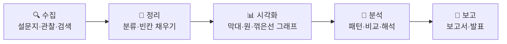
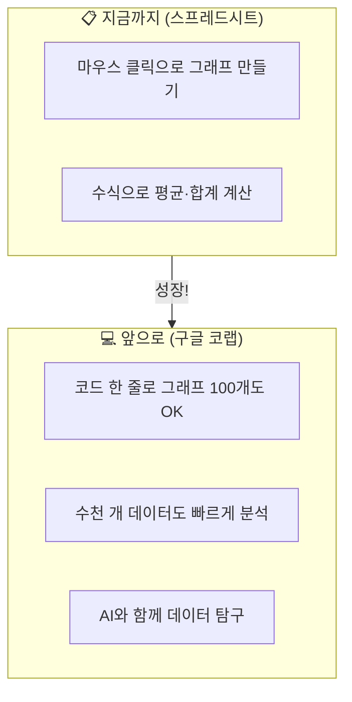

# 다음 여정을 위한 준비 — 코랩과 만날 날을 기대하며 🚀

---

## 🎯 이 장에서 배우는 것

- [ ] 데이터 활용의 전체 과정(수집→정리→시각화→분석→보고)을 흐름도로 요약할 수 있다
- [ ] 구글 코랩이 무엇인지 간단히 설명하고, 앞으로의 활용 가능성을 이해할 수 있다
- [ ] 데이터를 다루는 자신감을 확인하고, 다음 학습 방향을 그려볼 수 있다

---

> 💭 **생각해보기**: 처음 이 여정을 시작했을 때를 떠올려 보세요. "데이터가 뭐지?"라고 막막했던 그때와 지금의 나를 비교하면 어떤가요? 설문지를 만들고, 차트를 그리고, 보고서까지 완성한 여러분은 이미 **데이터 탐험가**입니다! 🎉

---

## 📚 핵심 개념

### 개념: 데이터 활용의 전체 흐름

**1. 비유로 시작**

> 데이터 활용 과정은 마치 **요리 과정**과 같아요. 재료를 사 오고(수집) → 씻고 다듬고(정리) → 예쁘게 담고(시각화) → 맛을 평가하고(분석) → 레시피를 정리해서 공유하는(보고) 것과 똑같습니다! 🍳

**2. 전체 흐름 한눈에 보기**



**3. 우리가 걸어온 길 정리**

- **1권 (Part 1~3)**: 데이터가 무엇인지 알고, 스프레드시트로 정리하고, 그래프를 그렸습니다
- **2권 (Part 4~6)**: 데이터를 분석하고, 이야기를 만들고, 보고서로 완성했습니다

> 📌 **정리하기**: 데이터는 모으는 것으로 끝나지 않습니다. **수집 → 정리 → 시각화 → 분석 → 보고**의 다섯 단계를 거쳐야 비로소 "의미 있는 정보"가 됩니다.

---

## 🔭 앞으로 만날 새로운 도구: 구글 코랩

### 구글 코랩이 뭔가요?

> 구글 코랩(Google Colab)은 마치 **인터넷 브라우저 안에 있는 실험실** 같아요. 컴퓨터에 아무것도 설치하지 않아도, 웹 브라우저만 열면 **파이썬(Python)이라는 프로그래밍 언어**로 데이터를 다룰 수 있는 무료 도구입니다. 🧪

### 코랩에서는 뭐가 달라지나요?



> 💭 **알아보기**: 코랩에서는 이런 코드로 그래프를 만들 수 있어요. 아직 몰라도 괜찮습니다. "아, 이런 느낌이구나!" 정도만 느껴보세요.

---

## 🔨 따라하기: 코랩 미리 맛보기

### Step 1: 코랩 접속해 보기

구글 검색창에 **"Google Colab"**을 검색하고, 첫 번째 결과를 클릭하세요. 구글 계정으로 로그인하면 바로 사용할 수 있습니다.

> ✨ 주소를 직접 입력해도 됩니다: **colab.research.google.com**

### Step 2: 첫 번째 코드 구경하기

코랩 화면에서 **"+ 코드"** 버튼을 누르면 코드를 입력할 수 있는 칸이 나타납니다. 아래 코드를 복사해서 붙여넣고, ▶️ 실행 버튼을 눌러 보세요.

**코드**:
```python
# 나의 첫 코랩 코드! 🎉
print("안녕, 데이터 세상!")
print("나는 데이터 탐험가입니다!")
```

**실행 결과**:
```
안녕, 데이터 세상!
나는 데이터 탐험가입니다!
```

### Step 3: 간단한 데이터 맛보기

```python
# 우리 반 좋아하는 계절 데이터 (미리보기)
계절 = ["봄", "여름", "가을", "겨울"]
학생수 = [7, 10, 8, 5]

for i in range(4):
    print(f"{계절[i]}: {'🟦' * 학생수[i]} ({학생수[i]}명)")
```

**실행 결과**:
```
봄: 🟦🟦🟦🟦🟦🟦🟦 (7명)
여름: 🟦🟦🟦🟦🟦🟦🟦🟦🟦🟦 (10명)
가을: 🟦🟦🟦🟦🟦🟦🟦🟦 (8명)
겨울: 🟦🟦🟦🟦🟦 (5명)
```

> 지금은 이 코드를 완벽히 이해할 필요 없어요! **"코드 몇 줄로 데이터를 표현할 수 있구나"**라는 느낌만 가져가면 충분합니다. 😊

---

## 📝 전체 코드

```python
# === 코랩 미리 맛보기 === #

# 1. 인사하기
print("안녕, 데이터 세상!")
print("나는 데이터 탐험가입니다!")
print()

# 2. 간단한 데이터 시각화
계절 = ["봄", "여름", "가을", "겨울"]
학생수 = [7, 10, 8, 5]

for i in range(4):
    print(f"{계절[i]}: {'🟦' * 학생수[i]} ({학생수[i]}명)")
```

---

## ⚠️ 주의할 점

- **코랩은 인터넷이 필요합니다**: 오프라인에서는 사용할 수 없으니, Wi-Fi가 연결된 환경에서 접속하세요
- **지금 당장 코드를 외울 필요 없어요**: 3권에서 하나씩 차근차근 배우게 됩니다. 오늘은 "구경"만 해도 100점! 👍

---

## ✅ 점검하기

**기본 문제** 📗

**1.** 데이터 활용의 다섯 단계를 올바른 순서로 나열한 것은?

- ㄱ. 시각화 → 수집 → 보고 → 정리 → 분석
- ㄴ. 수집 → 정리 → 시각화 → 분석 → 보고
- ㄷ. 분석 → 수집 → 정리 → 보고 → 시각화

<details><summary>정답 확인</summary>

**ㄴ**이 정답입니다. 데이터는 **수집 → 정리 → 시각화 → 분석 → 보고** 순서로 활용합니다.

</details>

**2.** 구글 코랩을 사용하기 위해 반드시 필요한 것 두 가지는?

<details><summary>정답 확인</summary>

**인터넷 연결**과 **구글 계정**입니다. 별도의 프로그램 설치 없이 웹 브라우저에서 바로 사용할 수 있습니다.

</details>

**응용 문제** 📙

**3.** 스프레드시트에서 하던 작업을 코랩에서 하면 어떤 점이 좋아질 수 있을까요? 한 가지만 써 보세요.

<details><summary>정답 확인</summary>

예시 답안: 데이터가 수천 개여도 코드 몇 줄로 빠르게 분석하고 그래프를 만들 수 있다. / 같은 분석을 반복할 때 코드를 다시 실행하기만 하면 된다. / AI 도구와 연결해서 더 깊은 분석이 가능하다.

</details>

**도전 문제** 📕

**4.** 🌟 내가 다음에 데이터로 탐구하고 싶은 주제를 자유롭게 적어 보세요!

> **예시**: "우리 학교 학생들의 스마트폰 사용 시간과 수면 시간의 관계", "지난 10년간 우리 동네 기온 변화"

<details><summary>작성 팁</summary>

좋은 탐구 주제를 고르는 세 가지 기준을 떠올려 보세요. ① 내가 궁금한 것 ② 데이터를 모을 수 있는 것 ③ 결과가 누군가에게 도움이 되는 것. 정답은 없습니다. 여러분의 호기심 자체가 정답입니다! ✨

</details>

---

> 🎓 **정리하기**: 여러분은 이 여정을 통해 데이터를 **모으고, 정리하고, 보여주고, 해석하고, 전달하는** 전체 과정을 경험했습니다. 이것은 과학자, 기자, 의사, 기업가 등 수많은 어른들이 매일 하는 일과 같은 것입니다. 여러분은 이미 그 첫걸음을 멋지게 뗐습니다! 🏆

---

## 🔗 다음 여정 미리보기

> 🐍 **3권에서는 구글 코랩과 파이썬**을 본격적으로 만납니다! 코드로 데이터를 불러오고, 한 줄 명령으로 멋진 그래프를 그리고, 더 많은 데이터에서 숨겨진 이야기를 찾아내는 방법을 배울 거예요. 오늘 맛본 그 실험실에서, 진짜 데이터 과학자의 도구를 하나씩 익혀 봅시다. **그날이 기대되지 않나요?** 🌟